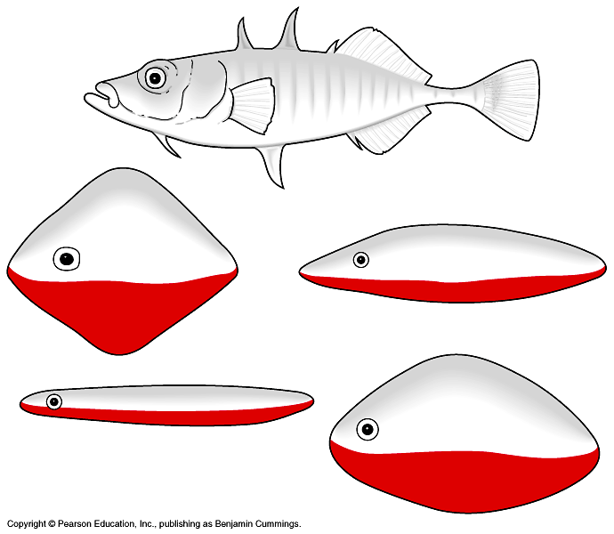

## Why is that crab waving at me?

## Animal behavior hash-tags

 

* **This lecture will cover the evolution of classic animal behaviors across the animal phylogeny**

 

* **#**

 

* **#**

 

* **#**

 

* **#**

## The big picture: Animal behavior

 

* **A behavior is an action carried out by muscles under control of the nervous system**

 

* **Behaviors and the anatomical structures related to their performance are subject to natural selection**

 

* ****

 

* ****

## Niko Tinbergen: Understanding animal behavior...

* **What stimulus elicits the behavior, and what physiological mechanisms mediate the response?**

 

* **How does the animal’s experience during growth and development influence the response?**

 

* **How does the behavior aid survival and reproduction?**

 

* **What is the behavior’s evolutionary history?**

## Tinbergen: Hieracry of animal behavior

## Fixed action patterns

 

* **Q1: stimuli that trigger behavior**
    + Tinbergen kept fish tanks with stickleback fish
    + Males = red belly; Females= no red belly

 

* **Male territorial behavior related to red color**
    + males also behaved aggrevisly when a red truck passed by!

 

* **Fixed Action Pattern: sequence of unlearned acts linked to a simple stimulus**
    + developmentally 'fixed' &rarr; *innate* behavior
    + trigger = *sign stimulus* (i.e. red color)

## Enivronmental cues for behavior: Migration

 

* **Environmental sitimuli trigger and guide animal behaviors**

 

* **Birds, fishes, mammals (+ more) use cues to *migrate* long distances**
    + Why do animals not get lost in new habitats?

 

* **Animals may use sun or moon position to navigate**
    + adjust route with circadian clocks!

## Migration: What happens if it is cloudy?

## Rhythm is gonna get you

* **Animal behvaiors often reflect biological rhtyms**
    + circadian clocks or longer cycles
 
  
 
* **Migration and reproduction cued by yearly seasonal cycles**
    + periods of daylength and darkness
    
  
 
* **Behaviors rhythms related to lunar cycles**
    + includes tides (e.g. crab reproduction)

## Froms of animal communication

 

* **Signal: stimulus transmitted from one animal to another**
    + male waving claw at female crab

 

* **Communication: transmission and reception of signals**
    + plays a role in proximate causes ('the How')

 

* **4 common modes of animal communication**
    + visual, chemical, tactile & auditory
    

## Fruit fly courtship

* **Step 1: Male *sees* female and orients towards her**
    + uses olfactory *chemical* system to make sure she is right species
    
 

* **Step 2: Male approaches female and *touches* female with foreleg**
    + alerts female to his presence
    
 

* **Step 3: Male vibrate wing in coursthip song**
    + *auditory* behaviors tells female he is of right species
    
 

* **If all communications are successful &rarr; sexy time**
    

## Fruit fly courtship: https://www.youtube.com/watch?v=KzWIuhXMUko

<iframe width="560" height="315" src="https://www.youtube.com/embed/KzWIuhXMUko" frameborder="0" allow="accelerometer; autoplay; encrypted-media; gyroscope; picture-in-picture" allowfullscreen></iframe>

## Forms of communcation evolve with animal's environment

 

* **Many terrestrial mammals are nocturnal**
    + use olfactory and auditory forms
    + usually are color blind
    
 

* **Humans and most birds are diurnals**
    + use visual and auditory forms
    + lack many chemical cues

 

* **The amount of information communicated is variable**
    + regardless of form
    

## 

## Phermones: How animals communicate through odors/taste

  
  
  

* **Phermones are chemical substances emitted by animals**
    + common among animals and insects
    + species detection in fruit flies
    
  

* **Permones can signal behaviors over longs distances**
    + Male silkworms can detect female phermones miles away 
    
    

* **Phermones maintain social behaviors in bees**
    + Queen substances &rarr; brings workers, inhibits ovaries in workers and attracts male drones

   

* **Phermones serve as alarms**
    + release injury signals to warn nearby animals
    

## Experince and behavior

* **Tinebergs Q2 How does the animal’s experience during growth and development influence the response?**
    
  

* **What behavariors are innate and what are learned?**
    + cross-fostering & human twin studies

## The capacity to *learn* in the animal kingdow

 
 
 

* ** **

## Trouble with assembling IKEA furniture? Call a crow...

    
## Social learning in animals

 

## Evolution of foraging (Tineberg Q3: Why?)

## Evolution of mate choice (Tineberg Q3: Why?)

>

## How have behaviors evolved (Tinbergen Q4)

* **Behaviors have a genetic basis**

## Are all behaviors evolved to be selfish?

 

