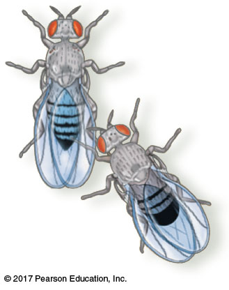

## Why is that crab waving at me?

<!-- ## Animal behavior hash-tags -->
<!-- 
 -->
<!--   -->

<!-- * **This lecture will cover the evolution of animal behaviors across the animal phylogeny** -->
<!--     + understand each of Tinbergen's questions and know examples for each -->

<!--   -->

<!-- * **#TinbergenQ1** -->

<!--   -->

<!-- * **#TinbergenQ2** -->

<!--   -->

<!-- * **#TinbergenQ3** -->

<!--   -->

<!-- * **#TinbergenQ4** -->

## The big picture: Animal behavior

 
 
 

* **Behavior:**

 

* **Learning connects experience and behavior **

 

* **Behaviors have a genetic basis**
    + allows evolution by natural selection

## Niko Tinbergen: Understanding animal behavior...

 
 

* **Q1. What stimulus elicits the behavior, and what physiological mechanisms mediate the response?**

 

* **Q2. How does the animal’s experience during growth and development influence the response?**

 

* **Q3. How does the behavior aid survival and reproduction?**

 

* **Q4. What is the behavior’s evolutionary history?**

 

**Take home message: **

## Fixed action patterns

 

* **Q1: stimuli that trigger behavior**
    + Tinbergen kept fish tanks with stickleback fish
    + Males = red belly; Females= no red belly

 

* **Male territorial behavior related to red color**
    + males also behaved aggressively when a red truck passed by!

 

* **Fixed Action Pattern: **
    + developmentally 'fixed' &rarr; *innate* behavior
    + trigger = *sign stimulus* (i.e. red color)

## Environmental cues for behavior: Migration

 
 

* **Environmental stimuli trigger and guide animal behaviors**

 

* **Birds, fishes, mammals (+ more) use cues to *migrate* long distances**
    + Why do animals not get lost in new habitats?

 

* **Animals may use sun or moon position to navigate**
    + adjust route with circadian clocks!

## Migration: What happens if it is cloudy?

## Rhythm is gonna get you

 
 
 
* **Animal behaviors often reflect biological rhythms**
    + circadian clocks or longer cycles
 
  
 
* **Migration and reproduction cued by yearly seasonal cycles**
    + periods of day length and darkness
    
  
 
* **Behaviors rhythms related to lunar cycles**
    + includes tides (e.g. crab reproduction, turtle nesting)

## Forms of animal communication

 
 
 

* **Signal: **
    + male waving claw at female crab

 

* **Communication: transmission and reception of signals**
    + plays a role in primary cause ('the How')

 

* **4 common modes of animal communication**
    + visual, chemical, tactile & auditory
    

## Fruit fly courtship

 

* **Step 1: Male *sees* female and orients towards her**
    + uses olfactory *chemical* system to determine species
    
 

* **Step 2: Male *touches* female with foreleg**
    + alerts female to his presence
    
 

* **Step 3: Male vibrate wing in courtship song**
    + *auditory* behaviors tells female he is of right species
    
 

* **If all communications are successful &rarr; sexy time**
    

## https://www.youtube.com/watch?v=KzWIuhXMUko

<iframe width="560" height="315" src="https://www.youtube.com/embed/KzWIuhXMUko" frameborder="0" allow="accelerometer; autoplay; encrypted-media; gyroscope; picture-in-picture" allowfullscreen></iframe>

## Forms of communication evolve with animal's environment

 

* **Many terrestrial mammals are nocturnal**
    + use olfactory and auditory forms
    + usually are color blind
    
 

* **Humans and most birds are diurnal**
    + use visual and auditory forms
    + lack many chemical cues

 

* **The amount of information communicated is variable**
    + read Honey Bee dance language in book
    

<!-- ##  -->

<!--  -->

<!-- ## Pheromones: How animals communicate through odors/taste -->
<!-- 
 -->
<!--    -->

<!-- 
 -->

<!-- * **Pheromones: chemical substances emitted by animals** -->
<!--     + common among mammals and insects -->

<!--    -->

<!-- * **Can signal behaviors over longs distances** -->
<!--     + Male silkworms detect female pheromones miles away  -->

<!--      -->

<!-- * **Maintain social behaviors in bees** -->
<!--     + 'Queen substance' &rarr; brings workers, inhibits ovaries in workers and attracts male drones -->

<!--     -->

<!-- * **Serve as alarms** -->
<!--     + release injury signals to warn nearby animals -->

<!-- 
 -->

<!--  -->

## Experience and behavior

* **Q2: How does the animal’s experience during growth and development influence behavior?**
    
  

* **What behaviors are innate and what are learned?**
    + cross-fostering & human twin studies

## The capacity to *learn* in the animal kingdom

 

* **Learning:  **

 

* **Learning capacity &rarr; nervous system organization during development**
    + genome encoded
    + finches can sing, but learn song from father

 

* **Both nature (genes) vs nurture (environment)**

 

* **Learning Types: Imprinting, Spatial, Associative, Cognitive, Social**

## Landmarks (Spatial) + Trial and Error (Associative)

## Trouble with assembling IKEA furniture? Call a crow...

    
    
    
## Social learning in animals: root of culture

## Evolution of foraging (Tinbergen Q3: Why?)

 

* **Q3: How does the behavior aid survival and reproduction?**

 

* **Food behaviors: eating, searching, recognizing & capture**
    + how did foraging behavior evolve?

 

* **Fruit flies: variation in an foraging gene (*for*) dictates larva travel when foraging**
    + *for^R^* (rover) vs *for^S^* (sitter)
    
 
    
* **Which allele will be selected for in a population?**

<!-- ## Optimal Foraging (*new Extra Credit*) -->
<!-- 
 -->

<!--  -->

<!--  -->

## Evolution of mate choice (Tinbergen Q3: Why?)

 

* **Mate choice and mating behavior influence reproductive success**

 

* **Seeking, attracting & choosing mates**
    + mate competition

 

* **Evolution of parental care produces more viable offspring**
    + monogamy vs polygamy
    + certainty of paternity

 

* **Mate choice behavior leads to *sexual* and *intrasexual* selection**

## How have behaviors evolved (Tinbergen Q4)

 
 

* **Behaviors have a genetic basis**

 

* **Courtship fruit fly: series of behaviors in male flies**
    + single gene (*flu*) controls entire ritual
    + if *flu* mutated &rarr; no mating
    + can be reversed in male and female!!!
    + variation in gene &rarr; variation in behavior
    
 

* **Variation in environment may cause behavior to evolve**

## Are all behaviors evolved to be selfish?

* **Behaviors should be mostly selfish**
    + individual vs competitors

 

* **Altruism: **
    + sterile male bees
    + animals that vocalize warning calls

     
    
* **Can unselfishness arise through natural selection?**
    + offspring survival: yours and relatives

 

* **Inclusive fitness: increases genetic representation of related offspring**

