<!-- ## What are those crazy feathers for? -->
<!-- 
 -->

<!-- 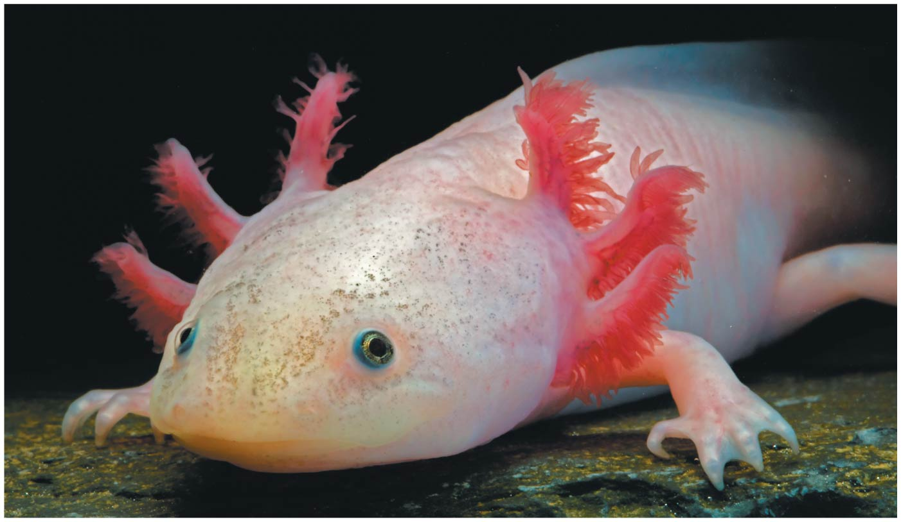 -->

<!-- ## Animal circulation and gas exchange hash-tags -->
<!-- 
 -->
<!--   -->

<!-- * **This lecture will cover animal circulation and gas exchange by examining species across the animal phylogeny** -->

<!--   -->

<!-- * **#ExchangeTransportLink** -->

<!--   -->

<!-- * **#CirculatoryBasics** -->

<!--   -->

<!-- * **#CirculatoryMammal** -->

<!--   -->

<!-- * **#RespiratoryStructures** -->

## The big picture: circulation and gas exchange

 

* **Direct exchange between every cell and the environment is not possible in all animals**
    + special structures for exchange & transport needed

 

* **Respiratory systems: **

 

* **Circulatory systems: **

 

* **Internal transport and gas exchange functionally related**

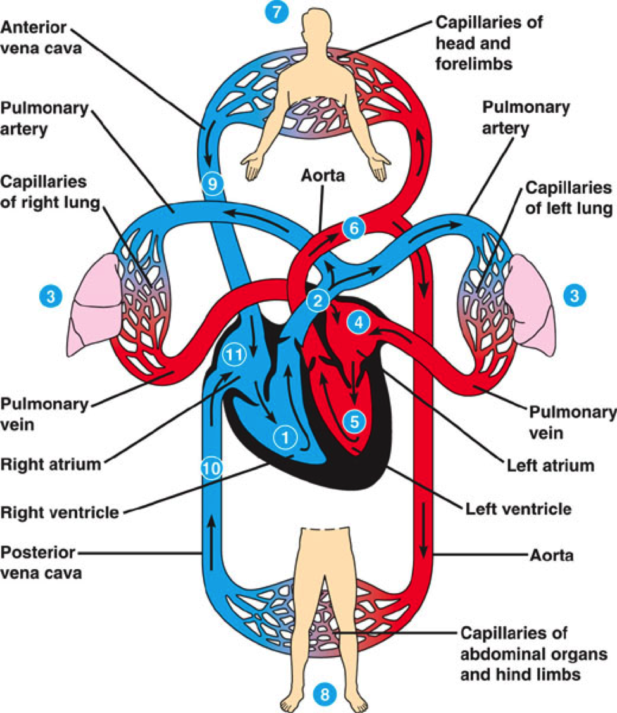

## Molecule trading

 

* **Small molecules can move between cells and their surroundings by *diffusion* **

 

* **Diffusion is only efficient over small distances** 
    
 

* **Molecular trading in animals occurs for every cell!**
    + gain O~2~ and nutrients
    + release CO~2~ and waste products
    
 
    
* **Simple body plans: **
* **Complex body plans: **

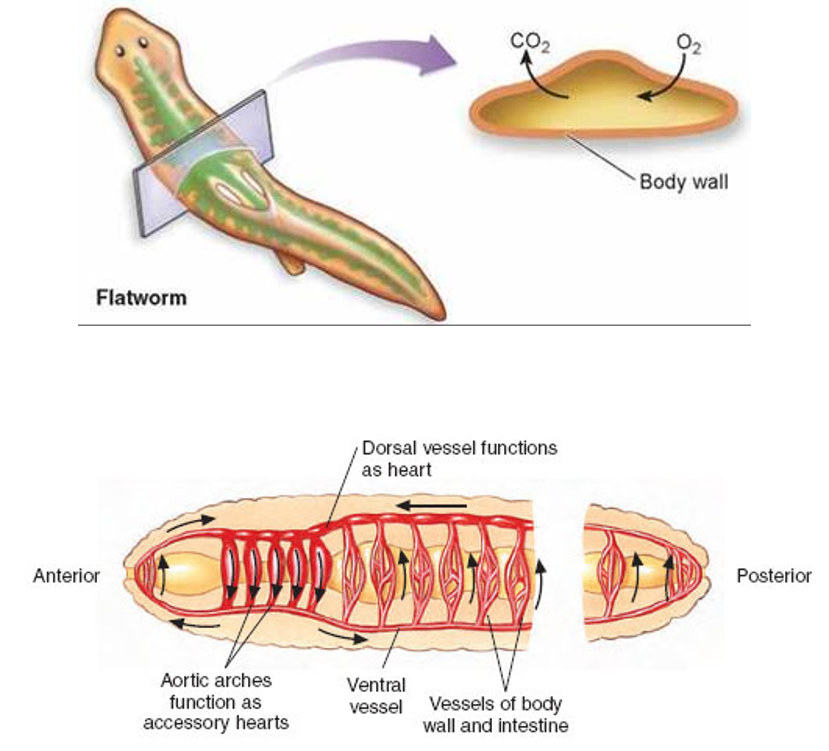

## Animals with gastrovascular cavities

 

* **Many animals have lots of cells in contact with environment**
    + hydras, jellyfish, flatworms

 

* **Central *gastrovascular cavity* functions to distribute substances**
    + opening at one end connects cavity to water
    + allows fluid to bath inner and outer tissues
    + *diffusion distance kept short*

 

* **Gastrovascular cavity can be highly branched**
    + extends into tentacles of cnidarians
    + covers high surface area of flatworms

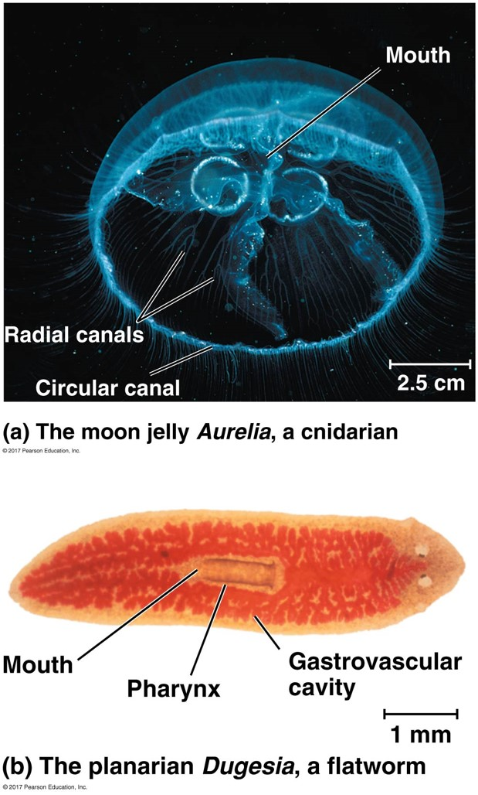

## Animals with circulatory systems

 

* **Circulatory systems have 3 components**
1. 
2. 
3. 

 

* **Fluid transport, via vessels, connects cytoplasm of cells to organs for gas exchange **

 

* **Mammals &rarr; O~2~ diffuses over 2 cell layers in lungs to reach blood**
    + molecule trading works like a circuit 

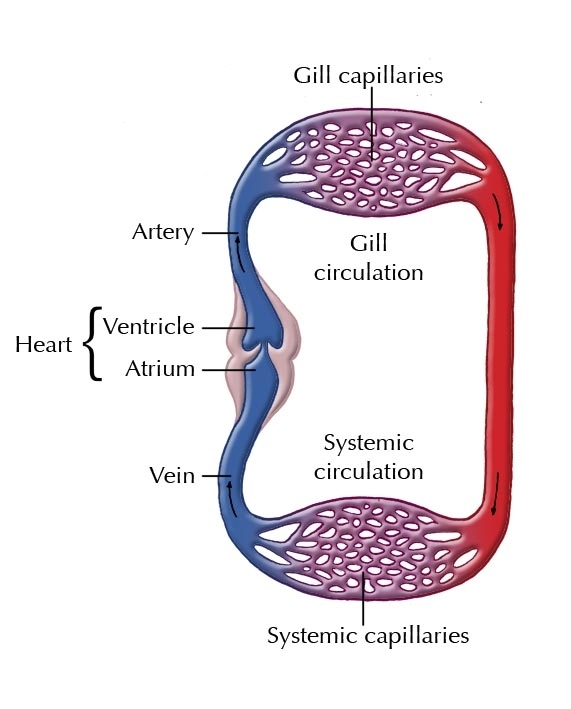

## Open and closed circulatory systems (hemolymph vs blood)

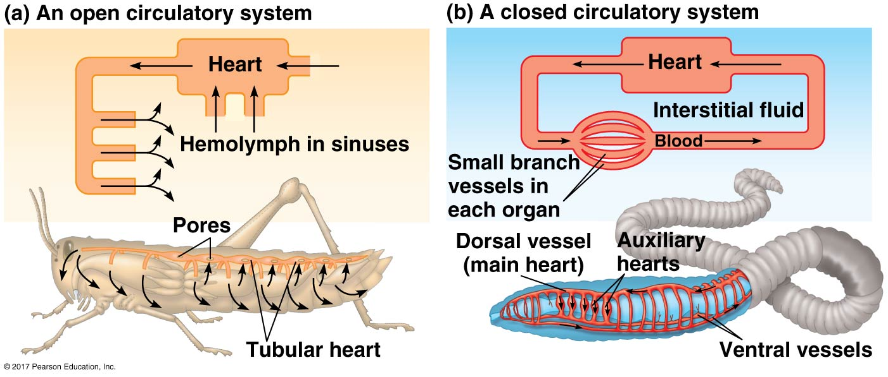

## Vertebrate Circulatory systems

 

* **Cardiovascular system: blood &rarr; heart &rarr; vessels**
    + length of vessels can be staggering

 

* **3 main types of vessels**
1. Arteries: 
2. Veins: 
3. Capillaries: 

 

* **Hearts of vertebrates have 2+ muscular chambers**
    + *atria*:
    + *ventricles*:
    
 

* **Number of chambers related to form and function**

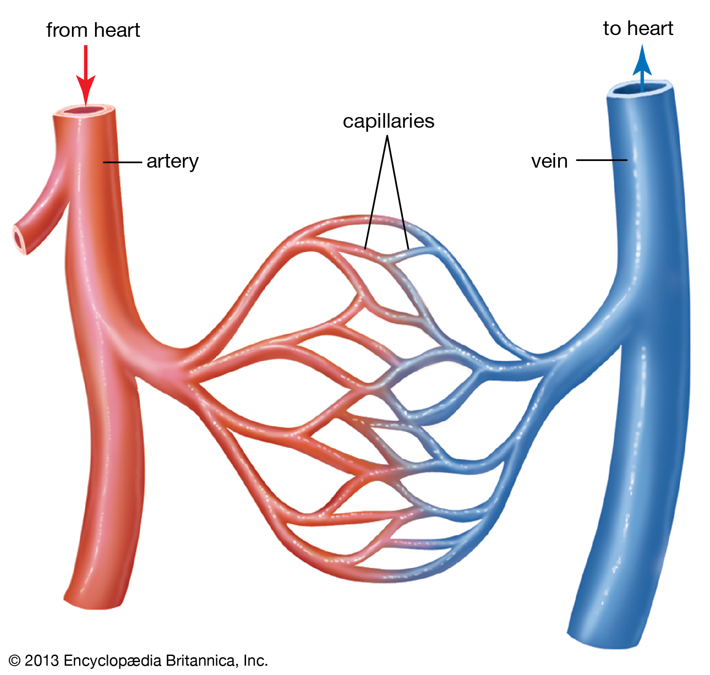

## Single vs Double circulation

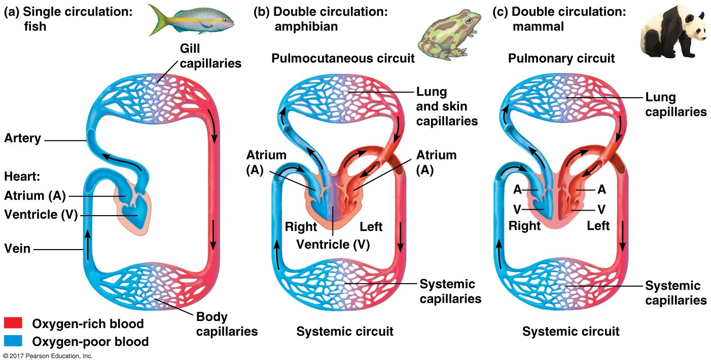

## Evolutionary variation: 3 chambered heart

 
 

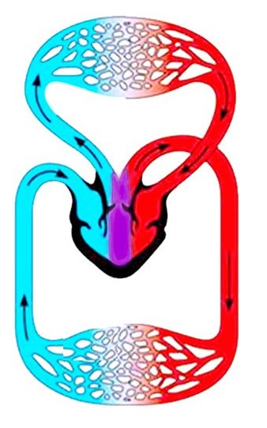

* **Amphibians and reptile hearts have 1 ventricle**
    + still use double circulation

 

* **Do not always fill their lungs**
    + pass long periods without gas exchange
    + or use another tissue (skin)
    
 
 
* **Example: frogs use skin when underwater**
* **Example: crocodiles shunt blood from lungs when underwater**

## Mammalian Circulation (1st circuit)

 
 

* **The heart contracts and relaxes in a rhythmic cycle called the cardiac cycle**

 

* **Right ventricle pumps blood to the lungs via arteries**

 

* **Blood flows through capillaries into lungs and loads O~2~ and unloads CO~2~**

 

* **O~2~ rich blood returns from lungs via veins to the left atrium**

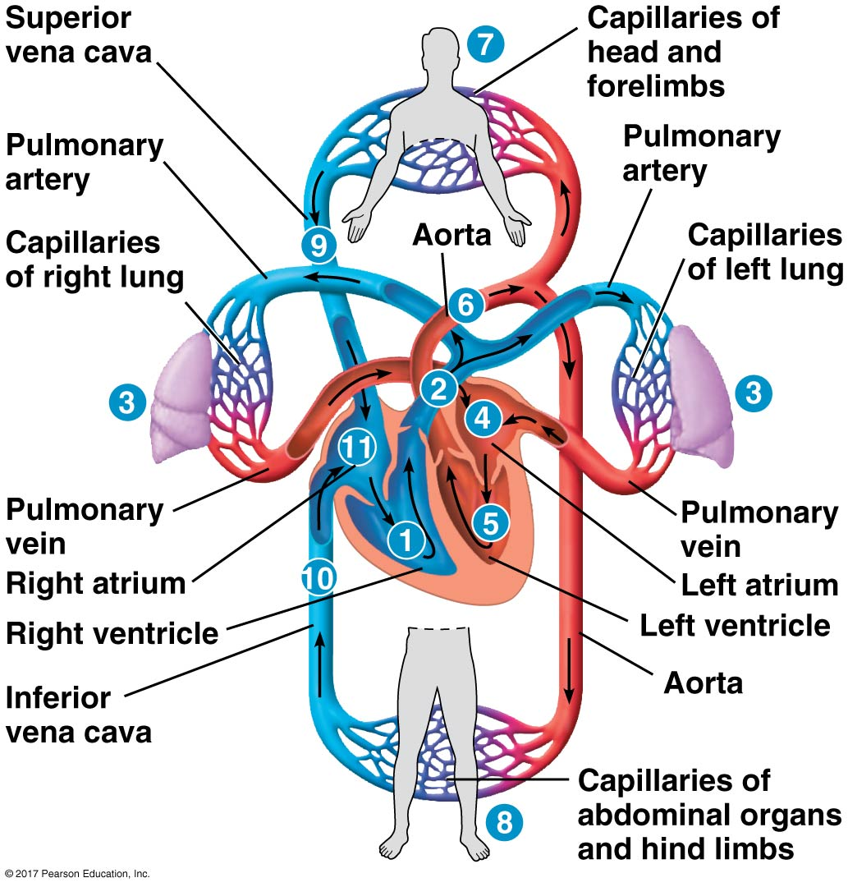

## Mammalian Circulation (2nd circuit)

    

* **Blood flows to left ventricle and pumped to tissues via arteries into capillaries**
    + First branches supply the heart muscle
    + Further branches lead to organs and hind limbs

    

* **O~2~ diffuses from blood to tissues, and CO~2~ diffuses from tissues to blood**

    

* **Capillaries rejoin conveying blood to veins**
    + O~2~ poor blood from the head, neck, and forelimbs is emptied into right atrium

<!-- ## Mammalian heart  -->
<!-- 
 -->
<!--    -->
<!--    -->
<!--    -->

<!-- 
 -->

<!-- * **Atria have thin walls and serve to collect blood returning to the heart** -->

<!--    -->

<!-- * **Ventricles have thicker walls and contract much more forcefully** -->

<!--      -->

<!-- * **The heart contracts and relaxes in a rhythmic cycle called the cardiac cycle** -->
<!--     + 4 valves prevent back flow of blood in the heart -->

<!-- 
 -->

<!-- 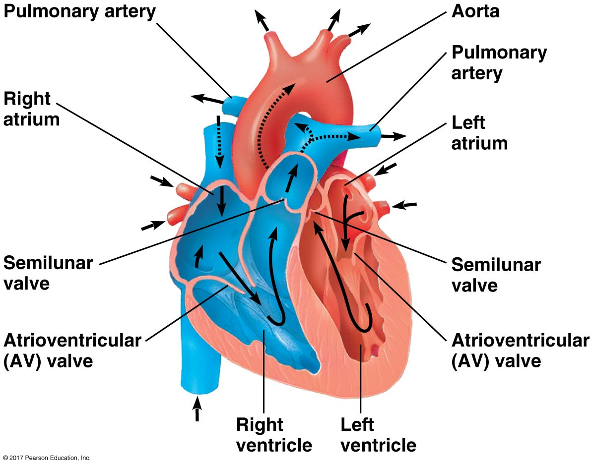 -->

## Blood flow

 
 

* **Physical laws govern movement of fluids through pipes**
    + affect blood flow and pressure
    
  

* **Blood flows from areas of higher pressure to low**
    + narrow diameter capillaries decrease pressure

 

* **Blood flow is slowest in the capillaries**
    + over large cross-sectional area
    + necessary for gas exchange

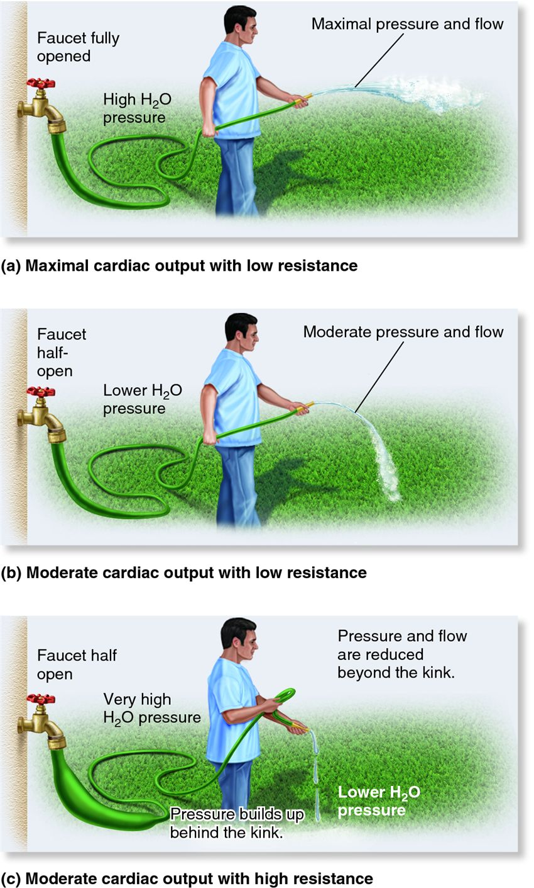

## Gas exchange over respiratory surfaces

 
 
 

* **Gas exchange = uptake of O~2~ and release of CO~2~**
    + O~2~ is abundant in the air (21%)
    + fairly easily to 'breath'
    
 
 
* **Water is more demanding for gas exchange**
    + dissolved O~2~ is variable but always less than air
    
 
 
* **Efficient surfaces for gas exchange have evolved**

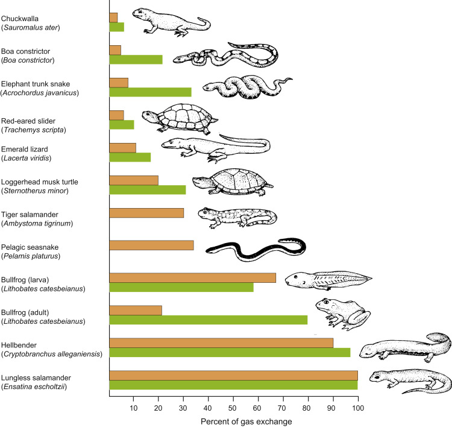
    
## Respiratory Surfaces

 

* **Differs across animal phylogeny**
    + sponges, cnidaria, flatworm &rarr; cells directly
    + earthworms, amphibians &rarr; skin
    
 

* **Other animals lack enough surface area**
    + to much volume to supply with O~2~

 

* **Respiratory organs evolve**
    + Gills &rarr; aquatic animals
    + Trachea &rarr; insects
    + Lungs &rarr; reptiles and mammals

## Gills

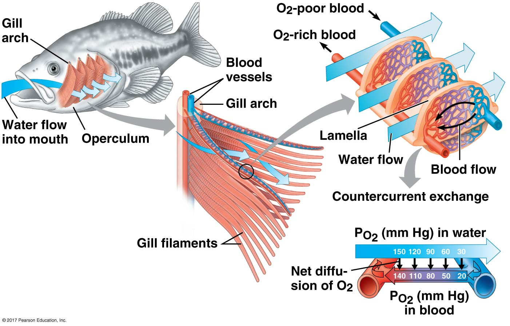

## Trachea in insects

>

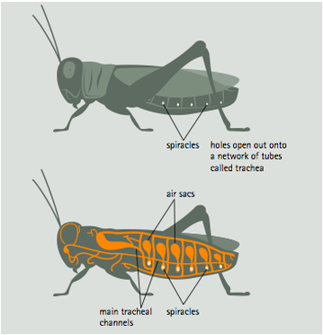

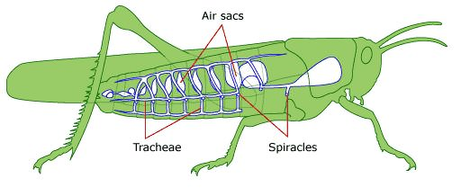

## Lungs in mammals, reptiles and birds

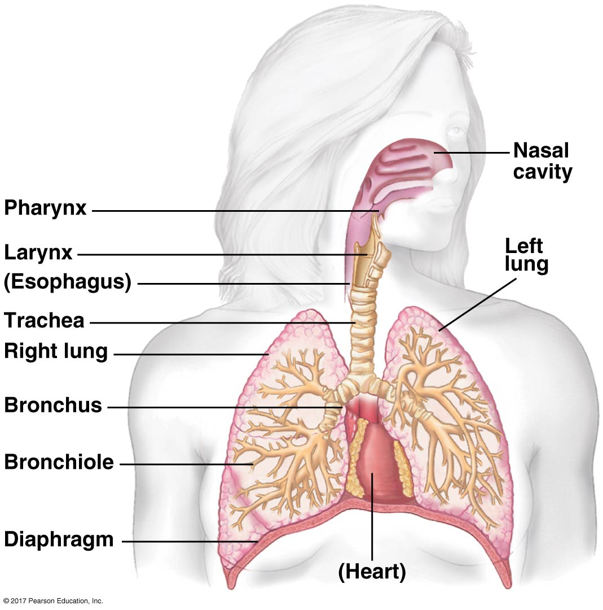

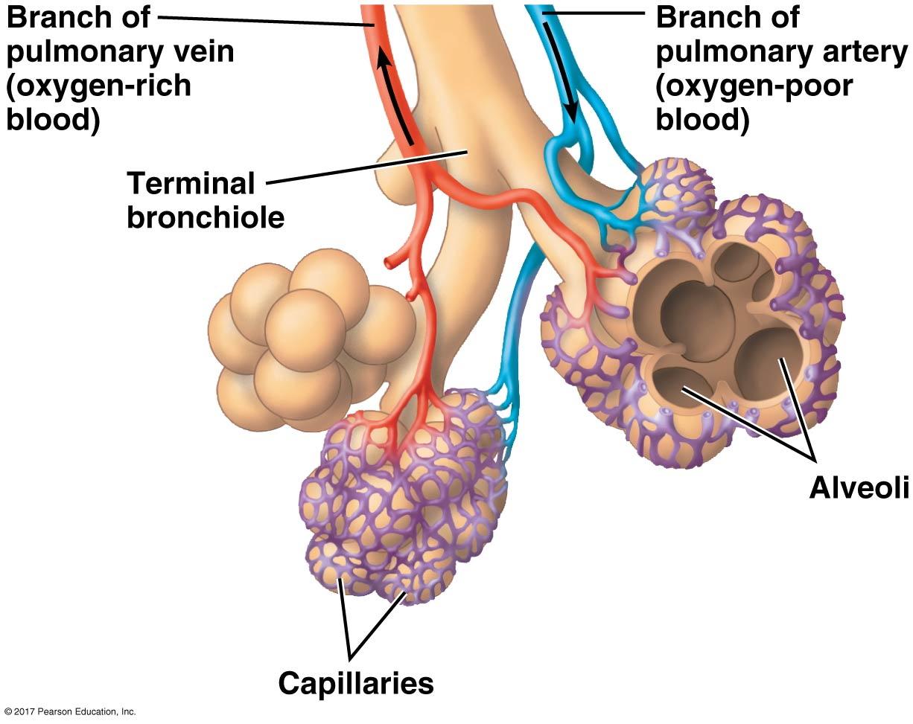

## Coordination of circulation and gas exchange

 
 

* **Most animals need to exchange large amounts of O~2~ and CO~2~**
    + to meet metabolic needs

 

* **During inhalation, fresh air fills in lung**
    + molecule trading occurs via diffusion

 
    
* **Blood is then pumped through circuit**
    + O~2~ carried in pigments (metal bound to protein)

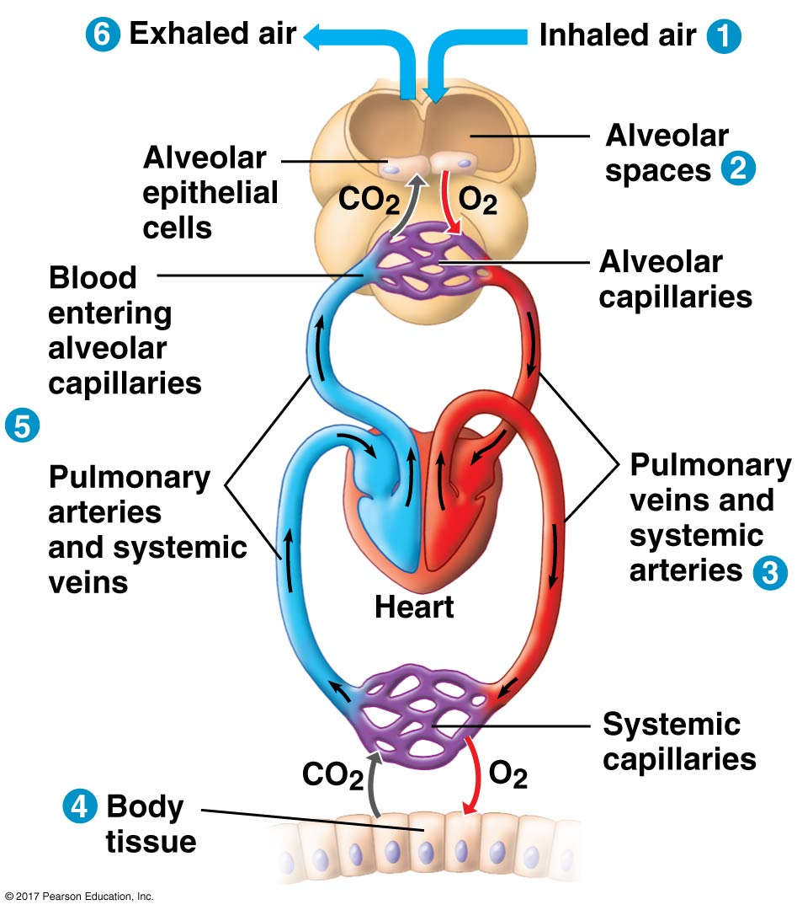

## 

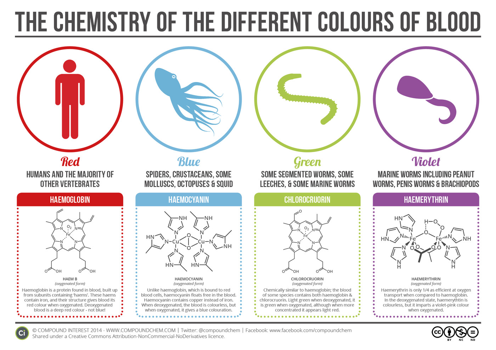

