<!-- ## Animal Form and Function (Part 1) -->
<!-- 
 -->

<!-- 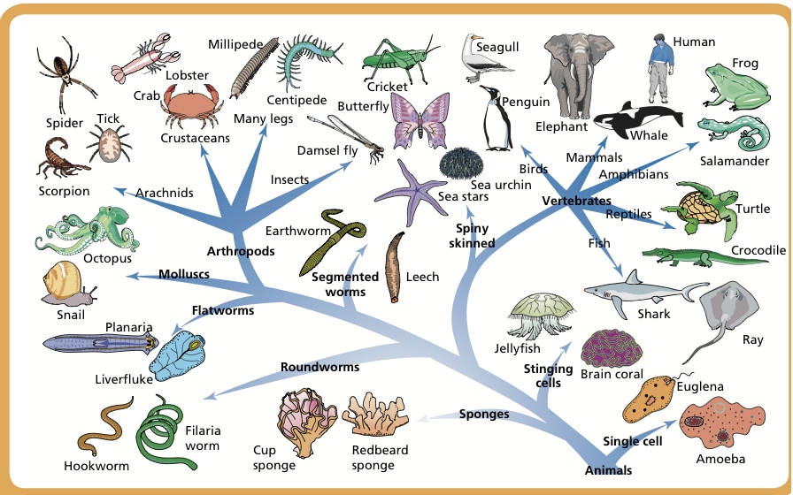 -->

<!-- ## Animal form and function hash-tags -->
<!-- 
 -->
<!--   -->

<!-- * **This lecture will cover animal form, by examining the development and diversity of body plans across the animal phylogeny** -->

<!--   -->

<!-- * **#EmbyroDevelop** -->

<!--   -->

<!-- * **#GermLayer** -->

<!--   -->

<!-- * **#BodyPlans** -->

<!--   -->

<!-- * **#WhyAnimalShape** -->

## Body plans are coordinated to optimize biological function

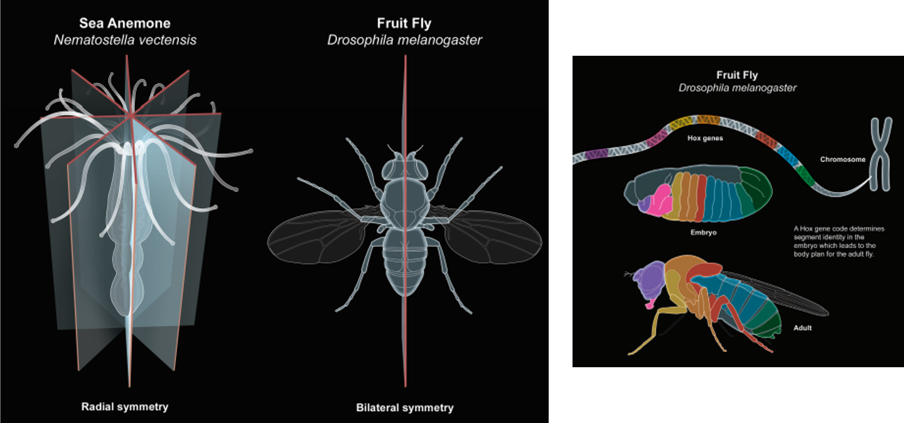

## Animals are multi-cellular, eukaryotic heterotrophs 

 

* **Most ingest organic materials**
    + consume, breakdown internally with enzymes

 

* **Lack structural support from cell walls**
    + extracellular proteins connect and strengthen cells
    + most abundant are *collagen* (not found in plants/fungi)

 

* **Cells organized into tissues**
    + similar cells acting as a functional unit
    + muscle & nervous tissue allows animals to move

     

* **Body plan = programmed development driven by evolution**

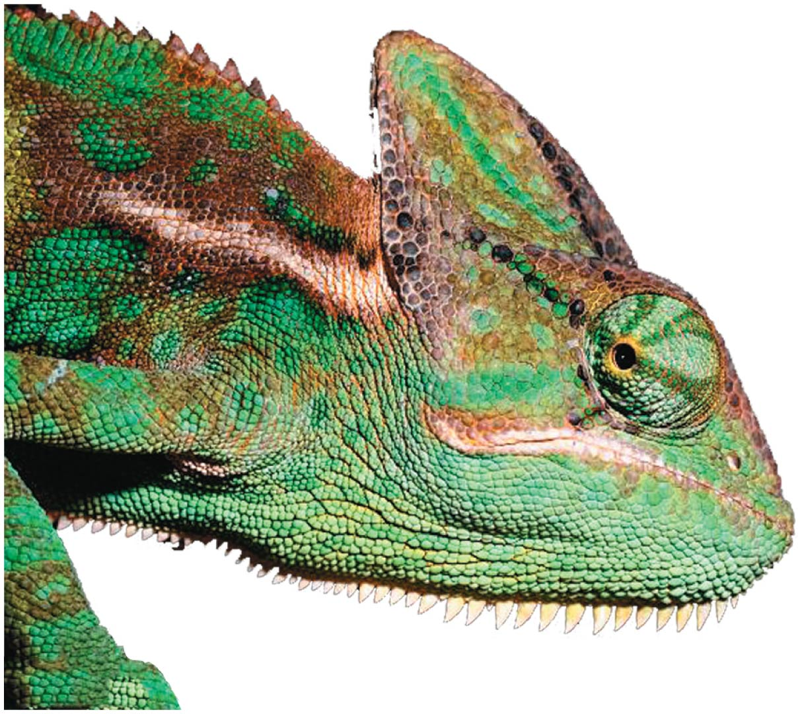

## Embryonic development key for animal diversity

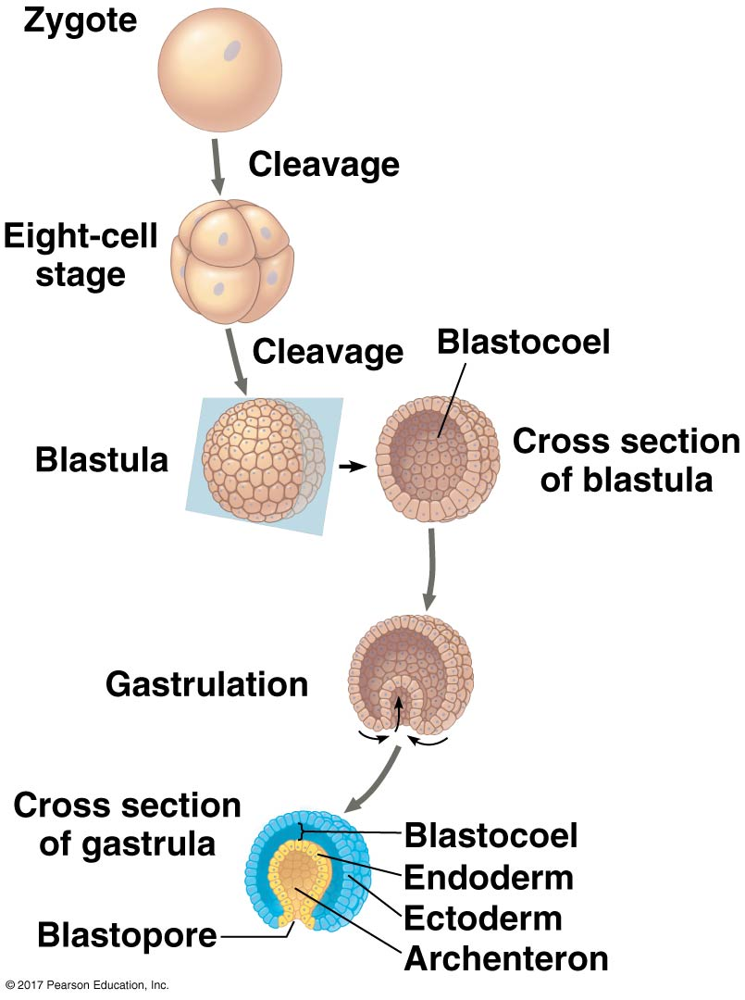

* **Fertilized zygote undergoes cleavage**
    + mitotic cell divisions without cell growth
    + rapid division but overall size stays same

 

* **Early multicellular stage called a blastula (hollow ball)**
    + protostome vs deuterostome = alignment of cells
    
 

* **Germ layers develop in next stage (gastrulation)**
    + develop into body parts

 

* **Many animals have larval and adult stage**
    + larva are sexually immature
    + larva look, live and eat differently

## 

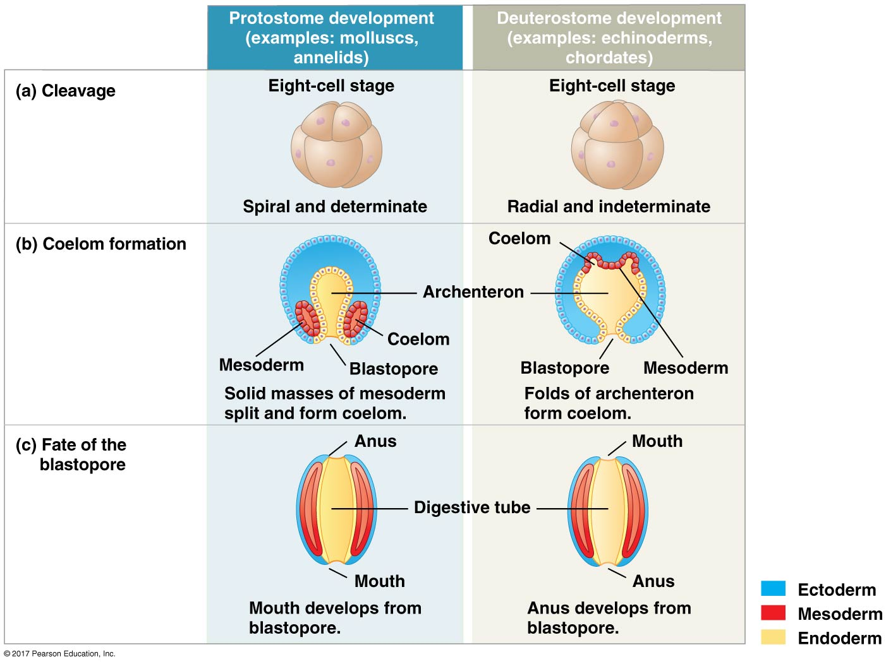

## Protostomes vs Deuterostomes and the blastopore

 
 
 

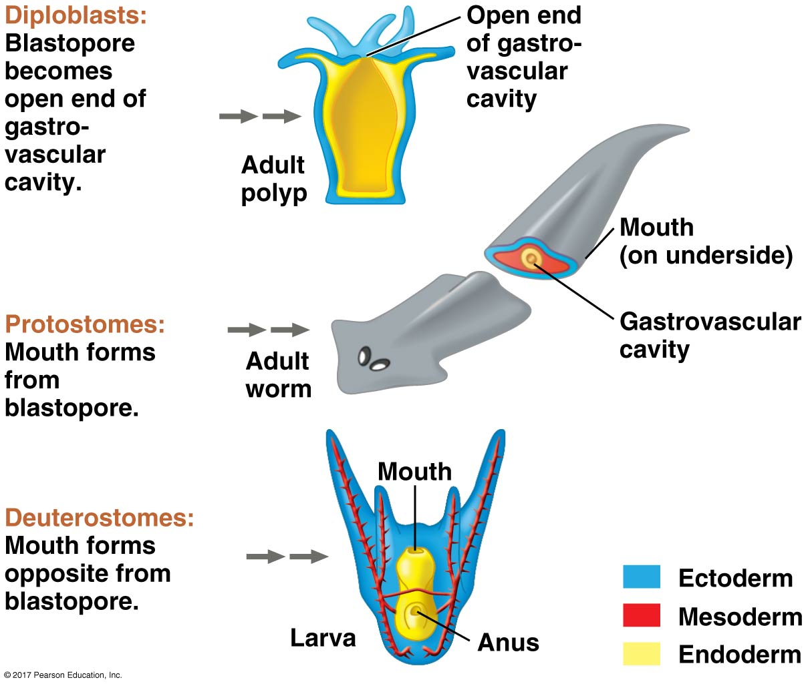

* **Blastopore: opening of central cavity of an embryo**

 

* **In most animals a second opening forms at opposite end**
    + become openings of digestive tube
    
 

* **Protostomes: blastopore becomes mouth**
* **Deuterostomes: blastopore becomes anus**

## Germ layers (primary cell layers in development)

 

* **Sponges (0), Diploblasts (2), Triploblasts (3)**
    + germ layers develop into tissues and organs

 

* **Ectoderm: **
    <!-- + turns into outer covering of animal -->
    
 

* **Endoderm: **
    <!-- + turns into lining of digestive tract -->
    <!-- + turns into lining of liver and lungs -->

 

* **Mesoderm: **
    <!-- + forms muscles and many organs -->
    
 
 

* **Coelom: **

    

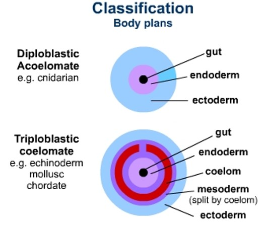

## 

## Body Cavities in Triploblasts

 
 

* **Fluid/air spaces between mesoderm layers**
    + digestive track and body wall

    

* **Body cavity called coelom**
    + cushions organs
    + fluid resistance for muscles
    + allows organs to move independently

 

* **Not all triploblasts have a coelom**

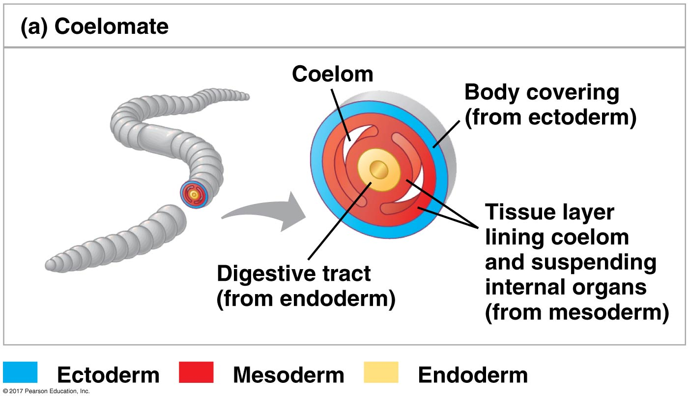

## Mammals develop subdivided body cavities from coelom

  
  

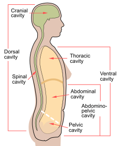

* **The dorsal cavity and the ventral cavity are the largest body compartments.**

    

* **Dorsal body cavity includes the cranial cavity, enclosed by the skull, and the spinal cavity, enclosed by the spine**

   

* **Ventral body cavity subdivided into 2 compartments**
    + vental contains the lungs and heart
    + abdominopelvic contains the kidneys, ureters, stomach, intestines, liver, gallbladder, pancreas, bladder, anus and reproductive system
    

    
## Form and function in biology

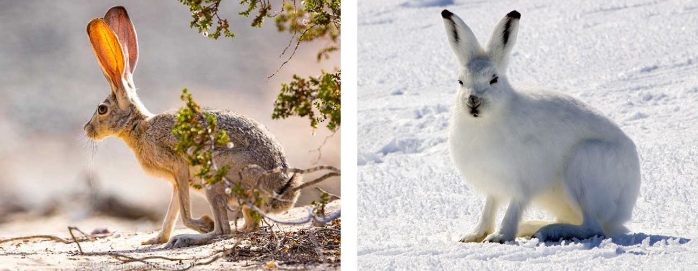

## Evolution of animal size and shape

 
 

* **Animal body plans are expressions of the genome, but the product of millions of years of evolution**

 

* **Animals body plans are constrained by physical laws**
    + diffusion, movement, heat exchange
    + gravity

 

* **Example: Properties of water and animal shape**
    + water more dense = surface bumps cause drag
    + natural selection favored tapered smooth bodies
    + convergent selection across aquatic mammals
    

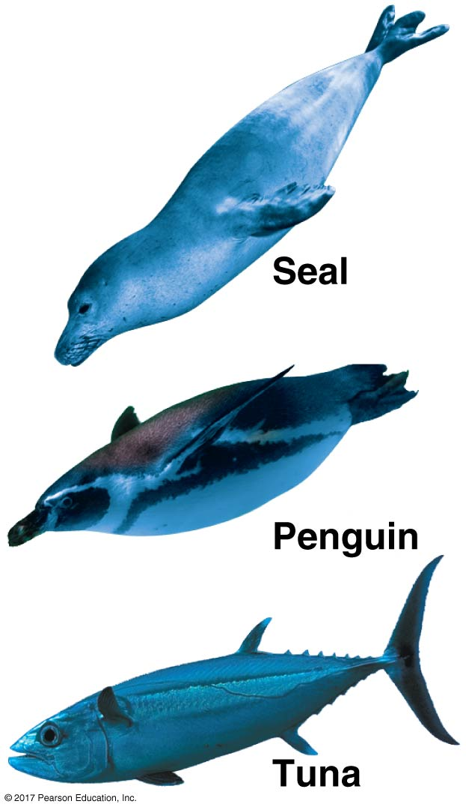

## Example: Diversity of bird form

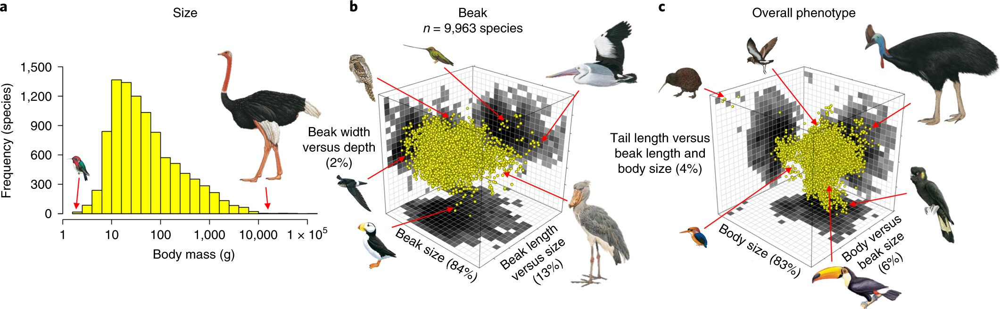

## Movie monsters are mostly not possible.... Godzilla

* **At that size, his heart wouldn't be able to pump blood to his brain.**

 

* **His brain would send messages too slowly to his muscles, so he wouldn't be able to move properly**

 

* **He'd either have to spend all his time sunbathing to stay warm**

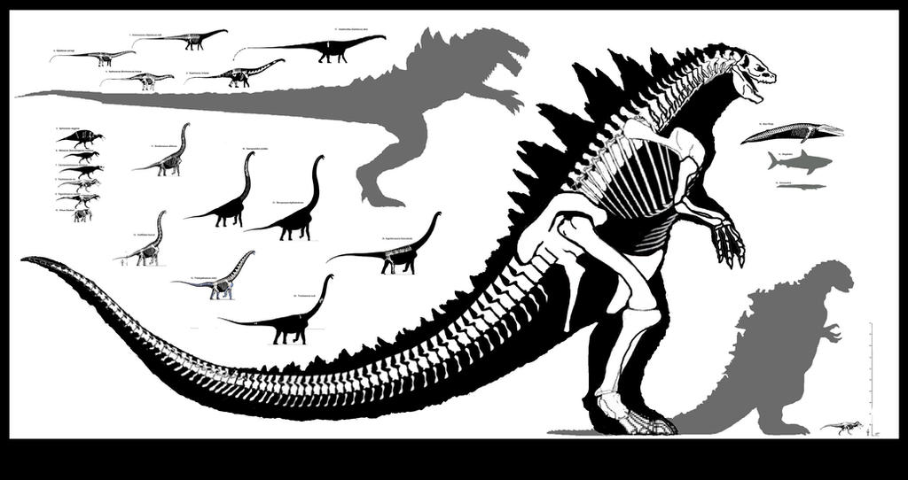

## Exchange with environment limits animal bodies

 

* **Animals must uptake nutrients, lose waste and exchange gases**
    + occurs across plasma membrane of cells
    
 

* **Simple internal body plan: Hydra**
    + body wall and cavity open to environment
    + gastrovascular cavity
    

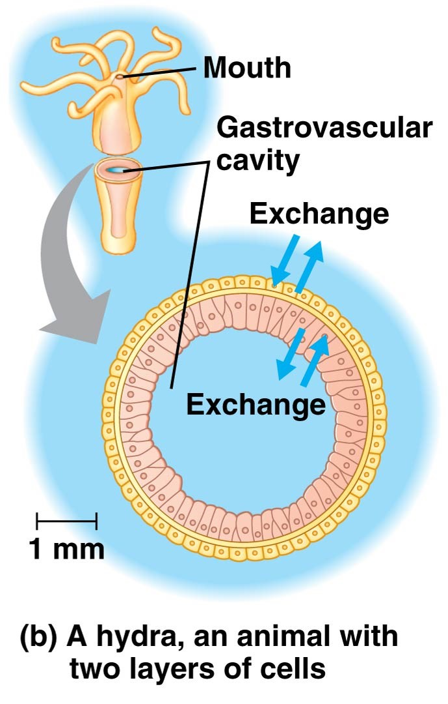

## Exchange with environment limits animal bodies

 

* **Animals must uptake nutrients, lose waste and exchange gases**
    + occurs across plasma membrane of cells
    
 

* **Body plan optimized for surface area: tapeworms**
    + thin, flat shape
    + lots of outer cells exposed to environment

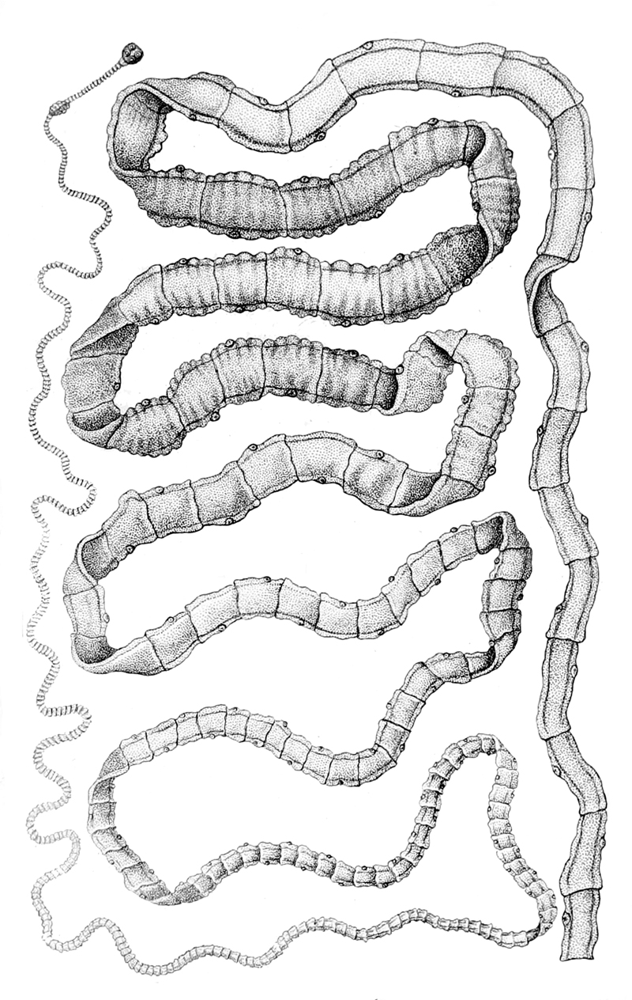

## Exchange with environment limits animal bodies

 

* **Animals must uptake nutrients, lose waste and exchange gases**
    + occurs across plasma membrane of cells

 

* **Many animals (like humans) have more complex internal bodies**
    + reduces total # of cells on outer surface
    + volume > surface area
    + 'think' whale versus flea
    
 

* **Internal structures for exchange evolve...**
    + highly branched or folded

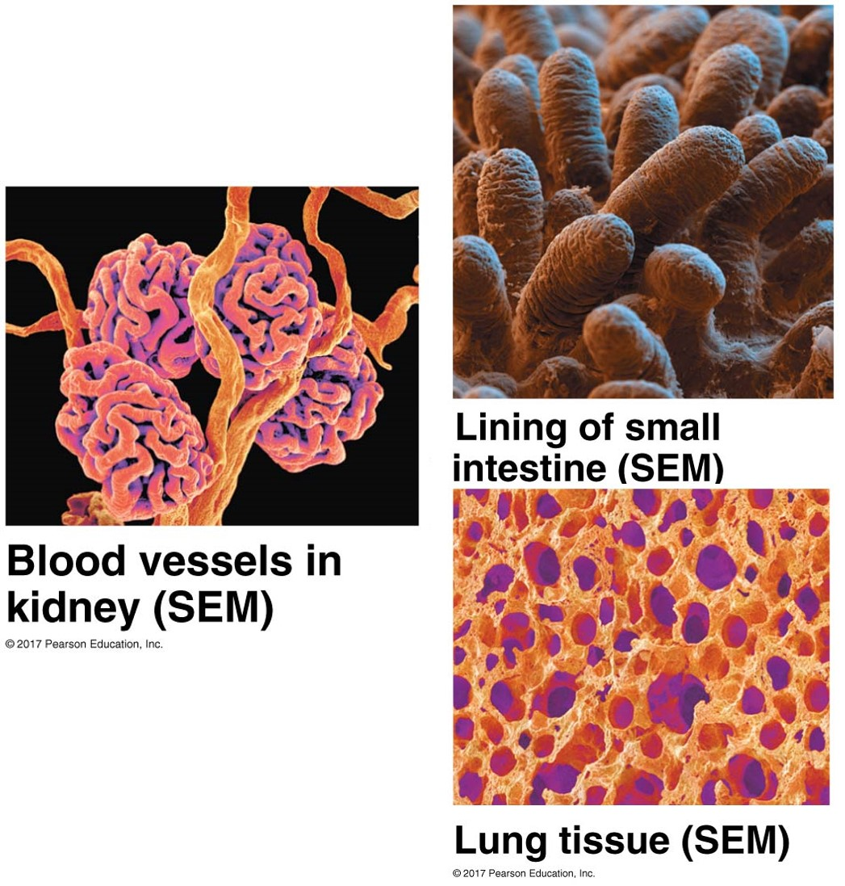

## Exchange with environment limits animal bodies

 

* **Animals must uptake nutrients, lose waste and exchange gases**
    + occurs across plasma membrane of cells

 

* **Many animals (like humans) have more complex internal bodies**
    + reduces total # of cells on outer surface
    + 'think' whale versus flea
    
 

* **Internal organs for exchange evolve...**
    + highly branched or folded
    + digestion, respiration and circulation
    + fluids connect structures to other cells

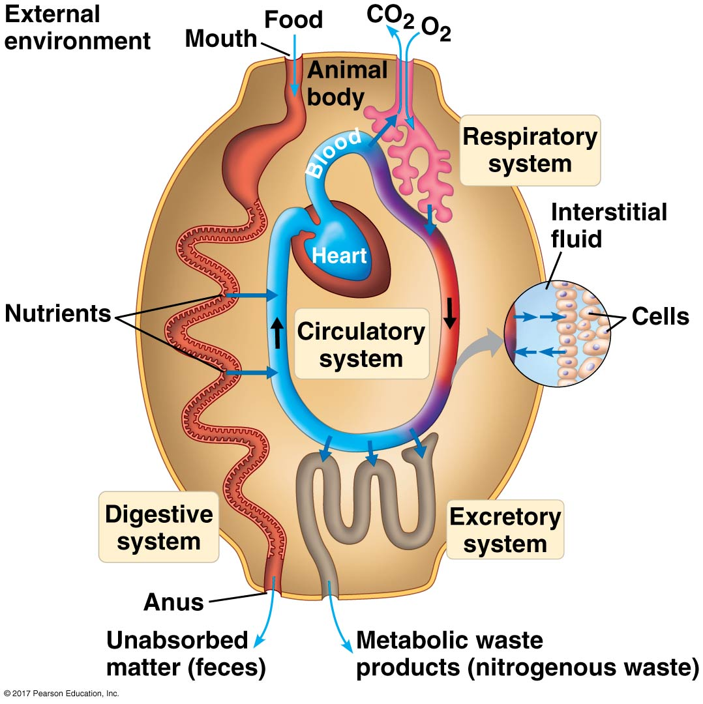

## What are the advantages of a complex body plan?

 

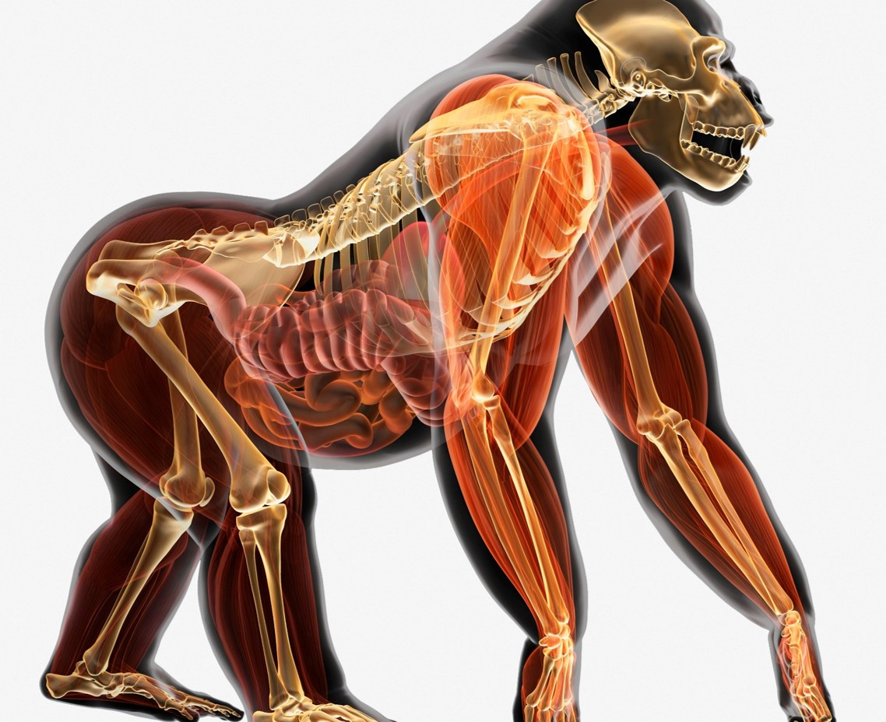

* **External skeleton?**

 

* **Sensory organs (eyes, ears, etc.)?**

 

* **Internal digestion organs?**

 

* **Specialized filtration systems?**

 
 

* **How do internal systems allow life on land?**

## Hierarchy of animal body plans

 

* **Cells with similar function grouped into tissues**

 

* **Different tissues organized into functional units: Organs**

 

* **Groups of organs can work together: Organ systems**

 

* **There are a limited set of cells and tissues**
1. *epithelial*: 
2. *connective*: 
3. *muscle*: 
4. *nervous*: 

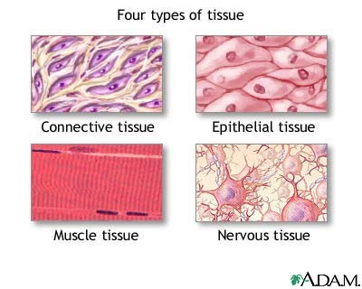

##

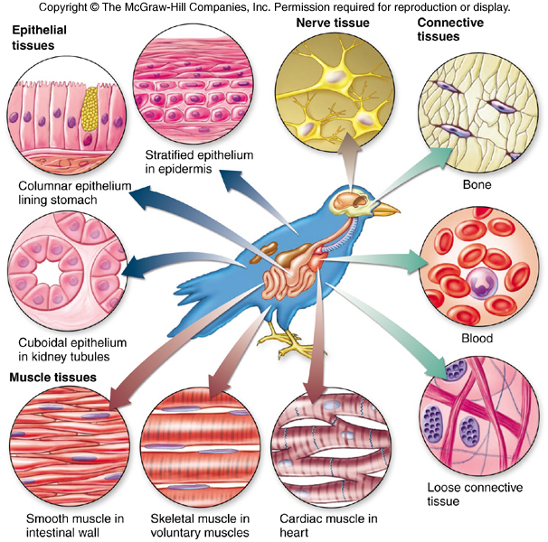
