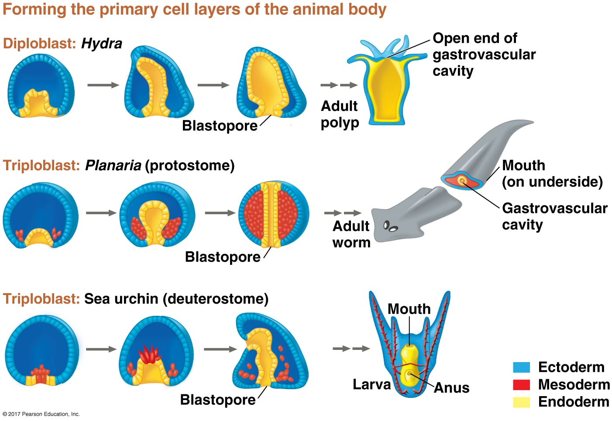
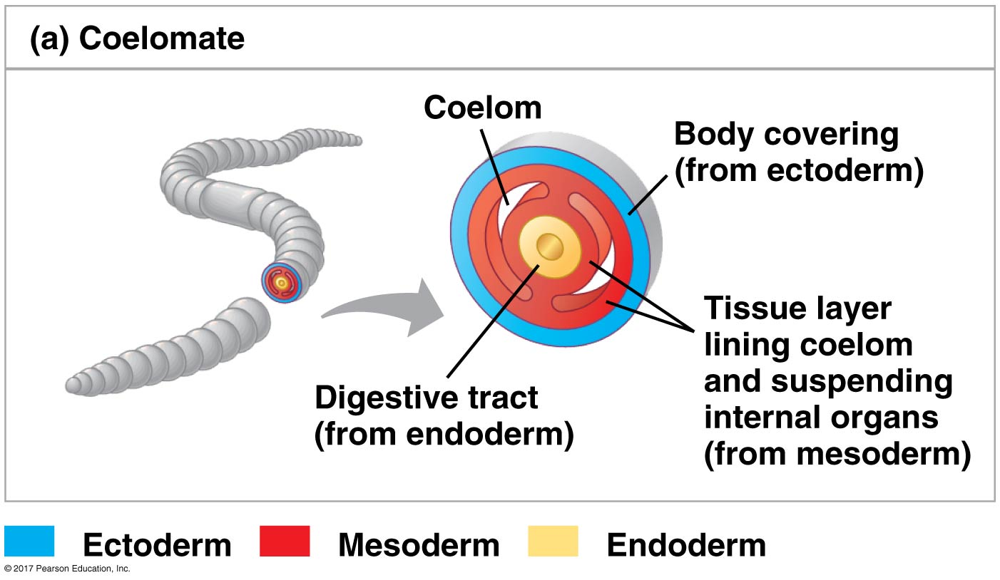
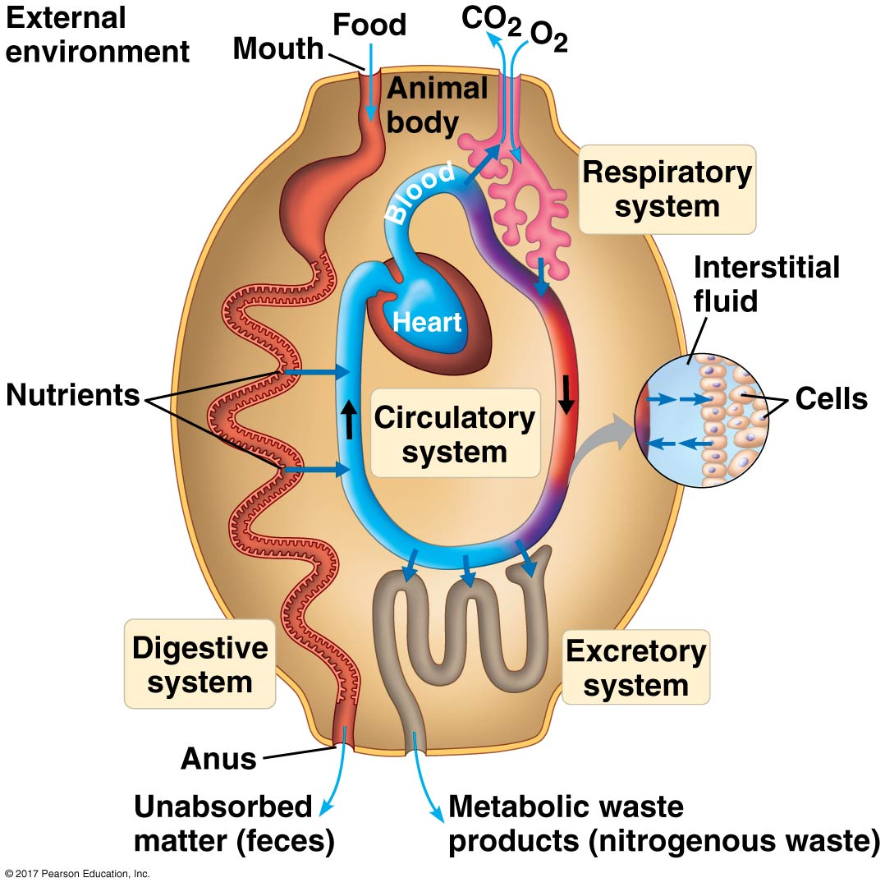

##

## Review: Animals are mutlticellular, eukaryotic heterotrophs 

* **Most ingest organic materials**
    + consume and then breakdown with enzymes

 

* **Lack structural support from cell walls**
    + external proteins connect and strengthen cells
    + most abundant are *collagen* (not found in plants/animals)

 

* **Cells orgainzed into tissues**
    + similar cells acting as a unit
    + muscle & nervouse tissue allows animals to move

 

* **Most animals reproduce sexually**
    + dominant diploid life stage
    + swimming sperm fertilizes egg
    

## Embryonic development key for animal diversity

* **Fertilized zygote undergoes cleavage**
    + mitotic cell divisions without cell growth
    + rapid division but overall size stays same

 

* **Early multicellular stage called a blastula**
    + similar to hollow ball
    + protostome or deuetrosome = alignment of cells
    
 

* **Tissue layers develop in next stage**
    + gastrulation resuts in gastrula

 

* **Many animals then have larval and adult stage**
    + larva = sexually immature
    + larva look, live and eat differently

## Protostomes vs Deutrostomes

## Protostomes vs Deutrostomes and the blastophore

## Germ layers

 

* **Sponges (0), Diplomasts (2), Triploblasts (3)**
    + study your phylogeney!!!
    + germ layers develop into tissus and organs

 

* **Ectoderm: layer at surface of embryo**
    + turns into outer covering of animal
    
 

* **Endoderm: innermost layer**
    + turns into lining of digestive tract
    + turns into lining of liver and lungs

 

* **Mesoderm: fill space between ecto and endo**
    + forms muscles and many organs
    

## 

## Body Cavities

 
 

* **Fluid/air spaces between endoderm and body wall**
    + digestive track and body wall
    
    
    
* **Body cavity called coelom**
    + cushions organs
    + may provide fluis resistance for muscles

    
## Form and function in biology

## Evolution of animal size and shape

* **Animal body plans are expressions of the genome, but the product of millions of years of evolution**

 

* **Animals body plans are constrined by physical laws**
    + diffusion, movement, heat exchange

 

* **Example: Properties of water and animal shape**
    + water more dense = surface bumps cause drag
    + natural selection favored tapered bodies
    + covergent selection across aquatic mammals
    

## Exchange with environment limits animal bodies

 

* **Animals must uptake nutrients, lose waste and exchange gases**
    + occurs across plasma membrane of cells
    
 

* **Simple internal body plan: Hydra**
    + body wall and cavity open to environment

## Exchange with environment limits animal bodies

 

* **Animals must uptake nutrients, lose waste and exchange gases**
    + occurs across plasma membrane of cells
    
 

* **Simple internal body plan: Hydra**
    + body wall and cavity open to environment
    
 

* **Body plan optimized for surface area: tapeworms**
    + thin, flat shape

## Exchange with environment limits animal bodies

 

* **Animals must uptake nutrients, lose waste and exchange gases**
    + occurs across plasma membrane of cells

 

* **Many animals (like humans) have more complex internal bodies**
    + reduces total # of cells on outer surface
    + 'think' whale versus flea
    
 

* **Internal structures for exchange evolve...**
    + highly branched or folded

## Exchange with environment limits animal bodies

 

* **Animals must uptake nutrients, lose waste and exchange gases**
    + occurs across plasma membrane of cells

 

* **Many animals (like humans) have more complex internal bodies**
    + reduces total # of cells on outer surface
    + 'think' whale versus flea
    
 

* **Internal structures for exchange evolve...**
    + highly branched or folded
    + digestion, respiration and circulation
    + fluids connect structures to other cells

## What are the advantages of a complex body plan?

 

* **External skeleton...**

 

* **Sensory organs (eyes, ears, etc.)...**

 

* **Internal digestion organs...**

 

* **Specialized filtration systems...**

 

* **Variable External environment (land) &rarr; internal environment...**

## Hierarchy of animal body plans

 

