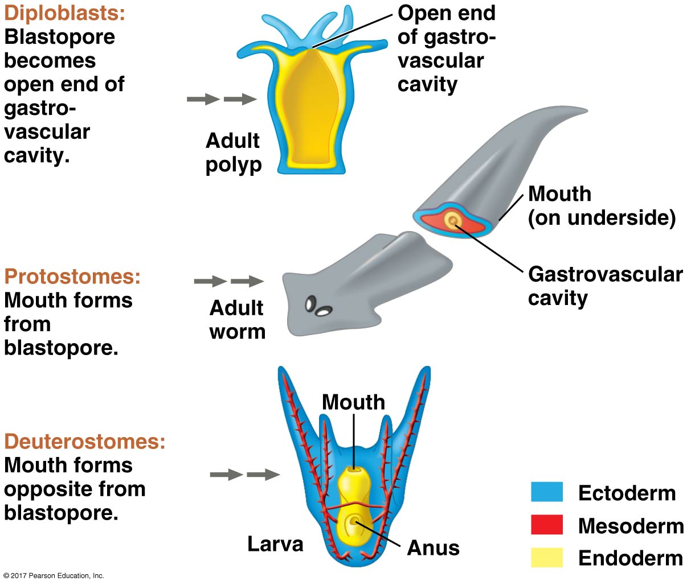

##

## Review: Animals are mutlticellular, eukaryotic heterotrophs 

* **Most ingest organic materials**
    + consume and then breakdown with enzymes

 

* **Lack structural support from cell walls**
    + external proteins connect and strengthen cells
    + most abundant are *collagen* (not found in plants/animals)

 

* **Cells orgainzed into tissues**
    + similar cells acting as a unit
    + muscle & nervouse tissue allows animals to move

 

* **Most animals reproduce sexually**
    + dominant diploid life stage
    + swimming sperm fertilizes egg
    

## Embryonic development key for animal diversity

* **Fertilized zygote undergoes cleavage**
    + mitotic cell divisions without cell growth
    + rapid division but overall size stays same

 

* **Early multicellular stage called a blastula**
    + similar to hollow ball
    + protostome or deuetrosome = alignment of cells
    
 

* **Tissue layers develop in next stage**
    + gastrulation resuts in gastrula

 

* **Many animals then have larval and adult stage**
    + larva = sexually immature
    + larva look, live and eat differently

## Protostomes vs Deutrostomes

## Protostomes vs Deutrostomes and the blastophore

## Germ layers

 

* **Sponges (0), Diplomasts (2), Triploblasts (3)**
    + study your phylogeney!!!

* **Ectoderm: **

 

* **Endoderm: **

 

* **Mesoderm: **

## 

## Fossil Fungi

 
 
 

* **Oldest fungal fossils appear ~900 mya**

 

* **In 2000, fossils of fungal spores and threads found in Wisconsin dated to 460 mya**
    + changed the origin of land-based fungi (Dirk Redecker)

 

* **Fungi and green plants moved onto land around same time**
    + helped plants invade the land! 
    + mycorrhizal symbiosis @ 405mya

## All Fungi share traits related to nutrition

 
 
 

* **Use enzymes to break down compounds**
    + diverse enzymes for diverse food sources
    
 
 

* **Heterotrophs: absorb nutrients from environment**
    + decomposers: break down dead things
    + parasites: absorb from host
    + mutualist: absorb/share with host
    

## Fungal derived enzymes and humans

## Fungal derived enzymes and humans

## Fungal body plan: Not-motile

## Most *hyphae* divided into cells by *septa*

## Mycelium: huge surface and volume for absorption

##

<iframe width="560" height="315" src="https://www.youtube.com/embed/E_Cy7KkwmWU" frameborder="0" allow="accelerometer; autoplay; encrypted-media; gyroscope; picture-in-picture" allowfullscreen></iframe>

## Specialized hypae in mycorrhizal fungi

 
 
 

* **Specialized hyphae for feeding on live animals**
    + hoops
    
 

* **Specialized hyphae that allow them to extract nutrients from plants**

 

* **Mutualistic fungi have branching hyphae they use to exchange nutrients with plant hosts**
    + *Arbuscules* invade cell walls

## Mycorrhizal fungi: sharing with plants

 
 
 

* **~80-90% of plants have association with fungus**
    + fungi grown in/around plant roots
    + share resources

 

* **2 main types:**
    + Ecto and Arbsucular mycorrhizae

 

* **Association now key for plants to thrive**
    + fungi more efficient @ nutrient uptake
    

## Fungi rule the world: plants and fungi talk

## Fungal life cycles

 

* **Life cycles can be complex**
    + spores are produced sexually or asexually
    + spores and nuclei of hypae are haploid (1N)

 

* **Lots of spores are produced**

 

**Sexual Reproduction:**

**1. Plasmogamy: Fusion of cytoplasm from different individuals**

**2. Karyogamy: parent nuclei fuse (2N)**

    

    
## Fungal life cycle: basic

## Fungal lineages (no longer clean groups)

## Fungal lineages (no longer clean groups)

## Fungal-animal mutualisms

## Fungal-animal parasitism: zombie apocalypse

<iframe width="560" height="315" src="https://www.youtube.com/embed/XuKjBIBBAL8" frameborder="0" allow="accelerometer; autoplay; encrypted-media; gyroscope; picture-in-picture" allowfullscreen></iframe>

    