## Animal form and function hash-tags

 

* **This lecture will cover animal function, by examining the mechanisms of homeostasis.**

 

* **#Homeostasis.**

 

* **#CircadianClocks**

 

* **#ThermoregulationBasics**

## Coordination and Control

* **Animal tissues and organs must be synced**
    + hunting predator: nose &rarr; brain &rarr; muscles

 

* **Animals have 2 systems for stimulus response**
1. Endocrine system: signal molecules released in bloodstream
2. Nervous system: neurons transmit signals throughout body

 

* **Endocrine signalling via hormones**
    + many hormones with unique receptors
    
 

* **Nervous system signalling via pathways**
    + nerve impulses travel to destination

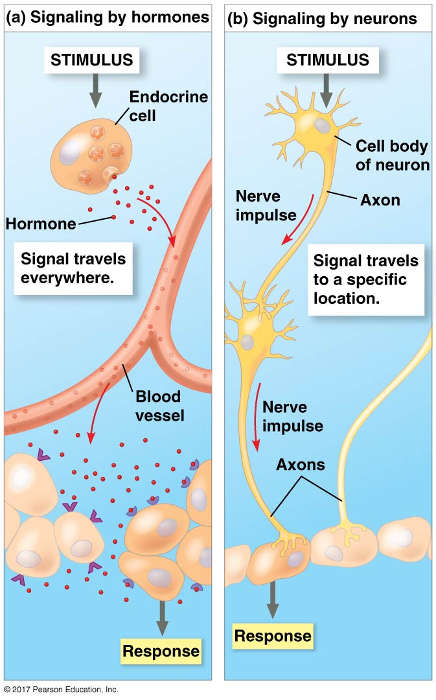

## Animals need to maintain internal environment

* **The external environment (especially land) is highly variable**
    + fluctuates daily, seasonally, annually, etc

 

* **Animals must maintain internal stability**
    + organ systems manage internal environment
    
 

* **Regulators: use internal mechanisms to control internal change**

 

* **Conformers: allows internal change in sync with external change**

   
    
* **Animals may use both mechanisms**
    + depends on variable
    

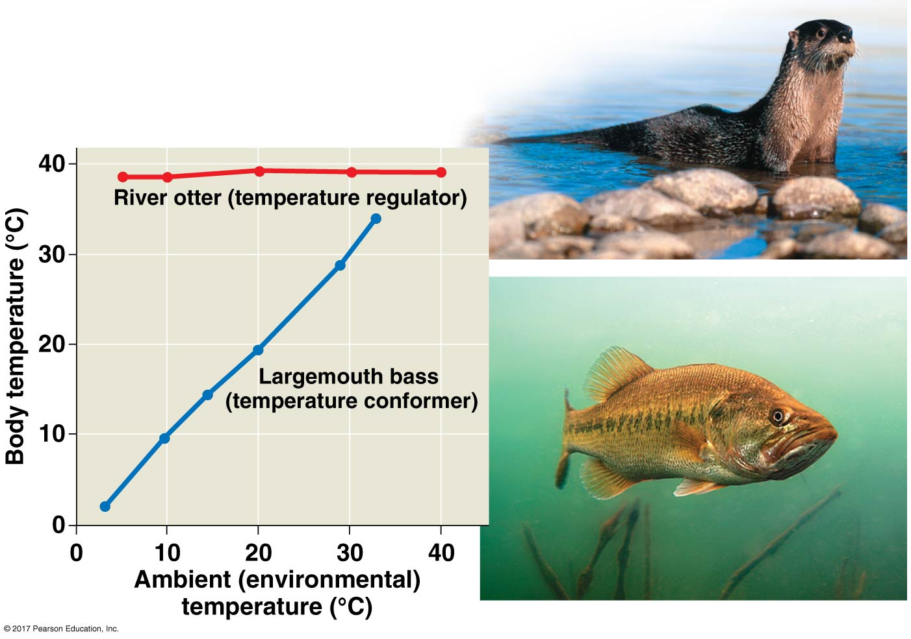

## Homeostasis: maintenance of internal balance

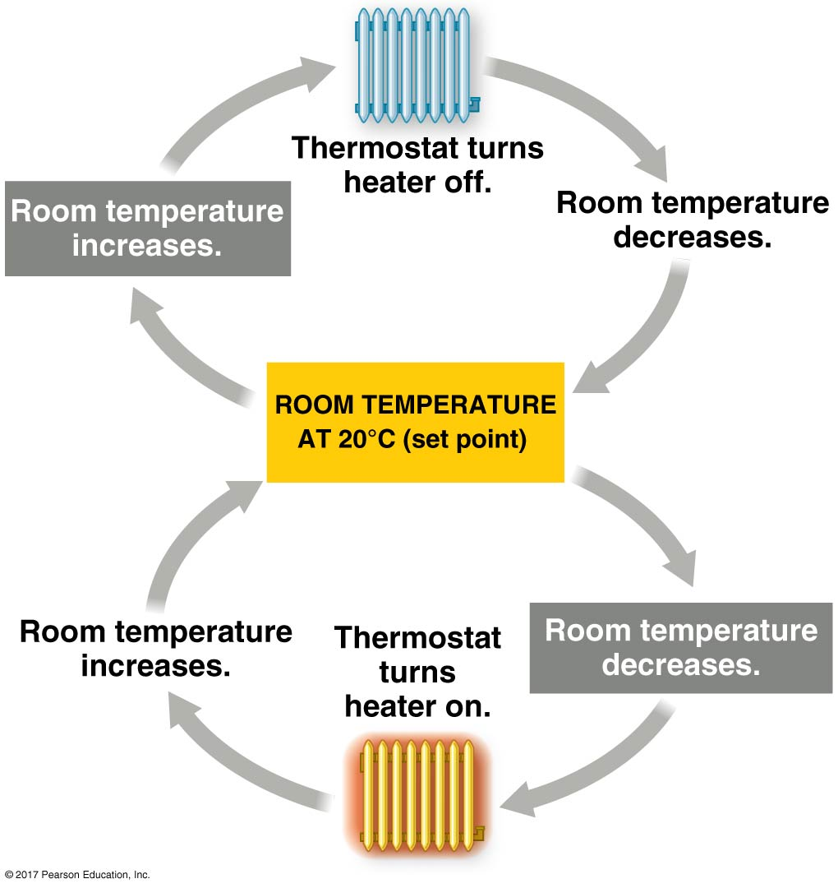

## Homeostasis: maintenance of internal balance

 
 

* **Animals exhibit *homeostasis* for a range of properties**
    + temperature, pH, blood glucose, etc. 
    + body or organs

 

* **Fluctuation in one of these properties is a *stimulus* **

 

* **Animal detect stimulus by a *receptor*, which triggers a response**
    + goal is to return the property to target value
    

## Homeostasis: Negative feedbacks

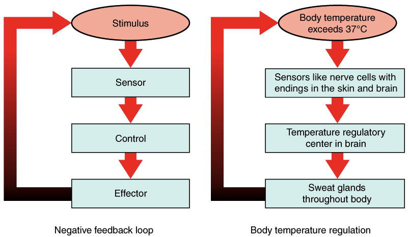

## Homeostasis is not constant

 

* **Regulated changes occur @ different life stages**
    + i.e. hormones at puberty

 

* **Regulated changes can be cyclical**
    + i.e. hormones and menstruation

 

* **Regulated changes on 24 cycle = *Circadian Rhythms* **
    + Why do we get jet lag?

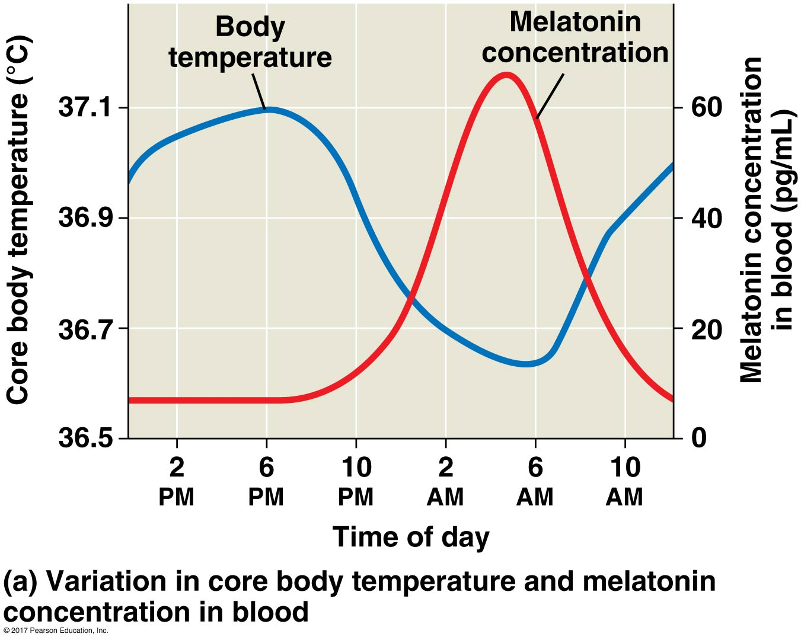

## Many human metabolic activities are on circadian clock

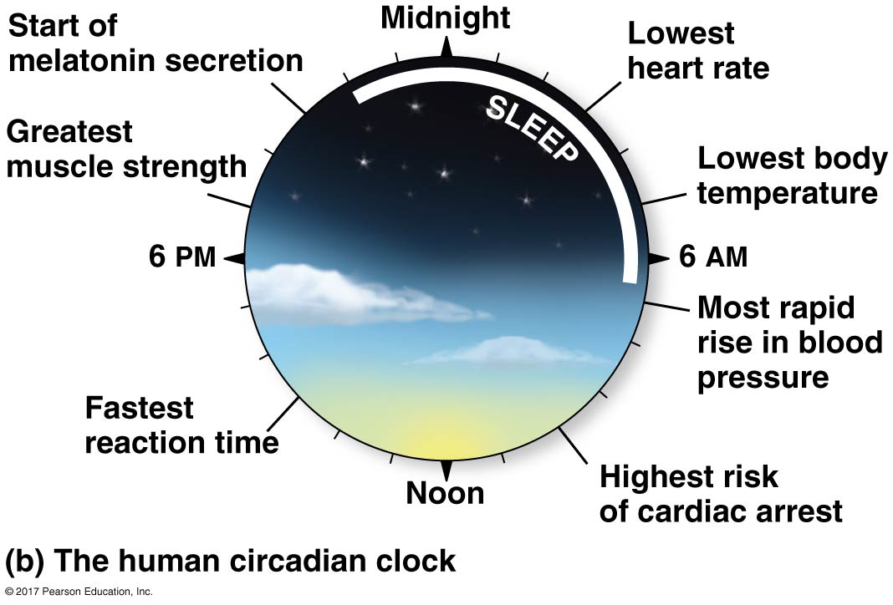

## Acclimatization: Animal's temporary adjustment to new environment

 

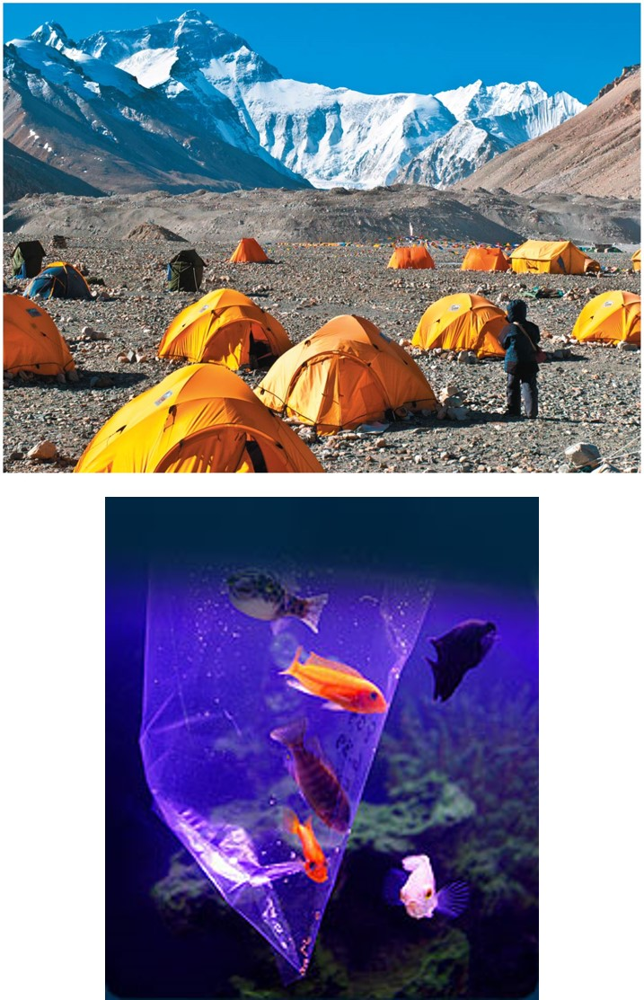

* **Animals often move into different environments**
    + changes in elevation, temperature, salinity, etc. 

 

* **May need to adjust *homeostasis* to new conditions**
    + not permanent (or would be 'adaptation')
    
 
 
* **Example: animals reach high altitude**
    + lower O~2~ causes animals to breath rapid and deeply
    + more CO~2~ is lost when exhaling, changing blood pH
    + over days, kidneys change urine output to fix blood

## Form and function together: *Thermoregulation* case study

 

* **Thermoregulation: maintaining body temperature within a range**
    + impacts enzyme activity, cellular fluids, biochemistry
    + outside range may be fatal
    
    
    
* **Heat for thermoregulation can come from 2 sources**
1. Internal metabolism: *Endothermic*
2. External sources: *Ectothermic*

  

* **Endotherms can maintain temperatures in fluctuating environments**
    + ability to heat or cool themselves
    
  

* **Ectotherms adjust temperature via behaviors**
    + seeking shade or sun
    + ectotherms need to eat less!!

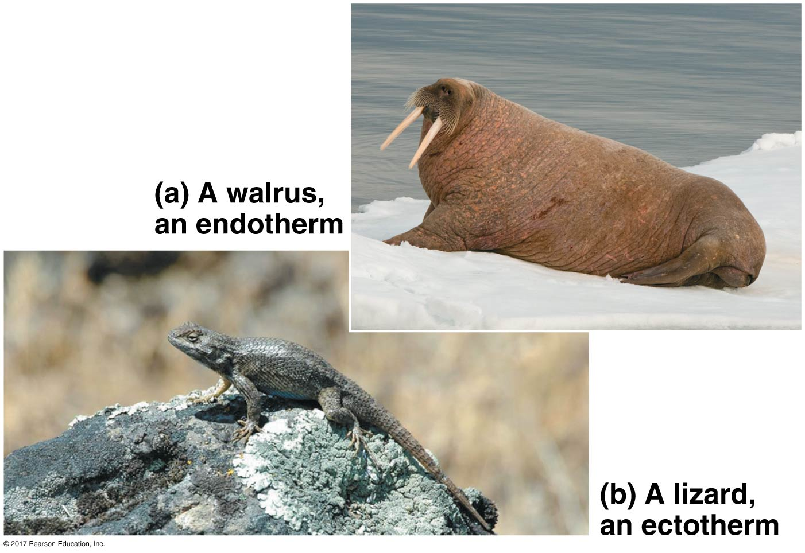

## Stop saying animals are 'Cold or Warm blooded'!!!

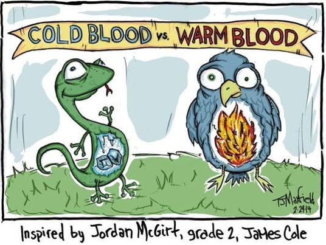

## Thermoregulation: Balancing heat loss and gain

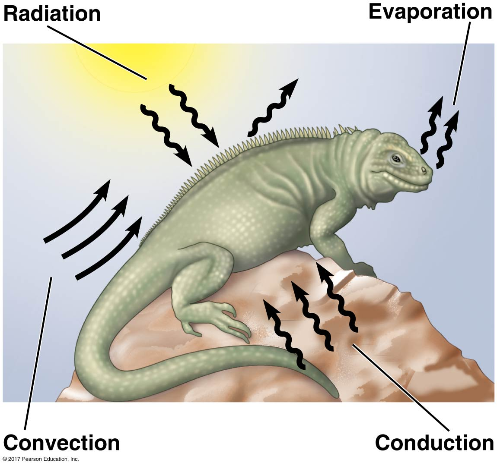

## Endotherms must produce heat: *Thermogenesis*

 
 

* **Endotherms bodies are constantly losing heat**
    + thermogenesis matches rates of heat loss
    
 
 
* **Thermogenesis increased by muscle activity**
    + moving
    + shivering
 
 
 
* **Shivering common in birds and flying insects**
    + 'warmed up' flight muscles

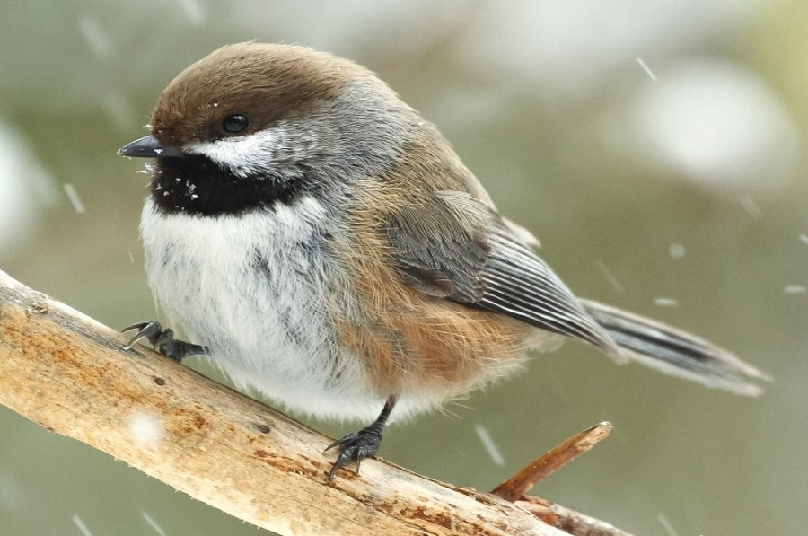
    
## Thermoregulation: Insulation

 

* **Insulation reduces flow of heat at body surface**
    + hair, feathers, fat, oils
    + important for mammals and birds

 

* **Insulation may be altered**
    + raising fur or feathers when cold
    + goose bumps in humans!!!

 

* **Insulation key for marine mammals**
    + water colder than body core
    + heat transfer faster in water than air

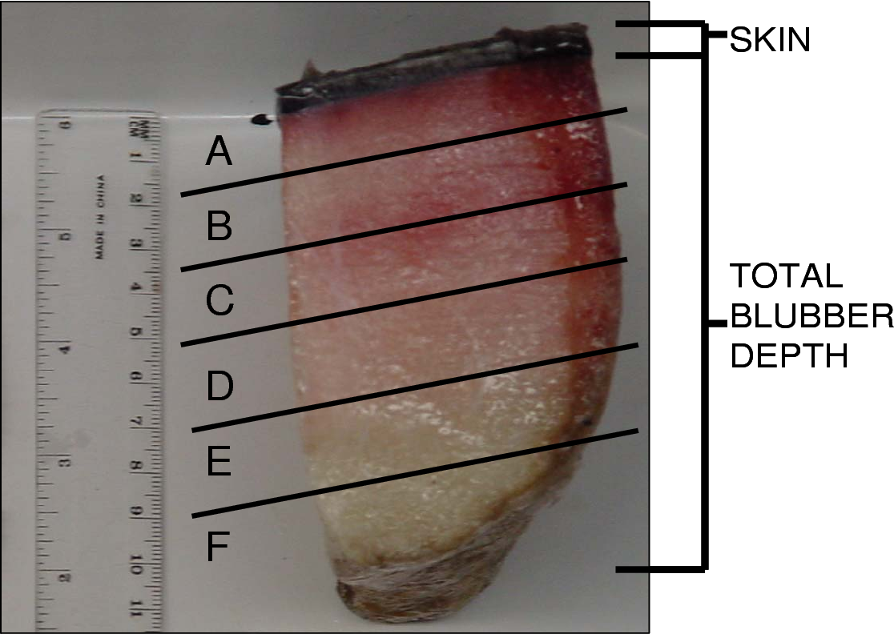

## Thermoregulation: Circulatory Adaptations

 
 

* **Animals can alter blood flow when temperatures change**
    + between internal body and skin
    
 

* **Blood vessels can relax, making them wider**
    + increases blood flow
    
 

* **Blood vessels can also constrict**
    + reduces blood flow

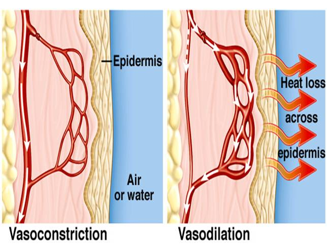

## Counter current heat exchange

>
 

**Birds, mammals, sharks, insects often transfer heat between fluids moving in opposite direction **

 

**Arteries and veins located next to each other**

 

**Heat transferred from warm blood (artery) to cold blood (vein) returning from extremities** 

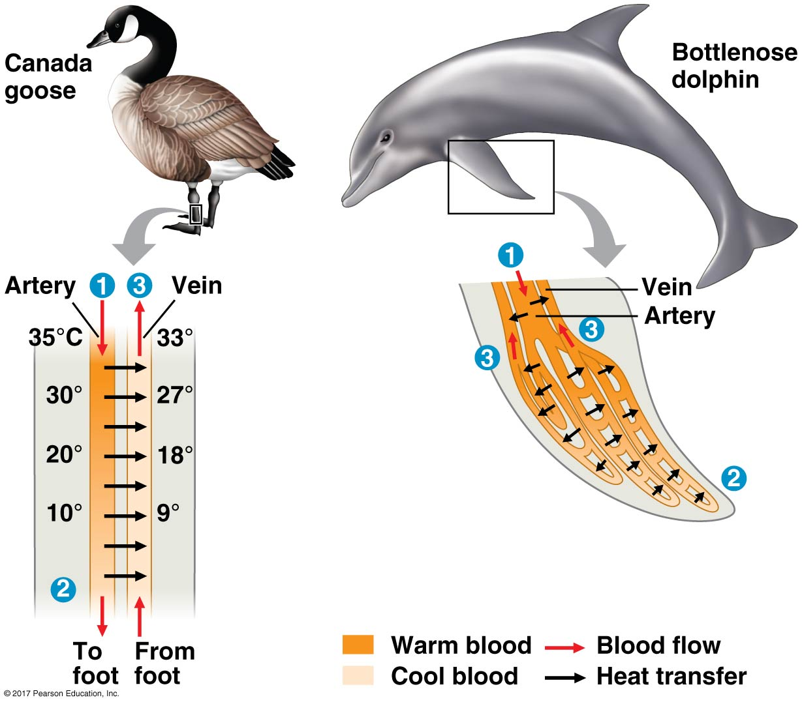

## Thermoregulation: Evaporative cooling (sweat glands)

## Thermoregulation: Social behavior

 

* **Group mechanisms to heat or cool**
    + Huddling for warmth
    + Fanning to cool

 

* **Emperor Penguins**
    + dark plumage facing out
    + overlapping feathers
    + shivering 
    + fat insulation
    + feet tipped up

 
    
* **Social thermoregulation common in bees**

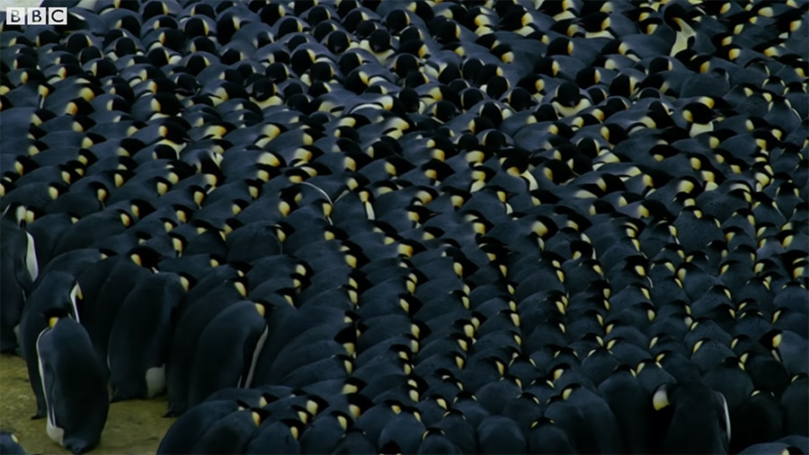

## The *hypothalamus* is the mammal thermostat

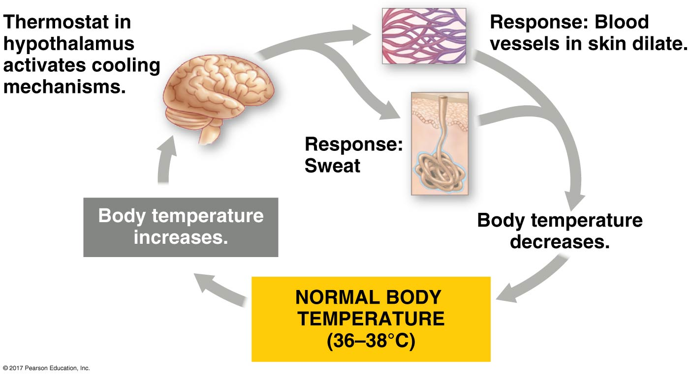

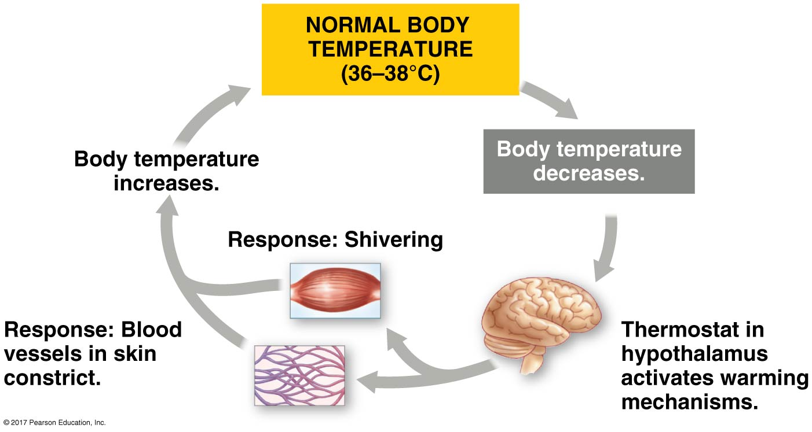
