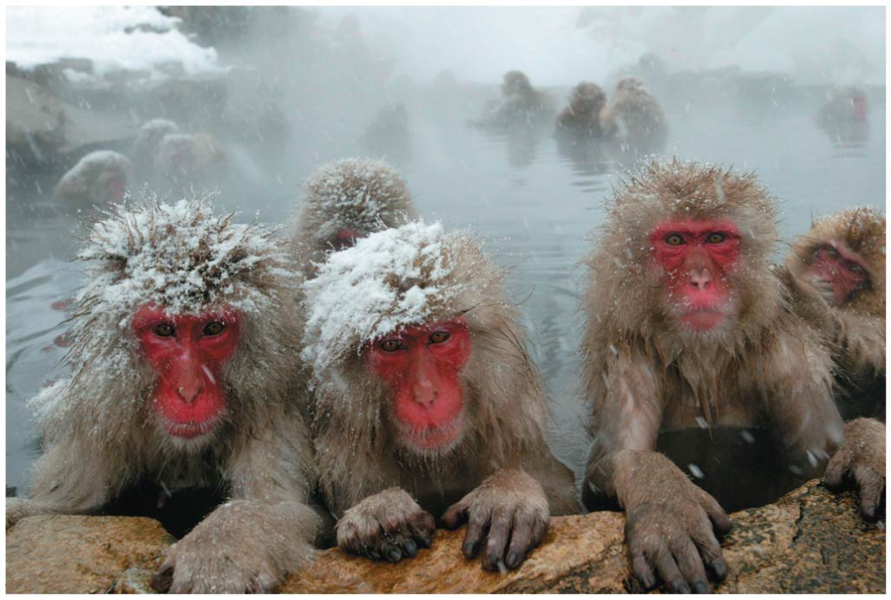
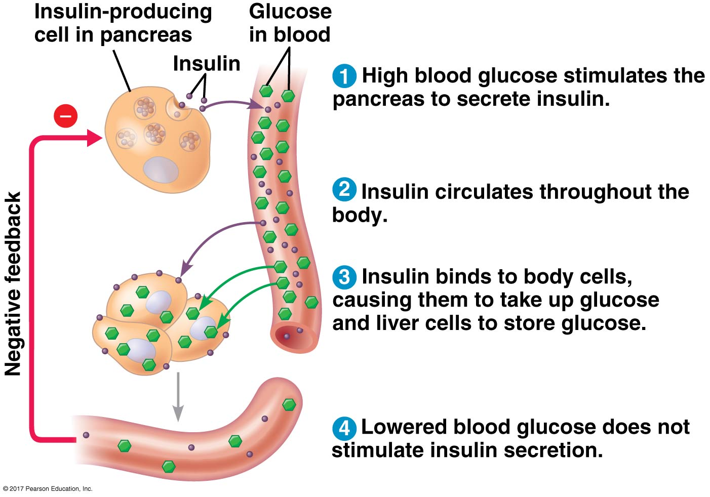

<!-- ## How can japenese macaques live in the snow and the jungle? -->
<!-- 
 -->

<!--  -->

<!-- ## Animal form and function hash-tags -->
<!-- 
 -->
<!--   -->

<!-- * **This lecture will cover animal function, by examining the mechanisms of homeostasis.** -->

<!--   -->

<!-- * **#Homeostasis** -->

<!--   -->

<!-- * **#CircadianClocks** -->

<!--   -->

<!-- * **#ThermoregulationBasics** -->

## Coordination and control of tissues and organs

* **Animal tissues and organs must be synced**
    + hunting predator: nose/ears &rarr; brain &rarr; muscles

 

* **Animals have 2 systems for stimulus response**
1. *Endocrine*: chemical signals released in bloodstream
2. *Nervous*: neurons transmit signals throughout body

 

* **Endocrine signalling via hormones**
    + many hormones with unique receptors
    
 

* **Nervous system signalling via electrical pathways**
    + nerve impulses travel to targeted destination

## Animals need to maintain their internal environment...

* **The external environment is highly variable**
    + fluctuates daily, seasonally, annually
    + especially on land

 

* **Animals must maintain internal stability**
    
 

* **Regulators: **

 

* **Conformers: **

   
    
* **Animals may use both mechanisms**
    + depends on the variable
    

## Homeostasis: maintenance of internal balance for regulators

## Homeostasis: maintenance of internal balance

 
 
 

* **Animals exhibit *homeostasis* for many internal properties**
    + temperature, pH, blood glucose, etc. 

 

* **Fluctuation in properties is a *stimulus* **

 

* **Animal detect stimulus by a *receptor*, which triggers a *response* **
    + returns variable  to target value
 

## Homeostasis is maintained via negative feedbacks

## Homeostasis for variables are not always constant

 

* **Regulation occurs @ different life stages**
    + hormones at puberty
    + larva vs adults

 

* **Regulated changes can be cyclical**
    + i.e. hormones and menstruation

 

* **Circadian Rhythms = **

 

* **Why do humans get jet lag?**

## Many human metabolic activities are on a circadian clock

## *Acclimation*: temporary adjustment to new environment

 

* **Animals often move into different environments**
    + changes in elevation, temperature, salinity, etc. 
    + or seasons (without moving)

 

* **May need to adjust *homeostasis* to new conditions**
    + not permanent (or would be 'adaptation')
    
 
 
* **Example: mammals reach high altitude**
    + lower O~2~ causes animals to breath rapid and deeply
    + more CO~2~ is lost when exhaling, changing blood pH
    + over days, kidneys alter urine output to fix blood pH

## Form and function together: *Thermoregulation* case study

* **Thermoregulation: **
    + impacts enzyme activity, cellular fluids, biochemistry
    
    
    
* **Heat for thermoregulation can come from 2 sources**
1. Internal metabolism: *Endothermic*
2. External sources: *Ectothermic*

  

* **Endotherms can maintain temperatures in fluctuating environments**
    + ability to heat or cool themselves
    
  

* **Ectotherms adjust temperature via behaviors**
    + seeking shade or sun

## Stop saying animals are 'Cold' or 'Warm' blooded

## Ectotherms: Balancing heat loss and gain via behaviors

## Endotherms must produce heat: *Thermogenesis*

 
 

* **Endotherms bodies are constantly losing heat**
    + thermogenesis matches rates of heat loss
    
 
 
* **Thermogenesis increased by muscle activity**
    + moving
    + shivering
 
 
 
* **Shivering common in birds and flying insects**
    + 'warming up' flight muscles

    
## Thermoregulation: Insulation reduces heat loss

 

* **Insulation reduces flow of heat**
    + fur, feathers, fat, oils
    + important for mammals and birds

 

* **Insulation may be altered**
    + raising hair or feathers when cold
    + goose bumps in humans!!!

 

* **Insulation vital for marine mammals**
    + water colder than body core
    + heat transfer faster in water than air

## Thermoregulation: Circulatory Responses

 
 

* **Animals can alter blood flow when temperatures change**
    + between internal body and skin
    
 

* **Blood vessels can relax, making them wider**
    + increases blood flow near skin to release heat
    
 

* **Blood vessels can also constrict**
    + reduces blood flow and prevents heat loss

## Counter-current heat exchange

 
 
 

**Birds, mammals, sharks, insects often transfer heat between fluids moving in opposite directions**

 

**Arteries and veins located near each other**

 

**Heat transferred from warm blood (artery) to cold blood (vein) returning from extremities** 

## Thermoregulation: Evaporative cooling (sweat glands)

**In some mammals, the nervous system stimulates sweat glands to secrete water to the skin surface, where it cools the body by evaporation**

## Thermoregulation: Social behavior

 

* **Group mechanisms to heat or cool**
    + Huddling for warmth
    + Fanning to cool

 

* **Emperor Penguins**
    + dark plumage facing out
    + overlapping feathers
    + shivering 
    + fat insulation
    + feet tipped up

 
    
* **Social thermoregulation common in bees**

## The *hypothalamus* is the mammal thermostat

