## Animal nervous systems are not 'new'

 

* **Early forms of sense-react existed in prokaryotes**

 

* **During the Cambrian explosion, specialized nervous systems appeared**
    + allowed animals to sense environment
    + allowed animals to respond quickly

 

* **Cnidarians are the simplest organisms with nervous systems**
    + nerve nets 
    + contraction & expansion of gastrovascular cavity

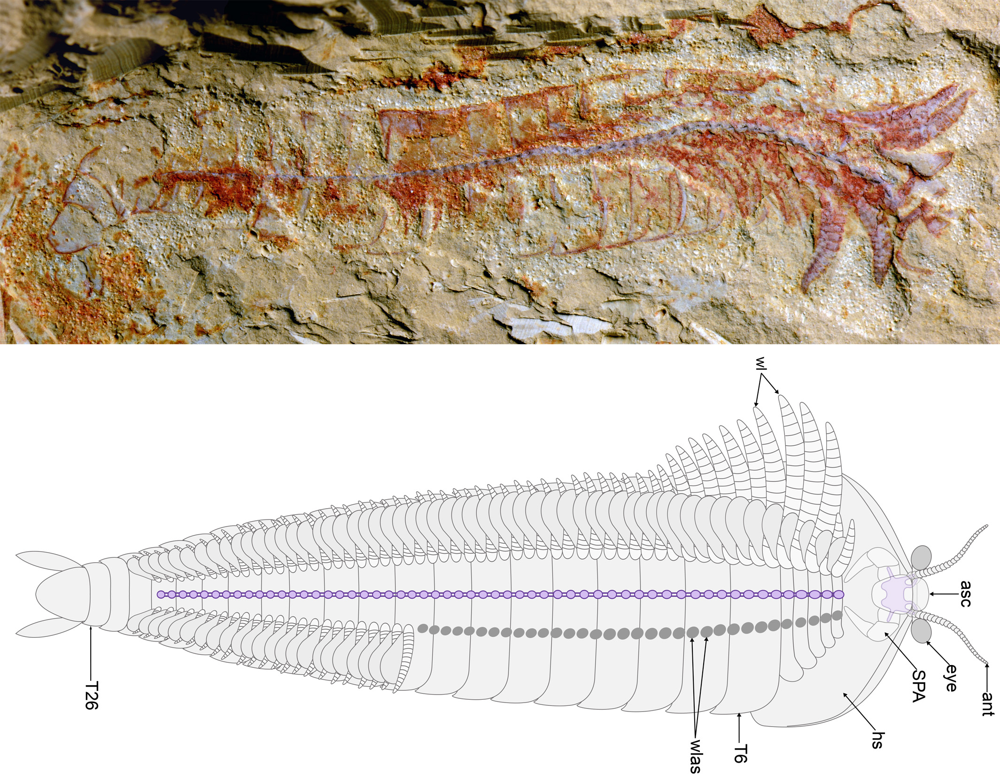

## Nervous systems consist of circuits of neurons and cells

* **In complex animals, axons of many neurons are bundled into 'nerves'**

 

* **Fibrous like nervous channels information flow along targeted routes in the nervous system**

 

* **Nerve circuits differ across the animal phylogeny**
    + sea stars = radial nerves connected to central ring
    + bilaterial animals - *cephalization*
    
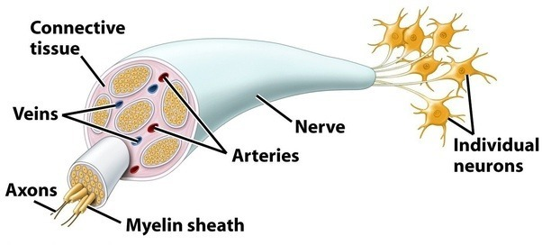

## Central nervous systems

* **Many animals have neurons that carry out integration formed into a CNS**

 

* **Planaria (flat worms) represent the first defined CNS**
    + small brain and nerve cords
    + only a small number of neurons (hundreds)

 

 

* **Higher animals have more complicated brains and nerve cords with ganglia**

## Peripheral nervous system relays info to CNS

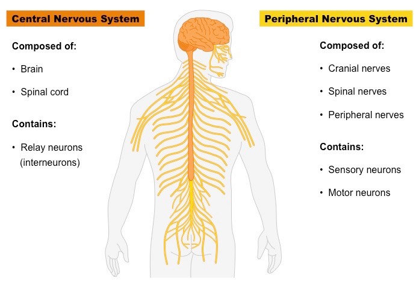

## Nervous system organization matches lifestyle

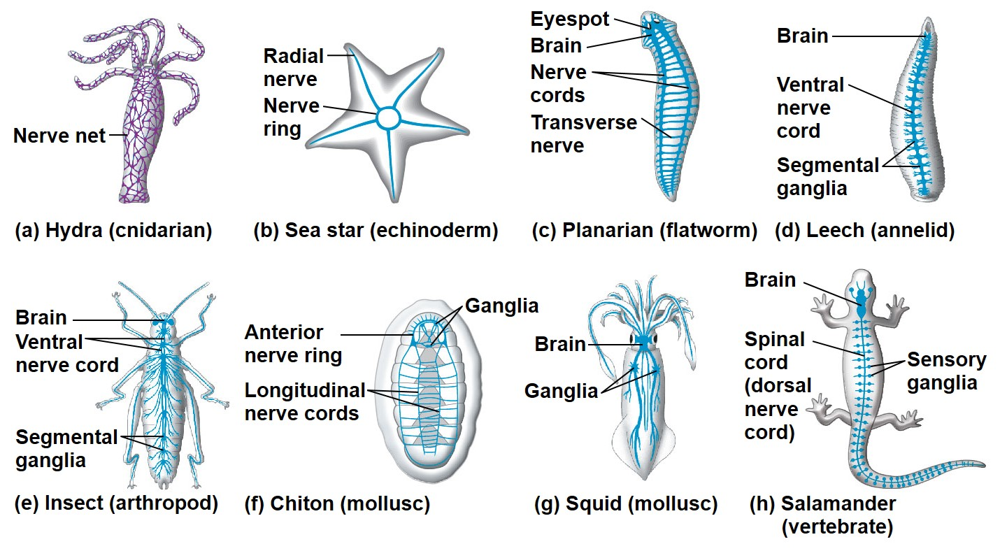

## Vertebrate nervous system

* **CNS develops from hollow dorsal nerve cord in development**
    + central canal of spinal cord
    + ventricles of brain
    
 

* **Brain & spinal cord have gray and white matter**
    + gray = neuron cell bodies
    + white = bundled axons

 

* **White matter exists on the interior of brain where neuron signalling is turned into function**
    + learning, emotions, processing, etc. 

 

* **White matter exists on the outer layer of the spinal cord to link CNS with PNS**
 

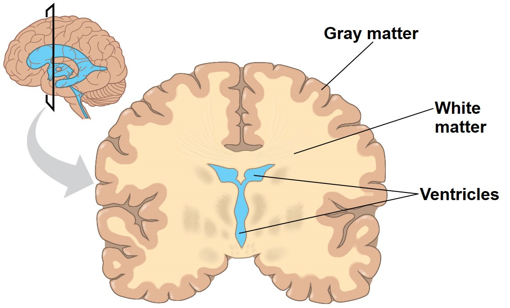

## Spinal cord relays info to and from brain

**Also, acts independently for simple *rapid* reflexes**

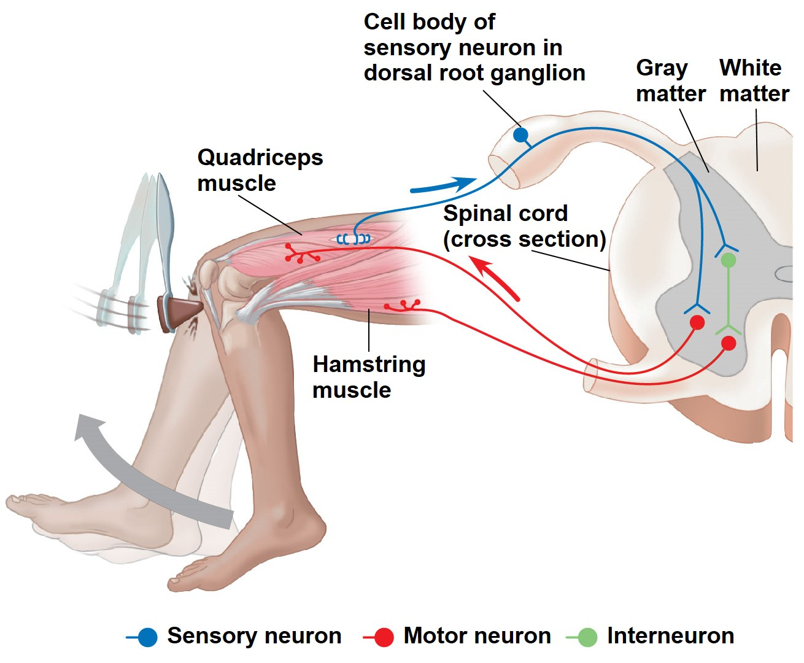

## PNS plays a large role in animal movement/homeostasis

 

* **Sensory information reaches the CNS along PNS neurons**
    + *afferent* neurons = to carry towards

 

* **CNS processes information and instructions travels to muscles, glands, etc.**
    + *efferent* neurons = to carry away

 

* **Nerve bundles include afferent and efferent neurons**

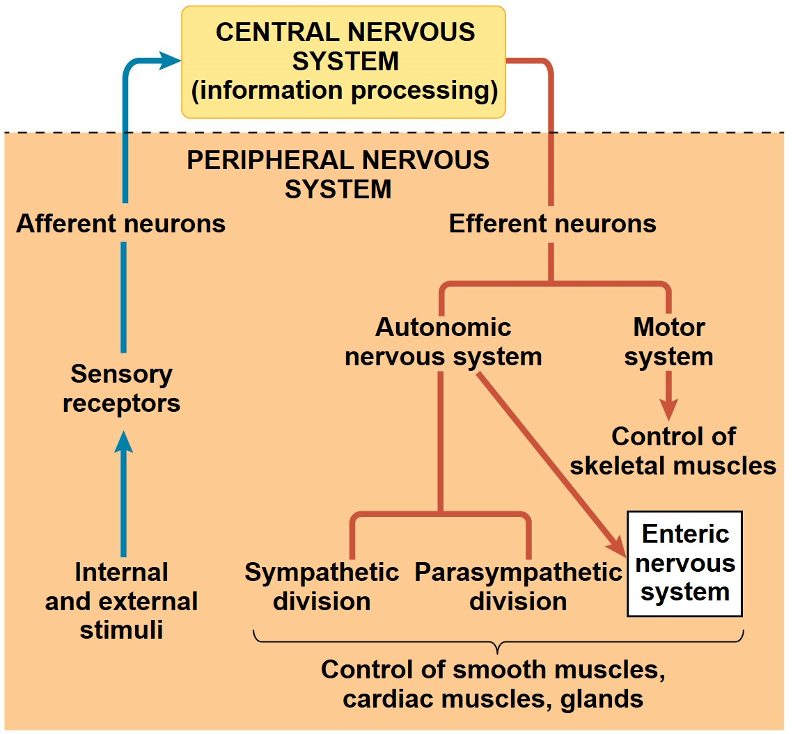

## PNS plays a large role in animal movement/homeostasis

 

* **PNS has 2 efferent components**
    + *motor* system
    + *autonomic* nervous system

 

* **Motor system carry signals to skeletal muscles**
    + voluntary (raise a hand)
    + involuntary knee-jerk

 

* **Autonomic system regulates *involuntary* smooth and cardiac muscles**
    + *Sympathetic*, *Parasympathetic*, *Enteric*
    + *Enteric* = digestion, pancreas, gallbladder    

## Sympathetic and Parasympathetic are antagonistic

**Arousal and energy generation (symp) vs calming and self-maintenances (para)**

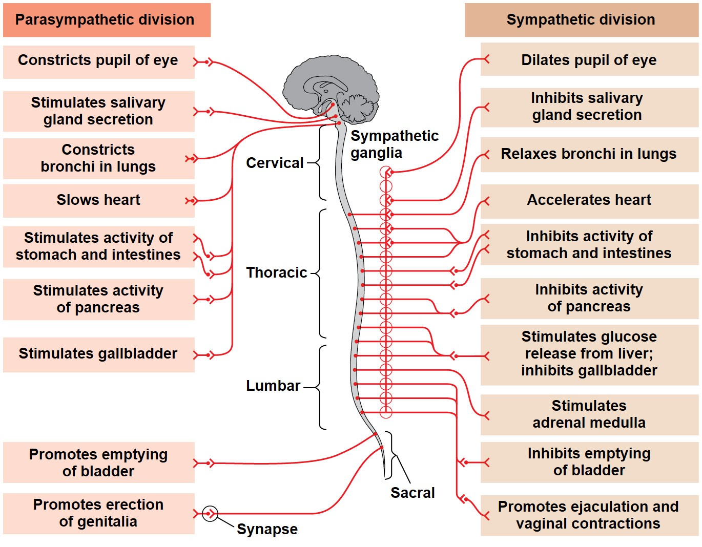

## Vertebrate brain is specialized by region

 

**Forebrain = processing of smells, sleep regulation, learning and complex processing**

 

**Midbrain = routing of sensory input**

 

**Hindbrain = involuntary activities such as blood circulation, locomotion**

 

**Across vertebrates, sizes of each region reflect importance of functions**

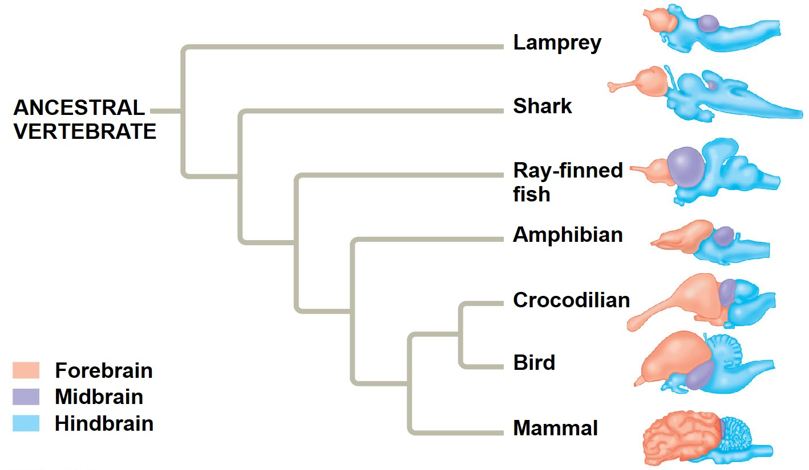

## Birds and mammals have larger brain:body size ratios

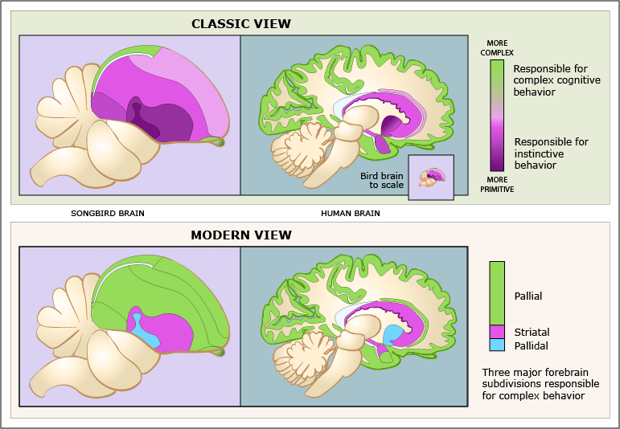

## Human brain

 

**100 billion neurons make 100 trillion connections**

 

**Cerebrum is essential for language, cognition, memory, consciousness and awareness**

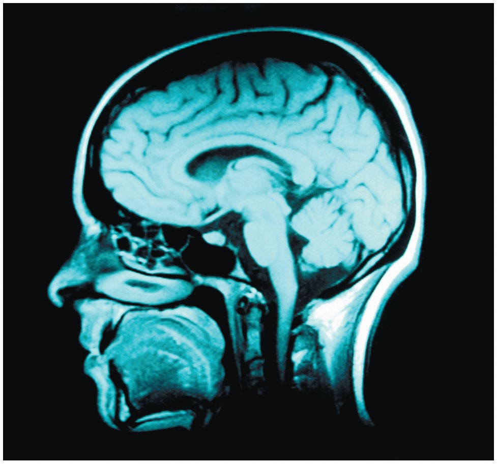

## Human brain

 

**100 billion neurons make 100 trillion connections**

 

**Cerebrum is essential for language, cognition, memory, consciousness and awareness**

 

* **Cerebrum is also regionized**
    + Frontal lobe = temperament and decisions
    + Temporal lobe = hearing
    + Paretial lobe = touch and integration
    + Occipital lobe = vision
    

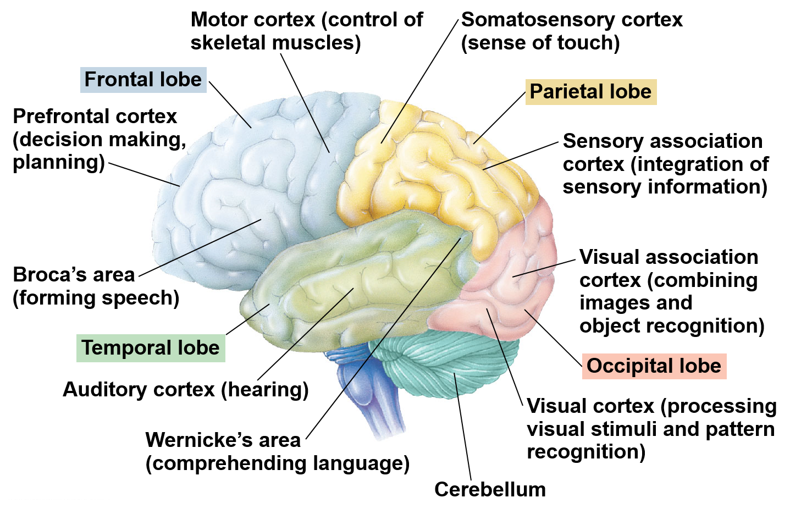

## Body parts are connected through sensory and motor cortexes

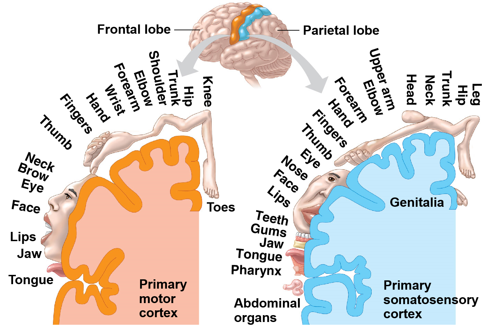

## Limbic system responsible for behaviorial, emotions, memory

 
 
 

* **Hippocampus = memory center (short and long)**
    + looks like a seahorse

 

* **Amygdalae = emotional responses, including  pleasure, fear, anxiety and anger**
    + looks like an almond
    + emotion functions in robust memories

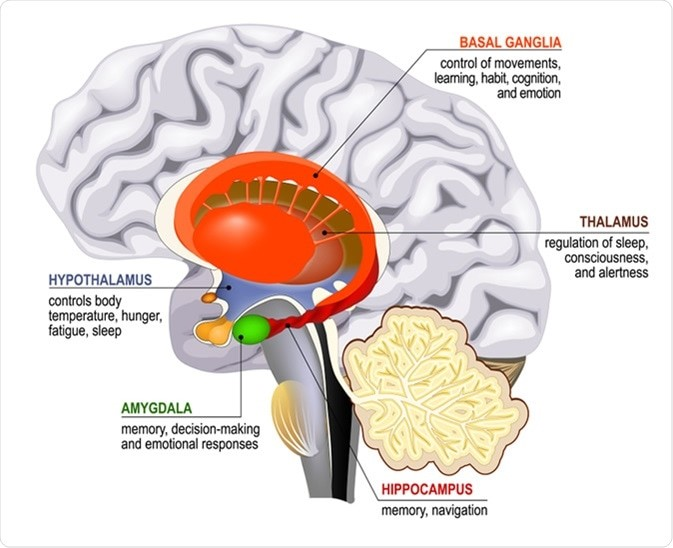
