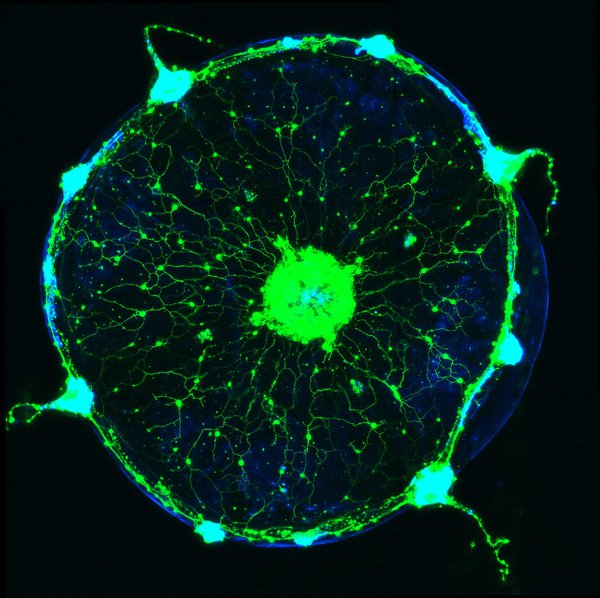
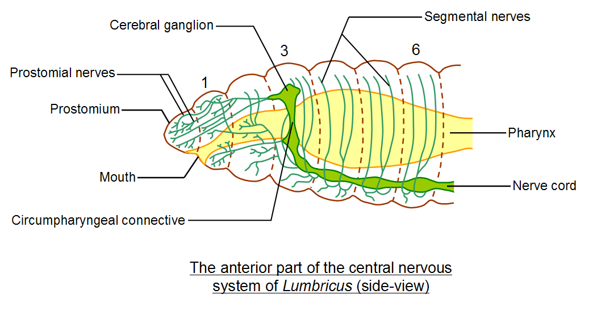

## Animal nervous systems are not 'new'

 

* **Early forms of 'sense-react' existed in prokaryotes**

 

* **During the Cambrian explosion, specialized nervous systems appeared**
    + allowed animals to sense environment
    + allowed animals to respond quickly

 

* **Cnidarians are the simplest organisms with nervous systems**
    + nerve nets scattered throughout body
    + control contraction & expansion of gastrovascular cavity

## Nerve net in jellyfish

## Nervous systems consist of circuits of neurons and cells

* **In complex animals, axons of many *neurons* are bundled into 'nerves' with other tissues**

 

* **Fibrous-like nerves channel information flow along targeted routes in the nervous system**

 

* **Nerve circuits differ across the animal phylogeny**
    + sea stars = radial nerves connected to central ring
    + bilaterial animals - *cephalization*
    

## Central nervous systems (CNS)

* **Many animals have neurons that carry out integration (i.e., perception) formed into a CNS**

 

* **Planaria (flat worms) represent the first defined CNS**
    + small brain and 2 nerve cords
    + only a few hundred neurons
     
 

 

* **Higher animals have more complicated brains and nerve cords with ganglia**
    + ganglia - clusters of nerves at at key points in spinal cord

## Nervous system organization also matches lifestyle

## Peripheral nervous system (PNS) relays info to CNS

## Vertebrate nervous system

* **CNS develops from hollow dorsal nerve cord**
    + central canal of spinal cord
    + hollow ventricles of brain
    
 

* **Brain & spinal cord have grey and white matter**
    + *grey* = neuron cell bodies, dendrites, terminals
    + *white* = bundled axons

 

* **White matter exists on the interior of brain where neuron signalling is turned into function**
    + learning, emotions, processing, etc. 

 

* **White matter exists on the outer layer of the spinal cord to link CNS with PNS**
 

## Spinal cord relays info to and from brain

**Also, acts independently for simple *rapid* reflexes**

## PNS plays a large role in animal movement/homeostasis

 

* **Sensory information reaches the CNS along PNS neurons**
    + *afferent* neurons = to carry towards

 

* **CNS processes information and instructions travels to muscles, glands, etc.**
    + *efferent* neurons = to carry away

 

* **Nerve bundles include both afferent and efferent neurons**

## PNS plays a large role in animal movement/homeostasis

 

* **PNS has 2 efferent components**
    + *motor* system
    + *autonomic* nervous system

 

* **Motor system carry signals to skeletal muscles**
    + voluntary (raise a hand)
    + involuntary knee-jerk

 

* **Autonomic system regulates *involuntary* smooth (organs) and cardiac muscles**
    + *Sympathetic*, *Parasympathetic*, *Enteric*
    + *Enteric* = digestion, pancreas, gallbladder    

## Sympathetic and Parasympathetic are antagonistic

**Calming and self-maintenance (para) vs Arousal and energy generation (symp)**

## Vertebrate brain is specialized by region

 

**Forebrain = **
<!-- processing of smells, sleep regulation, learning and complex processing** -->

 

**Midbrain = ** 
<!-- routing of sensory input -->

 

**Hindbrain = **
<!-- involuntary activities such as blood circulation** -->

 

**Across vertebrates, sizes of each region reflect importance of functions to each animal**

## Birds and mammals have larger brain:body size ratios

## Human brain

 

**100 billion neurons make 100 trillion connections**

 

**Cerebrum (enhanced region of forebrain) is essential for language, cognition, memory, consciousness and awareness**

## Human brain

 

**100 billion neurons make 100 trillion connections**

 

**Cerebrum is essential for language, cognition, memory, consciousness and awareness**

 

* **Cerebrum is also regionized (Don't Memorize)**
    + Frontal lobe = temperament and decisions
    + Temporal lobe = hearing
    + Paretial lobe = touch and integration
    + Occipital lobe = vision

<!-- ## Body parts are connected through sensory and motor cortexes -->
<!-- 
 -->

<!--  -->

<!-- ## Limbic system responsible for behavioral, emotions, memory -->
<!-- 
 -->
<!--   -->
<!--   -->
<!--   -->

<!-- 
 -->

<!-- * **Hippocampus = memory center (short and long)** -->
<!--     + looks like a seahorse -->

<!--   -->

<!-- * **Amygdala = emotional responses, including  pleasure, fear, anxiety and anger** -->
<!--     + looks like an almond -->
<!--     + emotion functions in robust memories -->

<!-- 
 -->

<!--  -->
