## Do albatross drink salt water?

 

* **An albatross remains at sea throughout the year**
    + only returns to land to reproduce
    
 

* **Albatross can survive by drinking seawater**
    + humans would die of dehydration
    
 

* **Both humans and albatross must maintain balance of fluids and solutes**
    + levels of ions (Na, Cl, Ca) too
    
 

* **Homeostasis requires *osmoregulation*: **
    + Balance water gain and loss
 
 

 
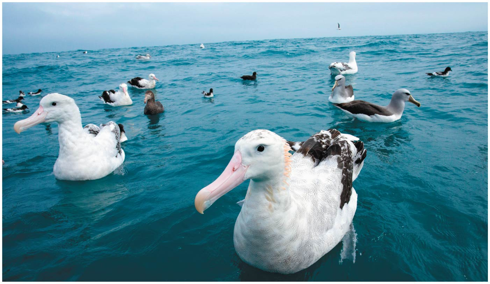
    
<!-- ## Osmoregulation and Excretion hash-tags -->
<!-- 
 -->
<!--   -->

<!-- * **This lecture will cover animal osmoregulation and excretion, which are necessary for homeostasis in different environments** -->

<!--   -->

<!-- * **#SoluteMovement** -->

<!--   -->

<!-- * **#ConformRegulate** -->

<!--   -->

<!-- * **#PoopTypes** -->

<!--   -->

<!-- * **#KidneyBasics** -->

## The big picture: Osmoregulation and excretion

 

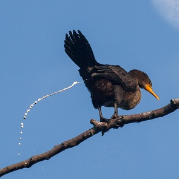

* **Different habitats present osmoregulation challenges**
    + deserts, oceans and even freshwater

 

* **Animals will have 'cell problems' if they do not regulate solutes**
    + excessive water uptake = 
    + substantial water loss = 
    

 

* **Animals must also get rid of ammonia, which can be toxic**
    + *excretion* = ridding the body of waste products
    
 

## Osmosis and Osmolarity

 

* **Water enters and leaves the cells by osmosis**
    + 2 solutions on either side of a membrane with different solute concentrations
    + *osmolarity* = 
    
 

* **2 solutions with same osmolarity are *isoosmotic* ** 
    + no net movement across membrane
    
 

* **Water moves from low to high osmolarity**
    + hyperosmotic = 
    + hypoosmotic = 

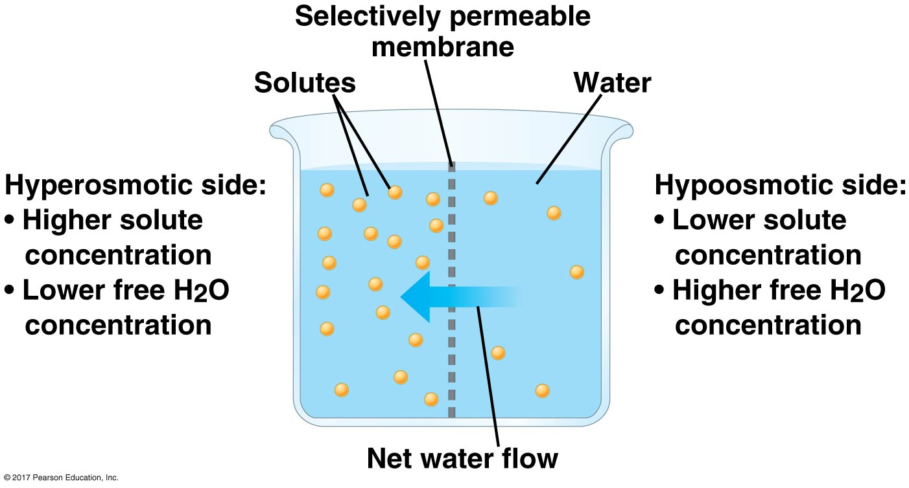

## To conform or to regulate.....

 

* **Animals maintain water balance by *osmoconforming* to surroundings**
    + internal osmolarity = environment
    + many marine animals
    
 

* **Animals maintain water balance by *osmoregulating* internal osmolarity**
    + may have discharge or uptake water
    + common for freshwater/terrestrial animals

 

* **Animals can be tolerant or sensitive to changes in osmolarity**

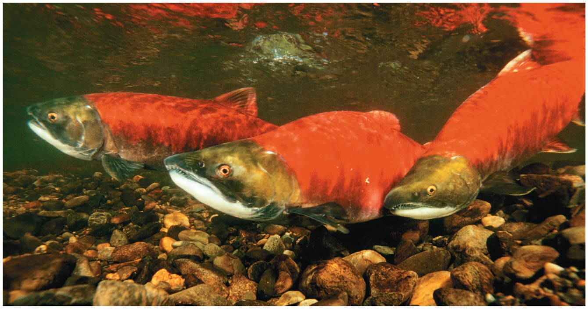

## Marine Animals (drink lots of seawater!)

    
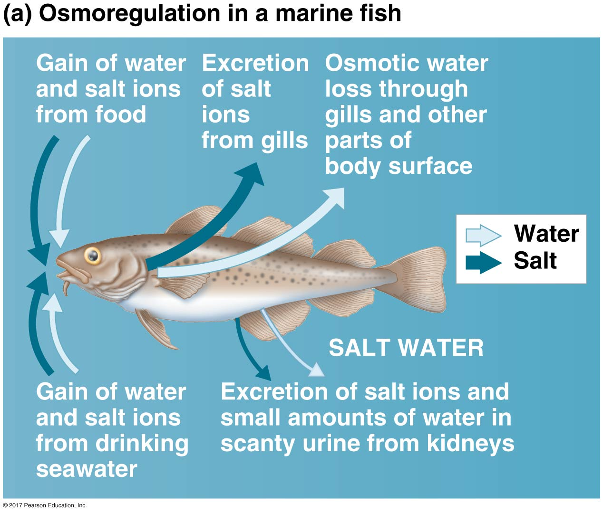

## Freshwater Animals (lots of excretion!)

## What happens in migrating salmon?

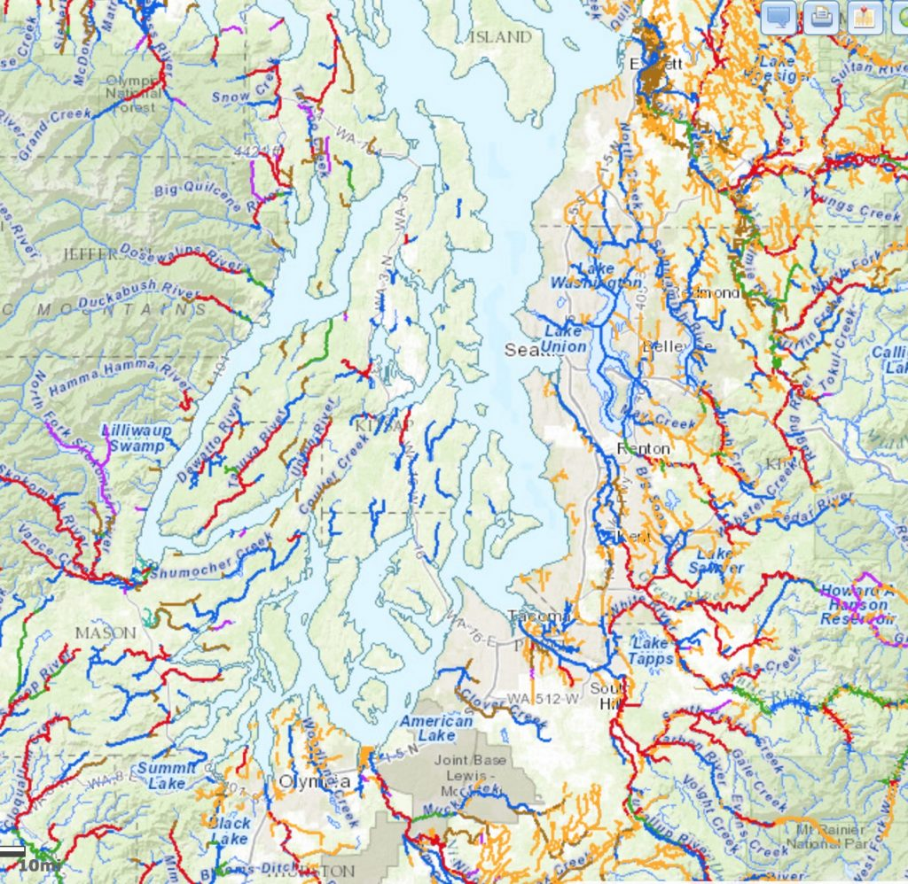

## Land Animals

 

* **Dehydration is main issue for terrestrial animals**
    + lots of adaptions to reduce water loss

 

* **Body coverings prevent dehydration**
    + wax layer, shells or keratin scales

 

* **Animal behaviors also adapt**
    + many desert animals are...
    
 

* **Animals always losing water**
    + urine, feces & gas exchange organs
    + must drink, eat or produce water metabolically

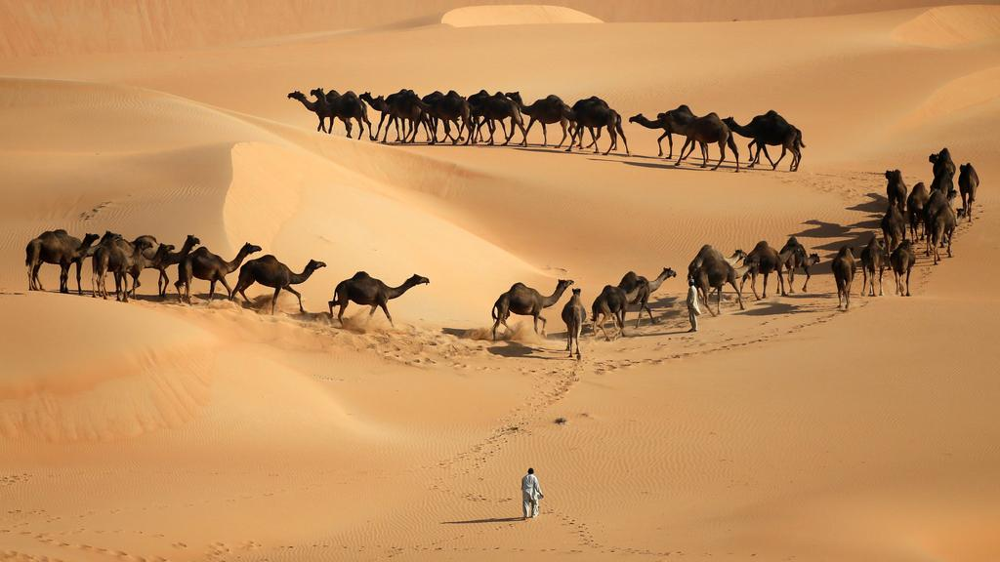

## Being a 'regulator' is expensive

 

* **Diffusion tends to equalize fluids**
    + osmoregulators expend energy to avoid this

 

* **Amount of energy depends on surroundings**
    + 5% of metabolism in many fish
    + 30% of metabolism in shrimp in salty lakes

 

* **Body fluids are adapted to habitat**
    + lower [solute] in freshwater
    + higher [solute] in marine
    + minimizes energy costs

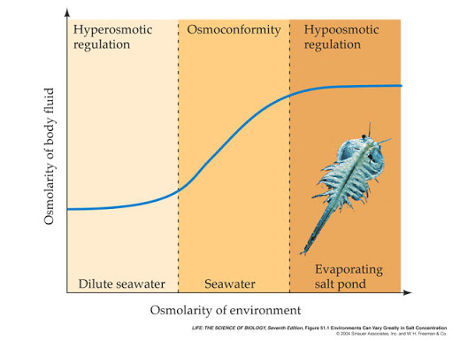

## Poop has a large impact on water balance

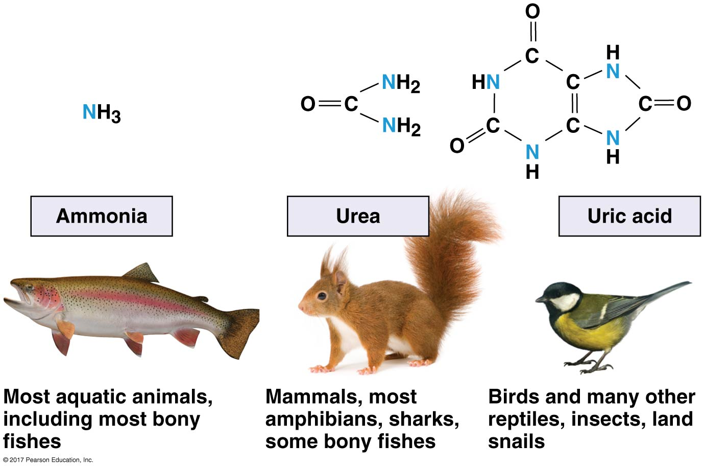

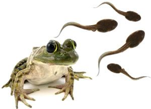

* **Waste excreted as ammonia, urea or uric acid**
    + vary in toxicity & cost to make
    
 
 
* **Ammonia: (NH~3~) is toxic, needs to be diluted**
    + common waste in aquatic animals

 

* **Urea: NH~3~ + CO~2~ in liver**
    + less toxic
    + energy expensive to produce
    + requires less water
    
 

* **Uric Acid: non-toxic and insoluble**
    + excreted with little water loss
    + most expensive to make
    

## Excretory systems filter body fluids

 
 
 

* **Excretory systems regulate solute movement**
    + internal fluids &larr; &rarr; environment
    + key for water balance
    
 

* **Many animals produce urine (fluid waste)**
1. *Filtration*:
2. *Reabsorption*:
3. *Secretion*:
4. *Excretion*:

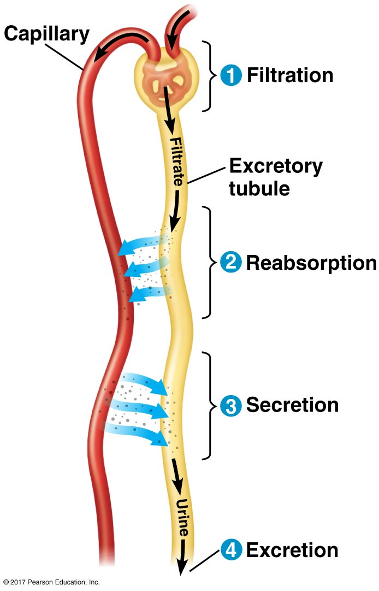

## Excretory systems are diverse in animals

   
   
   

* **Network of tubes with large surface area**
    + large exchange of water, solutes & wastes
    + *Insects*: nearly all water reabsorbed
    + *Vertebrates*: kidney used for osmoregulation & excretion

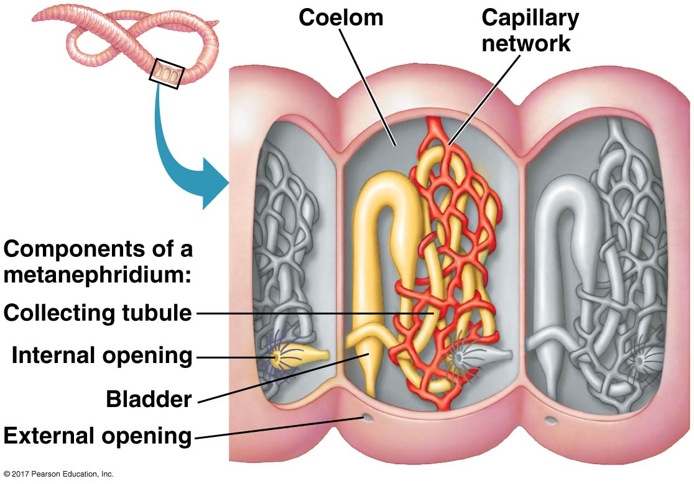

## Excretory systems are diverse in animals

   
  
  

* **Mammalian Kidneys: filters blood**
    + *cortex*:
    + *medulla*:
    + regions packed with excretory tubules
    + tubules create filtrate from blood
    + fluid reabsorbed and exits via vein
    + *ureter*:

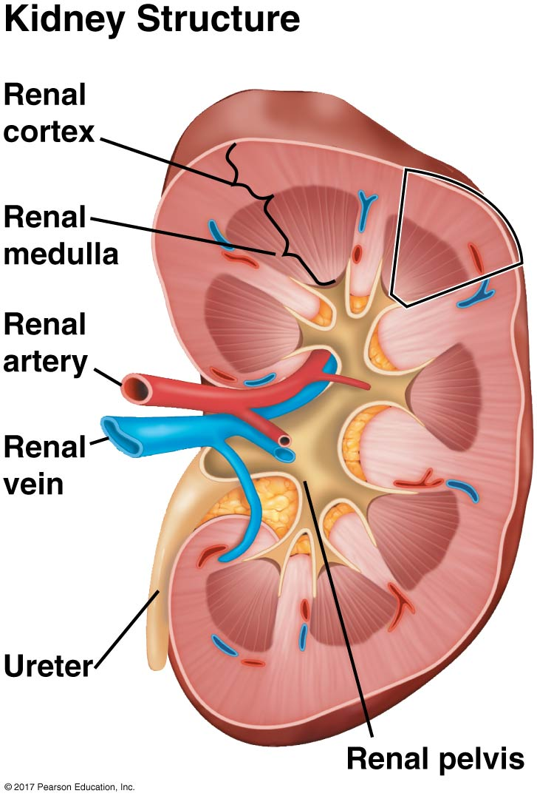

## Vertebrate/Mammalian kidney is key for life on land

  

* **Humans blood osmolarity = 300 mOsm/L**
    + Human urine osmolarity = 1,200 mOsm/L
    + urine 4x as concentrated
    
  

* **Desert mammals can concentrate urine 25x**

    

* **Energy spent to transport solutes against gradient**
    
 

* **Variety of complex mechanisms used to concentrate filtrate**
    + example: loop of Henle
    + kidney function adapted to habitats

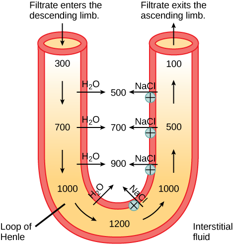

## Case Study: Kidney function in Vampire bats

* **Vampire bats feed on blood at night**
    
  

* **Drinks more than half body weight in blood each night**
    + may make it too heavy to fly!
    + kidneys excrete lots of dilute urine

 

* **Blood food mostly protein**
    + digested proteins become lots of Urea
    + Urea needs some water to dilute
    + roosting bats do not drink!
    
    

* **Kidneys shift to produce concentrated urine**
    + conserves water

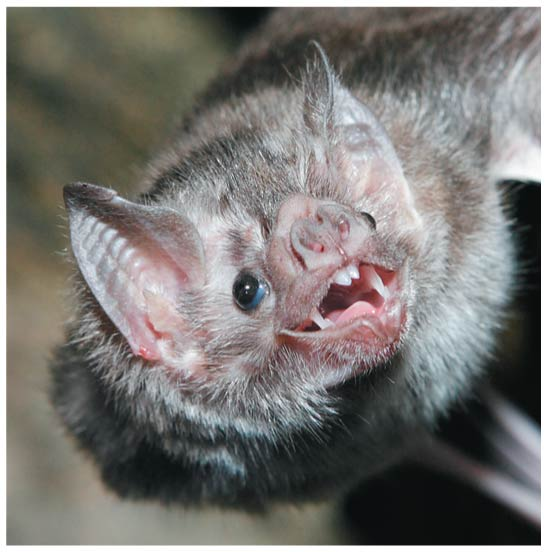

## 

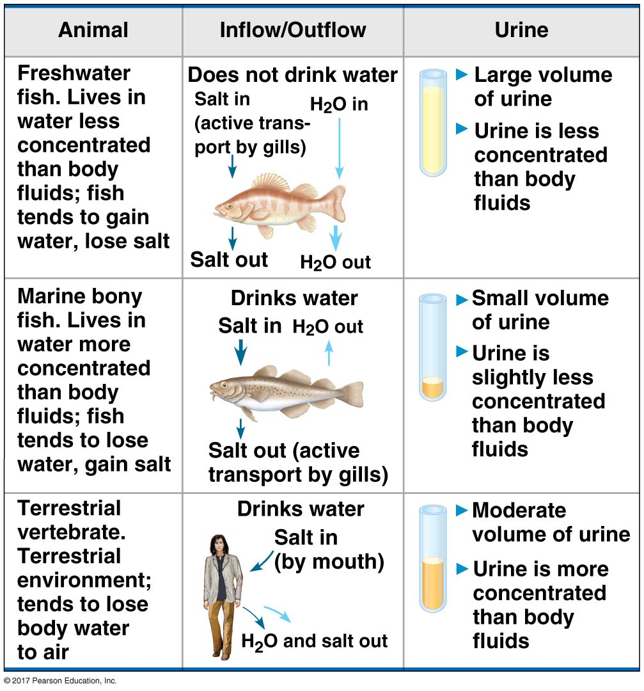
