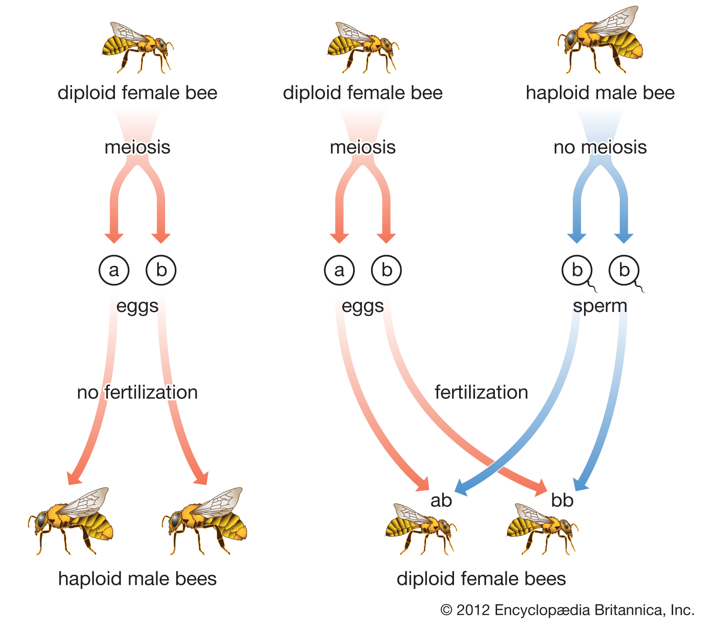

##

## Animal reproduction hash-tags

 

* **This lecture will cover general animal reproduction, with a specific focus on reproductive systems in mammals**

 

* **#AsexualTypes**

 

* **#SexualDiversity**

 

* **#Gamete Basics**

 

* **#MammalHormones**

## The big picture: Variation in animal reproduction

* **Mating between males and females is boring**
    + species can reproduce without sex
    + individual of species can change sex
    + species have male and female sex organs
    + some populations have only a few that mate

 

* **Two modes of reproduction in animal kingdom**
    1. Sexual: fusion of haploid gametes
    2. Asexual: no fusion of haploid gametes

 

* **Animals exhibit cycles of reproductive activity**

 

* **Mammalian reproduction is governed by hormones**

## Asexual reproduction in the animal kingdom

* **Budding: individuals arise from outgrowths of existing one**
    + found among invertebrates
    
 

* **Fission: separation of a parent into 2+ individuals**
    + about the same size
    + found among invertebrates

 

* **Fragmentation: break body into pieces, develop into adults**
    + accompanied by regeneration of lost body parts
    + sponges, worms, starfish

 
    
* **Parthenogenesis: development from unfertilized egg**
    + found among invertebrates and vertebrates

## Review video on budding, fragmentation (+ unnecessary extras)

 
 
 
 
 
 

https://www.khanacademy.org/science/in-in-class-10-biology/in-in-reproduction/in-in-asexual-reproduction-and-its-types/v/budding-fragmentation-regeneration-spores-how-do-organisms-reproduce-biology-khan-academy

## *Parthenogenesis*: Male drone bees are fertile and haploid!

## Animal sex blurs the lines of male and female

 

* **Sexual reproduction commonly between male and female**
    + finding a partner is difficult

 

* **Stationary animals tend to be hermaphroditic**
    + individual have male **and** female reproductive bits
    + Any 2 individuals can mate/self-fertilize  

 

* **Sex reversal occurs in different animal phyla**
    + oysters are males first, then turn to female when larger
    + the largest female in some coral fish turn to male

## Reproductive cycles are common in the animal kingdom

 

* **Cycles controlled by hormones and environmental cues**
    + occur with asexual or sexual modes
    + usually related to seasons

 

* **Ovulation: release of eggs at midpoint of female cycle**
    + cycles are variable in length
    + sheep: cycle + pregnancy = birth in spring

 

* **Seasonal breeders mate during certain times of the year**
    + temperature, food and water availability and predation
    + often synced with ovulation

 

* **Daphnia: cycles between asexual and sexual**
    + seasonally related to environment

## The "Handicap" of sexual reproduction

## How sperm and egg come together...

 
 
 

* **Union of egg and sperm = *Fertilization* **
    + can be external or internal

 
 

* **External: eggs shed by the female & fertilized by sperm in the environment**
    + moist habitat always required
    + *spawning*: individuals release gametes at same time

## How sperm and egg come together...

 
 
 

* **Union of egg and sperm = *Fertilization* **
    + can be external or internal

 
 

* **Pheromones: chemicals used to influence physiology and behavior**
    + function as mate attractants
    + pheromone production in humans is controversial 

## Pheromones in humans?

## Internal vs External: Offspring survival

 
 
 

* **Internal fertilization produces fewer gametes**
    + survival of zygotes higher

 

* **Internal associated with protection mechanisms** 
    + parental care of young
    + shells, amniotic eggs, marsupials(?)

 

* **Not just vertebrates..**

## Making and delivering gametes

    

* **Individuals usually have *gonads* that produce gametes**
    + essential for sexual reproduction
    + often established early in embryo development

    

* **Many animals have complex systems**
    + structures to carry, store, protect and nourish gametes
    + e.g. fruit fly (*spermathecae* stores sperm in female)

    

* **Mating may occur with more than 1 male**
    + males have mechanisms to prevent other male success

## Mammalian reproduction governed by hormones

  

* **Hormones coordinated from many glands/organs**
    + hypothalamus, pituitary and gonads
    
  

* **Gonadotropin-releasing hormone (GnRH) is secreted by the hypothalamus** 
    + directs release of FSH (follicle-stimulating hormone) 
    + directs release of LH (luteinizing hormone)
    + both from pituitary gland 

    

* **FSH and LH act on male and female gonads**
    + stimulate sex hormone production

## Mammalian reproduction governed by hormones

  

* **Gonads then produce and secrete 3 hormones** 
    + testosterone, estradiol and progesterone
    + found in male/females in different amounts

    

* **In male embryos direct reproductive structures**

   

* **In maturing mammals induce sex characteristics**
    + physical/behavior differences (male/female)
    
   

* **At maturity play role in gamete formation**

## Hormonal control of male system (negative feedbacks)

## 2 linked cycles in females

 
 

* **Changes in the ovaries define the ovarian cycle**
    + preparation of endocrine tissues and release of eggs
    
 
 
* **Changes in the uterus define the menstrual cycle**
    + endometrium thickens with blood vessels
    + preparation for embryo implantation
    + if an embryo does not implant, the endometrium is shed 

 
 
* **Both cycles occur concurrently**
  + use same series of hormones

    
##

## Placental mammals (embryo develops in uterus): *Fertilization*

## Placental mammals (embryo develops in uterus): *Pregnancy*

 
 

* **Pregnancy (gestation): carrying one or more embryos in the uterus**
    + Not all embryos are capable of completing development

 
 

* **Duration of pregnancy correlates with body size and maturity of the young at birth**

 
 

* **Blood from embryo travels to placenta through arteries of the umbilical cord**
    + returns via the umbilical vein

## 

##

## Placental mammals (embryo develops in uterus): *Birth*

 
 
 
 

  
* **Childbirth begins with labor, contractions that push the fetus and placenta out of the body**

 
 
 

* **Labor regulated by hormones**
    + estradiol and oxytocin

## Differences between the 3 types of mammals

https://www.youtube.com/watch?v=sz3Yv3On4lE

