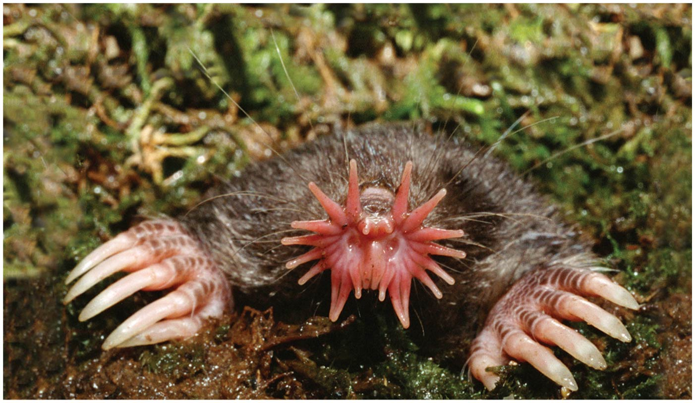
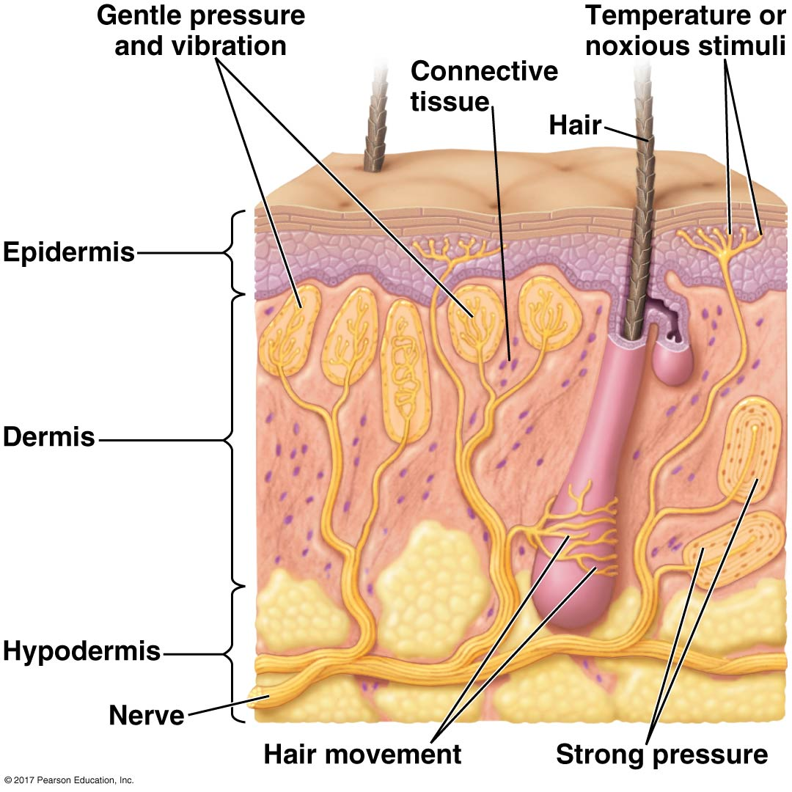
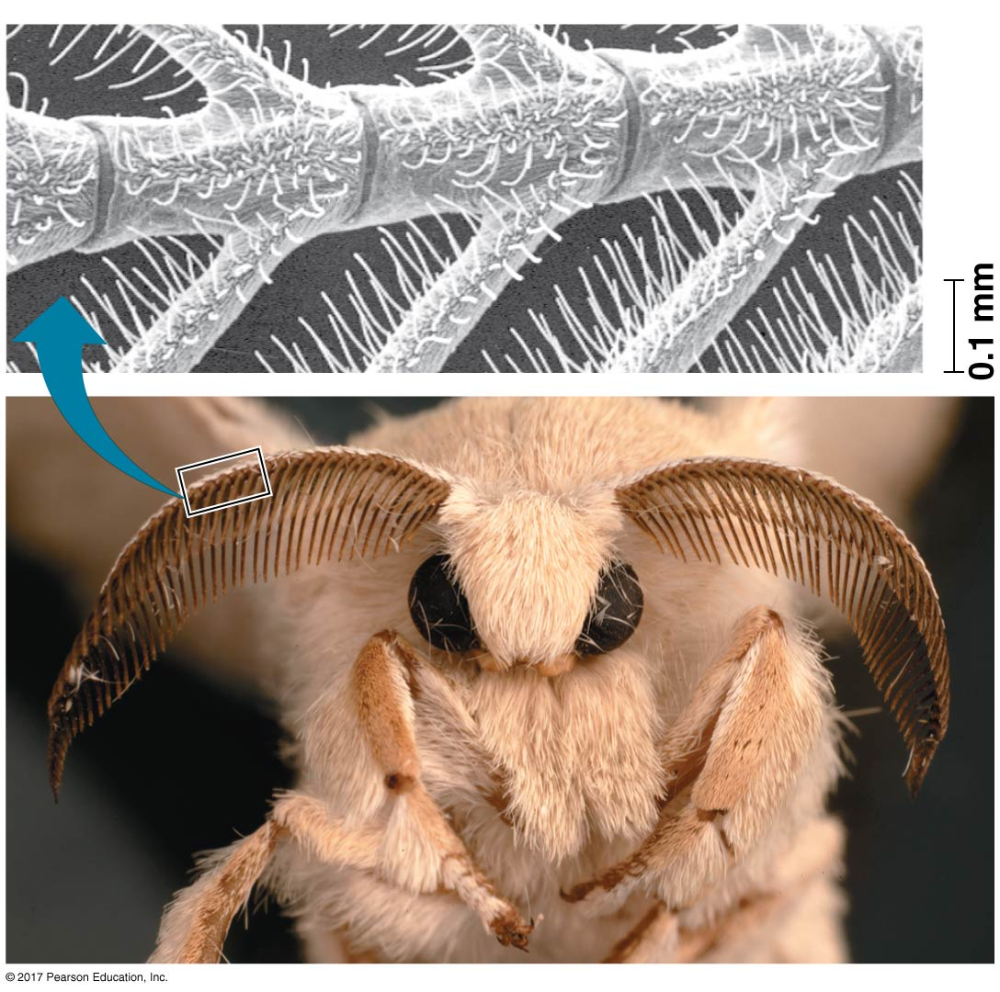

## The fastest predator on Earth?: star-nosed mole

**Eimer's organ: touch receptors - 120 milliseconds to identify and consume prey**

<!-- ## Animal Sensory hash-tags -->
<!-- 
 -->
<!--   -->

<!-- * **This lecture unpacks the mechanisms by which animals detect and process behaviors** -->

<!--   -->

<!-- * **#SensoryPath** -->

<!--   -->

<!-- * **#ReceptorTypes** -->

<!--   -->

<!-- * **#HowAnimalsHear** -->

## The Big Picture: Perception to Behavior

 
 

* **Sensory processes begin with stimuli**
    + stimuli are forms of energy

 

* **Receptors alert nervous systems (most animals)**
    + use *action potentials* (membrane voltage)
    + results in a 'sensation'

 

* **After a stimulus is processed, a response may be generated**

## Sensory pathways (4) work through neural pathways

* **Neurons = **
    + sensory, interneurons, and motor neurons
    
 

* **Most organelles located in the cell body**
    + includes nucleus

 

* **Highly branched extensions, called *dendrites*, receive signals**

 

* **Most neurons have a single *axon* to transmit signals**
    + transmit pulses of electrical current
    + terminals connect cells
    

## (1) Sensory Reception

 
 

* **Sensory pathways have four basic functions:**
    + reception, transduction, transmission, perception

 

* **Sensory pathway starts with stimuli**

 

* **(1) Sensory reception: **
    + sensory cells are specialized neurons
    + inside or outside body
    + detect stimuli

## (2) Sensory Transduction: Converting signals

 

* **Transduction: **
    + strength of stimulus determine how much

 

* **Stimulus receptors change flow of ions across membranes**
    + opens/closes ion channels
    + Ca^2+^, Na^+^, K^+^

 

* **Membrane potential: gradient that forces ions to passively move in one direction**
    + can be processed by central nervous system
    + magnitude of change in ion flow = strength of stimulus

## (3) Sensory Transmission: action potentials (nerve impulse)

 

* **Transmission:**

 

* **Action potential: **
    + caused by change in membrane potential
    + travels along *axon* and flow to other cells
    
 

* **Receptor generates action potentials that travel to central nervous system**
    + large stimulus = more action potentials

 

* **Speed of action potential depends on species**
    + length of axons varies
    + verterbrate axons are insulated

## Action Potential further explained...

 
 
 
 
 

https://www.youtube.com/watch?v=XnksofQN8_s

## (4) Sensory Perception: Processing the stimulus

 
 

* **Perception: **

 

* **How does the brain know the difference in stimuli?**
    + action potentials are not different from each other
    
 

* **Action potentials reach brain via dedicated neural pathways**
    + brain distinguishes stimuli on the path they arrive
    + 100 million neurons with 100 trillion connections = human brain

## If a tree falls in the woods......

## Animal sensory receptors: Mechanoreceptors

 
 

* **Response to touch, stretch, motion and sound**
    + Receptors sense physical deformation

 

* **Ion channels linked to structures that end outside cell**
    + hair or cilia
    + bending/stretching structure generates response

 

* **Touch receptors often embedded in tissue**

## Diversity of mechanoreceptors on mouse face

 

## Animal sensory receptors: Chemoreceptors

 

* **(1) Transmit information about solute concentration**
    + detect change in blood solutes &rarr; stimulate thirst

 

* **(2) Respond to individual kinds of molecules**
    + glucose, O~2~, CO~2~, amino acids, pheromones

 

* **Stimulus molecule binds to a chemoreceptor**

 

* **Chemoreceptor becomes more or less permeable to ions**
    + silk worms detect pheromones from females several kilometers away
    

## Taste and smell rely on chemoreceptors

## Taste and smell rely on chemoreceptors

## Animal sensory receptors: Electromagnetic

 
 

* **Receptors that detect light, electricity and magnetism**

 

* **Animals create & detect electromagnetic energy to hunt**

 

* **Used by animal kingdom to migrate**
    + proteins can sense Earth's magnetic fields
    + insects, birds & mammals
    

## Animal sensory receptors: Electromagnetic

 
 

* **Receptors that detect light, energy and magnetism**
    + may also create & detect electromagnetic energy

 
 

* **Used widely by animals to sense prey**
    + 16% of fish species use electroreceptors to detect bioelectric fields from prey
    

## Animal sensory receptors: Thermoreceptors

 

* **Receptors detect heat and cold**

 

* **Hot pepper science has really helped!!!**
    + Receptors that respond to capsaicin also respond to high temperatures 
    + open a calcium channels
    + taste 'hot": activate same receptors as hot soup
    + opposite for 'cold' flavor

 

* **Mammals: thermoreceptors for specific temperatures**
* **Venomous snakes: infrared receptors to detect 'warm' prey**

## Animal sensory receptors: Pain

 
 
 

* **Pain receptors (nocioreceptors) detect stimuli that reflect harmful conditions**
    + damaged or inflammed tissues
    + gene mutations can cause C.I.P.
    
 

* **Respond to damaged/inflamed tissues**
    + perceived as pain
    + trigger defenses (withdraw)

<!-- ## Equilibrium and hearing: Mechanoreceptors -->
<!-- 
 -->
<!--   -->
<!--   -->
<!--   -->

<!-- 
 -->

<!-- * **Hearing is closely related to balance in animals** -->

<!--   -->

<!-- * **Invertebrates use *statocysts* to sense gravity** -->
<!--     + sand in a chamber with cilia and receptors -->
<!--     + sand re-positions when animal moves -->

<!--   -->

<!-- * **Insects have hairs that vibrate with sound waves** -->
<!--     + tuning fork for mating -->

<!-- 
 -->

<!--  -->

<!-- ## Equilibrium and hearing: Mechanoreceptors -->
<!-- 
 -->
<!--   -->

<!-- 
 -->

<!-- * **Hearing is closely related to balance in animals** -->
<!--     + *Ear*: mammal sensory organ for hearing and equilibrium -->

<!--   -->

<!-- * **Hearing: vibrating objects create pressure waves** -->
<!--     + ear *transduces* this stimulus into nerve impulses -->
<!--     + involves 'hair' cells -->
<!--     + brain perceives as sound -->

<!--   -->

<!-- * **Equilibrium: organs in inner ear** -->
<!--     + hair cells, gels and canals -->
<!--     + detect movement, position, and balance   -->

<!-- 
 -->

<!--  -->

<!-- ## Equilibrium and hearing: lateral line -->
<!-- 
 -->
<!--   -->

<!--  -->

<!-- ## Evolution of visual perception -->
<!-- 
 -->
<!--   -->
<!--   -->

<!-- * **Light detectors ranges from clusters of cells to complex organs** -->
<!--     + detecting light intensity &rarr; forming images -->

<!--   -->

<!-- * **Photoreceptors: sensory cells with light absorbing pigments** -->
<!--     + many conserved genes across animals -->

<!--   -->

<!-- * **Many invertebrates have light-detecting organs** -->
<!--     + eye spots, single lens & compound eyes -->
<!--     + may 'see' color or UV -->

<!--  -->

<!-- ## Single lens eye in vertebrates -->
<!-- 
 -->

<!--  -->

<!--  -->

##

