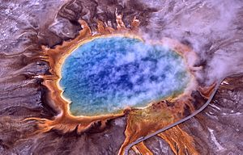
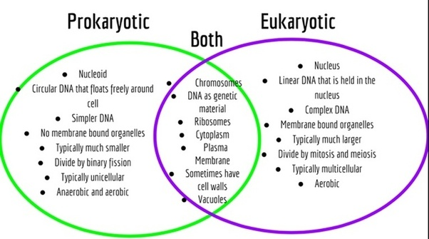
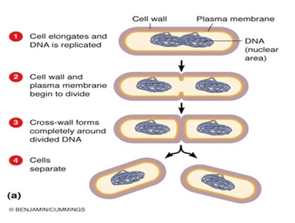

## Prokaryotes: The big picture

 

* **'Prokaryotes' are not a monopheyltic group
    + Bacteria, Archaea; some similarities, have unique traits

 

* **Diversity of ways of making a living**
    + sources of energy to make ATP
    + sources of carbon

 

* **Photosynthesis occurs in *distantly* related bacteria**
    + Cyanobacteria: first evidence ~2.7 bya
    + other bacteria gained photosynthesis by lateral gene transfer!!

 

* **Co-evolution with the planet and other organsims**
    + Oxygen accumulation via photosynthesis
    + extremeophiles (temperature, pH, salt,etc.)
    + *Prokaryotes are most abundant organisms on Earth!*

## Prokaryotes first to inhabit the Earth

## Prokaryotes are structurally diverse

 

* **Unicellular (some colonites)**

 

* **Small**

 

* **Many Shapes**

 

* **1/2 are motile**
    + use flagellum to move

## Common ancestor of all species living today: Prokaryote

##

## General Prokaryotic cell

## Reproduction in Prokaryotes

 
 

* **Asexual: daughter cells identical to parent**

 

* **However, Bacterial gene transfer occurs**
    + transger genetic material to NOT offspring

## Prokaryotes matter

## Prokaryotes matter: First fossils

* **First TRACES of living organisms**
    + Graphite carbon from Canadian rocks
    + Formed by ‘prokaryotes’
    + ~ 3.9 billion years ago! 
    
* **Cyanobacteria form stromatolites
    + undisputed fossils = 2.7 bya
    

## Prokaryotes matter: Cynaobacteria

## Prokaryotes matter: Great Oxygenation

## Prokaryotes matters: Humans

 

* **Photosynthetic prokaryotes led to O~2~ in atmosphere**

 

* ** Bacerteria and Archaea cycle nutrients**
    + break down dead things

 

* **A small % of Baceraia cause disease**

 

* **Bacteria clean pollution**

## 3 domain hypothesis: Linking Prokaryotes and Eukaryotes

## 2 domain hypothesis: Looking for LUCA

