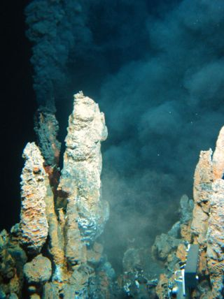
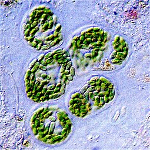

## BIOL 212: The Diversity of Life ---Where should we start?

 
**One of the most important outcomes of modern biology is the demonstration of the unity of life**

## 3 domain hypothesis: Linking Prokaryotes and Eukaryotes

 
 
 
 
 
 
 
 
 
 
 
 
 
 
 
 
 

**In 1857, Charles Darwin sent a letter to Thomas Huxley in which he wrote: “The time will come I believe, though I shall not live to see it, when we shall have very fairly true genealogical trees of each great kingdom of nature.”**

## 3 domains are not universally accepted...

 
 

* **1990, Carl Woese proposed that all cellular life could be placed into 1 of 3 ‘domains’**
    + Bacteria, Archaea and Eukarya
    + comparisons of small RNA sequences
    + Eukarya domain more closely related to Archaea

 

* **New genomic data argue that eukaryotes and archaea should not be separate**

 

* **The debate is unresolved and ongoing...**

## Is it 2 or 3 domains? That is the question...

## Looking for LUCA: Ancient Genes

* **The nature of the earliest ancestor of all living things has long been uncertain**
    + domains of life seem to have no common point of origin
  
 

* **Ancestor was likely a single-cell, bacterium-like organism**
    + Last Universal Common Ancestor **(LUCA)**
    + ~4 billion years ago

 

* **Scientists search for ancestral genes related by common descent**
    + 355 genes point to an organism that lived in the conditions found in deep sea vents

 

* **Vent organism was missing genes necessary for life**
    + must have been relying on chemical components from its environment
    + microbial 'mats' helped retain nutrients
    

##

## Bacterial prokaryotes first to inhabit the Earth

## Prokaryotes: First fossils

 
 

* **First TRACES of living organisms**
    + graphite carbon from Canadian rocks
    + deep-sea vent bacteria can create graphite
    + formed by ‘prokaryotes’
    + ~ 3.9 billion years ago! 

 

* **Cyanobacteria form stromatolites**
    + first undisputed fossils = 3.5 bya
    + western Australia has living examples
    + layers of calcium carbonate precipitated over bacterial colonies

## Common ancestor of all species living today: Prokaryote

## Prokaryotes: The big picture

 

* **'Prokaryotes' are not a monopheyltic group**
    + domains Bacteria & Archaea; each with unique traits
    + most species diverse groups on Earth

 

* **Diversity of ways of making a living**
    + use different sources of energy to make ATP
    + heterotrophs (get food from environment)
    + autotrophs (make their own food)

 

* **Co-evolution with the planet and other organisms**
    + oxygen poor to oxygen rich world
    + extremeophiles (temperature, pH, salt,etc.)
    + *prokaryotes are most abundant organisms on Earth!*

## Cells of Prokaryotes are simpler than Eukaryotes: Brain Storm

##

## Prokaryotes have a cell wall

 

* **Maintains cell shape, protects cells and prevents it from bursting in *hypotonic* solution**

 

* **In hypertonic environments prokaryotes loss water and shrink away from wall**
    + can halt reproduction
    + why salt is used to preserve food!

 

* **Major component of the bacterial cell wall is peptidoglycan**
    + rigid structure 
    + Archaean cells walls do not have peptidoglycan
    

## Cell surface structures: Gram + & - bacteria

## Hospitals: Gram staining as a fast diagnostic tool

 
* **2 main categories of bacterial infections**
    + Gram-positive and Gram-negative
    + allows treatment guidance to the most effective antibiotic
    
 

* **Gram stain is colored purple**
    + If stays purple = Gram-positive
    + If turns pink = Gram-negative

 

* **Gram+ : MRSA, strep and toxic shock.**

 

* **Gram- : salmonella, pneumonia, UTI's, and gonorrhea.** 

 

<!-- * **http://www.uphs.upenn.edu/bugdrug/antibiotic_manual/Gram3.htm** -->

## Gram - bacteria are more antibiotic resistant

## Evolution of traditional bacterial groups:

 

* **Gram positive bacteria are monophyletic**

 

* **Cyanobacteria (photosynthesis) are monophyletic**

 

* **Gram negative bacteria no longer considered monophyletic**

## Prokaryotes are structurally diverse

 

* **Unicellular (some colonies)**

 

* **Small**
    + microscopic to size of a poppy seed

 

* **Many Shapes**
    + spherical, rod, spiral

 

* **~1/2 are mobile (*taxis*)**
    + use flagellum

## The origins of movement: *Flagella*

 

* **3 main structures: motor, hook and filament (tail)**
    + relatively fast
    + very different from eukaryotes
    + complexity often used in creationism arguments
    
 

* **19 shared proteins are modified versions of existing proteins**
    + protein functions adapted to take on new functions
    + through natural selection!

 

* **Allows for *chemotaxis*, direct movement in response to chemicals**
    + towards or away

<!-- ## Prokaryotic vs Eukaryotic cells -->
<!-- 
 -->

<!--  -->

## Next time: Prokaryote functional diversity and importance

