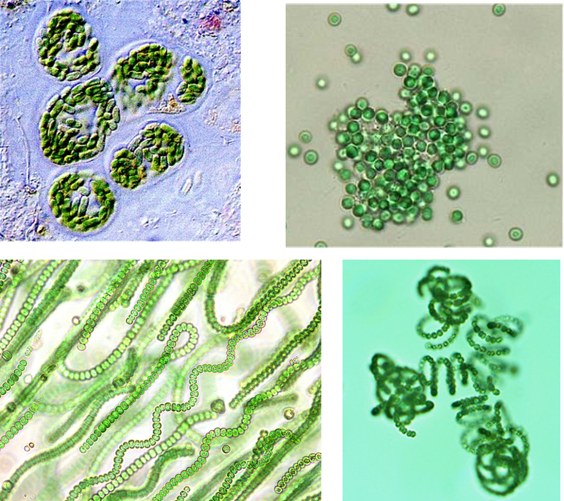
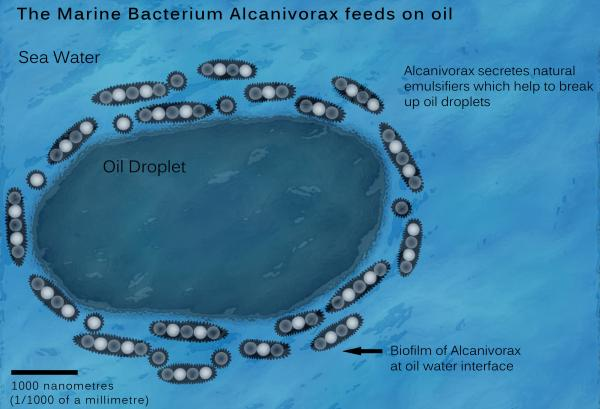

## Prokaryotes: The big picture

* **'Prokaryotes' are not a monopheyltic group**
    + Bacteria & Archaea; each with unique traits

 

* **Diversity of ways of making a living**
    + sources of energy to make ATP
    + sources of carbon

 

* **Photosynthesis first occurs bacteria**

 

* **Co-evolution with the planet and other organisms**
    + Oxygen poor to oxygen rich world
    + extremeophiles (temperature, pH, salt,etc.)
    + *Prokaryotes are most abundant organisms on Earth!*

## Prokaryotes first to inhabit the Earth

## Common ancestor of all species living today: Prokaryote

## Prokaryotes are structurally diverse

 
 

* **Unicellular (some colonies)**

 

* **Small**

 

* **Many Shapes**

 

* **1/2 are motile**
    + use flagellum

## Prokaryotic vs Eukaryotic cells

## Prokaryotic vs Eukaryotic cells

## Prokaryotes do it all!

 
 
 

* **Energy for ATP...**
    + sunlight
    + organic molecules
    + inorganic molecules

 

* **Sources of Carbon...**
    + Autotrophs (make themselves)
    + Heterotrophs (get from others)
    

    
## Reproduction in Prokaryotes

 
 
 

* **Asexual: daughter cells identical to parent**

 

* **However, Bacterial gene transfer occurs**
    + transfer genetic material to NOT offspring
    + transformation = 
    + transduction = 

## Prokaryotes matter

## Prokaryotes matter: First fossils

 
 
  

* **First TRACES of living organisms**
    + Graphite carbon from Canadian rocks
    + Formed by ‘prokaryotes’
    + ~ 3.9 billion years ago! 

 

* **Cyanobacteria form stromatolites**
    + undisputed fossils = 2.7 bya
    

## Prokaryotes matter: Cynaobacteria

 

* **Cyanobacteria: first evidence ~2.7 bya**
    + aka blue-green algae
    + aquatic and photosynthetic
    + use chlorophyll

 

* **Photosynthesis evolved independently in distant groups**
    + monophyletic or paraphyletic?
    + likely by lateral gene transfer!

 

* **Eukaryotes acquired photosynthesis by engulfing cyanobacteria!**

    

## Prokaryotes matter: Great Oxygenation

## Prokaryotes matters: Humans

 

* **Prokaryotes let us breath (O~2~)**

 

* **Bacteria and Archaea cycle nutrients**
    + break down dead things

 

* **A small % of Bacteria cause disease**
    + Lyme's disease

 

* **Bacteria clean pollution**
    + https://spinoff.nasa.gov/Spinoff2010/er_5.html

## 3 domain hypothesis: Linking Prokaryotes and Eukaryotes

## 2 domain hypothesis: Looking for LUCA

