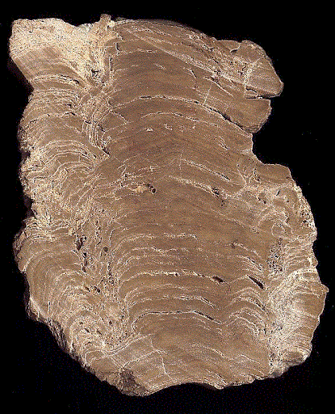
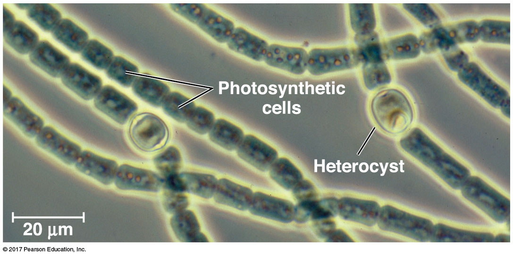
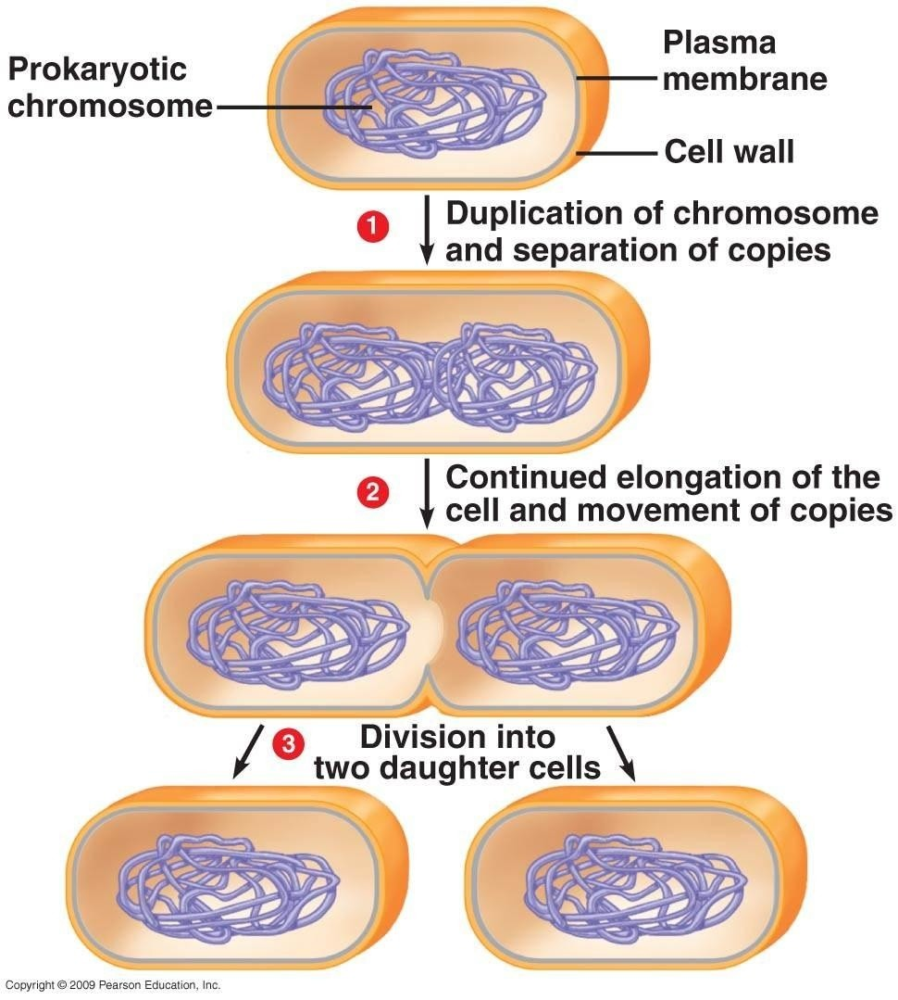
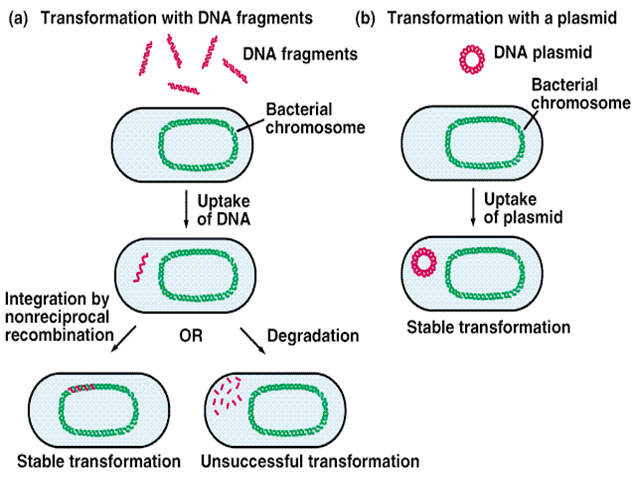
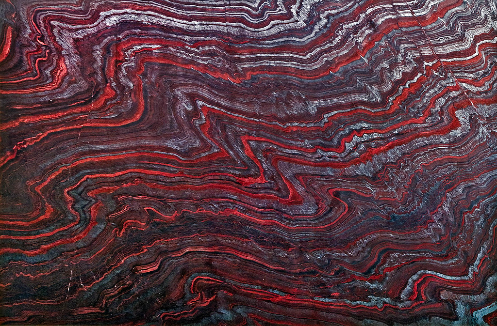
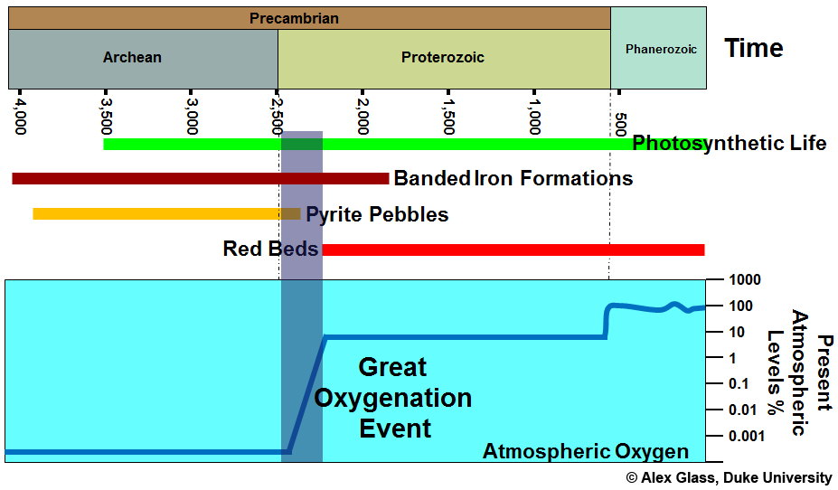

## Prokaryotes: The big picture

* **'Prokaryotes' are not a monopheyltic group**
    + Kingdoms Bacteria & Archaea; each with unique traits

 

* **Diversity of ways of making a living**
    + sources of energy to make ATP
    + heterotrophs
    + autotrophs (photosynthesis)

 

* **Co-evolution with the planet and other organisms**
    + oxygen poor to oxygen rich world
    + extremeophiles (temperature, pH, salt,etc.)
    + *prokaryotes are most abundant organisms on Earth!*

##

## Prokaryotes first to inhabit the Earth

## Prokaryotes matter: First fossils

 
 

* **First TRACES of living organisms**
    + Graphite carbon from Canadian rocks
    + Formed by ‘prokaryotes’
    + ~ 3.9 billion years ago! 

 

* **Cyanobacteria form stromatolites**
    + undisputed fossils = 3.5 bya
    + western Australia
    + layers of calcium carbonate precipitated over bacterial colonies

## Common ancestor of all species living today: Prokaryote

## Prokaryotes are structurally diverse

 

* **Unicellular (some colonies)**

 

* **Small**

 

* **Many Shapes**
    + spherical, rod, spiral

 

* **1/2 are motile (*taxis*)**
    + use flagellum

##

<!-- ## Prokaryotic vs Eukaryotic cells -->
<!-- 
 -->

<!--  -->

## Prokaryotes do it all! (review Table 27.1)

 
 
 

* **Sources of carbon**
    + autotrophs (make themselves)
    + heterotrophs (get from others)

 

* **Energy for ATP (no mitochondria)**
    + sunlight
    + organic molecules
    + inorganic molecules

## Cell surface structures: Gram + & - bacteria

<!-- ## Evolution of traditional groups: -->
<!-- 
 -->
<!--   -->

<!-- * **Gram positive bacteria are monophyletic** -->

<!--   -->

<!-- * **Cyanobacteria are monophyletic** -->

<!--   -->

<!-- * **Gram negative bacteria no longer considered monophyletic** -->

<!--  -->

<!--  -->

## Reproduction in prokaryotes: Binary fision

 

* **Asexual: daughter cells identical to parent**
    + rapid reproduction
    + not sustainable!
    + bad for genetic diversity

 

* **Mutations are rare but fast reproduction**

 

* **Gene transfer occurs:**
    + transformation = 
    + transduction = 

## Genetic Recombination: Transformation

<!--  -->

## Prokaryotes matter

## Prokaryotes matter: Cynaobacteria

 

* **Cyanobacteria: first evidence ~2.7 bya**
    + aka blue-green algae
    + aquatic and photosynthetic
    + use chlorophyll

 

* **Photosynthesis evolved independently in distant groups**
    + monophyletic or paraphyletic?
    + cyanobacteria are a monophyletic group

 

* **Eukaryotes acquired photosynthesis by engulfing cyanobacteria!**

    

## Prokaryotes matter: Great Oxygenation

## Prokaryotes matters: Humans

 

* **Prokaryotes let us breath (O~2~)**

 

* **Bacteria and Archaea cycle nutrients**
    + break down dead things

 

* **A small % of Bacteria cause disease**
    + Lyme's disease

 

* **Bacteria clean pollution**
    + https://spinoff.nasa.gov/Spinoff2010/er_5.html

<!-- ## 3 domain hypothesis: Linking Prokaryotes and Eukaryotes -->
<!-- 
 -->

<!--  -->

<!-- ## 2 domain hypothesis: Looking for LUCA -->
<!-- 
 -->

<!--  -->

<!--  -->