## Prokaryotes: The big picture

 

* **'Prokaryotes' are not a monopheyltic group**
    + Kingdoms Bacteria & Archaea; each with unique traits
    + most species diverse groups on Earth

 

* **Diversity of ways of making a living**
    + sources of energy to make ATP
    + heterotrophs
    + autotrophs (photosynthesis)

 

* **Co-evolution with the planet and other organisms**
    + oxygen poor to oxygen rich world
    + extremeophiles (temperature, pH, salt,etc.)
    + *prokaryotes are most abundant organisms on Earth!*

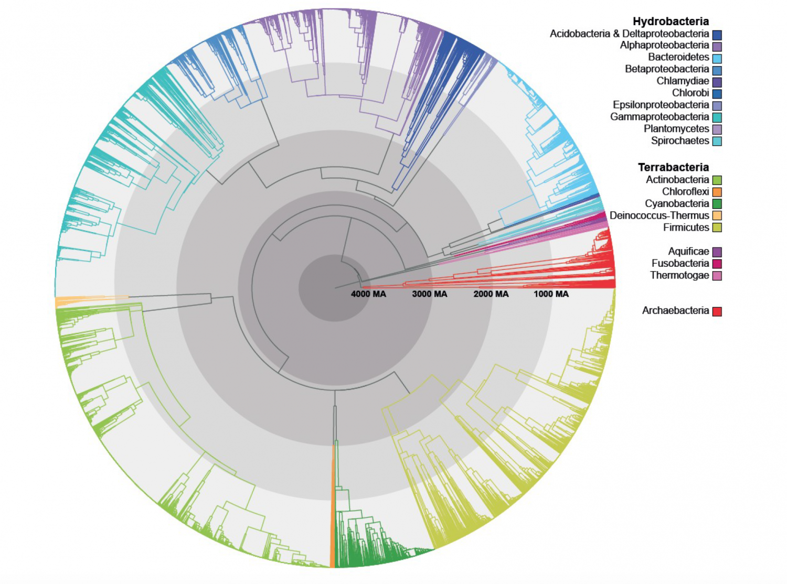

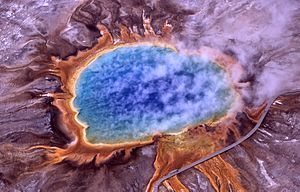

## Prokaryotes do it all! (review Table 27.1)

 

* **Sources of carbon**
    + autotrophs (make themselves)
        + chemically
        + light
    + heterotrophs (get from others)

 

* **Energy for ATP (no mitochondria)**
    + sunlight
    + organic molecules
    + inorganic molecules
 
 

* **Lifestyles reflected in extensive genetic diversification**

 

*Picture: Iron-oxidizing bacteria are chemoautotrophic bacteria that derive energy by oxidizing ferrous iron*

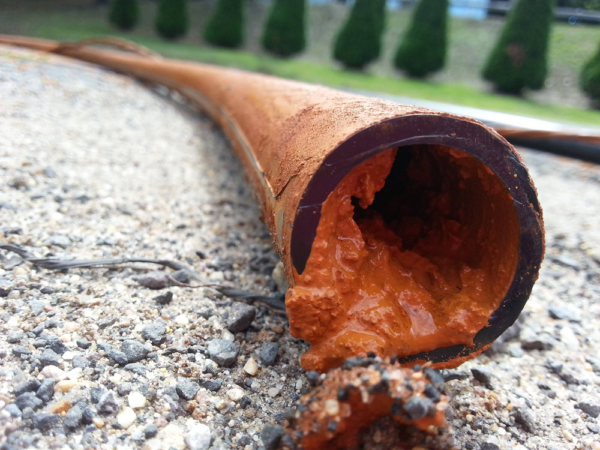

## Prokaryotes need nitrogen and may need oxygen

* **Metabolism varies with respect to oxygen**
    + use for cellular respiration
    + or poisoned by it!
    + some can extract chemical energy from nitrite or sulfate
 
  
 
* **Nitrogen is essential for production of amino acids**
    + prokaryotes less limited in obtaining nitrogen
 
  
 

* **Some bacteria convert atmospheric nitrogen (N~2~) into usable forms**
    + termed *Nitrogen fixation*

  
 
* **Picture: Bacteria work together**
    + photosynthesis and N fixation

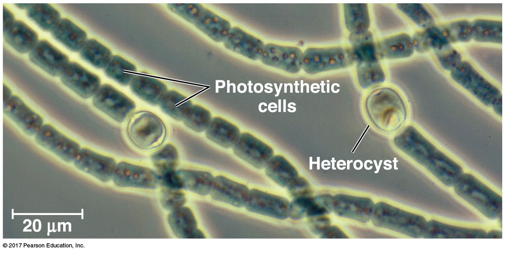

## Metabolic cooperation leads to *Biofilms*

 

 **Biofilms are living communities that allows microorganisms (such as single-celled bacteria) to behave as a group**

 

* **Fossil evidence of biofilms dates to about 3.25 billion years ago**

 

* **More than 75% of human infections are thought to be related to the presence of microorganisms in the form of biofilms**
    + on the surface of tissues or medical devices 
    + dental plaque!

 

* **Biofilms are not exclusive to prokaryotes but include them**
    + green film on pond rocks

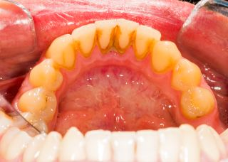

## Rapid reproduction leads to high genetic diversity

* **Rapid reproduction and large populations leads to many mutations**
    + **not through sexual reproduction**
    + 2 x 10^10 new E.coli cells in human intestine each day
    + possible for millions of mutations each day
    + infant microbiome diversifies rapidly based on environment..

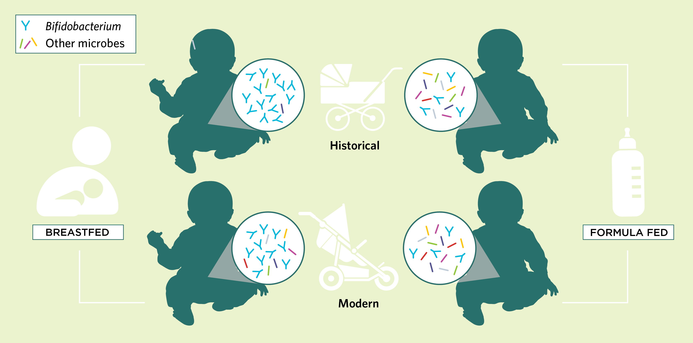

## Reproduction in prokaryotes: Binary fision

 

* **Asexual: daughter cells identical to parent**
    + rapid reproduction
    + not sustainable!
    + not great for genetic diversity

 

* **Mutations are rare but fast reproduction**

 

* **Horizontal gene transfer increases diversity:**
    + transformation = 
    + transduction = 
    + conjugation = 

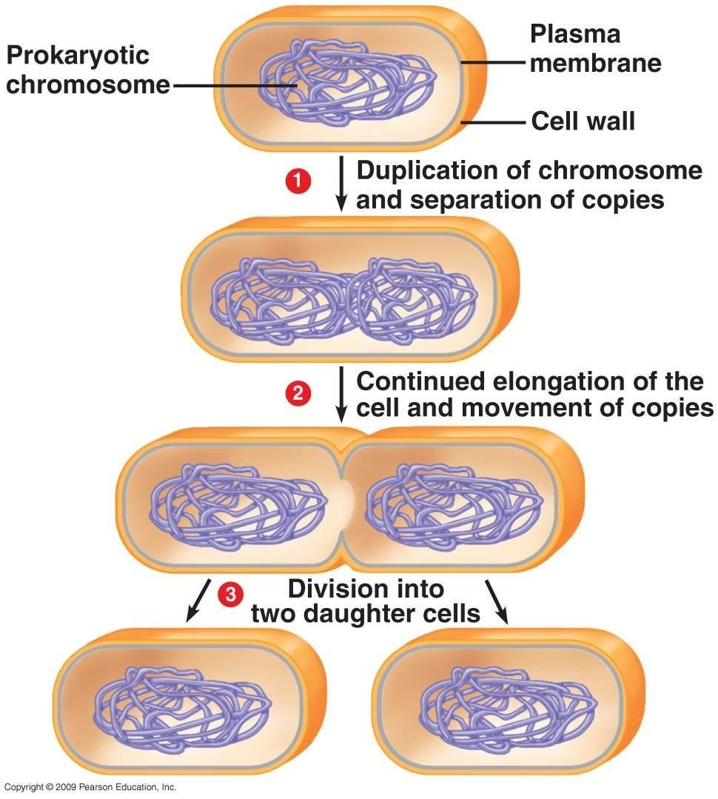

## Genetic Recombination: Transformation

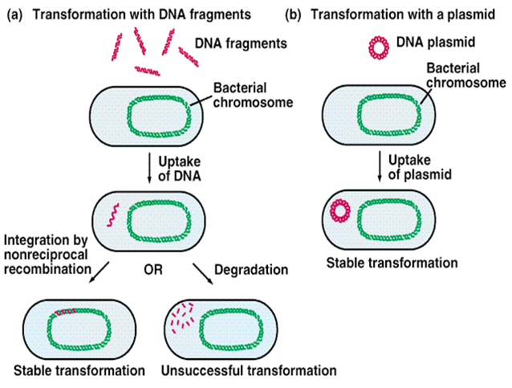

## Utilizing transformation for science advancement...

* **Manipulating DNA sequences in vitro,  creates recombinant DNA molecules that have new combinations of genetic material**

 

* **Recombinant DNA is then introduced into a host organism**
    + If the DNA comes from a different species, the host organism is considered to be transgenic.

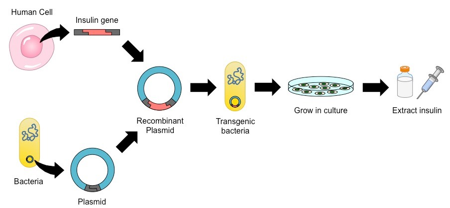

## 
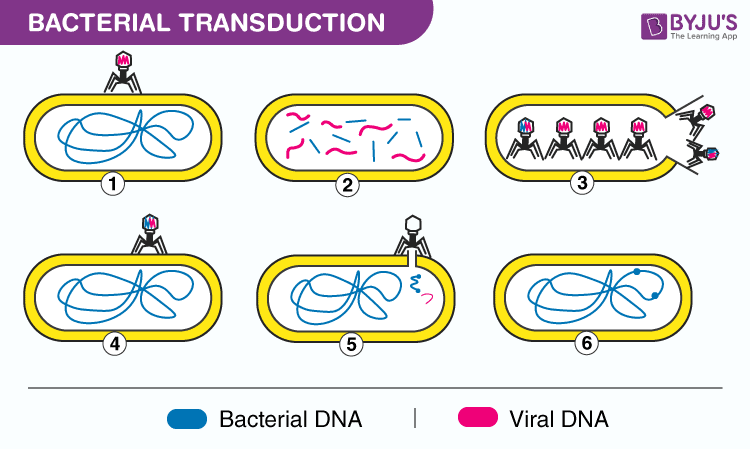

## Genetic Recombination: Conjugation (mechanism unresolved)

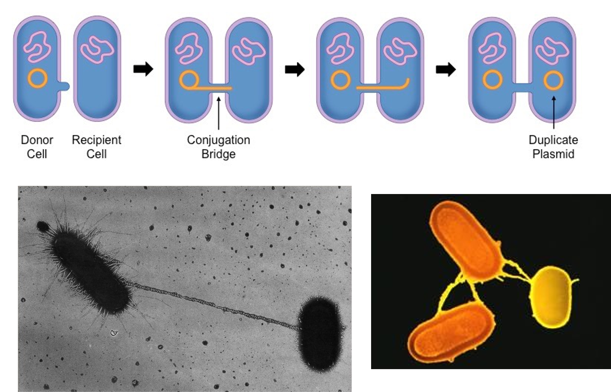

## Many R plasmids carry genes for antibiotic resisitance

 
 

* **Many species of bacteria carry genes that code for enzymes that destroy/hinder antibiotics**
    + tetracycline, ampicillin

 

* **Genes often carried in plasmids (R plasmids)**

 

* **R plasmids have genes that encode for pili**
    + enable conjugation
    + resistance genes can spread quickly

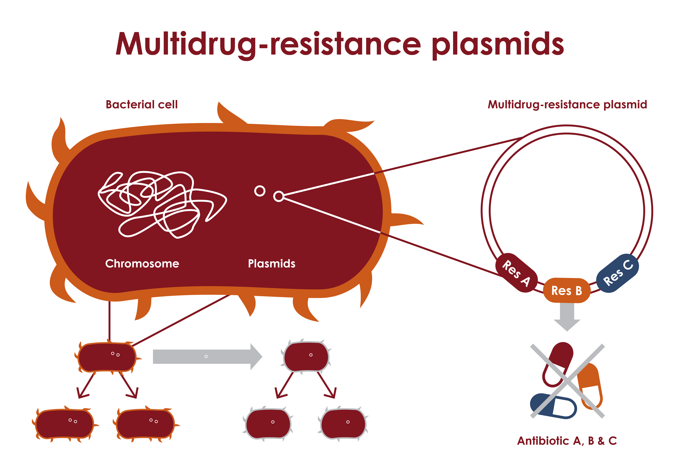

## Prokaryotes are incredible diverse

 

* **Acutally a big assumption!**
    + only 16,000 described

 

* **Genomes are super diverse because of horizontal gene transfer**

 

* **Bacteria: prokaryotic species most commonly known**
    + from pathogens to yogurt

 

* **Archaea: share traits with bacteria and eukaryotes**
    + earliest ancestors in extreme environments

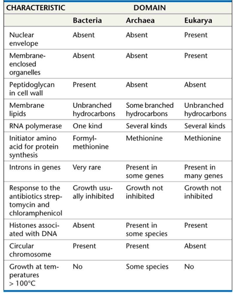

## Prokaryotes matter: Oxygen Revolution

 **Banded iron formation (2.4 mya) the result of oxygen, dissolved iron and sea water**

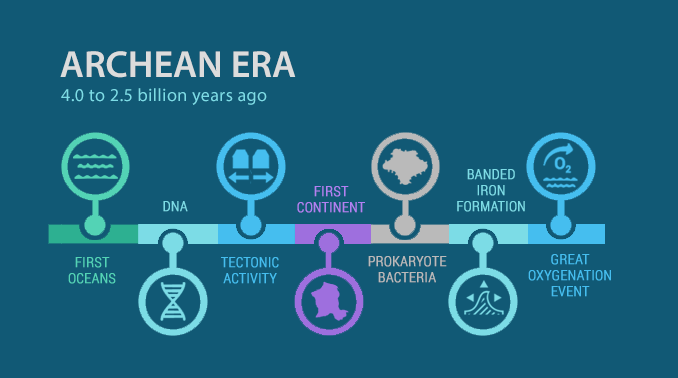

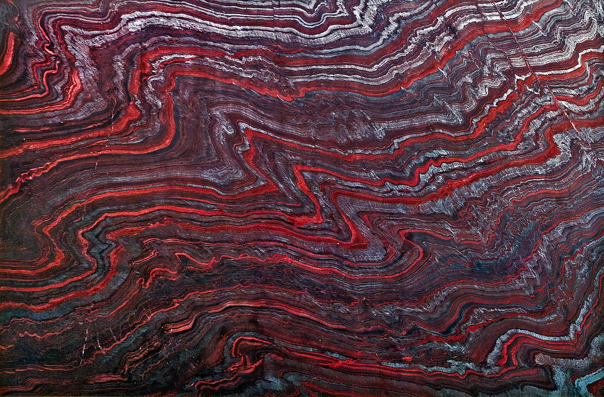

## Prokaryotes matter: Cynaobacteria

 

* **Cyanobacteria: first evidence ~3.5 bya**
    + blue-green algae
    + aquatic and photosynthetic
    + use chlorophyll

 

* **Photosynthesis evolved independently in distant groups**
    + mono, para or polyphyletic?
    + cyanobacteria are a monophyletic group

 

* **Eukaryotes acquired photosynthesis by engulfing cyanobacteria!**

    
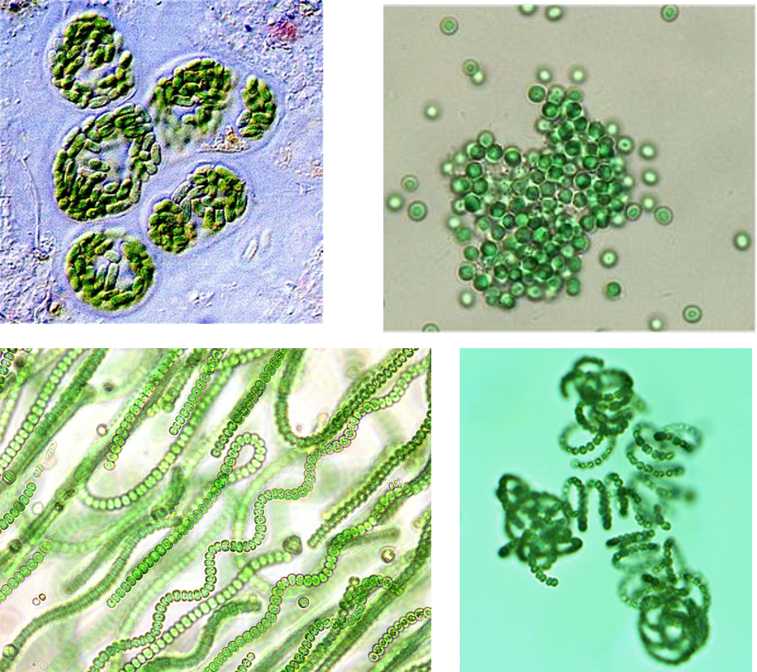

## Prokaryotes matter: Great Oxygenation

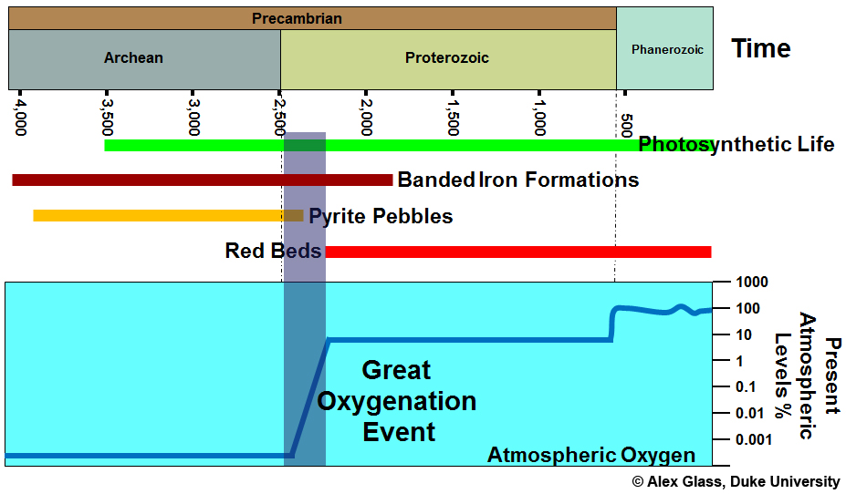

## Prokaryotes matter: Chemical Recycling

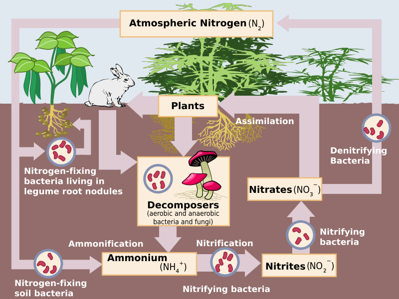

## Prokaryotes matter: Species Interactions

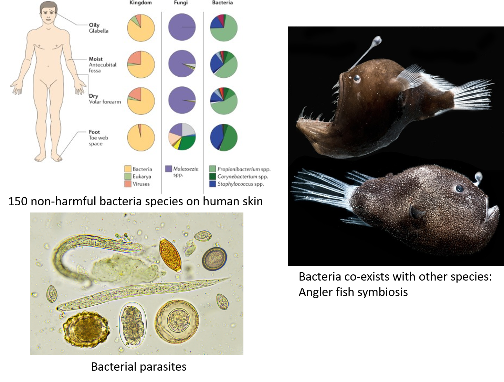

## Prokaryotes matter: Microbiomes

**Helps with digestion, destroys harmful bacteria and helps control your immune system.**

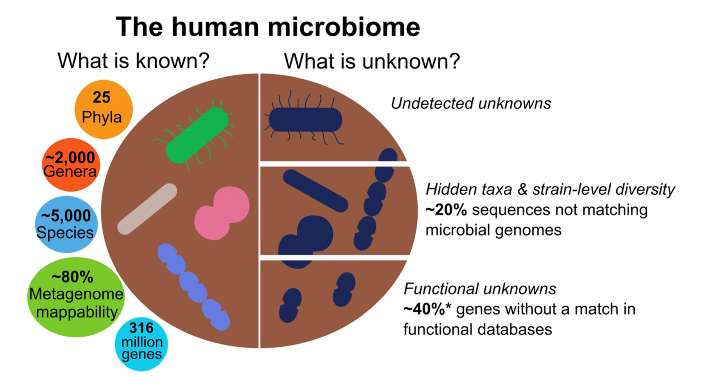

## Prokaryotes matters: Humans

 
 

* **Prokaryotes let us breath (O~2~)**

 

* **Bacteria and Archaea cycle nutrients**
    + break down dead things

 

* **A small % of Bacteria cause disease**
    + Lyme's disease

 

* **Bacteria clean pollution**
    + https://spinoff.nasa.gov/Spinoff2010/er_5.html

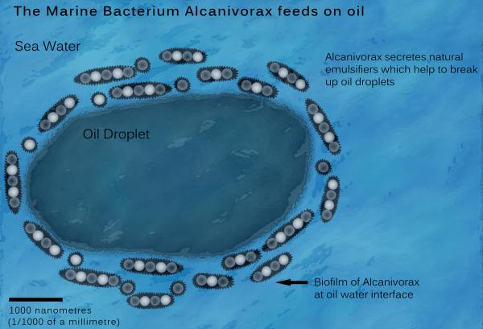