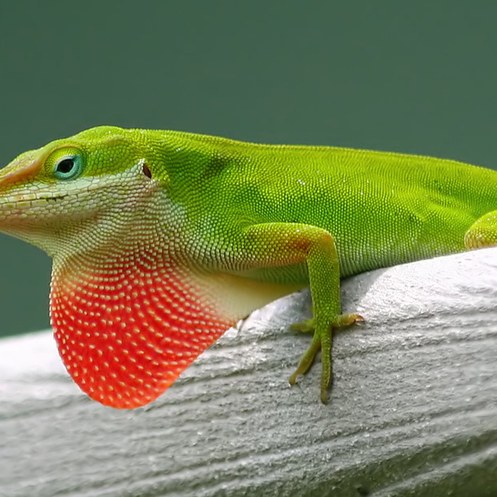
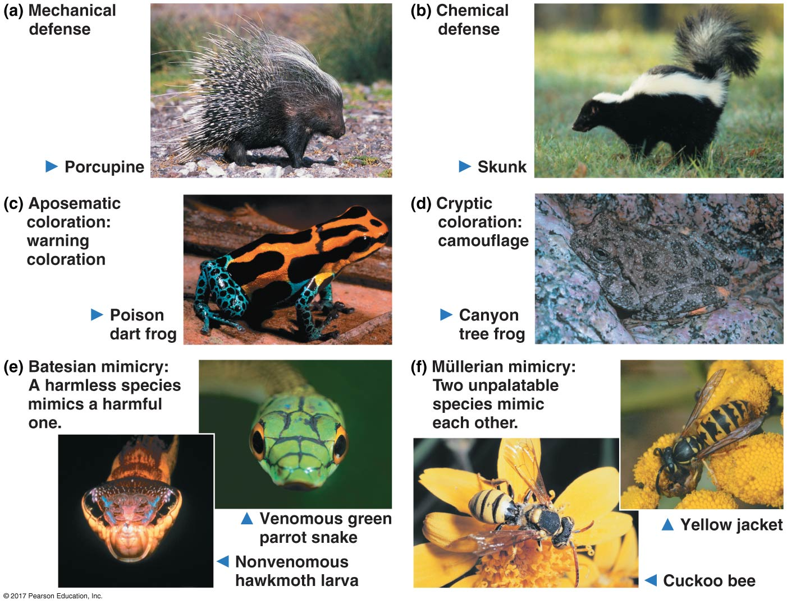
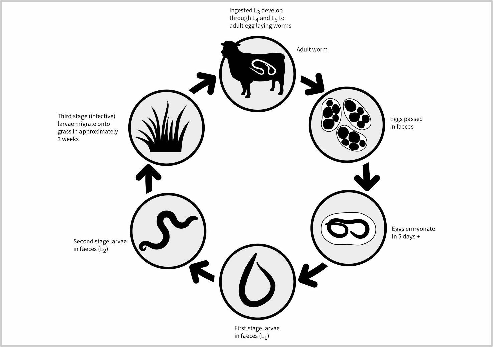

## Mmmmmm Shrimp....

## Community ecology hash-tags

 

* **This lecture will cover the diversity if interactions possible within a community of organisms**

 

* **#PostiveInteractions**

 

* **#NegativeInteractions**

 

* **#FoodWeb**

 

* **#SpeciesTypes**

## The big picture: Community ecology

 

* **Community: groups of populations of different species living close enough together to interact**
    + small scale: decomposes on a fallen log
    + large scale: flowers + pollinators in a national park

 

* **Interactions can help, harm or have no effect**
    
 

* **Interactions determine which species are present**

 

* **Interactions determine how an ecosystem functions**

## Inter-specific Competition (-/-)

 
 

* **Individual sharing space will compete for resources**
    + limits fitness for each species
    
 

* **Resources can mean man things:**
    + prey items, water, nutrients, space
    
 

* **Competitive exclusion: If 2 organisms completely overlap in space, there will be a winner and a loser**
    + local extinction
    + rare in nature
    

## Natural selection favors those that do not compete

 

* **Ecological niche: set of abiotic + biotic resources that organisms use**
    + temperature, time active, prey choice, nest sites
    + competition occurs for these resources

 

* **Natural selection reduces overlap between niches!**
    + *resource partitioning*: division of limited resources
    + feed @ different times, switching food source, etc.

 

* **Resource partitioning allows for coexistence**
    + partial niche overlap
    + why competitive exclusion is rare!

## Resource partitioning in *Anolis* lizards

## There is serious DRAMA in the animal kingdom!!!

 
 
 

* **Review: all animals are heterotrophic....**
    + we all gots to eat
    
 

* **All animals must eat, which means that most organisms are at the risk of being eaten**

 

* **Exploitation: species feeding interactions (+/-)**
    + predation, herbivory & parasitism
    + a lot of drama causes a lot of evolution!

## Predation (+/-)

 
 
 

* **One species (predator) kills and eats other (prey)**
    + does not have to be animal on animal
    
 

* **Lot of feeding adaptation in the animal world**
    + reproductive success depends on feeding

 

* **Fangs, claws, echo-location, venom, etc. etc. etc.**

## Predation (+/-)

 
 

* **Not getting eaten is just as important as eating**
    + powerful driver of natural selection
    
 

* **Behavioral adaptations**
    + hiding, fleeing, herding
    + active self defense less common

 

* **Morphological adaptations**
    + spines, odors, toxin accumulation
    + mimicry and camouflage
    

## Defenses &rarr; Co-evolutionary arms race

## https://youtube/w-K_YtWqMro

<iframe width="560" height="315" src="https://www.youtube.com/embed/w-K_YtWqMro" frameborder="0" allow="accelerometer; autoplay; encrypted-media; gyroscope; picture-in-picture" allowfullscreen></iframe>

## Herbivory (+/-)

 

* **Organism (herbivore) eats part of plant or alga**
    + harms the plant
    
 

* **Herbivores are large & small, terrestrial & aquatic**

    
 

* **Like predators, many special adaptations**
    + chemical sensors to identify toxins
    + specialized teeth or digestive systems
    
 

* **Review: Plants don't move**
    + just as many defensive adaptations
    + thorns, toxins, etc. 
    

## Parasitism (+/-)

 
 
 

* **Organism (parasite) gets nourishment from host**
    + host harmed in process
    + ~1/3 of all species are parasites!!
    
 

* **Parasites live inside or outside body of host**
    + tapeworms &rarr; ticks
    
 

* **Parasite usually have complex life cycles**

    
## Species interactions are not all bad!

 
 
 
 

* **Positive interactions occur where one at least one species benefits and their other is not harmed**
    
 

* **Postie interactions affect diversity of ecological communities**

 

* **Mutulalisms and commensalism are the most common**
    

## Mutualism (+/+)

 
 

* **Mutualism occur when both species benefit from the interaction**
    + common in nature
    
 

* **Often, the 2 species depend on each other for survival/reproduction**
    + plants + insects = pollination + food
    
 

* **Usually still a cost, but benefit > costs**
    + carbon - nitrogen trade-off between plants and fungi
    

## Commensalism (+/0)

  
 
 

* **Commensalism are interactions where one benefits but doesn't harm nor help the other**
    + also common in nature
    
  

* **Some biologists argue that any close interaction between two organisms is unlikely to be completely neutral for either party**
    + especially over time
    

## Trophic Structure

  
  

* **Structure and dynamics of a community depend on feeding relationships**
    
  

* **Energy is transferred upward, plants &rarr; consumers**

  

* **What an organism eats/produces determines its *trophic level* in a food web**
    + many organisms exists on the same trophic level

## Trophic Structure

  
  

* **Structure and dynamics of a community depend on feeding relationships**
    
  

* **Energy is transferred upward; plants &rarr; consumers**

  

* **What an organism eats/produces determines its *trophic level* in a food web**
    + many organisms can exists on the same trophic level

## Food webs are multi-dimensional

## Some species in a community are more impactful than others

  
  

* **Dominant species: members with most abundance or biomass**
    + better @ obtaining resources
    + defense wins championships
    
  

* **Keystone Species: play a pivotal role**
    + ecosystem engineers: alter habitats
    
  

* **Rare species: may perform a critical job**

   
    
