<!-- ## Mmmmmm Shrimp.... -->
<!-- 
 -->

<!-- 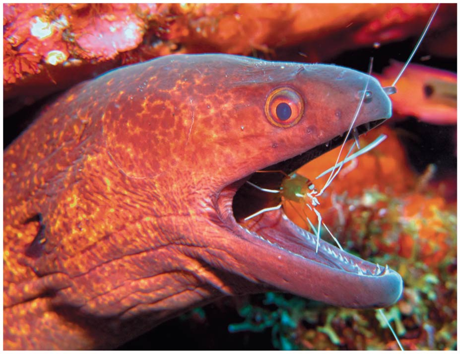 -->

<!-- ## Community ecology hash-tags -->
<!-- 
 -->
<!--   -->

<!-- * **This lecture will cover the diversity if interactions possible within a community of organisms** -->

<!--   -->

<!-- * **#PostiveInteractions** -->

<!--   -->

<!-- * **#NegativeInteractions** -->

<!--   -->

<!-- * **#FoodWeb** -->

<!--   -->

<!-- * **#SpeciesTypes** -->

## The big picture: Community ecology

 

* **Community: **
    + small scale: decomposers on a fallen log
    + large scale: flowers + pollinators in Shenandoah national park

 

* **Interactions can help, harm or have no effect**
    
 

* **Outcome of interactions determine which species are present**

 

* **Sum of interactions determine how an ecosystem functions**
    + productivity, water quality, population control

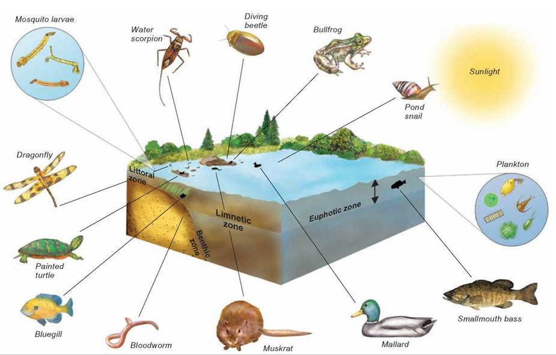

## Inter-specific Competition (-/-)

 
 

* **Individuals sharing space will compete for resources**
    + reduces fitness for each species
    
 

* **Resources can mean many things:**
    + prey items, water, nutrients, space
    
 

* **Competitive exclusion: **
    + local extinction
    + rare in nature (sometimes on islands)
    

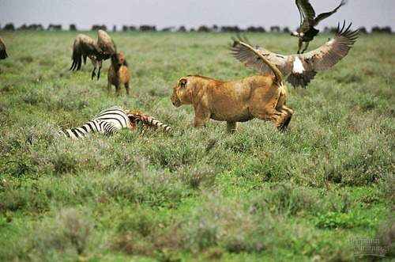

## Natural selection favors those that do not compete

 

* **Ecological niche: **
    + abiotic factors, food choice, nest sites
    + competition occurs for these resources

 

* **Natural selection reduces overlap between niches!**
    + *resource partitioning*: division of limited resources

 

* **Resource division  allows for coexistence**
    + use parts of a habitat, active at different times
    + allows partial niche overlap (not full)
    + why competitive exclusion is rare!

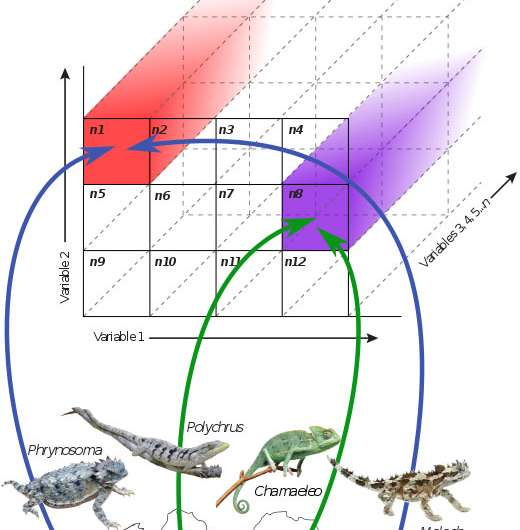

## Resource partitioning in *Anolis* lizards

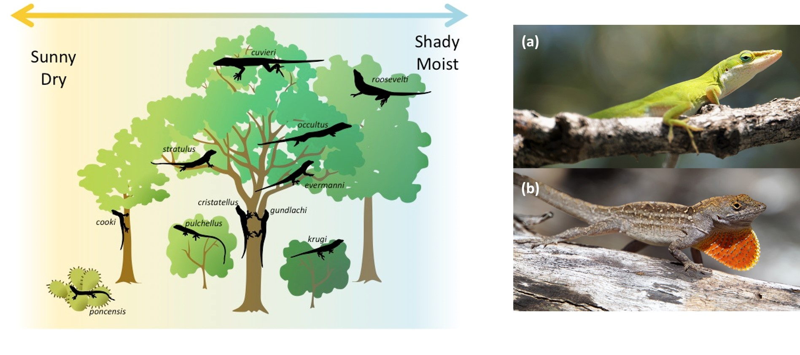

## There is serious DRAMA in the animal kingdom!!!

 
 
 

* **Review: all animals are heterotrophic....**
    
 

* **All animals must eat, which means that most organisms are also at the risk of being eaten**

 

* **Exploitation: species feeding interactions (+/-)**
    + predation, herbivory & parasitism
    + the drama drives natural selection!

## Predation (+/-)

 
 
 

* **One species (predator) kills and eats other (prey)** 
    
 

* **Lots of feeding adaptations in the animal world**
    + reproductive success depends on feeding

 

* **Fangs, claws, echo-location, venom, etc. etc. etc.**

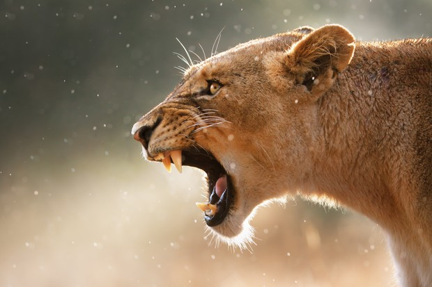

## Predation (+/-)

 
 

* **Not getting eaten is just as important as eating**
    + powerful driver of natural selection
    
 

* **Behavioral adaptations**
    + hiding, fleeing, herding
    + active self defense less common

 

* **Morphological adaptations**
    + spines, odors, toxin accumulation
    + mimicry and camouflage
    
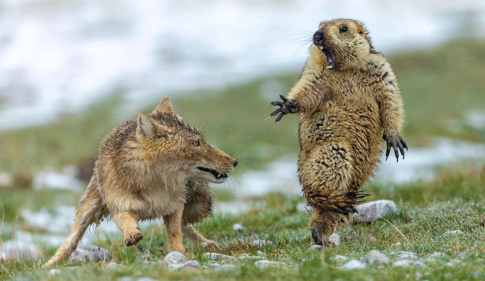

## Defenses vs Predation &rarr; Co-evolutionary arms race

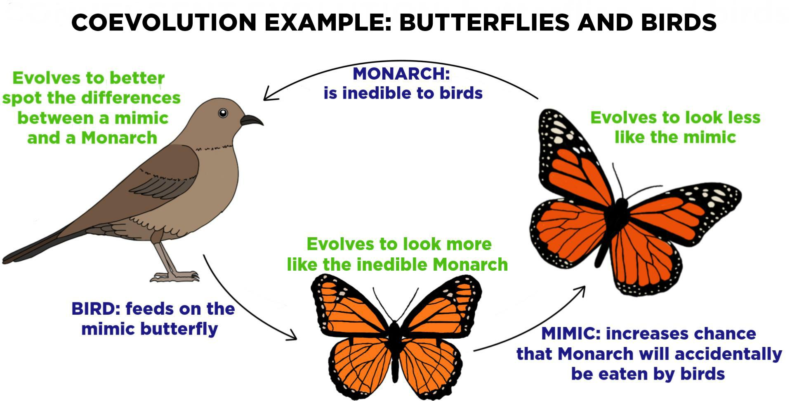

## https://youtube/w-K_YtWqMro

<iframe width="560" height="315" src="https://www.youtube.com/embed/w-K_YtWqMro" frameborder="0" allow="accelerometer; autoplay; encrypted-media; gyroscope; picture-in-picture" allowfullscreen></iframe>

## Herbivory (+/-)

 

* **Organism (herbivore) eats part of plant or alga**
    + harms the plant
    
 

* **Herbivores are large & small, terrestrial & aquatic**

    
 

* **Like predators, many special adaptations**
    + chemical sensors to identify toxins
    + specialized teeth or digestive systems
    
 

* **Review: Plants don't move**
    + just as many defensive adaptations
    + thorns, toxins, etc. 
    

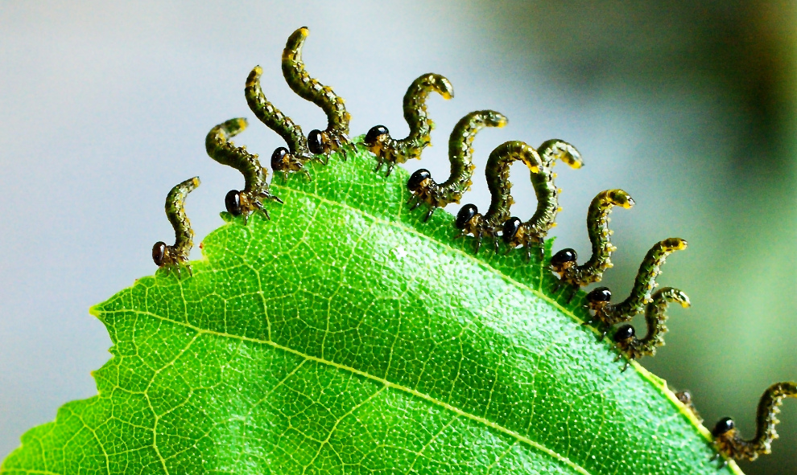

## Parasitism (+/-)

 
 
 

* **Organism (parasite) gets nourishment from host**
    + host harmed but rarely killed
    + ~1/3 of all species are parasites!!
    
 

* **Parasites live inside or outside body of host**
    + tapeworms to ticks
    
 

* **Parasites  usually have complex life cycles**
    + feeding and reproductive cycles using host

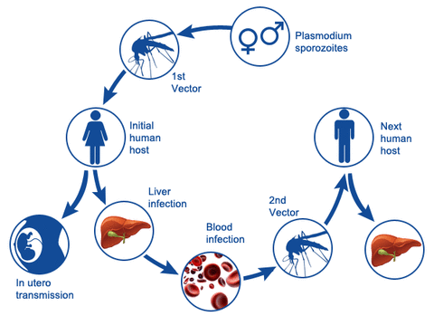
    
## Species interactions are not all bad!

 
 
 
 

* **Positive interactions occur where one at least one species benefits and their other is not harmed**
    
 

* **Positive interactions common in ecological communities**
    + drive higher biodiversity
    
 

* **Mutualism and commensalism are the most common**
    

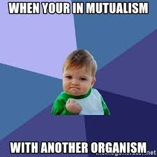

## Mutualism (+/+)

 
 
 

* **Occur when both species benefit from the interaction**
    + common in nature
    
 

* **Often, the 2 species depend on each other for survival/reproduction**
    + plants + insects = pollination + food
    
 

* **Usually still a cost, but benefit > costs**
    + carbon - nitrogen trade-off between plants and fungi
    

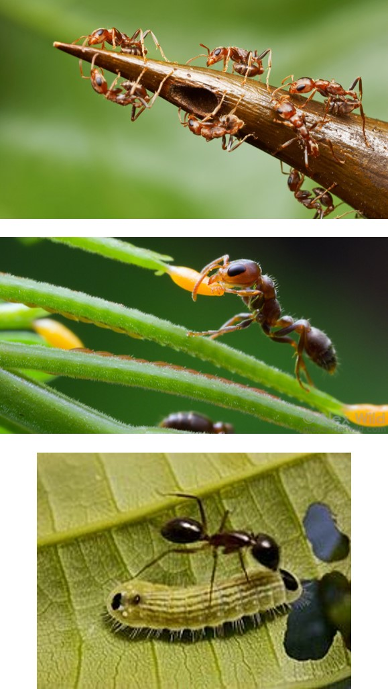

## Commensalism (+/0)

  
 
 

* **Commensalisms are interactions where one benefits but doesn't harm/help the other**
    + also common in nature
    
  

* **Some biologists argue that any close interaction between two organisms is unlikely to be completely neutral for either party**
    + especially over time
    

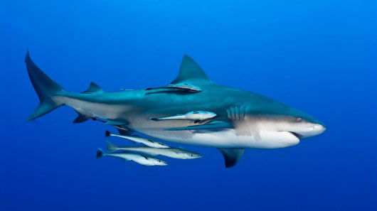

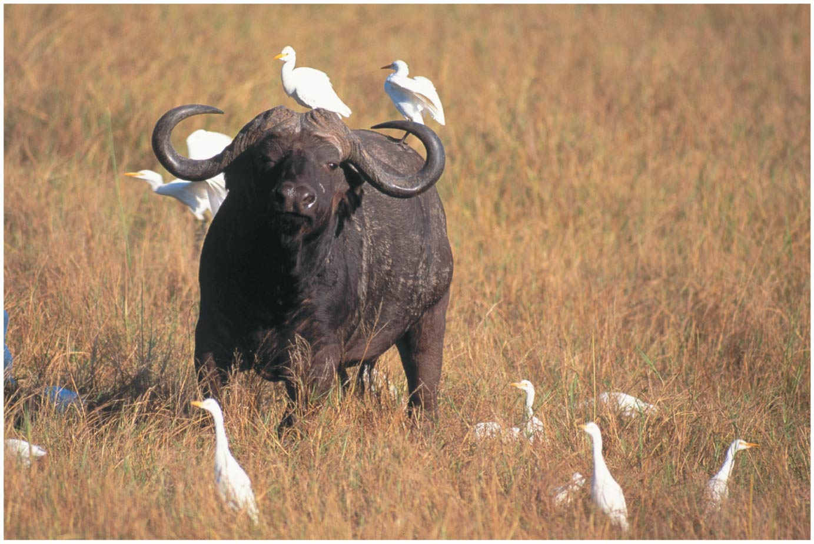

## Trophic (feeding) structure defined by species interactions

  
  

* **Structure and dynamics of a community depend on feeding relationships**
    
  

* **Energy is transferred upward**
    + plants/aglae &rarr; consumers
    + transfer is wasteful (most energy is lost)
    
  

* **Trophic level:**
    + many species can share a trophic level

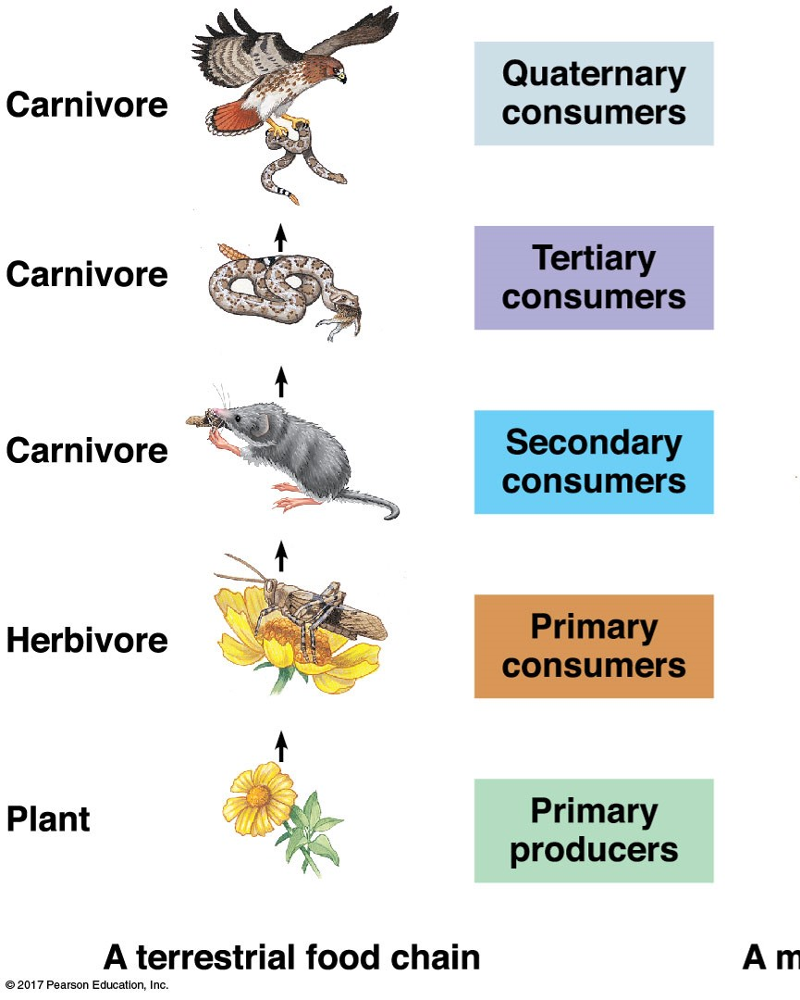

## Trophic Structure

  
  

* **Structure and dynamics of a community depend on feeding relationships**
    
  

* **Energy is transferred upward**
    + plants &rarr; consumers
    + transfer is wasteful (*WHY*?)

  

* **Exists in terrestrial and aquatic systems**
    + What happens if a species goes extinct?

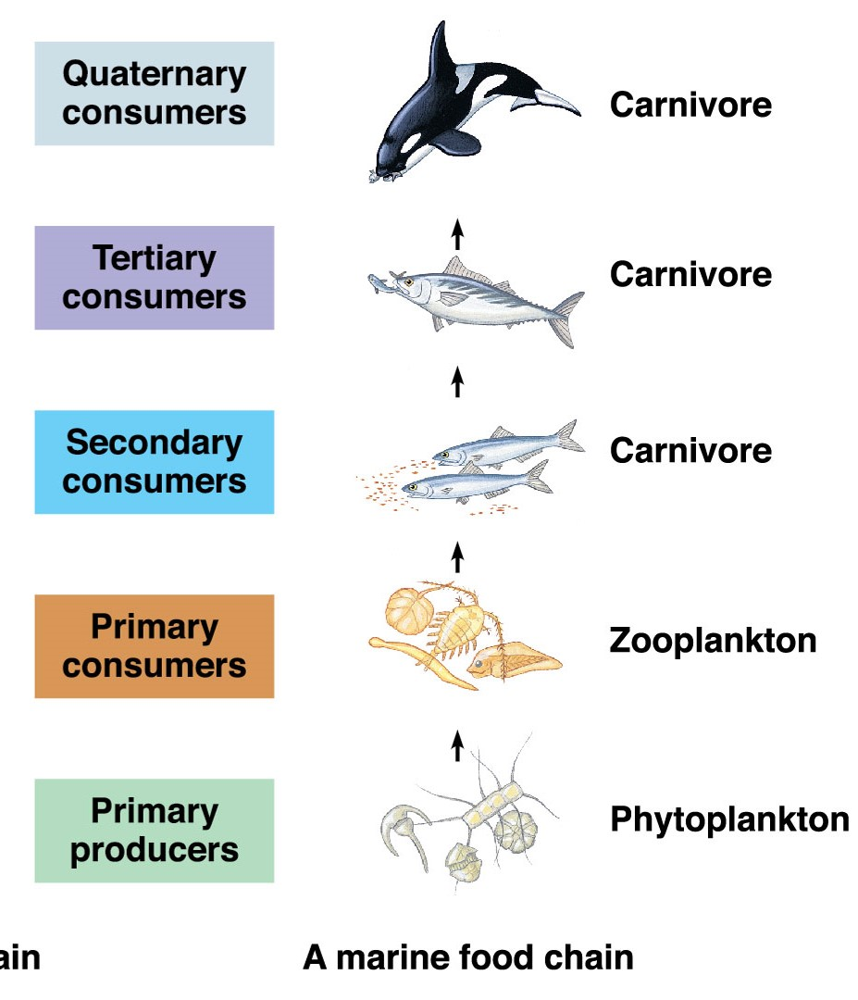

## Food webs are multi-dimensional

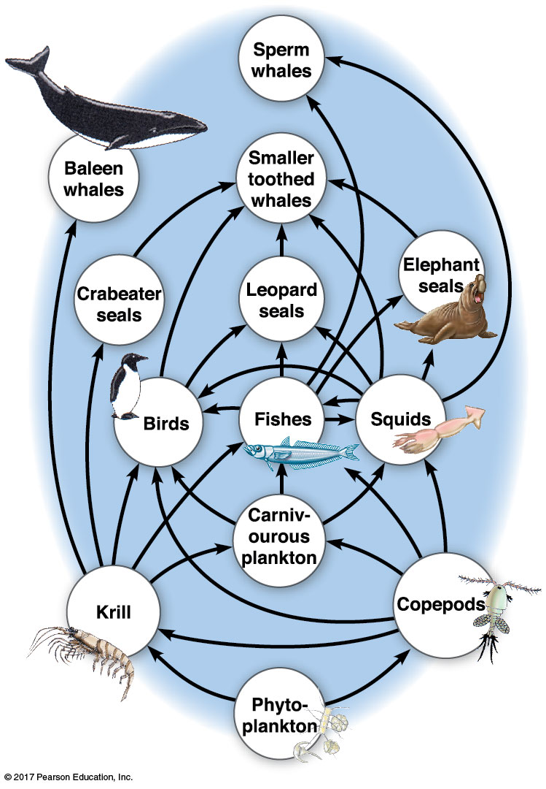

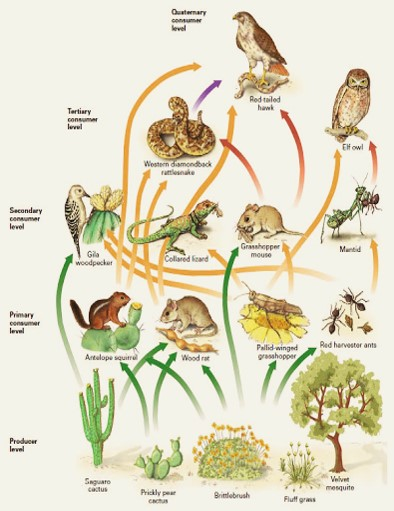

## Some species in a community are more impactful than others

  
  
  

* **Dominant species: **
    + better @ obtaining resources
    + defense wins championships
    
  

* **Keystone Species: **
  
  

* **Ecosystem engineers: **
    + impact every community member

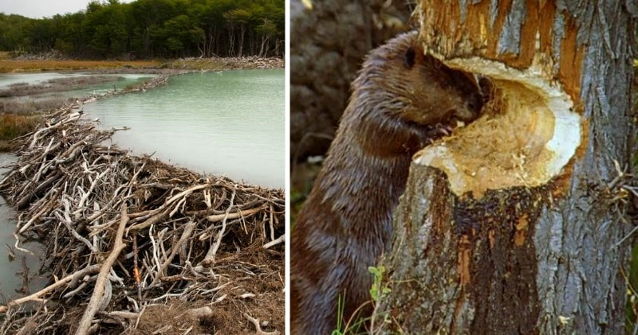   
    
