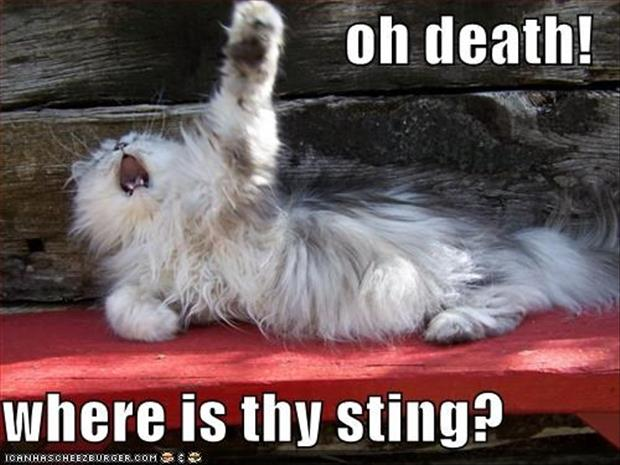

## Mmmmmm Shrimp....

## Community ecology hash-tags

 

* **This lecture will cover the diversity if interactions possible within a community of organisms**

 

* **#**

 

* **#**

 

* **#**

 

* **#**

## The big picture: Community ecology

 

* **Biological community: groups of populations of different species living close enough together to interact**
    + small scale: decomposers on a fallen log
    + Large scale: flowers and pollinators in a national park

 

* **Community interactions can help, harm or have no effect**
    + predation &rarr; competition &rarr; mutualaisms
    
 

* **Community interactions determine which species are present and how many**
    + biotic control of species distribution

## Interspecific Competition (-/-)

 
 

* **Individual sharing space will compete for resources**
    + limits fitness for each species
    
 

* **Resources can mean man things:**
    + prey items, water, nutrients, space
    
 

* **Competitve exclusion: If 2 organims completely overlap in space, there will be a winner and a loser**
    + local extinction
    + rare in nature
    

## Natural selection favors those that do not compete

 

* **Ecological niche: set of abiotic + biotic resources that organisms use**
    + temperature range, time active, prey choice, nest sites
    + competition can occur for any of these resources

 

* **Natural selection reduces overlap between species niches!**
    + *resource paritioning*: division of limited resources
    + feed @ different times, switching food source, etc.

 

* **Resource paritioning allows for coexistence**
    + partial niche overlap
    + why competitve exclusion is rare!

## Resource partitioning in *Anolis* lizards

## There is serious DRAMA in the animal kingdown!!!

 
 

* **Review: all animals are heterotrophic....**
    + we all gots to eat
    
 

* **All animals must eat, which means that most organims are at the risk of being eaten**

 

* **Exploitation: +/- species interactions relating to feeding**
    + predation, herbivory & parasitism
    + a lot of drama causes a lot of evolution!

## Predation (+/-)

 
 

* **One species (predator) kills and eats other (prey)**
    + does not have to be animal on animal
    
 

* **Lot of feeding adapatation in the animal world**
    + reprdocutive success depends on feeding

 

* **Fangs, claws, echo-location, poison, etc. etc. etc.**

## Predation (+/-)

 
 

* **Not getting eaten is just as important as eating**
    + powerful driver of natural selection
    
 

* **Behavioral adapataions**
    + hiding, fleeing, herding
    + active self defense less common

 

* **Morphological adaptations**
    + spines, odors, toxin accumulation
    + mimicry and camoflauge
    

## Defenses &rarr; Co-evolutionary arms race

## https://youtube/w-K_YtWqMro

<iframe width="560" height="315" src="https://www.youtube.com/embed/w-K_YtWqMro" frameborder="0" allow="accelerometer; autoplay; encrypted-media; gyroscope; picture-in-picture" allowfullscreen></iframe>

## Herbivory (+/-)

 

* **Organism (herbivore) eats part of plant or alga**
    + harms the plant
    
 

* **Herbivores are large & small, terrestrial & aquatic**

    
 

* **Like predators, many specilial adaptations**
    + chemical sensors to identify toxins
    + specialized teeth or digestive systems
    
 

* **Review: Plants dont move**
    + just as many defensive adaptations
    + thorns, toxins, etc. 
    

## Parasitism (+/-)

 
 
 

* **Organism (parasite) gets nourishment from host**
    + host harmed in process
    + ~1/3 of all species are parasites!!
    
 

* **Parasites live inside or outside body of host*
    + tapeworms &rarr; ticks
    
 

* **Parasite usually have complex life cycles**

    
## Species interactions are not all bad!

 
 
 

* **Positive interactions occur where one at least one species benefits and their other is not harmed**
    
 

* **Postive interactions affect diversity of ecological communities**

 

* **Mutulalisms and commensalism are the most common**
    

## Mutualism (+/+)

 
 

* **Mutualism occur when both species benefit from the interaction**
    + common in nature
    
 

* **Often, the 2 speies depend on each other for survival/reproduction**
    + plants + insects = pollination + food
    
 

* **Usually still a cost, but benefit > costs**
    + carbon - nitrogen tradeoff between plants and fungi
    

## Commensalism (+/0)

  
 
 

* **Commensalism are interactions where one benefits but doesnt harm nor help the other**
    + also common in nature
    
  

* **Some biologists argue that any close interaction between two organisms is unlikely to be completely neutral for either party**
    + especially over time
    

## Trophic Structure

  
  

* **Structure and drynamics of a community depend on feeding relationships**
    
  

* **Energy is transferred upward, plants &rarr; consumers**

  

* **What an organims eats/produces determines its *trophic level* in a food web**
    + many organinsm can exists on the same trophic level

## Trophic Structure

  
  

* **Structure and drynamics of a community depend on feeding relationships**
    
  

* **Energy is transferred upward; plants &rarr; consumers**

  

* **What an organims eats/produces determines its *trophic level* in a food web**
    + many organinsm can exists on the same trophic level

## Food webs are multi-dimensional

## Some species in a community are more impactful than others

  
  

* **Dominant species**
    
  

* **Keystone Species**
    + ecosystem engineers:
  

* **Rare species:**

   
    
    
## Who controls the trohic structure: Top?

## Who controls the trohic structure: Bottom?

