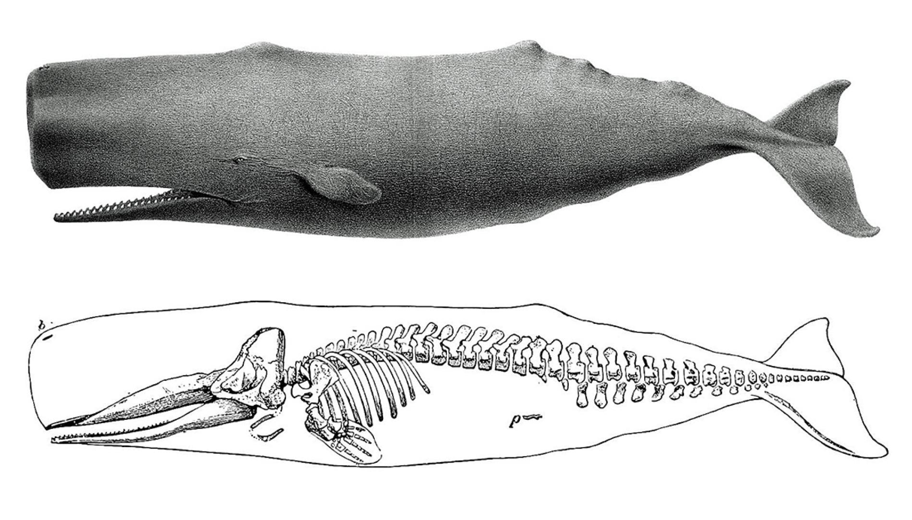

## Hash tags for each lecture...

 

* **Use these as your study guides. Each one is a concept (not a definition).**
    + I use them to write the exam
    + Create a checklist - cross them off as you study
    + Use office hours for ones you don't quite get
    + Start with hashtags and expand outward when studying
    
 

**#FossilClues**

 

**#FirstTheories**

 

**#SharedAncestry**

## Sedimentary rocks reveal the vastness of geologic time

**Fossils are glimpses into the past...**

## 

## Georges Cuvier (1769-1832): The concept of extinction

## 99% of all species that have existed have already gone extinct!!!

**Scientists after Cuvier (i.e., Darwin) now had to account for extinction as fact**
 
 
 
 
 
 
 
 
 
 
 
 
 
 
 
 
 
 
 
 

**Example: Wooly Mammoths appear and then disappear in the fossil record.**

## Jean-Baptiste de Lamarck: Famous for being wrong

 

* **Lines of descent (early evolution theory)**
    + compared living giraffes  with fossil forms
    + evolution =  simple to more complex

 

* **(1) Theory of use and disuse**
    + body parts used: **?**
    + body parts disused: **?**

 

* **(2) Inheritance of acquired characteristics**
    + changes can be passed to offspring
    
 

* **The long muscular neck of Giraffes**

## According it Lamarck, Skee-Lo could get his wish

**I wish I was like six-foot-nine so I can get with Leoshi...**

## Transitional Forms

 
 

* **There appear to be connections between living things and fossils**
    + Lamarck and Cuvier
    + **Intermediate Creatures**?

 

* **Whales: past and present**
    + nostrils
    + pelvis
    + hind limbs!
    + unique skulls

## Vestigial traits: leftover structures

## Vestigial traits: leftover structures

## Traits connections argue for *Shared Ancestry*

## Evolution as descent with modification

 

**The fossil record lets us explore the ancestors that anything living (including us) evolved from**

 
 
 
 
 
 

* **Next Time: How did this actually happen?**

