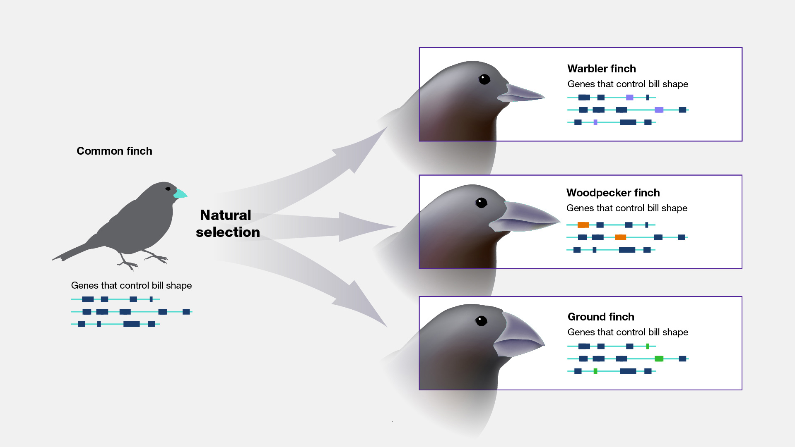

## Hash tags (*Things to know*) for each lecture...

* **Use these as your study guides. Each one is a concept (not a definition).**
    + I use these *concepts* to write the exam/quiz questions
    + Generally, you should be able to write 2-3 sentences about each # (with no notes)
    + Create a checklist - cross them off as you study
    + Use student hours (or email) for ones you don't quite get
    + Start with #s and expand outward when studying
    + Extra Credit *Mastery Cards* are based on these
    
 

**#Fossil Clues**

 

**#Early Evolution Theories**

 

**#Shared Ancestry**

## What is evolution?

## Sedimentary rocks reveal the vastness of geologic time

**Fossils buried in those rocks tell the evolutionary story of life on Earth...**

## 

    
* **Geology and fossils reveal key facts:**
1. The Earth and life on Earth are billions of years old
2. Fossils look very different across geologic time

## Georges Cuvier (1769-1832): The concept of extinction

**Cuvier's findings refute the idea of species permanence**

## 99% of all species that have existed have already gone extinct!!!

**Scientists after Cuvier (i.e., Darwin) now had to account for extinction as fact**
 
 
 
 
 
 
 
 
 
 
 
 
 
 
 
 
 
 
 
 

**Example: Wooly Mammoths appear and then disappear in the fossil record.**

## Jean-Baptiste de Lamarck: Famous for being wrong

 

* **Lines of descent (early evolution theory)**
    + compared living giraffes with fossil forms
    + evolution =  'life evolves from simple to more complex' as organisms passed *developed* characteristics to their offspring

 

* **(1) Theory of use and disuse**
    + body parts used: **enhanced**
    + body parts disused: **minimized**

 

* **(2) Inheritance of acquired characteristics**
    + changes can be passed to offspring
    
 

* **The long muscular neck of Giraffes...**

## According it Lamarck, Skee-Lo could get his wish

**I wish I was like six-foot-nine so I can get with Leoshi...**

## Transitional Forms Exist in the Fossil Record

 
 

* **There appear to be connections between living things and fossils**
    + Lamarck and Cuvier
    + argues against species permanence

 

* **Aquatic mammals: past and present**
    + nostrils
    + pelvis
    + hind limbs!
    + unique skulls

## Vestigial traits: leftover structures that have lost their function

## Vestigial traits: leftover structures

## Traits connections argue for *Shared Ancestry*

## Evolution as descent with modification

 

**The fossil record lets us explore the ancestors that anything living (including us) evolved from**

 
 
 
 
 
 

* **Next Time: How did giraffes really evolve longer necks?**

