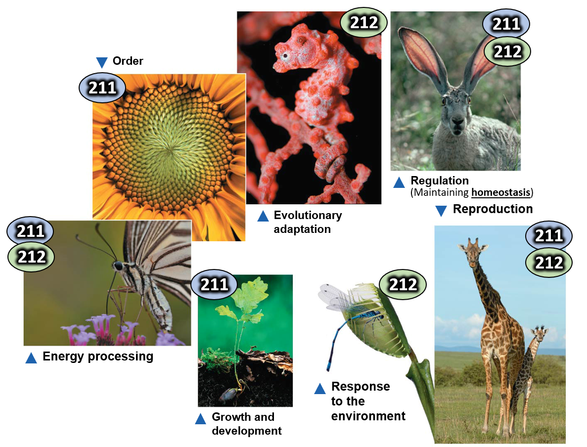
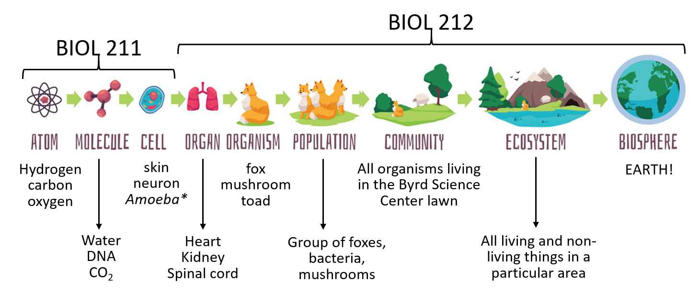
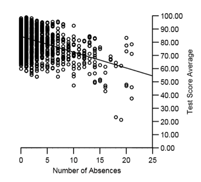
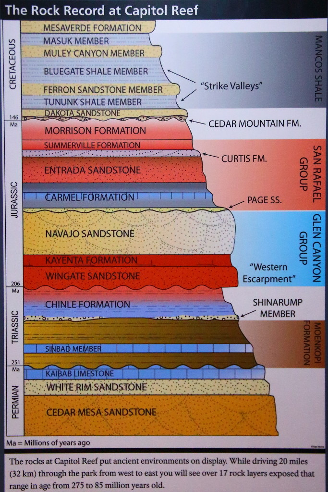
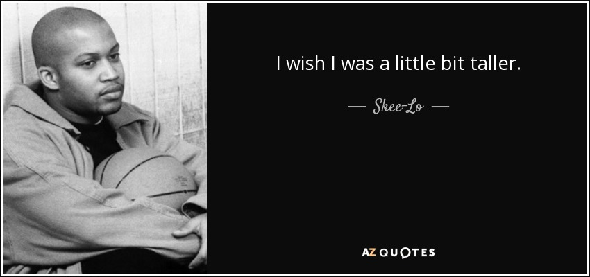
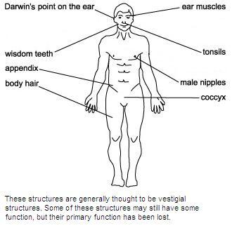
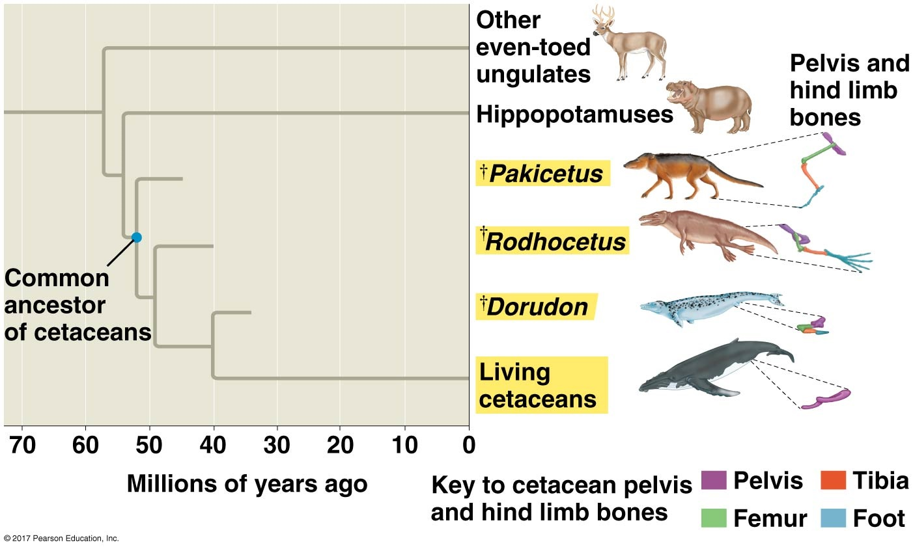

<!-- ## What BIOL 211/212 are all about... -->
<!-- 
 -->

<!--  -->

<!-- ## What BIOL 211/212 are all about... -->
<!-- 
 -->

<!--  -->

<!-- ## Day 1 Advice - Work with me, not against me -->
<!-- 
 -->
<!--   -->

<!-- * **It is up to YOU to seek help when needed and/or inform me of any issues** -->
<!--     + I can't help if I dont know what is going on -->
<!--     + You are NOT bothering me!  -->

<!--   -->

<!-- * **Email is the best way to contact me outside of class** -->
<!--     + Make sure your question in not answered in the syllabus! -->

<!--   -->

<!-- * **~~Office~~ Student Hours are awesome, I promise!** -->
<!--     + There will be no judgement, we will just get to work -->
<!--     + Alternative: You can always swipe my in at Ram's Den -->

<!--   -->

<!-- * **In Class: Keep the lines of communication flowing!** -->
<!--     + Not enough days for homework, lecture slides, etc.  -->

<!--  -->

<!-- ## Day 1 Advice - DONT SKIP -->
<!-- 
 -->
<!--   -->

<!-- * **Class attendance correlates with high performance** -->
<!--     + Study after study after study shows that class attendance is the most important factor contributing to academic success -->

<!--  -->

## Hash tags (*Things to know*) for each lecture...

 

* **Use these as your study guides. Each one is a concept (not a definition).**
    + I use them to write the exam
    + Create a checklist - cross them off as you study
    + Use student hours for ones you don't quite get
    + Start with #s and expand outward when studying
    
 

**#FossilClues**

 

**#EvolutionTheories**

 

**#SharedAncestry**

## What is evolution?

## Sedimentary rocks reveal the vastness of geologic time

**Fossils are glimpses into the past...**

## 

    
* **Geology and fossils reveal key facts:**
1. The Earth and life on Earth are old
2. Fossils look very different across geologic time

## Georges Cuvier (1769-1832): The concept of extinction

**Cuvier's finding refute the idea of species permanence**

## 99% of all species that have existed have already gone extinct!!!

**Scientists after Cuvier (i.e., Darwin) now had to account for extinction as fact**
 
 
 
 
 
 
 
 
 
 
 
 
 
 
 
 
 
 
 
 

**Example: Wooly Mammoths appear and then disappear in the fossil record.**

## Jean-Baptiste de Lamarck: Famous for being wrong

 

* **Lines of descent (early evolution theory)**
    + compared living giraffes  with fossil forms
    + evolution =  simple to more complex

 

* **(1) Theory of use and disuse**
    + body parts used: **enhanced**
    + body parts disused: **minimized**

 

* **(2) Inheritance of acquired characteristics**
    + changes can be passed to offspring
    
 

* **The long muscular neck of Giraffes...**

## According it Lamarck, Skee-Lo could get his wish

**I wish I was like six-foot-nine so I can get with Leoshi...**

## Transitional Forms Exist in the Fossil Record

 
 

* **There appear to be connections between living things and fossils**
    + Lamarck and Cuvier
    + **Intermediate Creatures**?

 

* **Whales: past and present**
    + nostrils
    + pelvis
    + hind limbs!
    + unique skulls

## Vestigial traits: leftover structures that have lost their function

## Vestigial traits: leftover structures

## Traits connections argue for *Shared Ancestry*

## Evolution as descent with modification

 

**The fossil record lets us explore the ancestors that anything living (including us) evolved from**

 
 
 
 
 
 

* **Next Time: How did giraffes really evolve longer necks?**

