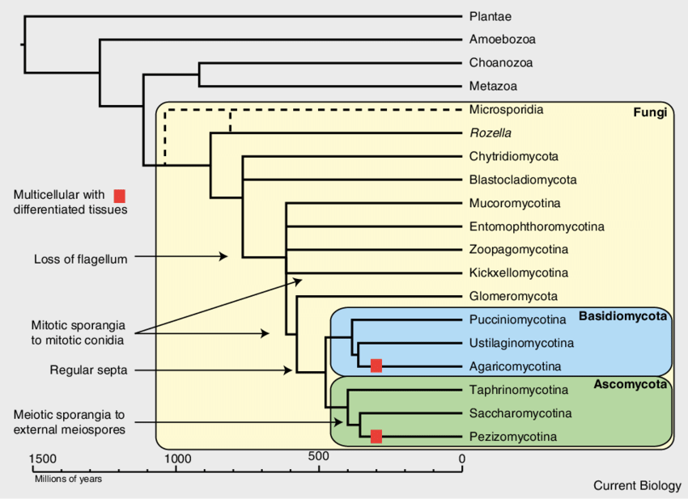
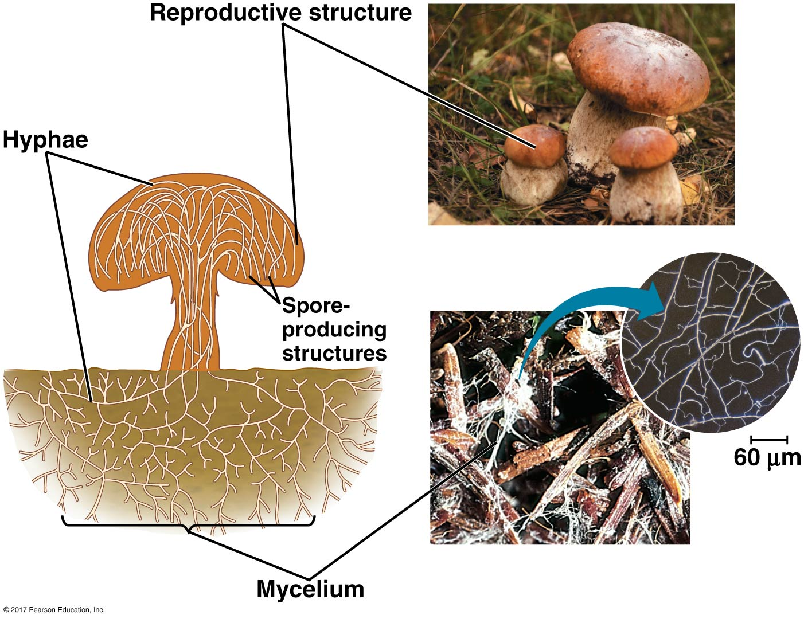
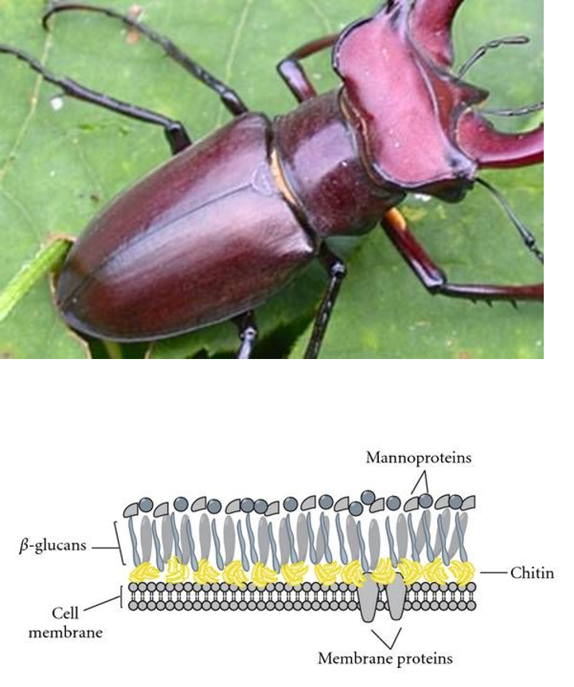

##

## The big picture: Fungi are essential for ecosystem function

* **100,000 species described**
    + estimated 1.5 million species
    + diverse size, morphology and habitats

 

* **Heterotrophic: eat via absorption**
    + parasites, decomposers, mutualists
    + recycle nutrients via decomposition

 

* **Cell walls made of chitin**
    + mushrooms are only a part of the body
    + filaments belowground for absorption

 

* **Wild reproduction**
    

## Chitin and Heterotrophs &rarr; Animals & Fungi 

## Fossil Fungi

 
 

* **Oldest fungal fossils appear ~900 mya**
    + split from aquatic eukaryotic ancestor 1 bya(?)

 

* **Fossils of fungal spores found in Wisconsin dated to 460 mya**
    + suggests origin of land-based fungi

 

* **Fungi and green plants moved onto land around same time**
    + what was the benefit for fungi?
    + helped vascular plants invade the land! 
    + mycorrhizal symbiosis @ 405mya during Devonian period

## All fungi share traits related to nutrition

 
 
 

* **Heterotrophs: absorb nutrients from environment**
    + decomposers: break down dead things
    + parasites: absorb from host
    + mutualist: absorb/share with host

 
 

* **Use enzymes to break down compounds**
    + diverse enzymes for diverse food sources
    + secreted outside the cell (*extracelluar*)

    

## Fungal derived enzymes and humans: Cellulase

## Fungal derived enzymes and humans: Statins

## Fungal body plan: Not-motile and mostly multi-cellular

## Mycelium: huge surface and volume for absorption

## Most *hyphae* divided into cells by *septa*

##

<iframe width="560" height="315" src="https://www.youtube.com/embed/E_Cy7KkwmWU" frameborder="0" allow="accelerometer; autoplay; encrypted-media; gyroscope; picture-in-picture" allowfullscreen></iframe>

## Specialized hypae in mycorrhizal fungi

 
 
 

* **Specialized hyphae for feeding on live animals**
    + hoops that can snare prey
    
 

* **Specialized hyphae that allow extraction of nutrients from plants**

 

* **Mutualistic fungi have branching hyphae they use to exchange nutrients with plant hosts**
    + *Arbuscules* invade cell walls

## Mycorrhizal fungi: sharing with plants

 
 

* **~80-90% of plants have association with fungus**
    + fungi grown in/around plant roots
    + share what resources?
    + how much sharing is not known

 

* **2 main types:**
    + Ecto and Arbsucular mycorrhizae

 

* **Association now key for plants to thrive**
    + fungi more efficient @ nutrient uptake
    

## Fungi rule the world: plants evolution linked to symbiosis

## Fungal life cycles (Haplonic)

 

* **Life cycles can be complex**
    + spores are produced sexually or asexually
    + spores and nuclei of hypae are haploid (1N)

 

* **Lots of spores are produced**

 

**Sexual Reproduction:**

**1. Plasmogamy:**

**2. Karyogamy: **

    

    
## Fungal life cycle: basic

## Fungal lineages (no longer clean groups)

## Fungal lineages (no longer clean groups)

## Fungal-animal mutualisms

## Fungal-animal parasitism: zombie apocalypse

<iframe width="560" height="315" src="https://www.youtube.com/embed/XuKjBIBBAL8" frameborder="0" allow="accelerometer; autoplay; encrypted-media; gyroscope; picture-in-picture" allowfullscreen></iframe>

    