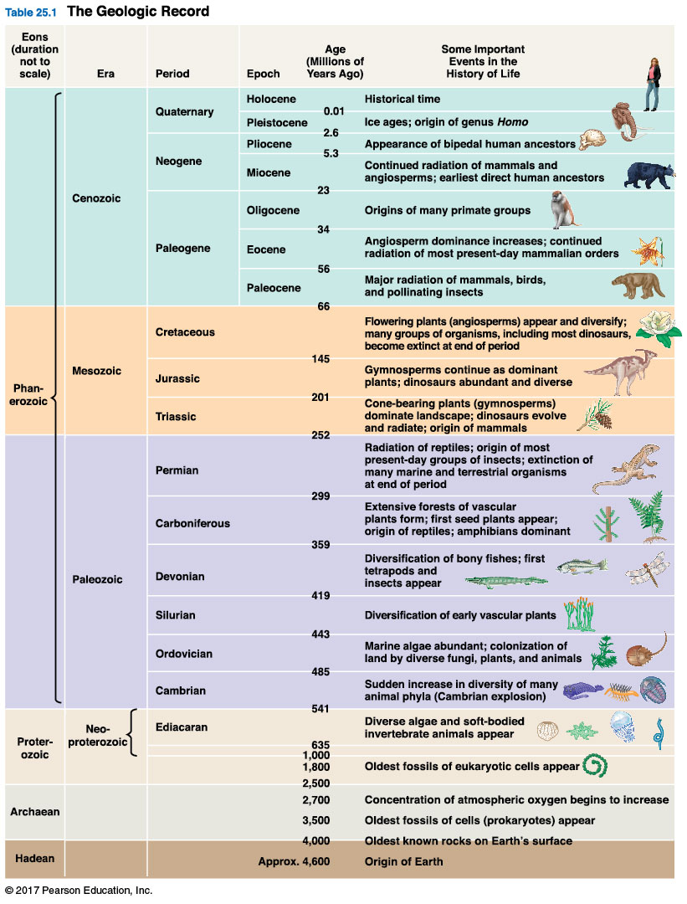

## Oparin and Haldane hypothesis

 

**Chemical and physical processes combine to make cells**
 

1. abiotic synthesis of small organic molecules (amino acids)
2. small molecules join together (proteins)
3. molecules packaged into protocells
4. origin of self-replicating molecules

 

* **Oparin & Haldane: early earth had water vapor and compounds from volcanic eruptions (CO~2~, CH~4~, NH~3~)**
    + atmosphere was *reducing*
    + energy from UV or lightning
    + oceans = primordial soup of organic molecules

## Miller and Urey experiments

  
##

## Fossils are key to understanding evolution

## Progression of life on earth

* **Fossils help divide geologic record into 4 eons**
1. Hadean
2. Archaen
3. Proterozoic

 

**4. Phanerozoic: last 500 million years**

 

* **Recent geologic ages (3), each with unique animal life**
1. Paleozoic
2. Mesozoic
3. Cenozoic

## Review: Evolution of Eukaryotes and the Great Oxygenation

##

## Early animal life and the Cambrian explosion

 
 
 

* **Prior to Cambrian all large animals had soft body**
    + little evidence of predation
    + grazers, scavengers, filter feeders

 

* **Large predators evolve in early Cambrian**
    + 545-525 mya
    + predator vs prey evolution
    + evolution of eyes

## Cambrian explosion = bizarre aquatic creatures

 
 
 

* **Spectacular diversification of animals**
    + troubled Darwin

 

* **Abrupt period: only 10-20 million years!**

 

* **Hard skeletons and soft bodies**
    + diverse body morphology (Hox genes)
    + bilaterally symmetrical animals

## Burgess Shale

 

* **British Columbia's Yoho National Park**
    + 60,000 unique fossils
    + one of the most diverse and well-preserved fossil sites
 
 
 
* **Creatures from the Cambrian explosion**
    + origins dating 545 to 525 million years ago

 

* **Mudslides from barren land buried marine organisms**
    + sediment  deposited in deep-water basin next to enormous algal reef 

## Nearly all major animal groups in Burgess Shale!!!

##
 
 

**Did the Cambrian really explode?**

## Animal colonization of land

 

* **Arthropods (insects/spiders): 450 mya**

 

* **Tetrapods: 350 mya**
    + evolved from lobe-finned fishes
    

## Rise and Fall of organisms

 
 
 

* **Speciation rates: how many species in a lineage are created**

 

* **Extinction rates: how many species in a lineage are lost**

 

* **The fate of a lineage depends on this rise and fall**
    + plate tectonics
    + mass extinctions
    + adaptive radiations
    

## Continental Drift

 

* **Continents = floating plates of Earth's crust**
    + plate movement = *continental drift*
    + a few cm a year
    
 

* **Landmasses came together 3 times over last billion years**
    + yields new continents
    + new super continent in ~250 million years
    
 
  
* **Mountains and islands form at boundaries**
    + Indian + Eurasia = Himalayan Mtn (45 mya)

## Continental Drift.... so what?

 
 

* **Landmass change alters livable habitats**
    + species distributions change
    + oceans change (Valley of Whales)
    + Pangaea (250 mya) drained shallow oceans

 

* **Landmass change alters climate**
    + Canada was once tropical
    
 
  
* **Continental drift drives speciation**
    + adapt, move or die

## Allopatric speciation: Australian marsupials

## Mass Extinctions

* **5 mass extinctions in fossil record**
    + >50% of marine species extinct
    
 

* **Permian extinction: 96% marine loss**
    + most recent: Cretaceous (bye bye Dino)
    
 
  
* **Causes are varied**
    + volcanoes & meteors
    + massive climate change
    + ocean chemistry
    
 

* **What if early primates went extinct?**

## Adaptive Radiation

 

* **AR:**

 

* **Occur on large scale after extinction events**
    + many vacant habitats
    + favors evolutionary innovations (seeds)

 

  
* **Dinosaur extinction &rarr; mammals**
    + small and nocturnal &rarr; ...

## Regional Adaptive Radiation

