## Primordial soup

Oparin and Haldane

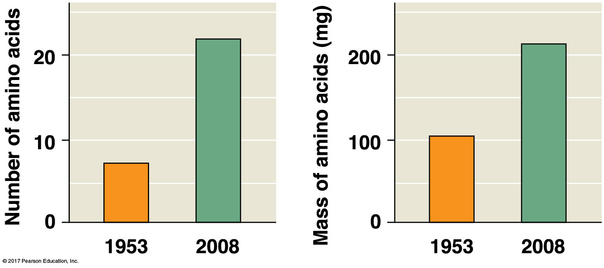
    
## Geologic Time Scale

## key events
unicellular, multicellular land

## Evolution of Eukaryotes

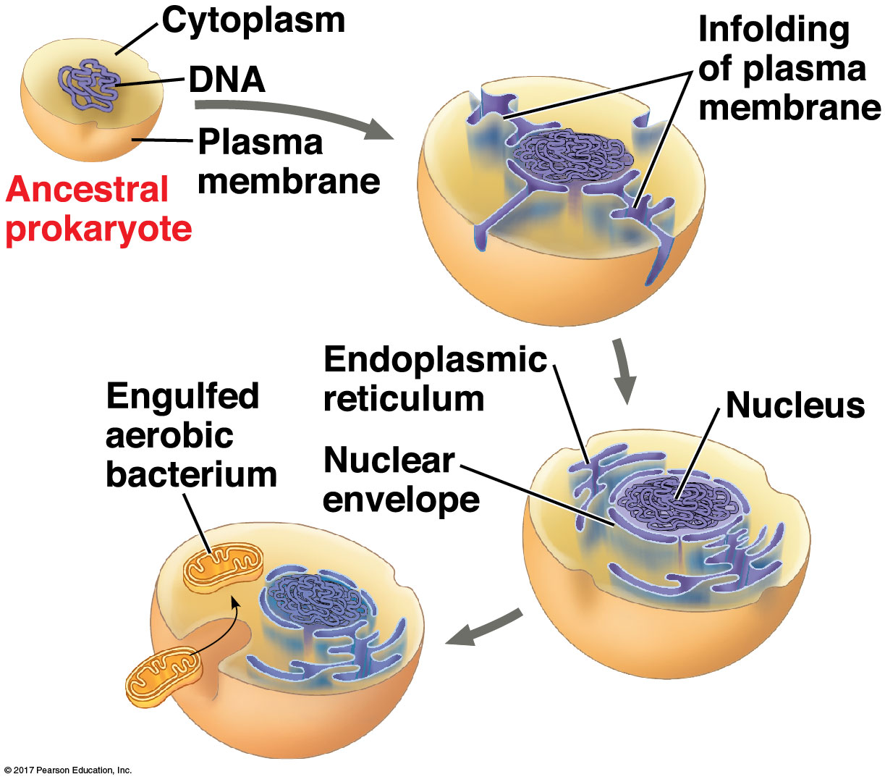

## Evolution of Eukaryotes

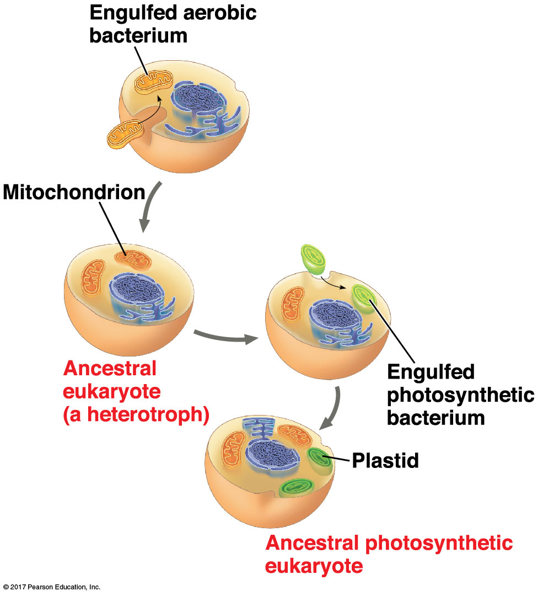

## Oxygen revolution
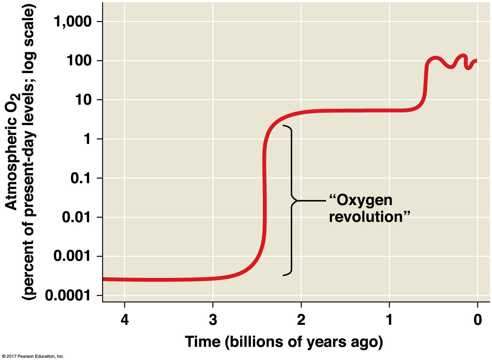
    

## Evolution of Animals

 

 

    

## Early animal life and the Cambrian explosion

Spectacular diversification of
animals ~ 540 million years ago!
– seemingly abrupt: 10-20 million
years!
– bizarre creatures, both hard
skeletons and soft bodies
– diverse, not in numbers of
species, but in body morphology
(bilaterally symmetrical animals)

## Burgess Shale

## Nearly all major animal groups in Burgess Shale!!!

## Did the Cambrian really explode?

## Ediacaran fauna – 550-650 MYA

Prediction: Animal fossils will be
found in deposits much older than
the Burgess Shale

As predicted, fossils support
diversification of animal groups
before the Cambrian!

## molecular clocks

Differences in DNA sequences support
extended diversification of
major animals groups
before the Cambrian!

Amount of genetic difference between
sequences is a function of time since
separation.

## Cambiran species

There were many new adaptations!
– hard skeletons and soft bodies.
– small, medium, large, and extra large!
– crawlers, burrowers, swimmers,…
– predators, mud eaters, scavengers,
plankton feeders, …

## What caused the Cambrian explosion

 

• Geologic causes:
– Increased oxygen levels in seawater?
– Snowball Earth??
• Ecological causes:
– Predator-prey “arms race”?
• Genetic causes:
– Evolution of complex Hox genes that regulate
body morphology (e.g., segmentation genes)?

## Life on Land
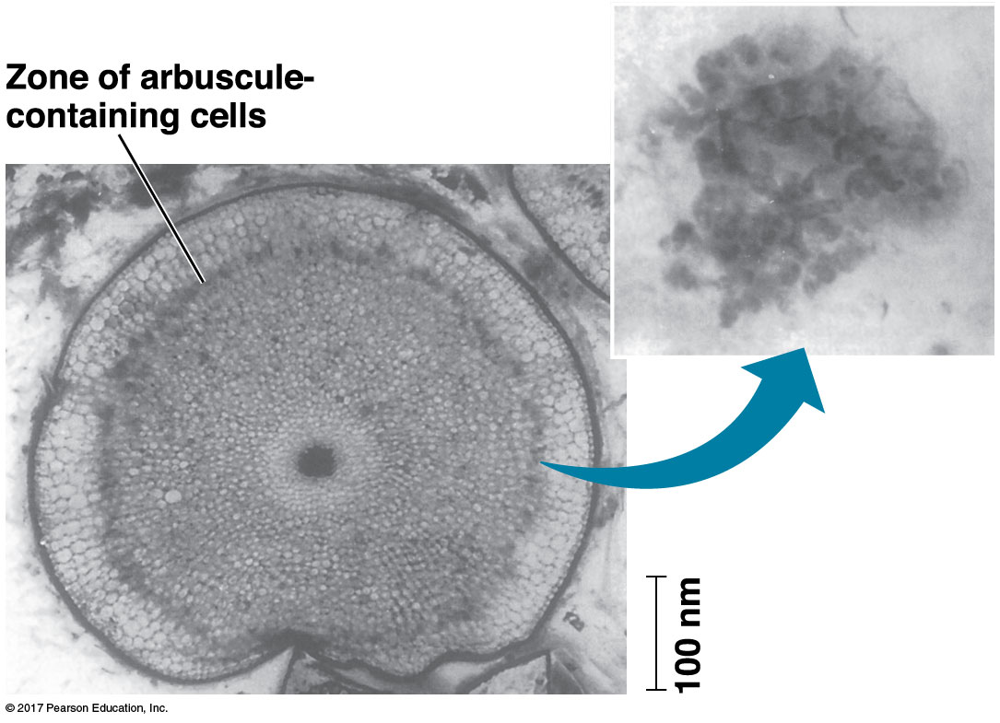

## Continental Drift

* **Landmasses came togehter 3 times over last billion years**
    + yields new contintents
    + new super continent in ~250 million years

 

* **Continents = floating plates of Earth's crust**
    + plate movement = *continental drift*
    + a few cm a year
    
 
  
* **Mountains and islands form at boundaries**
    + Inidan + Eurasia = Himalayan Mtn (45 mya)

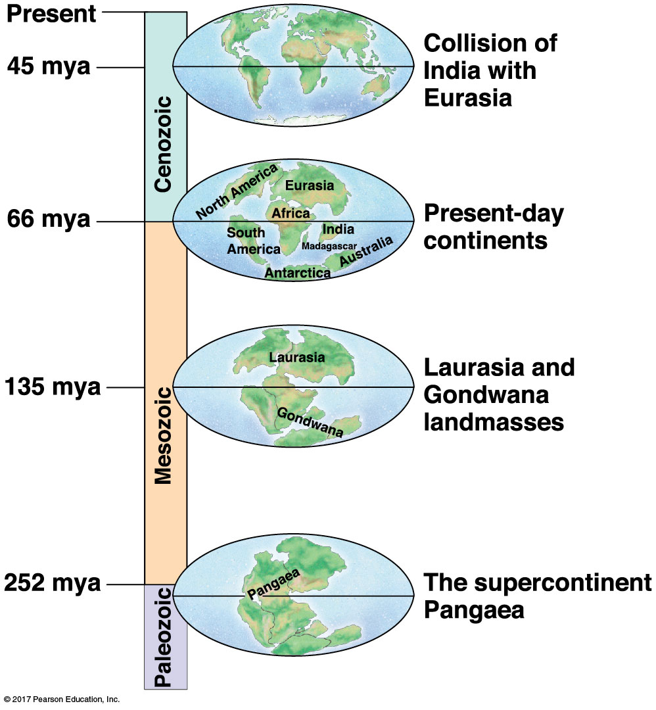

## Continental Drift.... so what?

* **Landmass change alters livable habitats**
    + Oceans basins change
    + species distributions change (Pangea)

 

* **Landmass change alters climate**
    + Canada used to be tropical
    
 
  
* **Continental drift drives speciation**
    + new opportunites for species
    + some species driven to extinction

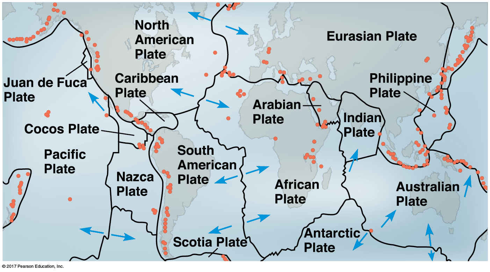

## 

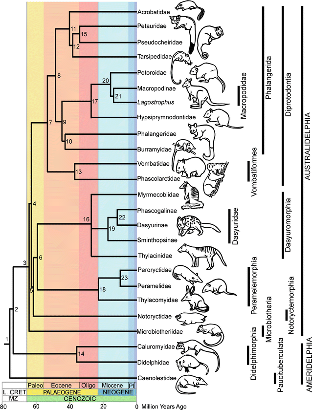

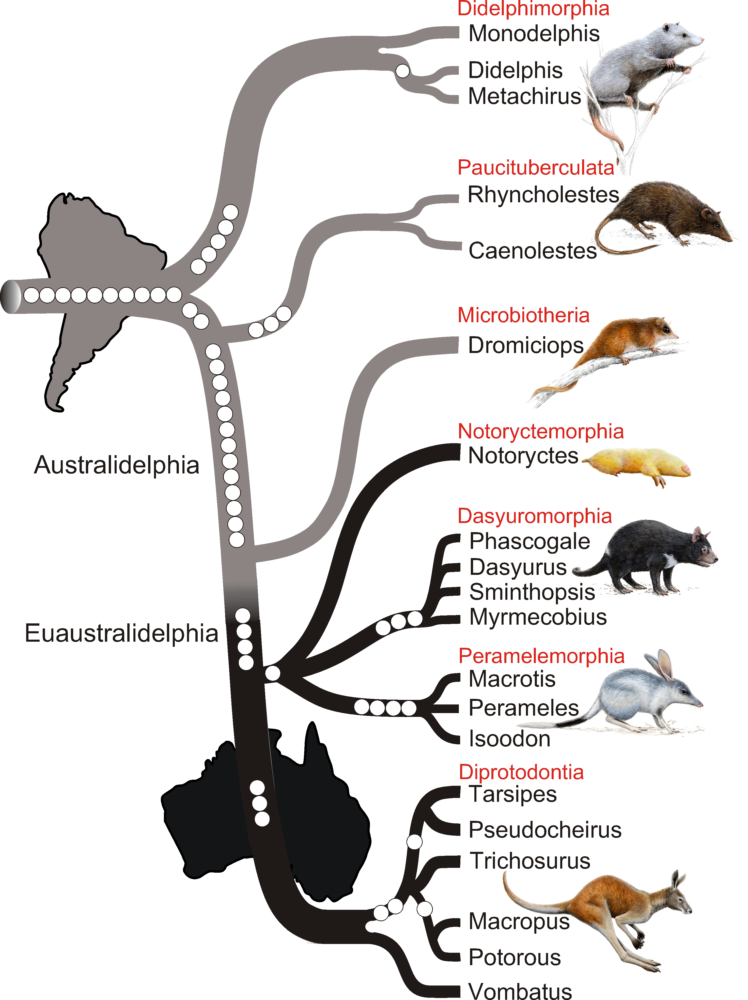

# Extinctions

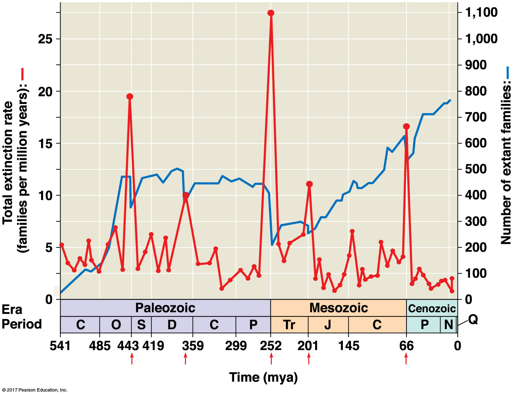

# Extinctions

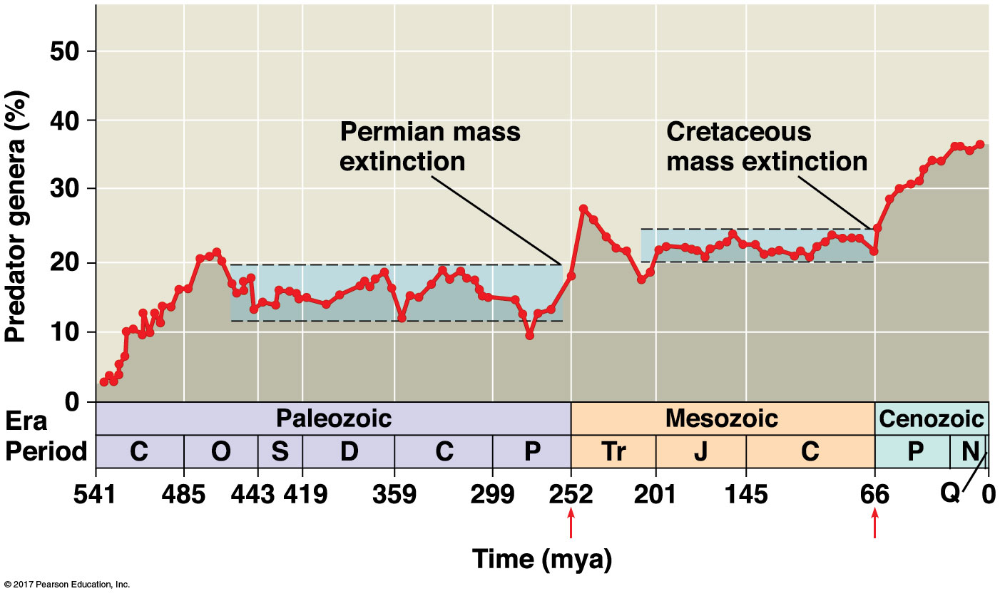

## Adaptitive radiation

* **“the historical product of the interplay between genetic possibility and environmental opportunity, amplified by ecological interactions to extend across all of biology.” – Knoll and Carroll (1999)**

 

* **Adaptive Radiation: **

 

* ** Occur on large scale after each extinction event**
    + many vacant habitats
    + favor evolutionary innovations

 

  
* **Dinosaur extinction &rarr; mammal diversification**
    + small and nocturnal &rarr; ...

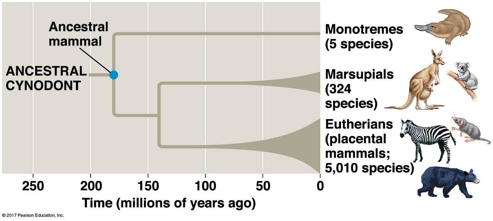

# Regional Adaptive Radiation

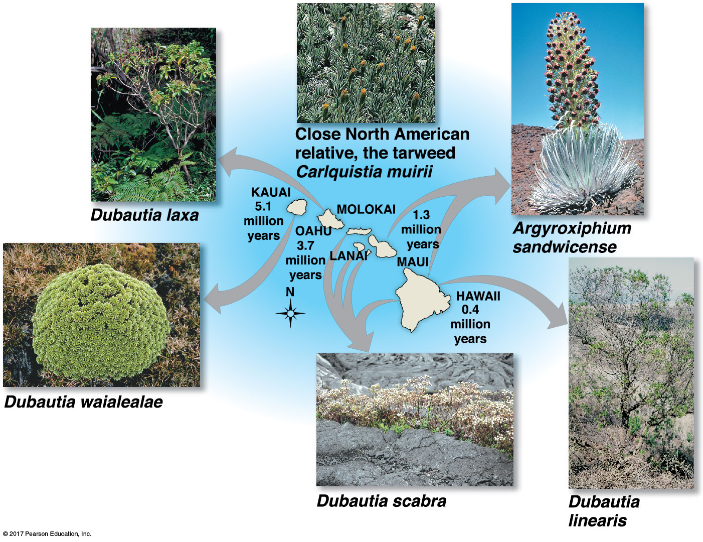

# Rise and Fall of organisms

##

https://www.youtube.com/watch?v=qNtQwUO9ff8