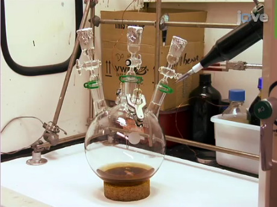

## Oparin and Haldane hypothesis

 

**Chemical and physical processes combine to make primitive cells**
 

1. abiotic synthesis of small organic molecules (e.g., amino acids)
2. small molecules join together (proteins)
3. molecules packaged into primitive cells
4. origin of self-replicating molecules

 

* **Early earth had water vapor and simple compounds from volcanic eruptions (CO~2~, CH~4~, NH~3~)**
    + atmosphere was *reducing* (now controversial)
    + energy from UV or lightning
    + oceans = primordial soup of organic molecules

## Miller & Urey experiments: Testing Oparin & Haldane

## Similar experiments have had variable success

##

## Fossils record is incomplete and biased

## Fossils DO trace the steps of animal evolution

## Progression of life on earth

 

* **Fossils help divide geologic record into 4 eons**
1. Hadean
2. Archaen
3. Proterozoic

 

**4. Phanerozoic: last 540 million years**

 

* **Recent geologic ages (3), each with unique animal life (within Phanerozoic)**
1. Paleozoic
2. Mesozoic
3. Cenozoic

## Review: Evolution of Eukaryotes and the Great Oxygenation

## Early animal life and the Cambrian explosion

 
 

* **2^nd^ oxygen revolution tied to evolution of animals**

 

* **Prior to Cambrian all 'large' animals had soft bodies**
    + little evidence of predation
    + grazers, scavengers, filter feeders
    + still all marine

 

* **Large predators evolve in early Cambrian**
    + 545-525 mya
    + predator vs prey evolution
    + evolution of eyes (sensory organs)

## Cambrian explosion = bizarre aquatic creatures

 

* **Spectacular diversification of animals**

 

* **Abrupt period: only 10-20 million years!**
    + speed of diversification troubled Darwin

 

* **Hard skeletons evolved**
    + diverse body morphology (new Hox genes?)

 

* **Bilaterally symmetrical animals**
    + formation of 'head' region
    + organized sensory organs
    + new direction of movement

## Burgess Shale

 

* **British Columbia's Yoho National Park**
    + 60,000 unique fossils
    + one of the most diverse and well-preserved fossil sites
 
 
 
* **Animals from the Cambrian explosion**
    + origins dating 545 to 525 million years ago

 

* **Mudslides from land buried marine organisms**
    + sediment  deposited in deep-water basin next to enormous reef 
    + soft and hard body fossils

## Nearly all major animal groups in Burgess Shale!!!

<!-- ## -->
<!--   -->
<!--   -->

<!-- **Did the Cambrian really explode?** -->

<!--  -->

<!--  -->

## Geologic history of life on land follows Cambrian period

## First animal colonization of land

 

* **Arthropods (insects/spiders): 450 mya**

 

* **Tetrapods (four-footed animals): 350 mya**
    + evolved from lobe-finned fishes
    

## Rise and fall of animal diversity

 

* **Diversification is not a smooth process**

 

* **Speciation rates: how many species in a lineage are created**

 

* **Extinction rates: how many species in a lineage are lost**

 

* **The fate of a lineage depends on this rise and fall**
    + plate tectonics
    + mass extinctions
    + adaptive radiations
    
 

* **Example: first tetrapods &rarr; dinosaurs &rarr; mammals**
    

## Continental Drift

 

* **Continents = floating plates of Earth's crust**
    + plate movement = *continental drift*
    + a few cm a year
    
 

* **Landmasses came together 3x over the previous billion years**
    + yields new continents
    + new super continent in ~250 million years
    
 
  
* **Mountains and islands form at boundaries**
    + India + Eurasia = Himalayan Mtns (45 mya)
    + Appalachian Mtns ~500 mya

## Continental Drift.... so what?

 
 

* **Landmass change alters livable habitats**
    + species distributions change
    + oceans change (Valley of Whales)
    + Pangaea (250 mya) drained shallow oceans

 

* **Landmass change alters climate**
    + Canada (burgess shale) was once tropical
    
 
  
* **Continental drift drives speciation**
    + adapt, move or die

## Allopatric speciation: Australian marsupials

**Continental drift caused the success and failure of different mammal groups**

## Mass Extinctions

* **5 mass extinctions in fossil record**
    + ~75% of species go extinct
    
 

* **Permian extinction: 96% marine loss**
    + most recent: Cretaceous (bye bye Dino)
    
 
  
* **Causes are varied**
    + volcanoes & meteors
    + massive climate change
    + ocean chemistry
    
 

* **Evolution favors innovation but...**
    + innovations can be wiped out

## Adaptive Radiation

* **Rapid diversification events to fill new habitat opportunities**

 

* **Occur on large scale after extinction events**
    + many vacant habitats
    + favors evolutionary innovations

 

* **Can also occur when species reaches new open habitat**
    + Opportunity leads to diversification

 

* **Dinosaur extinction &rarr; mammals**
    + small & nocturnal in presence of dinosaurs

## Regional Adaptive Radiation: Hawaiian islands born 'naked'

