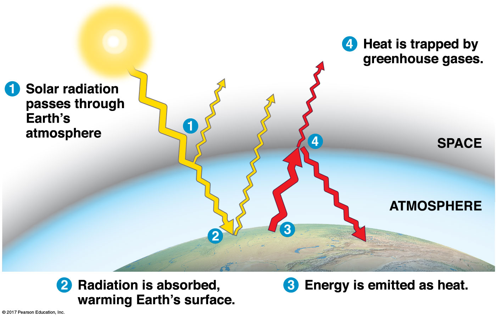

## Human activity has altered >70% of land surface

<!-- ## Global Change hash-tags -->
<!-- 
 -->
<!--   -->

<!-- * **This lecture will cover the changes in Earth's system via biodiversity and global change** -->

<!--   -->

<!-- * **#BiodiversityTypes** -->

<!--   -->

<!-- * **#BiodiversityThreats** -->

<!--   -->

<!-- * **#ConBioTypes** -->

<!--   -->

<!-- * **#GlobalChangeBasics** -->

## The Big Picture: Earth's systems and humans interact

 

* **Biodiversity can be measured at many scales**
    + maintaining high biodiversity has huge benefits

 

* **Conservation biology focuses on the population level**
    + small populations have genetic problems
    
 

* **Global Change is occurring at unprecedented rates**
    + Yes, change has occurred over Earth's history
    + No, it has never occurred this quickly
    
 

* **Are we in a new mass extinction?**

## What is Biodiversity?

 

* **Level 1: Genetic Diversity**
    + within and among populations
    + loss reduces adaptive potential
    
 

* **Level 2: Species Diversity**
    + number of species in a system
    + local or whole extinctions possible
    
 

* **Level 3: Ecosystem Diversity**
    + variety of ecosystems on Earth
    + provide services to living things
    

## How do we measure biodiversity?

 

* **Genetic Diversity: alleles in populations**
    + what happens when a population disappears?
    
 

* **Species Diversity**
    + how many species?
    + how *even* are the species?
    + roles of dominant, keystone & rare species
    
 

* **Ecosystem Diversity**
    + what services does an ecosystem provide?
    + are the abiotic variables changing?

## The Selfish View: What does biodiversity provide us?

 

* **Moral code: Each species belongs**
    + what happens when a species becomes locally extinct?
    
 

* **Practical benefits for all 3 biodiversity types**
    + genetic diversity a tool for medicines
    + diversity feeds, clothes and houses humans
  
 

* **Ecosystem Services to humans**
    + raw goods
    + health and well being
    + regulation of air, water, etc

## Why is biodiversity changing?

 

* **Human activities threaten biodiversity**
    + at each scale
    
 

* **Threats posed by humans fall into 4 categories**
1. habitat loss
2. species introductions
3. over-harvesting
4. global change

 

* **Landscape change by humans is huge threat**
    + nearly all land surface has been altered
    + causes *fragmentation* or *loss of habitat*

## Introduced species and over-harvesting

## How does conservation biology work? 

 
 

* **Small populations are the most vulnerable**
    + population getting pushed to extinction 
    
 

* **Small populations vulnerable to inbreeding**
    + genetic issues of non-random mating

 

* **Small populations vulnerable to genetic drift**
    + chance loss of alleles
    
 

* **Goal: Maintain genetic diversity to avoid extinction vortex**

## How does conservation biology work? 

 

* **Detect downward trends in population sizes**
    + may be a large population
    
 

* **Prioritize the factors causing decline**
    + habitat loss or climate change   
        
 

* **What are the environmental needs of the species?**
    + What causes the decline
    + How do we stop it?
    

## Landscape conservation: Building habitat corridors

## Global Change: What is in a name?

 
 

* **Global warming: **
    
 

* **Climate change: **
    + more than just temperature
    + mostly related to post 1950's
    
 

* **Global change: **
    + e.g. nutrient cycles, biodiversity, land use, sea level rise, ice loss
    

## Global Change: Climate change

  

* **Climate change is strongly related to the chemistry of the atmosphere**
    + greenhouse gas effect 
    + CO~2~, CH~4~, NO~x~ & H~2~O
    
  

* **Greenhouse gases intercept and absorb radiation**
    + more greenhouse gases = higher temperatures
    
  

* **Burning of fossil fuels has increased atmospheric CO~2~**
    + makes biosphere warmer
    + impacts weather and climate
    

## Greenhouse effect is a natural process!

<!-- ## Global Change: Nutrients -->
<!-- 
 -->

<!-- 
 -->

<!-- * **Humans move nutrients around too much** -->
<!--     + mostly to support agriculture -->
<!--     + disrupts natural cycling -->

<!-- 
 -->

<!-- 
 -->

<!-- * **Ecosystems may reach *critical load* of a nutrient** -->
<!--     + nutrient cannot be taken up by plants -->
<!--     + excess N on crops, leaches to aquatic systems -->
<!--     + excess N impacts area not intended -->

<!-- 
 -->

<!--  -->

<!--  -->

<!-- ## Global Change: Toxins & Pollution -->
<!-- 
 -->

<!--  -->

<!--  -->

<!-- ## Global Change: What can we do? -->
<!-- 
 -->
<!--    -->

<!-- 
 -->

<!-- * **We cannot save all habitats** -->
<!--     + which patches are most crucial? -->

<!--    -->

<!-- * **Sustainable development** -->
<!--     + better engineer man-made ecosystems -->
<!--     + food security while reducing nutrient/chemical impacts -->
<!--     + food security while maintaining ecosystem services -->

<!--    -->

<!-- * **Curb global emissions** -->
<!--     + can we do it? -->
<!--     + technology? -->

<!-- 
 -->

<!--     -->

<!-- ## Future of the Biosphere: New Mass Extinction? -->
<!-- 
  -->

<!--    -->