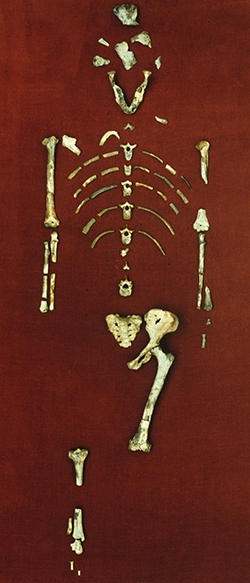
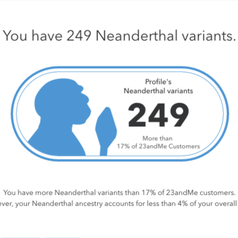

## Things to Know (#'s)

 
 

**#Hominin Traits**

 
 

**#Why 2 Legs?**

 
 

**#Out of Africa**

##
**Mammals are more recently derived amniotic chordates, with fur and mammary glands**

## The common display of chimp to man is deeply problematic 

## Common **Mis**conceptions of human evolution

 
 

* **Humans descended from chimpanzees: WRONG!** 
    + **RIGHT**: We share a common ancestor with chimps

 

* **Human evolution = series of steps from ancestor to *Homo sapiens*: WRONG!**
    + **RIGHT**: Human evolution is more like bush than a ladder
    + *Homo sapiens* is a single branch on a bushy phylogenetic tree of 'humans'
    
 

* **Human characteristics like upright posture and large brain evolved together: WRONG!**
    + **RIGHT**: Early ancestry included upright walkers with small brains 
    
## Primate phylogeny (Misconception #1)

##

## The big picture: Humans are evolutionary newcomers 

* **Our closest *living* relatives are the chimpanzees**
    + common ancestor with chimps ~ 6-7mya
    + genomes are 98.9% identical to chimps
    + 1% difference means a lot!!
        + 19 regulatory genes differ
        + 600 genes differ in protein expression
        
 

* **Hominin derived characters:**
    + bipedal
    + large brain
    + reduce jawbone, jaw muscles, and bite force
    + shorter digestive tract

 

* **These characters are not unique to *Homo sapiens*! **
    

    
## Hominins: part of primate tribe that includes genus *Homo*

 

* **~30 species described (fossils) in the Hominin tribe**
    + at least 6 different genera (e.g., *Homo*)
    + key brain size, teeth shape, and body size traits
    + inferred tool use/culture/language
    + each species had different combos of those traits

   
   
* **We (*Homo sapiens*) are the sole surviving taxon**

 

* **Old fossils in Africa suggests origins of the tribe**
    + *Sahelantrophus tchadensis* (Toumai): 6.5mya
        + fossil connection to first hominins missing
    + *Ardipithecus ramidus* (Ardi): 4.4 mya
        + lived in trees & on ground

## Hominin evolution was not a linear process (Misconception #2)

## 

**Hominin evolution:**
 

**Brain volume increases over macroevolutionary events**
 

**(Misconception #3)**

## Hominin evolution: The jaw (form and function)

## Why did we evolve to walk on 2 legs? (form and function)

## 

## 

## The earliest Hominins evolved in Africa

 

* **All but the 4 most recent species existed *only* on the African continent**

 

* **Oldest hominin fossil found in Chad**
    + ~6-7 mya, found in 2001
    + diverged from common ancestor with chimps (~7mya)
 
  
 
* **Hominin diversity increased ~4-2 mya**
    + long lived *Australopithecus* genus
    + 'Lucy' fossil in Ethiopia
        + more diverse diet
    + definitely bipedal
    + gorilla-like shoulders: climber?
    + possible tool use

## Lucy (*Australopithecus afarensis*) direct ancestor of *Homo*?

## *Homo* genus in the fossil record

 

* ***Homo* genus is composed of modern humans**
    + all species are called *humans*
    + ~2mya to present day

 

* **15+ species described!**
    + flat and narrow faces
    + small jaws and teeth
    + larger brain cases

 

* **Tool-making was their hallmark** 

## Brain volume in *Homo* species increased disproportionately

## Species of Hominins and *Homo* overlapped!

## *Homo* species migrated out of Africa (*H.erectus* likely first)

***H.erectus migrated* ~2 million years ago, followed by  *H.heidelbergensis***

## *Homo sapiens* evolution

* **Evolved on the African continent ~ 300,000 years ago**

 

* **Migrated in later waves of immigration out of Africa**
    + ~100,000 years ago
    + **not the first species to leave**

 

* **1 population left Africa, then split into 3 groups**
    +  fossil and DNA evidence shows migration paths
    +  ~2,000 generations ago

 

* **Natural selection for the ability to reason and communicate?**
    + increased tool use and language
    + resulted in larger brains 

## *H.neandertalensis* and *H.sapiens* interacted!

 

* **Neanderthals evolved in Eurasia (not Africa)**
    + split from a common ancestor ~ 500,000 ya
    + buried dead
    + used art

 

* **Co-existed with *H.sapiens* until ~ 30,000 years ago**
    + Middle East and Europe

 

* **Only one lineage survived**
    + natural selection based on climate?
    + out competed?
    + extirpation of Neanderthals by modern humans? 

## *H.neandertalensis* and *H.sapiens* interbred!

## Recent findings: new modern species?

 
 
 

* **Really small new species (*H.floresiensis*)?**
    + fossils in Indonesian island cave
    + allegedly 13,000 years old

 

* **Archaeologists seeking to understand migratory path to Australia**

 

* **Controversy: diseased *H.sapiens*?**

## Where is Human evolution heading?

**Newish Traits** = Cooler body temperatures, less hair, even smaller jaws and teeth
 

**Regional populations adaptions** = surface area:volume by climate (regional), nose and lips shapes by climate, strait hair in cool climates, eye lid folds in Asian populations to protect eye from UV, thicker fat in arctic populations, large brain volumes in cold climates, reemergence of lactase, skin color and vitamin D synthesis by region, resistance to malaria, increased susceptibility to allergies/asthma
