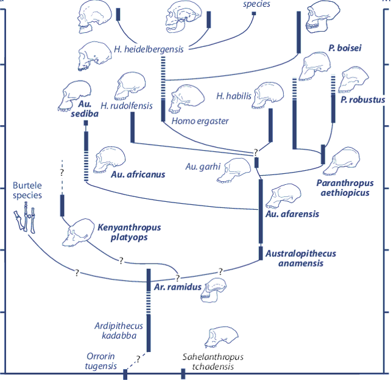

## Common **Mis**conceptions of human evolution

 

* **Our ancestors were chimpanzees: WRONG!** 
    + RIGHT: We share a common ancestor with chimps

 

* **Human evolution = series of steps from ancestor to *Homo sapiens*: WRONG!**
    + RIGHT: Hominid phylogeny is more like bush than a ladder
    + *Homo sapiens* is a twig on the bush
    
 

* **Human characteristics like upright posture and large brain evolved together: WRONG!**
    + RIGHT: Our ancestors include upright walkers with small brains 
    
##

##

## The big picture: Humans are evolutionary newcomers 

* **Our closest *living* relatives are the chimpanzees**
    + common ancestor with chimps ~ 6-7mya
    + genomes are 98-99% similar to chimps
    + 1% difference means a lot!!
    + 19 regulatory genes differ

 

* **Hominin derived characters:**
    + bipedal
    + large brain...
    + reduce jawbone and jaw muscles
    + shorter digestive tract

 

* **These characters are not unique to *Homo sapiens*! **
    

    
## Hominins: part of primate family; includes genus *Homo*

* **~20 species of fossils**
    + brain size, teeth shape, body size
    + inferred tool use/culture/language
    + species had different combos of each

 

* **Really old fossils**
    + *Sahelantrophus tchadensis* (Toumai): 6.5mya
        + fossil connection to *Homo* missing
    + *Ardipithecus ramidus* (Ardi): 4.4 mya
        + lived in trees & on ground

   
   
* **We (*Homo sapiens*) are the sole surviving lineage**

## Human evolution was not a linear process

## Hominin evolution: brain volume

## Skull evolution: The jaw

## Brainstorm: Why did we evolve to walk on 2 legs?

## 

## 

## The earliest Hominins evolved in Africa

 

* **All but the 4 most recent species are found on the African continent**

 

* **Oldest hominin fossil found in Chad**
    + ~6-7 mya, found in 2001
    + diverged from common ancestor with chimps (~7mya)
 
  
 
* **Hominin diversity increased ~4-2 mya**
    + *Australopithecus* spp
    + 'Lucy' fossil in Ethiopia
        + more diverse diet
    + definitely bipedal
    + gorilla-like shoulders: climbers
    + possible tool use

## Lucy (*Australopithecus afirensis*) direct ancestor of *Homo*?

## *Homo* genus in the fossil record

 

* **Early *Homo* genus is composed of first humans**
    + all species are called *humans*
    + ~2mya to present day

 

* **8-10 species described!**
    + flat and narrow faces
    + small jaws and teeth
    + larger brain cases

 

* **Tool-making was their hallmark** 

## Brain volume in *Homo* species increased disproportionately

## Species of Hominins and *Homo* overlapped!

## *Homo* species left Africa (*H.ergaster* then *H.erectus*)

## *Homo sapiens* evolution

 

* **Descended from a *2^nd^* wave of immigration out of Africa**
    + 'Out of Africa' hypothesis
    + ~100,000 ya
    + fossil and DNA evidence
    + not the first species to leave

 

* **1 population left Africa, split into 3 groups**
    +  2,000 generations ago

 

* **Natural selection for the ability to reason and communicate**
    + Increased tool use and language
    + resulted in larger brains 

## *H.neandertalensis* and *H.sapiens* co-occured

 

* **Neanderthals evolved in Eurasia**
    + Split from a common ancestor ~ 500,000 ya
    + buried dead
    + used art

 

* **Co-existed until ~ 30,000 years ago**
    + Middle East and Europe

 

* **Only one lineage survived**
    + Interbreeding
    + Competition?
    + Extirpation of Neanderthals by modern humans? 

## *H.neandertalensis* and *H.sapiens* co-occured

## Recent findings: new modern species?

 
 
 

* **Really small new species (H.floresiensis)?**
    + fossils in Indonesian island cave
    + allegedly 13,000 years old
    

 

* **Archaeologists seeking path to Australia**

 

* **Controversy: diseased *H.sapiens*?** 

## Where is Human evolution heading?

