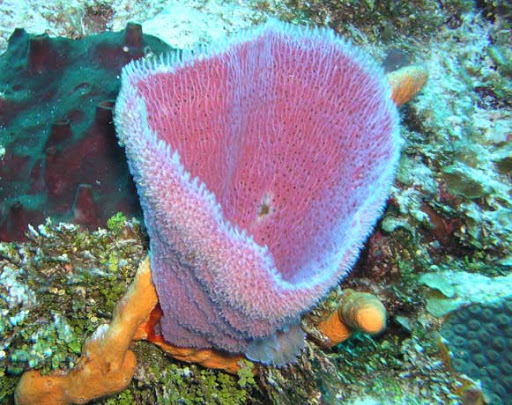
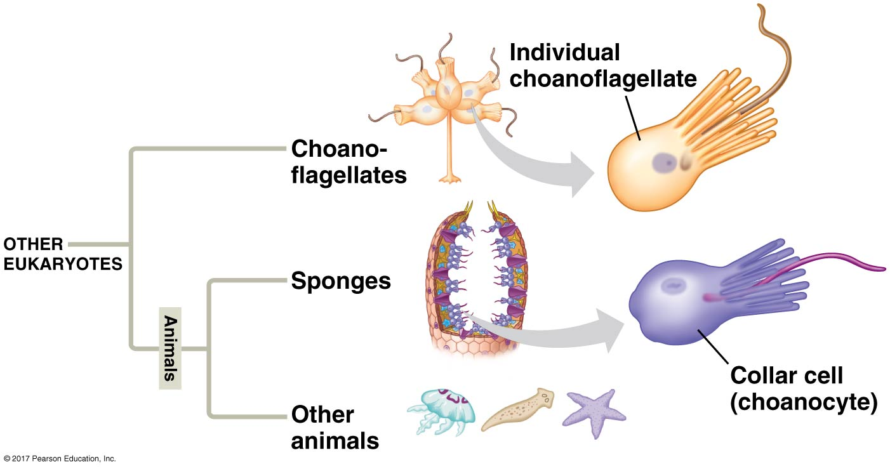
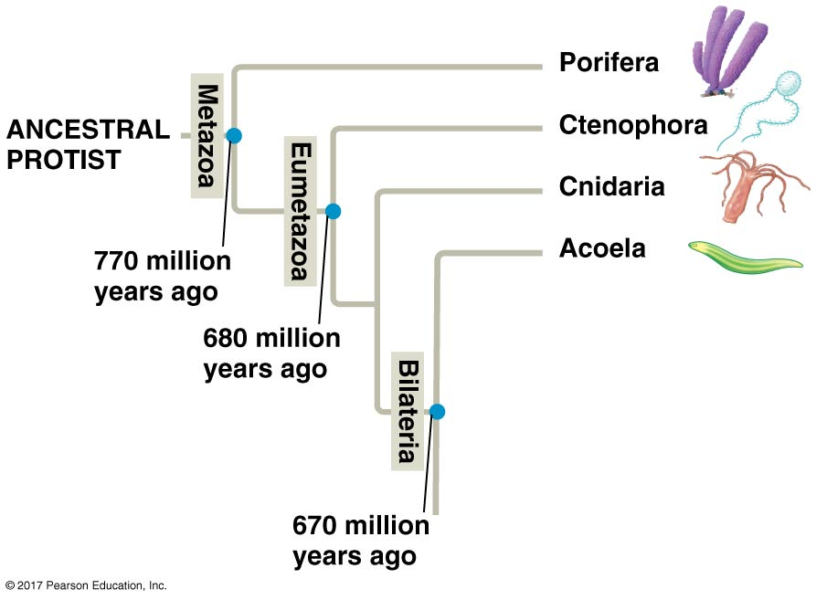
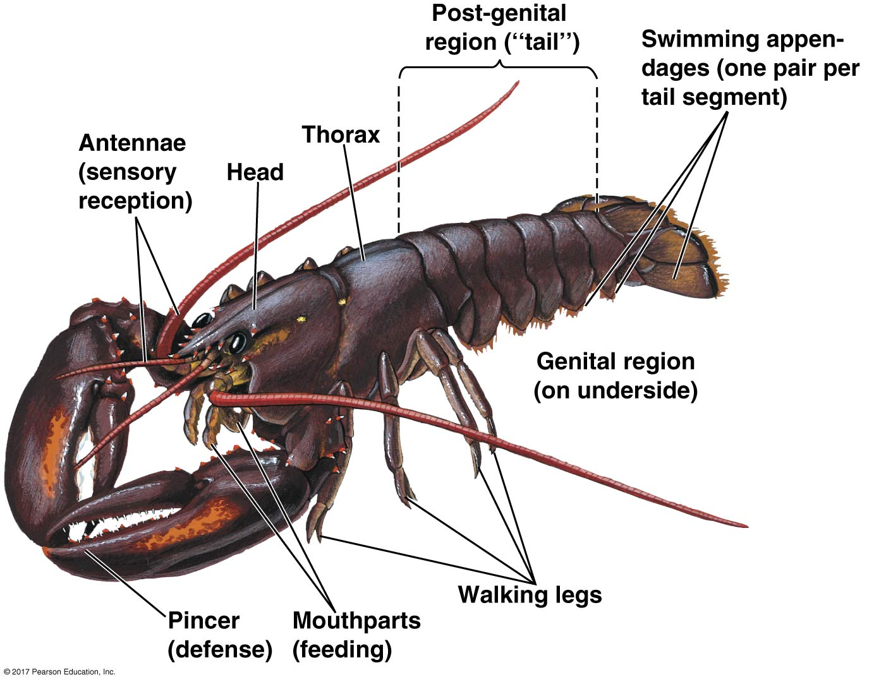
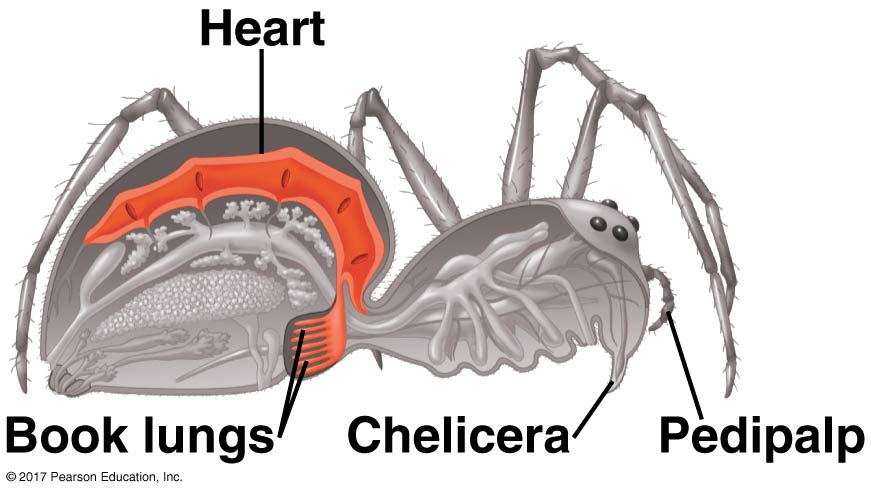
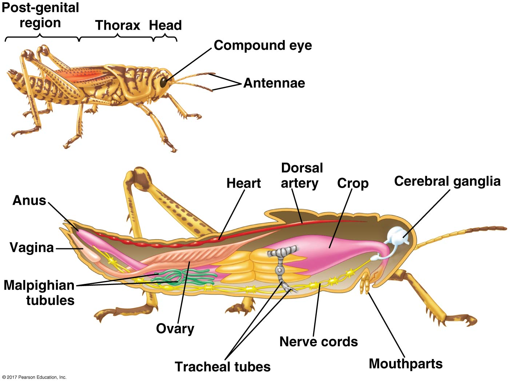

## History of animals ~700 million years old

 

* **Spronges maybe 

* **accepted fossils Ediacaran (pre cambrain)

## Animals are monophyletic

* **All share 3 traits**
1. Multoi-cellular
2. Motile (adults or larvae)
3. Heterotrophy

 

* **All animals, excepts sponges, have:
1. Nerve cells called neurons
2. Muscle cells

 

* **Animals are incredibly diverse**
    + 35 majoy phyla
    + 1/3 are marine
    + most phyla have marine members
    
    * **Microevolution happens at the population level (review)**

## Fungi and animal common ancestors

## Invertebrate Phylogeny

## Invertebrates: lacking a bacbone

* **95% of known animal species**

 

* **Occupy ever habitat on Earth**

 

* **Small to huge**

 

** Categoized based on ----**

## Porifera (Sponges)

* **Most basal animal group**
    + do not move and marine
    + filter feeders
    + hermaphroditic (alternate)
    
 

* **Share similarties with Chonaflagellates**
    + feed using cells called *choanocytes**

     

* **Lots of cells, but no tissue layers**

##

## Similarites suggest Choanaflagellates closet living relative

## Cnidaria

* **All animals except sponges are considered "True Animals"**
    + contain tissues
    

    

## Cnidaria

* **All animals except sponges are considered "True Animals"**
    + contain tissues
    
 

* **First lineage to diverse were Cnidarians**
    + corals, hydras and jellyfish
    
 

* **Simple diploblastic radial body plan**
    + motile and sessile
    + polyp or medusa
    

## 

## Most animals are *triploblastic*, *bilaterians*

* **Triplobalsty = 3 germ layers**
    + digestive tract with mouth and anus
    
 

* **Bilateral = symmetircal in 2 halves**
    + corals, hydras and jellyfish
    

## Most animals are *triploblastic*, *bilaterians*

* **Triplobalsty = 3 germ layers**
    + digestive tract with mouth and anus
    
 

* **Bilateral = symmetircal in 2 halves**
    + corals, hydras and jellyfish
    
 

* **3 major clades of bilaterians**
1. Lophotrochozoa
2. Ecdysozoa
3. Deuterostomia

## Lophotrochozoa: Most share 2 structures

## Lophotrochozoa - 18 total phyla

 

* **Most common phyla:**
1. Platyhelminthes (flatworms)
2. Syndermata (rotifers and acanthocephalans)
3. Ectoprocts ()
4. Brachiopods (lamp shells)
5. Mollusca (snails, slugs, oysters, clams, octopuses, squids)
6. Annelids (segmented worms)

 

* **Many phyla appeared in Cambrian explosions**

## Cnidaria: free-living planaria

## Mollusca: Mollusc

## Annelids: Earthworm

## Ecdysozoa

* **Animals with cuticle**
    + shed tough external coat
    + shed as grow; molting; *ecdysis*
    
 

* **8 total phyla**
    + more species than all other groups
    
 

* **2 major phyla**
1. Nematoda (roundworms)
2. Arthropods (mostly insects)

## Nematoda

* **Cylinder bodies from 1mm to 1m**

 

* **Aquatic, soil, plant tissues, animals tissues**
    + many parasitic species
    + humans are host to 50 species

 

* **Longitudinal muscles; thrashing motion**

## C. elegans: model animal species

## Arthropoda: Rulers of the animal world

div style="float: left; width: 50%;">

* **A billion billion arthropods estimated**
    + 1 million species described
    + nearly all habitats on Earth
    
 

* **Segmented body, hard exoskeleton, jointed appendages**
    + likely led to success
    
 

* **Early arthopods are the trilobytes**
    + little variation in body plant

 

* **Evolution selected for functional body regions**
    + feeding, walking, swimming
    + efficient division of labor

## Arthopod body plans: Hox genes?

## Phylum Echinoderms: Next time

