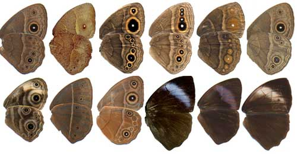

## Evolution as descent with modification

 

**The fossil record lets us explore the ancestors that anything living (including us) evolved from**

 
 
 
 
 
 

* **How did this actually happen?**

## What does 'Descent with modification' really mean?

 
 
 
 

 Evolution: Change in the **genetic** 
 

 **composition** of a **population** over 
 

 **generational time** 

## How would you define a *population*?

## *Population* = group of individuals of same species, coexisting in the same time and place, with the potential of interbreeding 

## BIOL211 review: change in *genetic composition*

## 6 genetically distinct lineages of giraffes

## *Generational Time*

 
 
 
 

**Human = ~27 years**
 
 
 
 
 

**Bacteria = ?**

## Darwinian Evolution

 

* **Focus on adaptation through natural selection (not use/disuse)**
    + characteristics that enhance fitness
    + these characteristics are heritable

 

**?Could new species arise from an *ancestral form* by adaptations to different environments?**

## Adaptation viewed through *homology*

<!-- descent with modification -->

## Evolution by Natural Selection rules (1)

**(1) Individuals in a population vary in their traits**

 
**?What is a trait?**

 
**Trait variation comes from random mutations**

## Evolution by Natural Selection rules (2)

 
 

**(2) Some of these differences are heritable**

 

## Evolution by Natural Selection rules (3)

**(3) In each generation, many more offspring are produced than can survive**

 

* **Only some will survive to reproduce**
 
* **Some will produce more offspring than others**
    

## Evolution by Natural Selection rules (4)

**(4) Individuals with certain heritable traits are more likely to survive and reproduce (adaptation)**

 

* **Individuals with certain traits produce more offspring than those without those traits (selection)**
 
* **Individuals are selected naturally, by the environment**
 
* **Favorable traits accumulate in a population**

## Natural Selection acts on individuals but populations evolve

 
 
 

* **Droughts cause shifts in beaks of finches on the Galapagos Islands**
    + selection pressures from a single food source

 

* **Average beak depth increases over time because deep-beaked individuals had greater reproductive success**
    + *the individuals during drought do not adapt beak size!*

## Evolution happens: Antibiotic resistance

## Evolution of antibiotic resistance 

 

* **Penicillin used in 1943 to stop *S.aureus* **
    + by 1945 20% of *S.aureus* resistant
    + due to new enzyme 'penicilinase"

 

* **Methicillin used in 1959 to stop *S.aureus* **
    + deactivates production of cell walls
    + resistant strains emerged within 2 years
    + evolved  a different enzyme to make cell walls

 

* **Natural selection then lead to spread of MRSA**
    + Methicillin-resistant *S.aureus* super bugs!
    + MRSA now resistant to multiple antibiotics
    

<!-- ##  -->

<!--  -->

<!-- ##  -->

<!--  -->

## Antibiotic resistance is not new to evolution!

 
 

* **Antibiotic resistance is ancient and widespread**
    + genes to protect against penicillin, tetracycline, etc.
    + soil bacteria are rich in resistance 

 

* **Multi-drug resistance common in bacteria isolated from Lechuguilla Cave**
    + ecosystem isolated from surface for 4 million years
    + *Paenibacillus* cave isolate is resistant to most clinical antibiotics
    + 18 resistance mechanisms, including 3 unknown!

    

## Evolution can occur rapidly in certain organisms

<iframe width="560" height="315" src="https://www.youtube.com/embed/plVk4NVIUh8" frameborder="0" allow="accelerometer; autoplay; encrypted-media; gyroscope; picture-in-picture" allowfullscreen></iframe>

## Generational time...

 

**If you were a bacteria today, in 2020....**

 

* **You started class as a sexually reproducing adult and leave welcoming your great-grandchildren**

 

* **Yesterday...**
    + Start	of	Classic	Period	for	Maya	
    + China’s	Three	Kingdoms	reunified	under	Emperor	Jin	
    + Warrior	Queen	Zenobia	breaks	with	Roman	Empire	
    + Pyramid	of	the	Sun	and	Moon	completed	
    + Birth	of	Prophet	Mohammed
    
## Generational time and evolution

**Humans	=	~25	years	**
 
**Bacteria = ~20 minutes**

 
 
 
 
 
 
 
 
 
 
 
 
 
 
 
 

**How long is the average course of antibiotic treatment?**
 
**Do you better understand new strains of SARS-CoV-2?**

