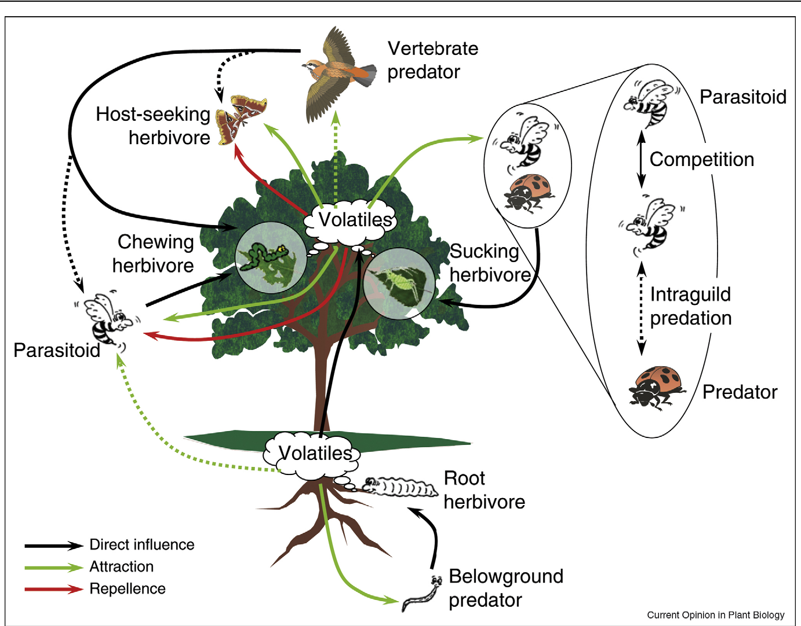

## Plant cognition

 
 
 
 
 

* **Do plants sense their environment?**
    * changes in essential resources
    * herbivory/disturbance
    * external stimuli

 

* **If so, what do they do about it?**
    * do plants process information?

## Plants grow towards light:  Phototropism via Auxin

<!-- ## Sunflowers in the light -->
<!-- 
 -->

<!-- <iframe width="560" height="315" src="https://www.youtube.com/embed/GCRNHdGXTi4" frameborder="0" allow="autoplay; encrypted-media" allowfullscreen></iframe> -->

## Plants competing for light can grow really tall

 
 
 

* **Primary and secondary growth allow trees to be giants**

 

* **Are their limitations to plant height?**
    + Tallest redwood tree = 116 m
      
 

* **What resource most limits growth?** 

 

## Plant Water Transport: Soil → Root → Stem → Leaf →  Air

## Are there limits to moving water?

 
 

* **Large trees move hundreds of gallons of water a day**
    + only small amounts needed for growth/photosynthesis

 

* **Gravity does not help**
    + harder and harder to move water up
    + xylem less efficient @ top
    + theoretically, limits growth to 122-130 m

 

* **Drying soil adds opposite tension**

 

## How long a straw could Superman use?

 
## How can redwood trees grow so tall?

 

* **Cohesion-tension theory**
    + plants use water properties to cheat gravity

 

* **Cohesion: H~2~0 molecules stick to together**
    + via Hydrogen bonds

 

* **Adhesion: water sticks to non-water molecules**
    + stick to sides of xylem tissues
    + H~2~0 not pulled straight up!

 

* **Transpiration pulls water under tension**

 
 

## How can redwood trees grow so tall?

 
 

* **H~2~O also pulled in zig zag motion**
    + pits in xylem cells
    + tracheids are twisted

 

* **Vascular tissue is tough**
    + high resistance of lignified walls
    + built not to collapse under tension
  
 

* **Redwoods near theoretical limit!!!** 
  

 

## Cavitation: When water under tension breaks (cohesion fails)

**When to much tension breaks the 'string' of water, an air bubble is introduced**

##

<!-- ## Do plants sense cavitation events and repair them?  -->
<!-- 
 -->

<!--  -->

<!--  -->

<!--  -->

## How plants avoid water problems: Close stomata

## Risky stomatal behavior

## How plants avoid water problems: Refill soil at night

## How plants avoid water problems: Alter xylem cell construction

## Sensory cell systems - Sensing environmental stimuli

**NOT ON TEST**
 

**Cell to cell signal networks**

 

**Ca^2+^ based signals are common**

## Wounding triggers transmission of Ca^2+^ to start defense

 

##

<iframe width="560" height="315" src="https://www.youtube.com/embed/Lzq-wRHCTKc" frameborder="0" allow="autoplay; encrypted-media" allowfullscreen></iframe>

<!-- ## Don't mess with the acacia tree! -->
<!-- 
 -->

<!--  -->

<!-- ## Plant herbivore defenses: Ethylene  -->
<!-- 
 -->

<!--  -->
 

<!-- ## Protective perfumes -->
<!-- 
 -->

<!--  -->

<!-- ##  -->

<!--  -->