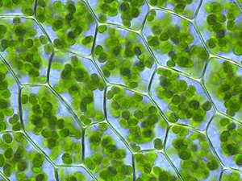
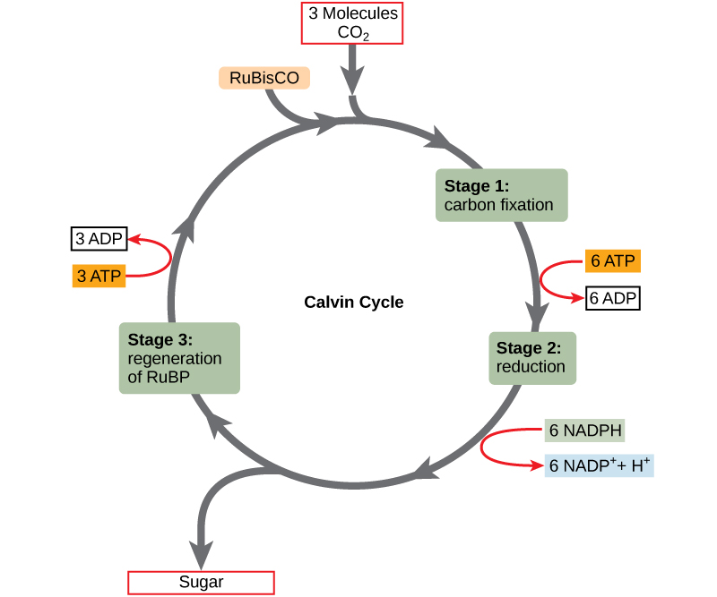
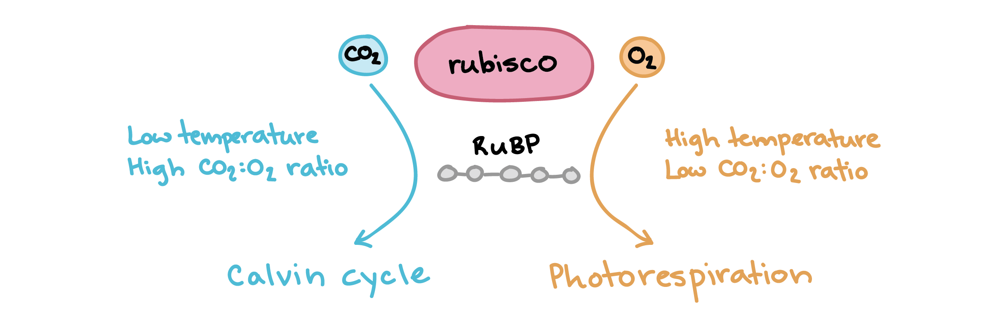
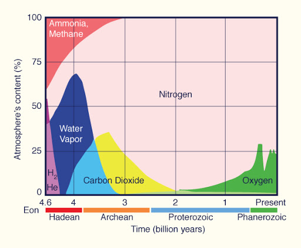
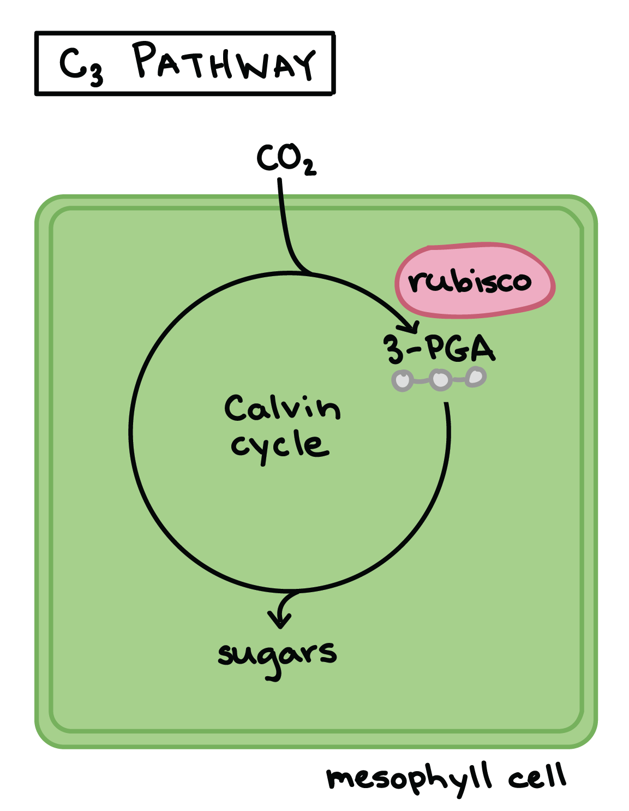
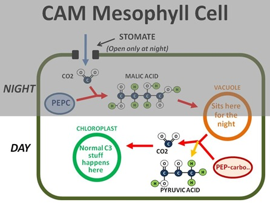

## Review: Light energy to chemical energy

## Light reactions: make ATP + NADPH for Calvin cycle

 

<!-- ##  -->

<!--  -->

## Calvin cycle

## Calvin cycle is a 3-step process

 

* **1. Fixation: CO~2~ reacts with 5C molecule (RuBP)**
    + catalyzed by Rubisco enzyme
    + new 6C split into 2 acids (3C each)

 

* **2. ATP and NADPH turn 3C acids into sugars**
    + reduction of acids

 

* **3. Some 3C sugars recycled to make RuBP (5C)**
    + one 3C sugar leaves to make glucose
    + recycling needs ATP
    
 

## Making sugars requires several cycles

## Rubisco - the enzyme that dominates carbon fixation

 
 
 
 
 

* **Most abundant enzyme in the world**

 

* **Most CO~2~ converted into biomass is fixed by Rubisco**

 

* **Large molecule : 16 polypeptides : 8 active sites**

## Rubisco: the clunky and slow carbon fixer

 
 
 

* **Only 3-10 reactions per second**
    + limits photosynthesis
    
 

* **20% error rate**
    + gets worse at high temperatures

 

* **Also reacts with O~2~**
    + O~2~ reaction called *Photorespiration*
    + uses ATP and NADPH to make CO~2~

  

## C3 photosynthesis how did we get here...

 
 
 

* **Evolution doesn't always create the best solution**

 

* **Photorespiration is completely wasteful**
    + 2x energy to produce the same amount of sugar than if Rubisco only reacted with CO~2~

 

* **Rubisco has evolved high affinity for CO~2~ (80x > O~2~)** 
    + compare to the composition of the atmosphere...

 

<!-- ## Rubisco substrate choice -->
<!-- 
 -->

<!--  -->

<!--  -->

<!-- ## Photorespiration inpacts food security -->
<!-- 
 -->

<!--  -->

## Rubisco and plant evolution: How did we get here?

 
 
 
 

* **Why is there so much Rubsico?**

 

* **Why is it so big and slow?**

 

* **Was it Rubisco always a cheater?** 

 

 

<!--  -->

<!-- ## Plant evolution tied to atmospheric shifts in CO~2~:O~2~  -->
<!-- 
 -->

<!--  -->

## Why has Rubisco not been replaced?

 
 

* **Evolution of enzymes difficult**
    * trade-offs between activity and stability
    * selection against modifying mutations

 

* **RubisCO → RubisC???**
    + requires a decrease in fitness 
    + plants are stuck with Rubisco
    
  
 
* **Natural selection increased affinity for CO~2~**
    + makes it slow

## Evolution tinkers with other parts of photosynthesis

 
 

* **Improved and recombined existing parts and pieces**
    + work around the photorespiration issue
 
 

* **In response to environmental change**
    + lower [CO~2~] & higher [O~2~]
    + high temperatures 
    + water limitations (stomata)

 

* **Evolution of new photosynthesis pathways**
    + Allowed plants to exploit drier habitats

## Evolution of C4 photosynthesis

 
 
 
 

* **Calvin cycle moved to *Bundle Sheath Cells* surrounding leaf veins**
    * chloroplasts now present

 
 

* **BSC cells are less permeable to gases**
    * what does this mean for photorespiration?

## 

## C4 plants concentrate CO~2~ around Rubisco *spatially*

 
 
 

* **C4 mechanism separates Calvin cycle from high O~2~**

 

* **New enzyme, phosphoenolpyruvate carboxlylase (PEPC)**
    * fixes CO~2~ to PEP (**no affinity for O~2~**)
    * new 4C malate pumped to bundle sheath cells
    * malate broken down to release CO~2~

 

* **Hyper efficient with use of CO~2~**
    * How does this impact stomata behavior?

## Why is C4 photosynthesis not dominant?

 
 
 
 

* **Regeneration of PEP expensive (ATP)**
    + in addition to ATP needed for Calvin cycle
 
 
 
* **Where is needed ATP generated?**

 

* **Where should C4 plants exist?**
    

##

 In hot conditions, the benefits of reduced photorespiration likely exceed the ATP cost of moving CO~2~ from the mesophyll cell to the bundle-sheath cell 

<!-- ## C4 photosynthesis: Evolved many times -->
<!-- 
 -->

<!--  -->

## Evolution of CAM photosynthesis (C4 pathway w/out BSC)

## CAM concentrates CO~2~ around Rubisco *temporally*

 
 
 

* **Stomata open at night only**
 
 
 
* **4C compounds produced in large quantities**
    + stored when Rubisco is inactive

 

* **C4 vs CAM**
    * substitute BSC for "night shift"
    

## Yes we CAM!!

 
 
 

* **CAM evolved independently several times**
    + ~16,000 species

 

* **Exist in arid environments or habitats**
    * cacti
    * epiphytes

 

* **Are CAM plants fast or slow growing?**

## C3 vs C4 vs CAM: Know advantages/disadvantages of each

## Why does this matter to you...

 
 

* **C4 plants are economically important**
    * corn, sugarcane, sorghum & switchgrass

 

* **So are C3 crops**
    * beans, rice, wheat, potatoes (temperate crops)

 

* **Global water use is set to triple by 2050**
    * 70%  to the agriculture sector
    * 50% transpired through stomatal pores

<!-- ##  -->

<!--  -->

<!-- ## Can science TUNE photosynthesis? -->
<!-- 
 -->
<!--   -->
<!--   -->
<!--   -->
<!--   -->

<!--  -->

<!-- 
 -->

<!-- * **↑ efficiency of Rubisco in crops** -->

<!--   -->

<!-- * **Redesign to mask photorespiration** -->

<!--   -->

<!-- * **Turning C3 crops to C4...** -->
<!--     * https://c4rice.com/ -->

<!-- 
 -->

