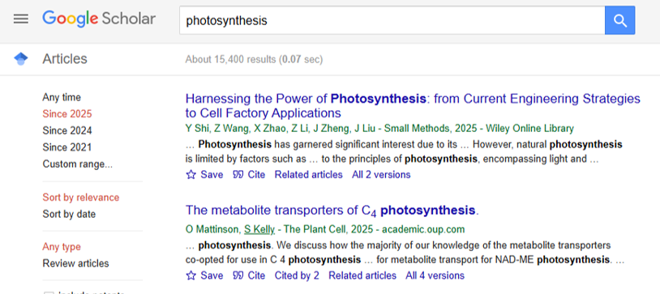
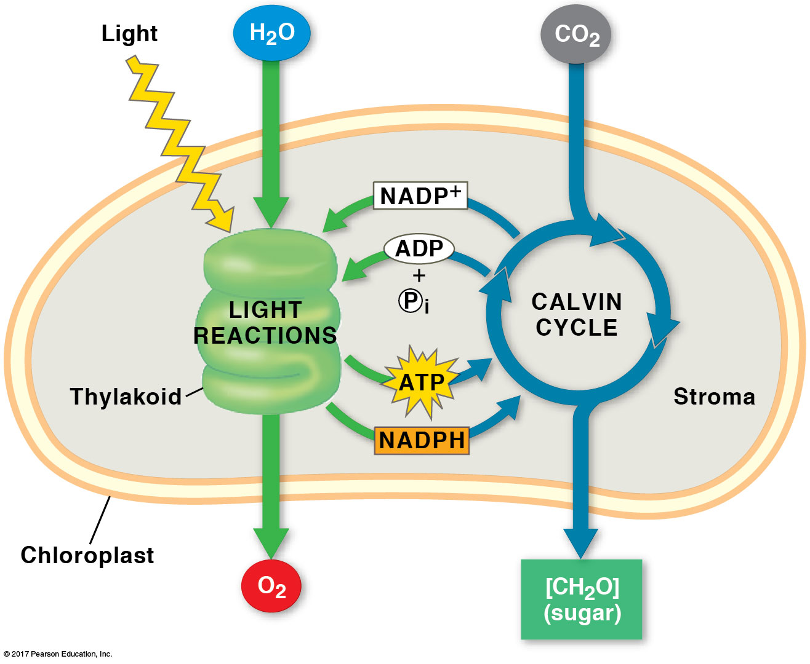
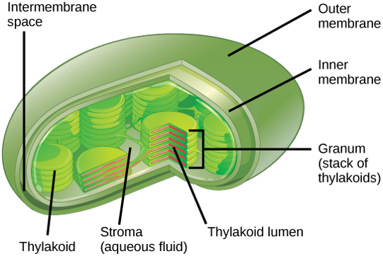
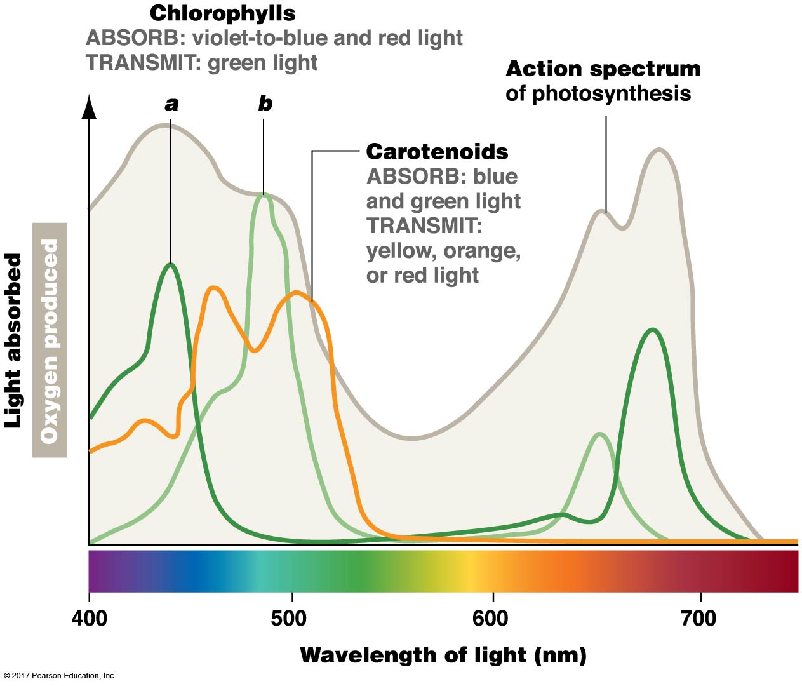
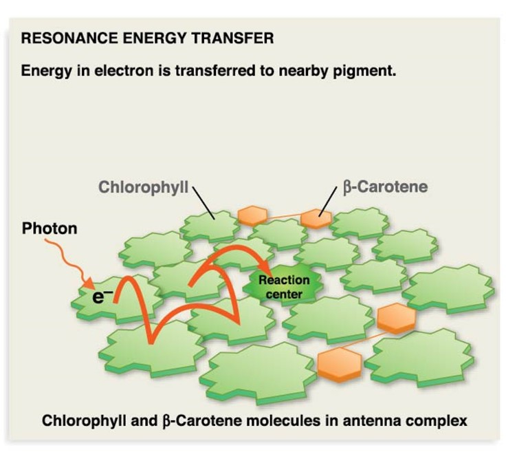
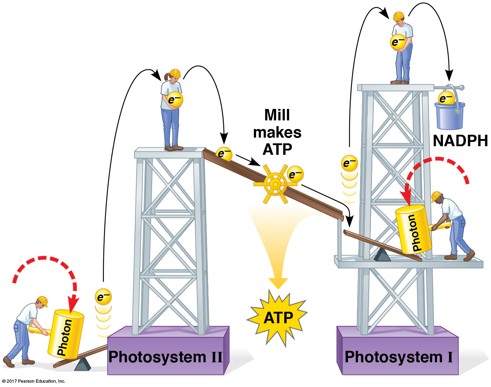
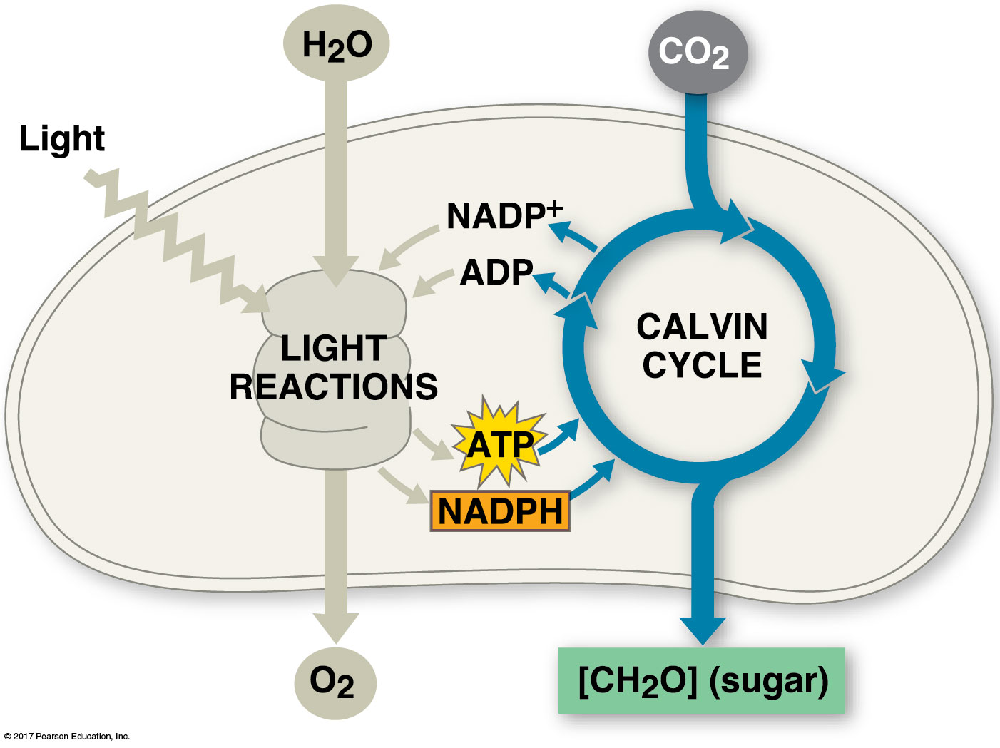
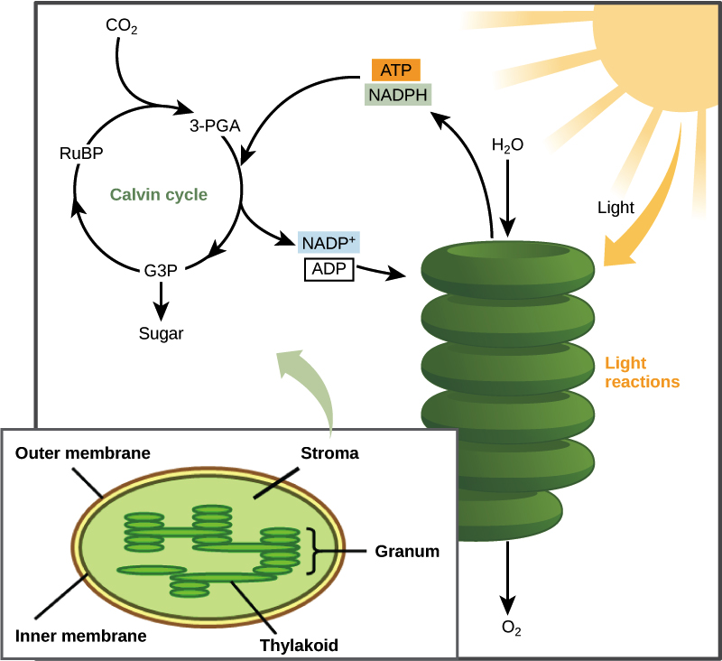

## Photosynthesis is complicated....

 

## Photosynthesis is the basis for most biomass on Earth

 

* **CO~2~ + H~2~0 + light ---> Sugars + O~2~**

 

* **Photosynthesis is an energy pathway**
    + 2 linked reactions
    + light-dependent reaction + Calvin cycle

 

* **Everything takes place in the chloroplast**
    + light reaction = thylakoid membranes
    + Calvin cycle = stroma (liquid portion)

 

* **Light reaction - light energy into chemical energy (ATP & NADPH)**
 
* **Calvin cycle - converts CO~2~ into sugars**

## Chloroplasts: Where the magic happens

## When light hits chlorophyll a few things can happen

## When pigments absorb photons an electron gets excited

## Photosystems (2) convert light energy to chemical energy

**Photosystem = packaging of chlorophyll pigments and proteins in thylakoid membranes**

## Light reactions: make ATP + NADPH for Calvin cycle

 

## 

## Calvin cycle occurs in the stroma

**Calvin cycle = uses the chemical energy stored by the light-dependent reactions to form sugars**

## Calvin cycle is a 3-step process

* **1. *Fixation*: CO~2~ reacts with 5C molecule (RUBP)**
    + catalyzed by Rubisco enzyme
    + new 6C split into two acids (3C each)

 

* **2. *Reduction*: ATP and NADPH convert 3C acids into 3C sugars**
    + reduction of acids (requires electron carrier)
    + requires energy

 

* **3. *Regeneration*: Some 3C sugars recycled to make RUBP (5C)**
    + one 3C sugar leaves to make carbohydrates/sugars
    + recycling step also needs ATP

 

## Making sugars requires several cycles

**Three spins needed to remake RUBP and six spins to make glucose (a 6C molecule) **

## Rubisco - the enzyme that dominates carbon fixation

 
 
 
 
 

* **Most abundant enzyme in the world**

 

* **Most CO~2~ converted into biomass is fixed by Rubisco**

 

* **Large molecule : 16 polypeptides : 8 active sites**

## Rubisco: the slow, clunky and cheating carbon fixer

 
 
 

* **Only 3-10 reactions per second**

 

* **20% error rate**
    + gets worse at high temperatures

 
 

* **Photorespiration - Rubisco cheats on CO~2~ with O~2~**
    + Rubisco does have a higher affinity for CO~2~ via natural selection
    + but.... O~2~ is more prevalent in the atmosphere

<!-- ## C3 photosynthesis how did we get here... -->
<!-- 
 -->
<!--   -->
<!--   -->
<!--   -->
<!--   -->

<!-- 
 -->

<!-- * **Evolution doesn't necessarily create the best solution** -->

<!--   -->

<!-- * **Oxygenation products are completely wasteful** -->

<!--   -->

<!-- * **2x energy to produce the same amount of sugar than if Rubisco just reacted with CO~2~** -->

<!--  
 -->

<!--  -->

## Calvin Benson won a Nobel prize, his TA won best practical joke

