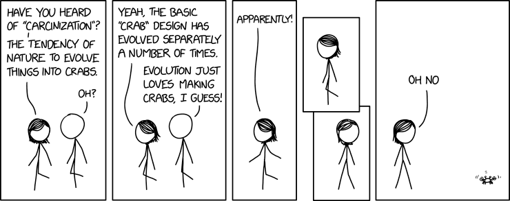
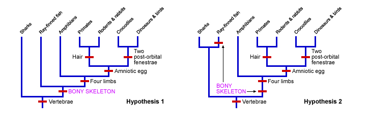

## Connecting classification with systematics

## Connecting classification with phylogeny

## Using phylogeny to trace the relatives of birds

**Each tree is a *hypothesis* about the most likely path of evolution based on the data available**

##
 
 

* **What makes a bird a bird?**

 

* **Shared ancestral character: a trait that is found in the ancestor of a group and all of the derived taxa have the trait**
    + common ancestor for all taxa at *root* of the tree

 

* **Critical innovations = Shared Derived Character**
    + adaptive traits that define new taxa
    + marked with 'slashes' on tree
    + evolutionary novelties to distinguish taxa

## Anatomy of a phylogenetic tree

## 

## How to draw phylogenies: branch shape and length

## How to draw phylogenies: branch shape and length

## Mapping traits on a phylogeny (review *homology*)

## 

## Convergent evolution in marine mammals (analogous traits)

**Aquatic mammals are a large polyphyletic group in the mammal phylogeney**

<!-- ##  -->

<!--  -->

## How to use derived characters to infer phylogeny

## How to use derived characters to infer phylogeny

 
 
 
 

* **Principle of Parsimony = Simplest solution is the likely path of evolution**

 

* **A logical way to identify homologous and analogous traits**

 

* **Minimize the # of evolutionary changes needed to explain your character data** 

## How to use derived characters to infer phylogeny

## Visualizig Parsimony (homology vs analogy)

## Whale Evolution: A Case History

 
 

* **Phylogenetic trees based on morphology place whales outside of the artiodactyl group**

 

* **Artiodactyl mammals = cows, deer and hippos** 
    + hooves with even number of toes
    + unusual pulley-shaped ankle bone

 

* **Astragalus ankle bone is a *shared derived trait* for all artiodactyls**
    + the principle of parsimony, based on this trait, should exclude whales

## Whale Evolution: A Case History

 
 

* **How do we determine evol'n relationships?**
    + morphology - presence/absence of ankle bone
    + DNA sequences - shared gene families

 

* **Depends on what data you have!**
    + poor fossil records made this tricky 

 

* **Modern genetic data now suggests a closer relationship between whales and hippos...**

## Whale Evolution: Whales and Hippos share common ancestor

## 

<!-- ##  -->

<!--  -->
