## The big picture: Plants evolved from green algae

 

* **Cyanobacteria & protist made landfall ~1.2 bya**
    + plants, fungi and animals ~500 mya
    + first forests 385 mya

 

* **Plants evolved from green algae**
    + Several key *'shared traits'*
    + **WHAT DO YOU THINK THEY ARE?**

 

* **Plants support all life on earth**
    + Oxygen to breath
    + food to eat
    + new habitats
    

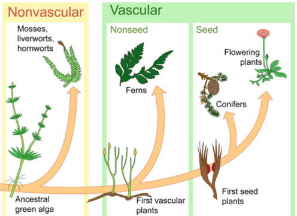

## Protists that share traits with plants

 

* **Dinoflagellates - unicellular aquatic**
    + some are photosynthetic
    + haploid dominate life cycle

 

* **Brown Algae - large multicellular aquatic**
    + AoG life cycle
    + identical haploid and diploid life cycle
    + photosynthetic

 

* **Diatoms - unicellular aquatic**
    + all are photosynthetic
    + diploid dominated life cycle
    

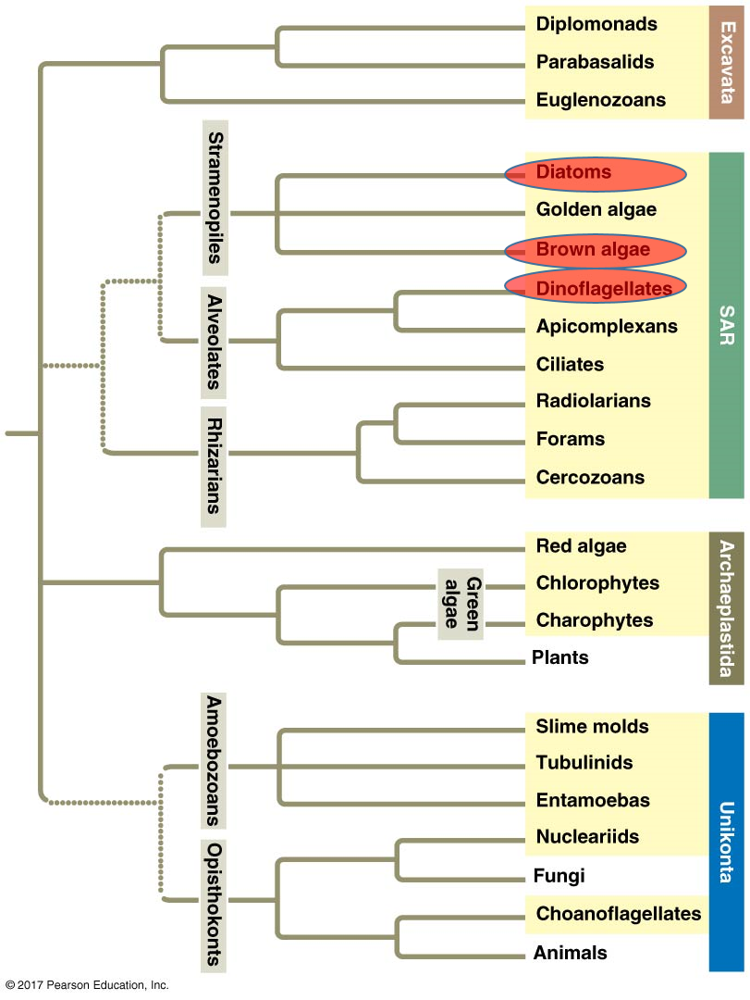

##
 
 
 
 
 
 
 
 
 

**Not ancestral to plants!**

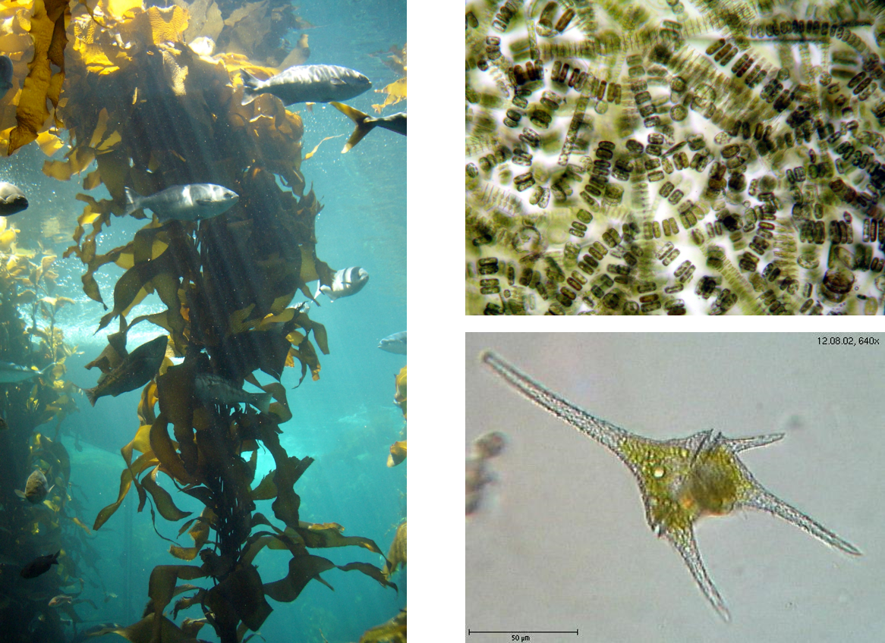

## Green Algae (Oedogonium)

 
 

* **Sister group to land plants**
    + marine and freshwater
    + single and multi-cellular
    + broad, thick filaments
    + some have AoG
    + evolved around ~750mya
    
 

* **Reproductive features:**
    + *Oogonia* = egg containing cell
    + *Antheridium* = sperm containing cell
    

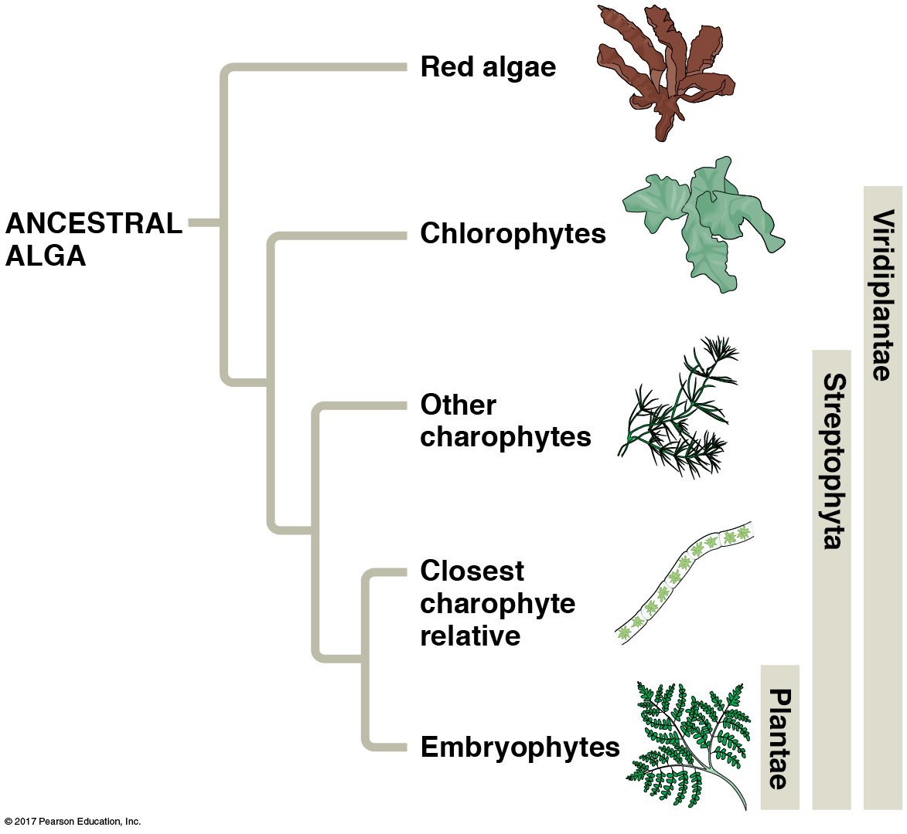

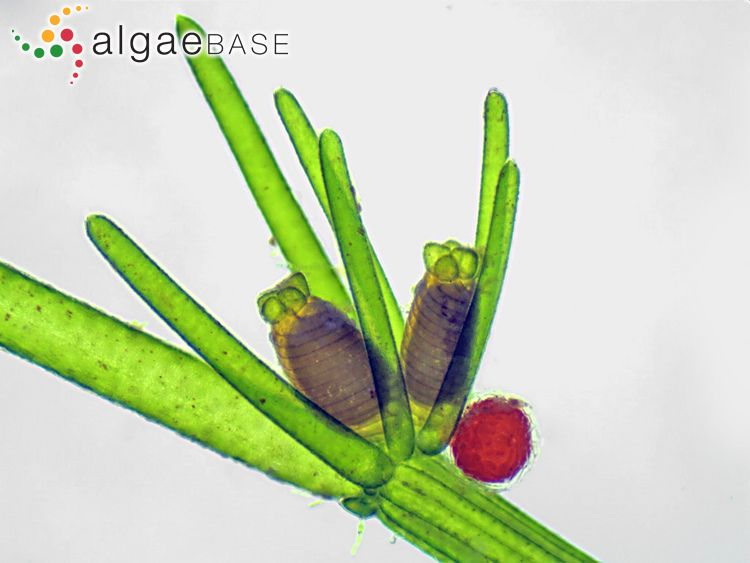

## Molecular evidence points at charophytes as plant ancestors

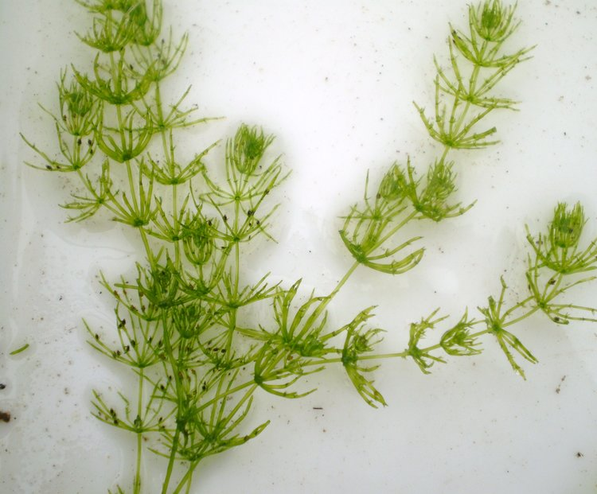

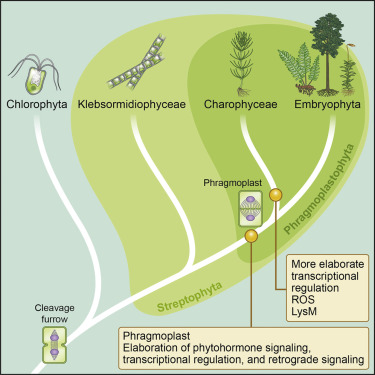

## Charophytes (freshwater green algae)

 

* **Freshwater species**

 

* **Transition from water to land starts with Charophytes**
    + freshwater habitats may have dried
    + a population eventually lived above water line

 

* **More shared traits with land plants:**
    + circular protein rings in plasma membrane
    + make cellulose fibers in cell wall
    + swimming sperm with similar structure
    + phragmoplast (something with cell division)
    + ROS genes
    

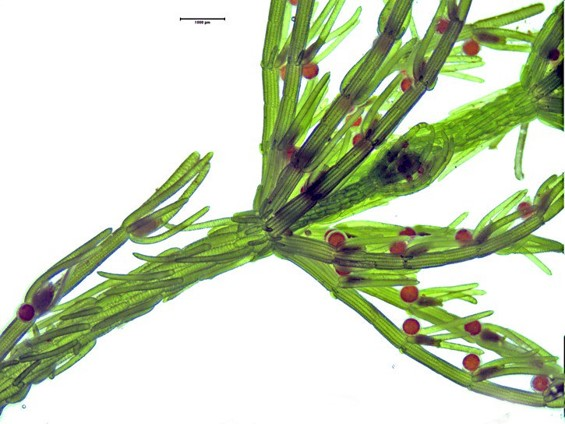

## Living on Land: The Wild Wild West

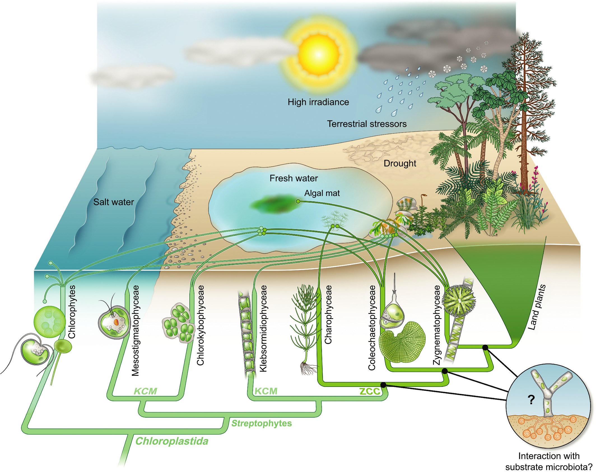

## Land plants are a monophyletic group

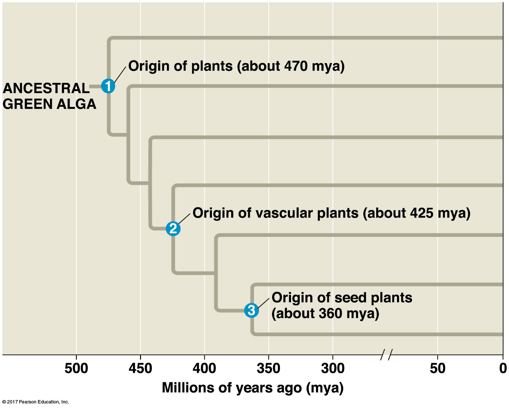

## Shared Traits define plant evolution

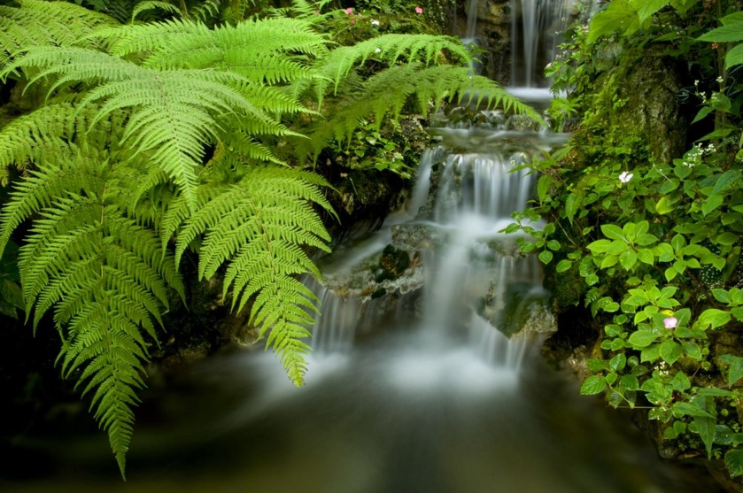

## Multi-cellular, Dependent embryos (placental transfer)

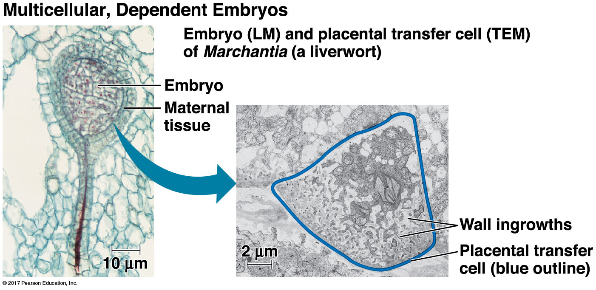

## Waxy cuticle and stomata

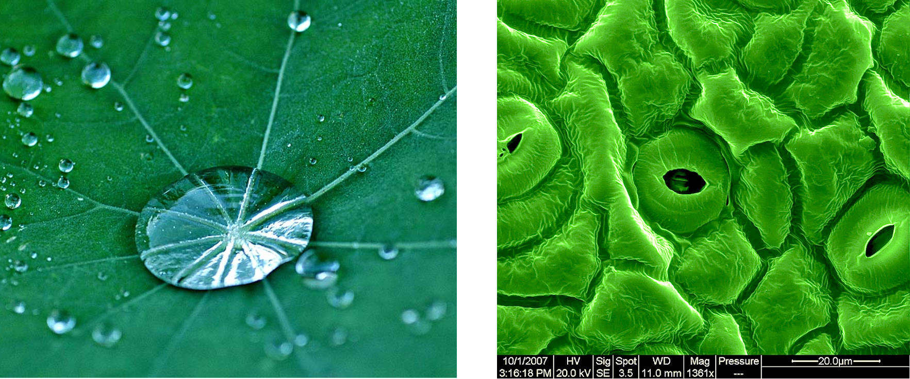

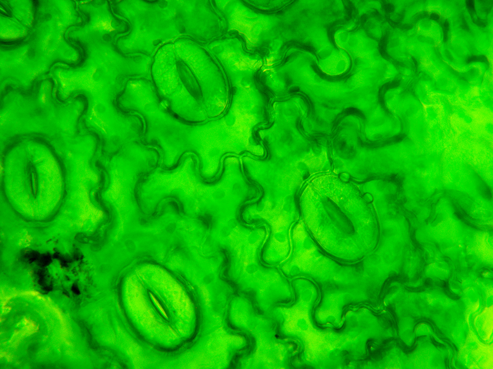

## Multi-cellular Gametangia

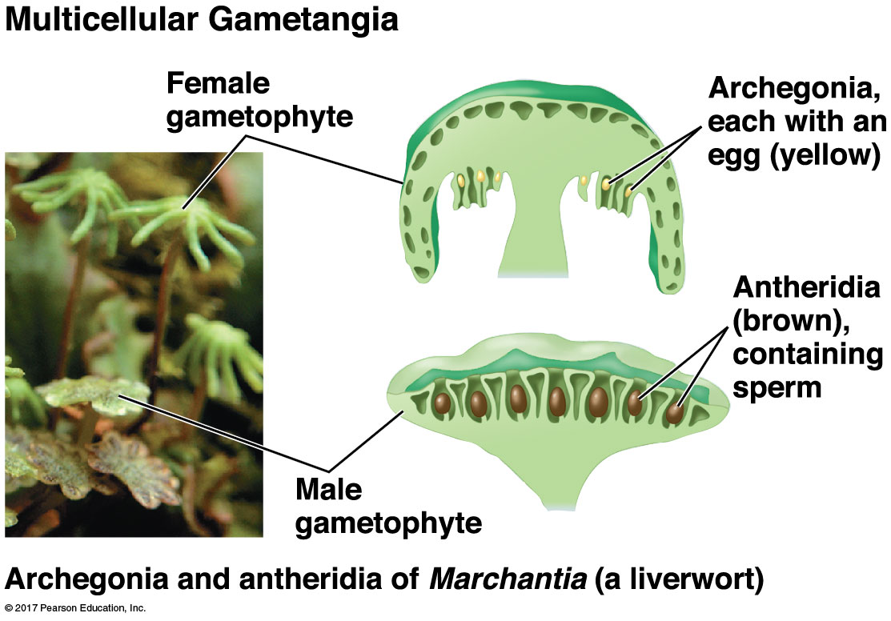

## Photosynthesis with unique pigments (chlorophyll A & B)

## Unique cell walls

 
 
 

* **Cells walls made of cellulose** 
    + not unique to plants
    
 

* **Pectin to fortify cell walls **
    + unique to plants

 

* **Produce cells walls in unique way**
    + at end of mitosis

## Alternation of generations

## Alternation of generations

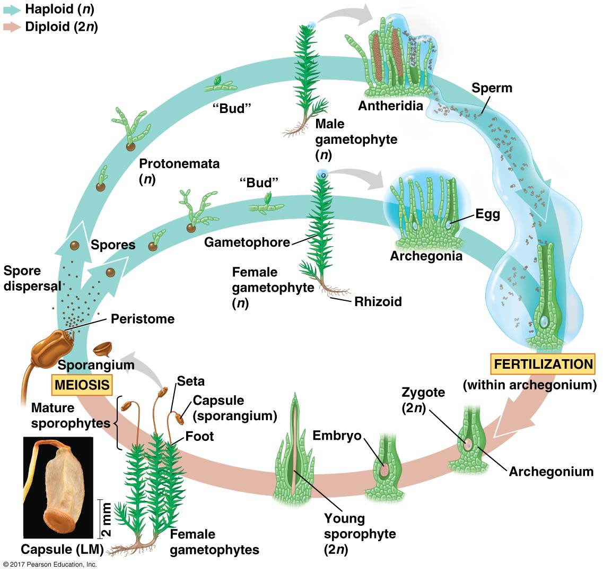

## First plant group: non-vascular bryophytes (mosses)

 

* **Mosses, hornworts and liverworts**
    + Fossils of bryophyte spores ~470mya
    
 

* **Non-vascular; ground hugging carpets**
    + bodies to thin to support height growth

 

* **Have a rhizoid but not a root**
    + anchors plant
    + does not uptake water

 

* **Resistant spores**

## Bryophytes have gametophyte dominated life cycle

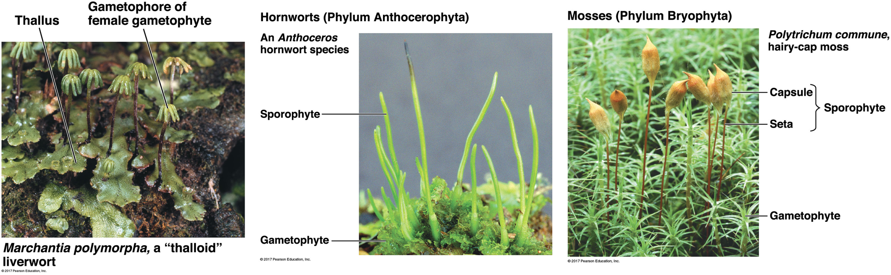

