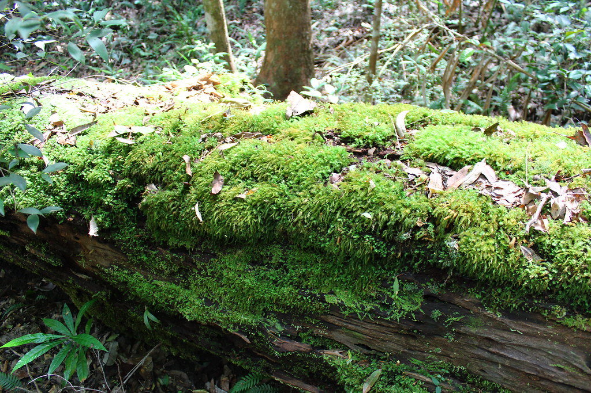

## What organism is the common ancestor to plants?

**Many Protists share traits with plants**

 

* **Dinoflagellates - unicellular aquatic**
    + some are photosynthetic
    + but haploid dominate life cycle

 

* **Brown Algae - large multicellular aquatic**
    + AoG life cycle
    + photosynthetic but use chlorophyll c

 

* **Diatoms - unicellular aquatic**
    + all are photosynthetic
    + but diploid dominated life cycle
    

##
 
 
 
 

**Dinoflagellates**
 
**Brown Algae**
 
**Diatoms**

 

**Not ancestral to plants!**

 

**Secondary endosymbiosis**
 
**for chloroplasts**

## The big picture: Plants evolved from green algae

 

* **Cyanobacteria & protist made landfall ~1.2 bya**
    + plants, fungi and animals ~500 mya
    + first forests 385 mya

 

* **Plants evolved from green algae**
    + several key *'shared derived traits'*

 

* **Plants support all other life on land**
    + oxygen to breath
    + food to eat
    + new habitats for animals
    

## Green Algae (genus = Oedogonium)

 

* **Sister group to land plants (embryophytes)**
    + all are *photosynthetic*
    + marine and *freshwater*
    + single and *multi-cellular*
    + broad, thick filaments (not stems)
    + some have *A.o.G*
    + evolved around *~750mya*
    
 

* **Reproductive features:**
    + *Oogonia* = egg containing cell
    + *Antheridium* = sperm containing cell
    + these 'houses' for egg and sperm are protections from the environment

 

## Molecular evidence points at charophytes as plant ancestors

**Many shared gene families with plants, now that we have the chara genome**

## Charophytes (freshwater green algae)

* **Freshwater species**

 

* **Transition from water to land starts with Charophytes**
    + freshwater habitats may have dried
    + ancestral species partly lived out of water

 

* **More shared traits with land plants:know a few!**
    + circular protein rings in plasma membrane
    + make cellulose fibers in cell wall
    + swimming sperm with similar structure
    + phragmoplast (growth hormone)
    + ROS genes to eliminate free oxygen radicals
    

## Living on Land: The Wild Wild West

**What are the pros and cons of living on land?**

## Land plants are a monophyletic group

## Shared derived traits define land plant evolution

## Multi-cellular, Dependent embryos (placental transfer)

**Fancy botany word for plants = embryophytes**

## Waxy cuticle and stomata

## Multi-cellular Gametangia

**Fancy botany term for sperm and egg houses**

## Photosynthesis with unique pigments (chlorophyll A & B)

## Unique cell walls

 
 
 

* **Cells walls made of cellulose** 
    + not unique to plants
    
 

* **Pectin to fortify cell walls **
    + unique to plants

 

* **Produce cells walls in unique way**
    + at end of mitosis

## Alternation of generations

**Can you draw me yet?**

## Alternation of generations - Homosporous

**Homospory - one type of spore, that germinates into a bisexual gametophyte**

## First plant group: non-vascular bryophytes (mosses)

 

* **Mosses, hornworts and liverworts**
    + Fossils of bryophyte spores ~470mya
    
 

* **Non-vascular; ground hugging carpets**
    + bodies to thin to support height growth

 

* **Have a rhizoid but not a root**
    + anchors plant
    + does not uptake water

 

* **Resistant spores**

## Bryophytes have a gametophyte dominated life cycle

**Early plants, like moss, have sperm that swim from antheridia to archegonia**

##

