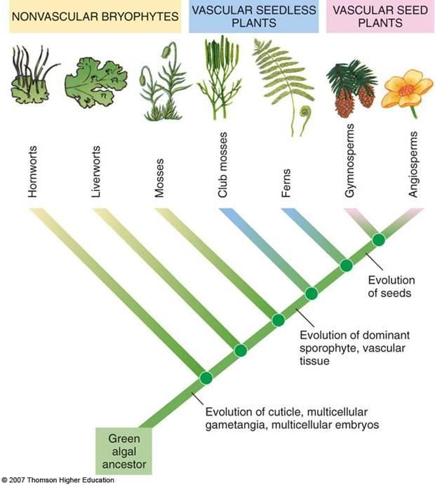
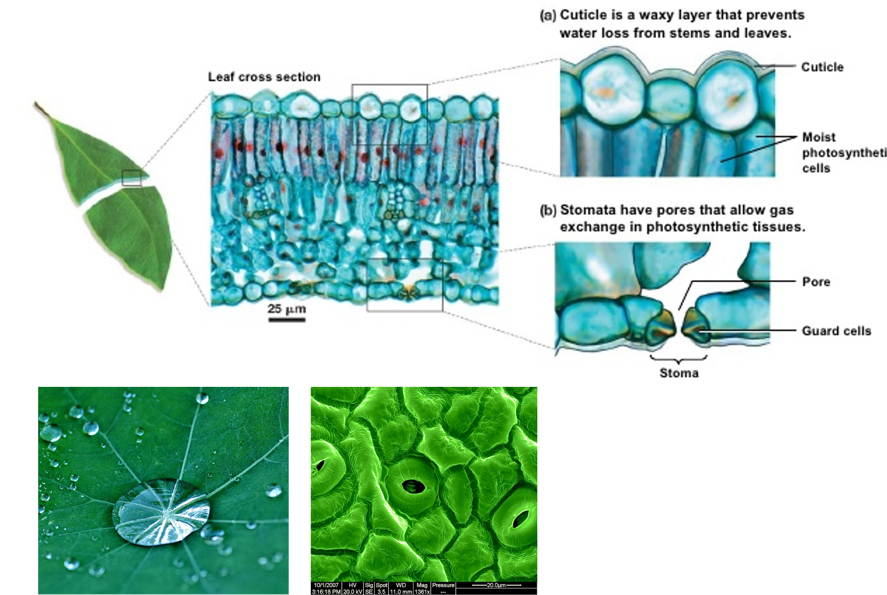

## Green plants are monophyletic

## The big picture: Plants evolved from green algae

 

* **Cyanobacteria and protist existed from 1.2 bya**
    + plants, fungi and animals ~500 mya

 

* **Plants evolved from red and green algae**
    + photosynthetic protists
    + *Key 'synapomorphies' algae &rarr; plants*
    + **WHAT DO YOU THINK THEY ARE?**

 

* **Plants support all life on earth**
    + Oxygen to breath
    + food to eat
    

## Protist &rarr; Garbage Can &rarr; non plant features

 

* **Dinoflagellates - unicellular aquatic**
    + some are photosynthetic
    + haploid dominate life cycle

 

* **Brown Algae - large multicellular aquatic**
    + AoG life cycle
    + identical haploid and diploid life cycle
    + photosynthetic

 

* **Diatoms - unicellular aquatic**
    + all are photosynthetic
    + diploid dominated life cycle
    

##
 
 
 
 
 
 
 
 
 

**These are NOT plants**

## Green Algae (Oedogonium)

 

* **Sister group to land plants**

 

* **Unicelular, multicellular**
    + filamentous, unbranched

 

* **Marine and freshwater**

 

* **Reproductive features:**
    + *Oogonia* = egg containing cell
    + *Antherdia* = sperm containing cell
    

## So what actually makes green plants unique?

 

**Character traits**

 

1. Photosynthesis with unique pigments 
    + (chlorophyll a/b & cartenoids)
2. Store sugars (from photosynthesis) as starch
3. Cells walls made of cellulose 
    + not unique to plants
4. Pectin to fortify cell walls 
    + unique to plants
5. Produce cells walls in unique way
    + at end of mitosis

## Charophytes (freshwater green algae)

 

* **Sister group to land plants**

 

* **Freshwater species**
    + broad, thick filaments
    + haplonic (1N) life cycle

 

* **More developed Oogonium and Antherdium**

 

* **Transition from water to land starts with Charophytes**

##

## Non-vascular derived plant traits

* **The fossil record for land plants begins around ~500mya**
    + green algae begins around ~750mya
    + land plants are monophyletic (one time)

 

* **Non vascular plants evolved first**
    + mosses, hornworts and liverworts
    + small, no developed vascular system
    + must live near water
    + haploid dominate AoG
    
 

**(1) Waxy cuticle:**
 
**(2) Stomata:**
 
**(3) Multicellular Gametangia (whoa)**

##

## 

##

##

