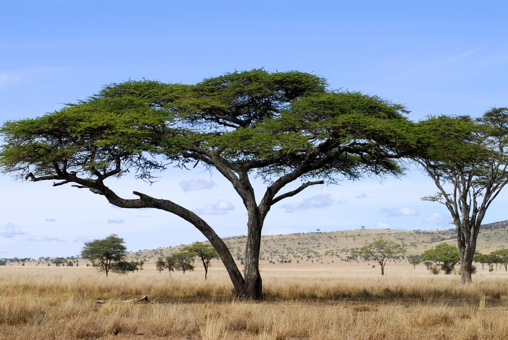
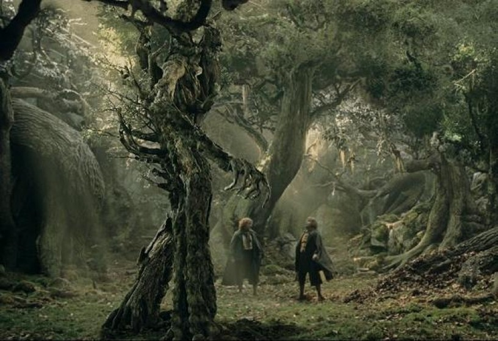
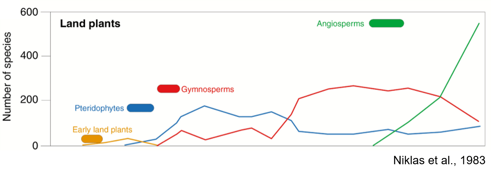
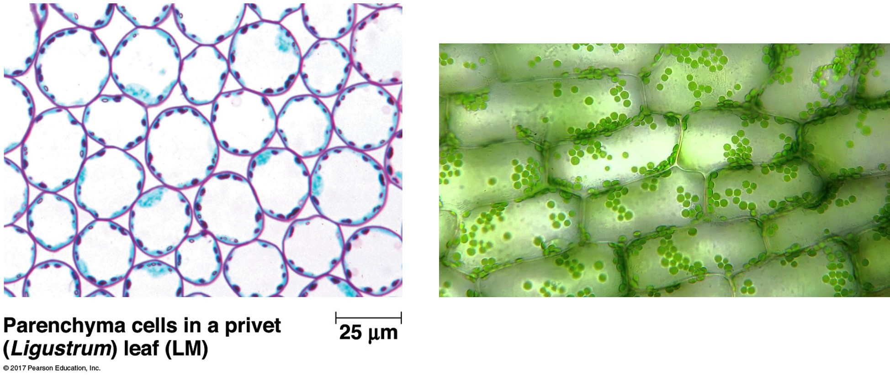
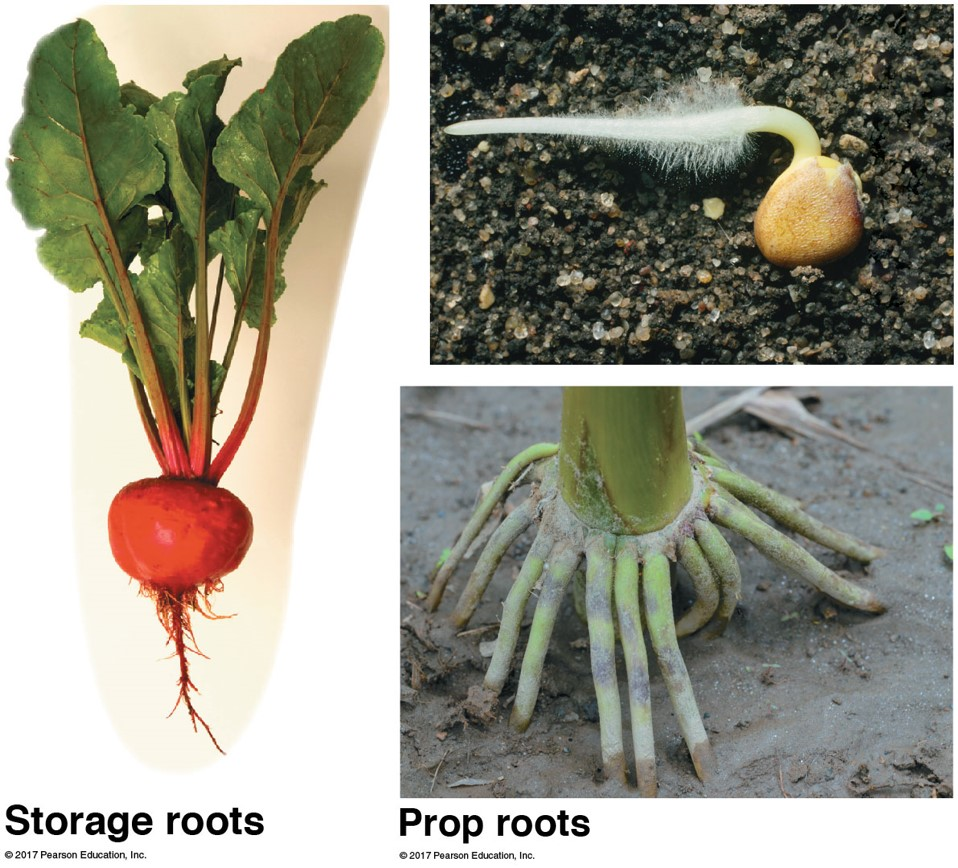
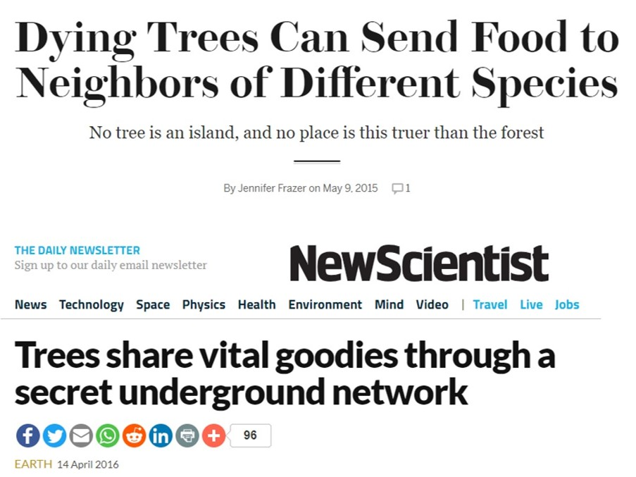
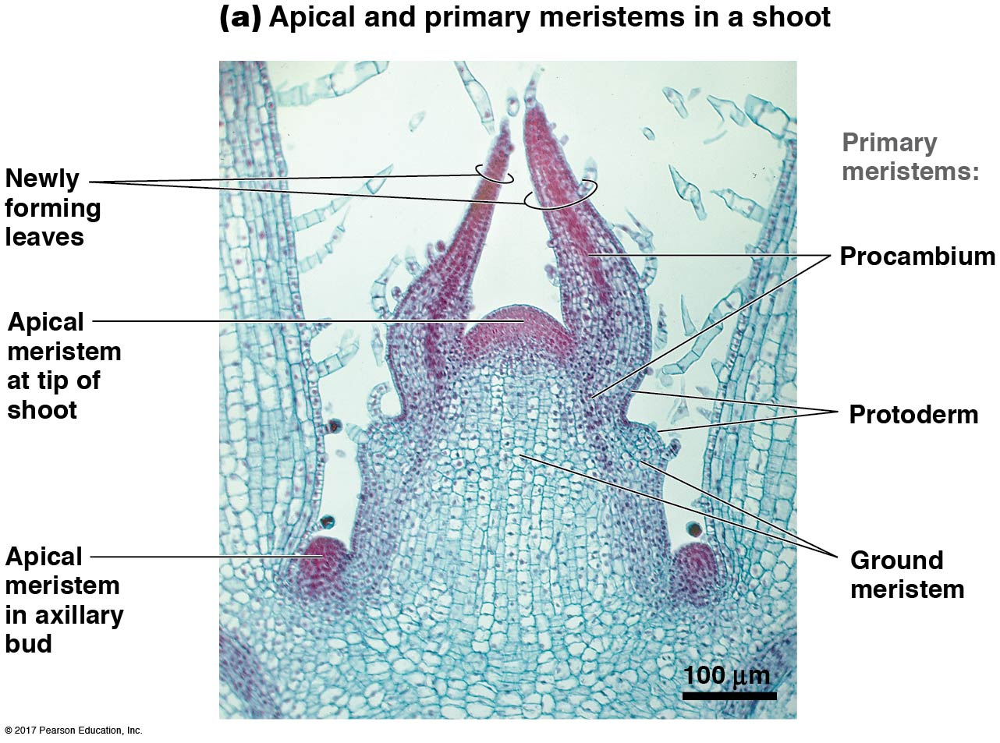

## How do we view plants in the real world?

 

## Are plants as advanced (> or =) as humans?

 

## Plants pull all of this off while...

 

## Plants as sessile organisms

 
 
 
 

* **Mostly defined by their total inability to move**

 

* **Is this a good thing or a bad thing?**

 

* *Their Darwinian struggle for growth, survival and reproduction in very different arenas has resulted in an extremely wide variety of form and function (Diaz et al 2016)*

##

## Themes in vascular plant form

 

* **Plants extract materials from environment**
    * ~18 essential elements
    * soil (most)
    * atmosphere (a few)
    * materials can be limiting

  

* **Above- and belowground body plan**
    * connected via vascular tissues

## Themes in vascular plant form

 

* **Plants extract materials from environment**
    * ~18 essential elements
    * soil (most)
    * atmosphere
    * many materials are limited

  

* **Above- and belowground body plan**
    * connected via vascular tissues
  
  

* **Plants exhibit _indeterminate growth_**
    * "foragers"
    * diversity of sizes & shapes
  

## Diversity in plant form via resource uptake vs support

## Diversity in plant form via evolutionary history

**Derived traits on the plant phylogeny allowed plants to colonize most land surfaces**

## Diversity in plant form via environment (e.g., climate)

## Plants adapt form to persist in different environments

## Plants have 3 tissue systems connecting all plant organs

## How do plants create such dynamic structures? **Cells!**

## Parenchyma cells: living with metabolic function

 
 
 
 
 
 
 
 
 
 
 
 
 
 
 

**Parenchyma cells in leaves = Mesophyll cells**
**Contain chloroplast and carry out photosynthesis**

## Collenchyma (flexible) & Sclerenchyma (rigid) for support

## Vascular tissues: Xylem composed of water conducting cells

 

## Vascular tissues: Phloem composed of sugar conducting cells

 

## Dynamic root growth integral for plant function

## Root morphology is super diverse

## Roots are a member of a living soil community

<!-- ## Root exudation: Who's in charge? -->
<!-- 
 -->

<!--  -->

<!--  -->

## Roots supply nutrients & water for growth & metabolism

 

## Indeterminate growth occurs at meristems (tips)

**Undifferentiated cells divide until they are 'told' what cells to turn into**

## Cambium produce secondary growth (out not up)

**Vascular cambium creates new xlyem and phloem (tree rings) and cork cambium creates cork (bark)**
 

<!-- ## Annual growth rings -->
<!-- 
 -->
<!--   -->
<!--   -->
<!--   -->
<!--   -->

<!--  -->

<!-- 
 -->

<!-- * **Plants record what happens on the planet** -->

<!--   -->

<!-- * **Complete cycle of seasons** -->
<!--     * record atmospheric conditions -->

<!--   -->

<!-- * **Agreement on solar storms on a global scale!** -->
<!--     * Wang et al. 2017. Nature Communications -->

<!--  
  -->

<!-- ## Plant form: building the perfect plant... -->
<!-- 
 -->

<!--  -->
 

