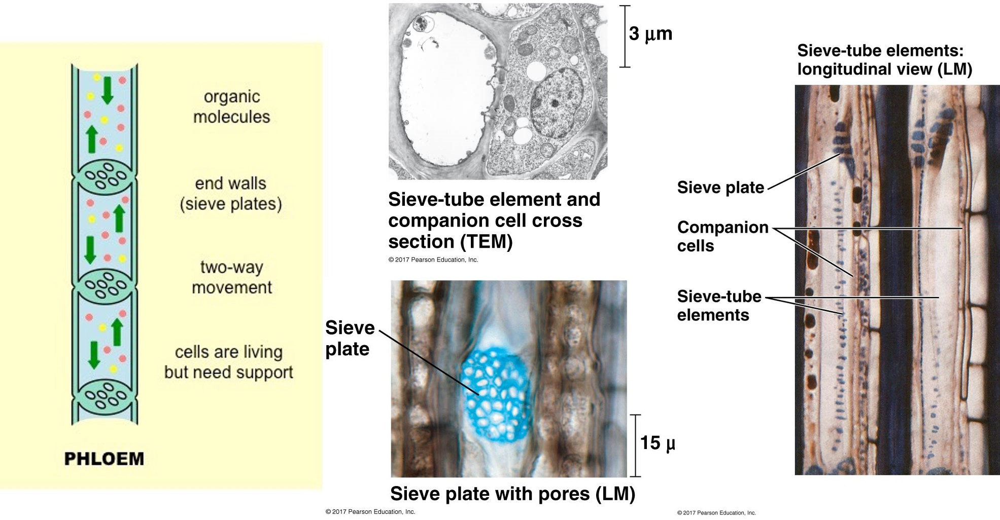

## Plants as sessile organisms

 
 
 
 

* **Mostly defined by their total inability to move**

 

* **Is this a good thing or a bad thing?**

 

* *Their Darwinian struggle for growth, survival and reproduction in very different arenas has resulted in an extremely wide variety of form and function (Diaz et al 2016)*

##

<!-- ## Themes in vascular plant form -->
<!-- 
 -->

<!-- 
 -->

<!-- * **Plants extract materials from environment** -->
<!--     * ~18 essential elements -->
<!--       * soil (most) -->
<!--       * atmosphere (a few) -->
<!--     * these materials can be limiting -->

<!--    -->

<!-- * **Above- and belowground body plan adapted to extract resources** -->
<!--     * connected via vascular tissues -->

<!-- 
 -->

<!--  -->

## Themes in vascular plant form

* **Plants extract materials from environment**
    * ~18 essential elements
      * soil (most)
      * atmosphere
    * many materials are limited

  

* **Above- and belowground body plan adapted to extract resources**
    * connected via vascular tissues
  
  

* **Plants exhibit _indeterminate growth_**
    * "foragers"
    * diversity of sizes & shapes
  

## Diversity in plant form via resource uptake vs support

<!-- ## Diversity in plant form via evolutionary history -->
<!-- 
 -->
<!-- **Derived traits on the plant phylogeny allowed plants to colonize most land surfaces** -->
<!--  -->

## Plants adapt form to persist in different environments

<!-- ## Diversity in plant form via environment (e.g., climate) -->
<!-- 
 -->

<!--  -->

## Plants have 3 tissue systems connecting all plant organs

## How do plants create such dynamic structures? **Cells!**

## Epidermal cells: interact with the environment

**Outermost layer of cells on a plant, forming a protective barrier that covers the entire plant organ**

 
**Aboveground cells = protective barrier, Belowground cells = absorptive surfaces**

## Parenchyma cells: living cells with metabolic function

 
 
 
 
 
 
 
 
 
 
 
 
 
 
 

**Parenchyma cells in leaves = Mesophyll cells**
**Contain chloroplast and carry out photosynthesis**

## Collenchyma (flexible) & Sclerenchyma (rigid) for support

**Although quite different, both cells types provide mechanical support for plants**

## Vascular tissues: Xylem composed of water conducting cells

 

## Vascular tissues: Phloem composed of sugar conducting cells

 

## Plant organs are easy! Leaves, stems and roots

 
 
 

**Plant cells differentiate and organize into specialized tissues (dermal, ground, vascular) that combine to form functional plant organs***

 

**All 3 tissue types are present in each plant organ**

 

**Flowers/Cones are reproductive organs that are highly modified versions of leaves**

## Dynamic root growth integral for plant function

<!-- ## Root morphology is super diverse -->
<!-- 
 -->

<!--  -->

<!--  -->

<!-- ## Root exudation: Who's in charge? -->
<!-- 
 -->

<!--  -->

<!--  -->

## Roots supply nutrients & water for growth & metabolism

 
**Roots uptake resources through osmosis and diffusion (actively/passively)**
 

**Roots can also  faciliate resource uptake by pumping H+ into the soil, which protons bind to negatively charged soil particles, displacing nutrient cations (like K+, Ca2+, Mg2+) into the soil**

## Roots are a member of a living soil community

## Indeterminate growth occurs at tips of stems/roots (meristems)

**Undifferentiated cells divide until gene expression 'tells' them what cells to turn into**

## Cambium produce secondary growth (out not up) in stems

**Stems are mostly vascular tissue, with xylem and phloem forming the main transport system that runs through the plant**
 

**Vascular cambium creates new xylem and phloem (tree rings) and cork cambium creates cork (bark)**
 

## Leaf structure and function = biomass factory

<!-- ## Leaves exchange gases via stomata -->
<!-- 
 -->
<!--   -->
<!-- **CO~2~ IN, O~2~ and H~2~O OUT** -->

<!--  -->

<!--  -->

## Leaves exchange gases via stomata = CO~2~ in, O~2~ and H~2~O out

 
- **CO~2~ enters leaf air spaces and then the chloroplast organelle through a concentration gradient**
 
- **Stomata are not always open....WHY??? **

## Leaf gas exchange impacts the global atmopshere

## Vascular tissues in leaves are confined to veins

 

* **_Transpiration_ (leaf water loss from evaporation) is a by‐product of opened stomatal pores**
 

* **H~2~O transport needs to be sufficient to keep stomata open** 
 

* **Veins represents investment in H~2~O supply**

## Angiosperms have evolved higher vein densities

 

* **Helps explain angiosperm dominance**
 
* **Transpiration alters global climate systems! About 10% of water in atmosphere comes from leaves** 

## Leaf economic theory: Return on Investment

