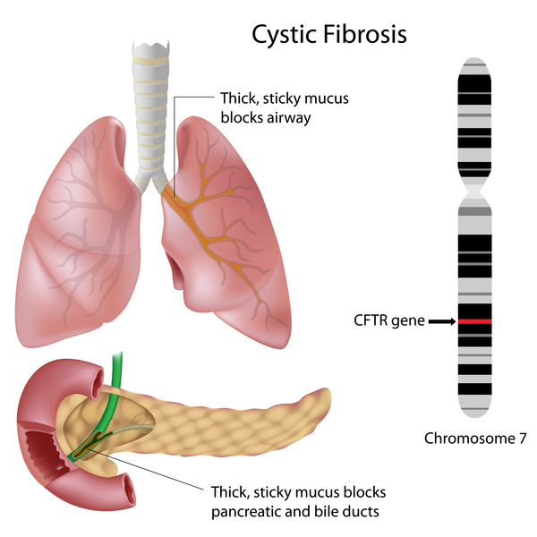
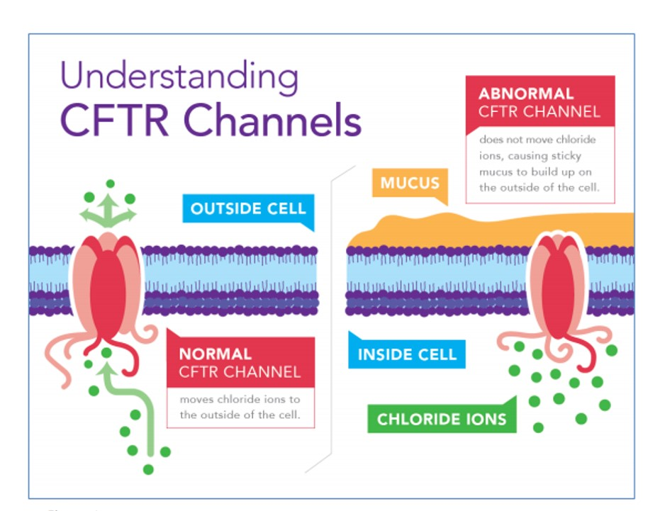
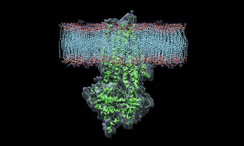
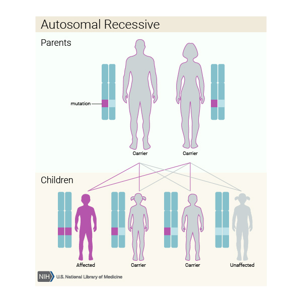
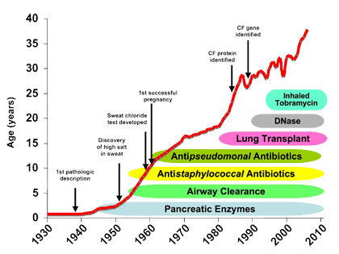
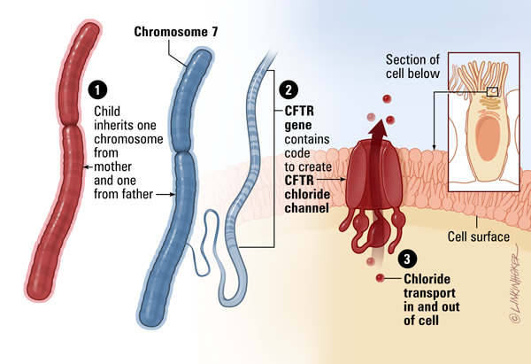
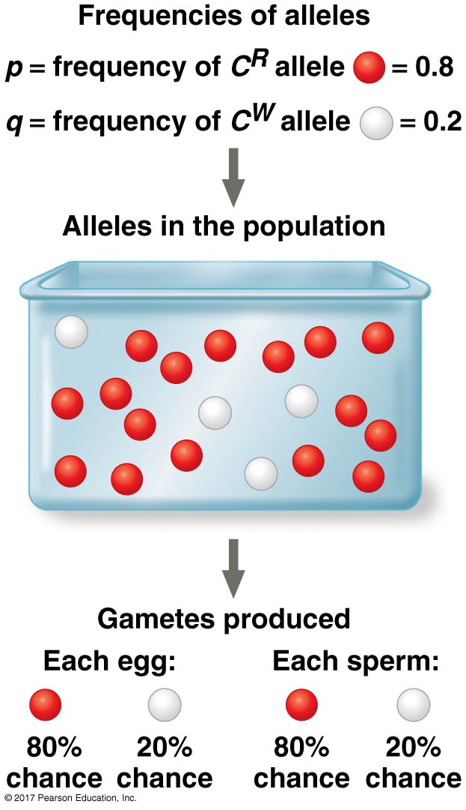

## The smallest unit of evolution: Populations

 
 
 

* **Change in allele frequencies in a population over generations**
    + aka 'Evolution'
    + not the individual
 
 

* **Expression of trait variation**
    + allelic differences among individuals
    + may lead to reproductive success in current environment

    
## Viewing the world via one-locus and two alleles

* **Locus: a region of DNA that encodes for a trait**
    + may be one or many genes

 

* **Allele: a variant of a gene**
    + 'A' = ACTGATCCCGATCCCGATAAATAGG
    + sequence is transcibed into mRNA then translated to red pigment
    
 

* **Other individuals have a different sequence at red pigment locus:**
    + 'a' = ACTGATCCCGATC**TT**GATAAATAGG
    + new allele 'a'gives no pigmentation

 

* **Letters 'A' and 'a' indicate there are two different alleles at this locus in the population**
    + *Homozygous* or *Heterozygous*

## Phenotypic variation reflect genetic variation

 

* **Some heritable phenotypes occur as 'either-or'**
    + red or no pigment
    + single gene locus
    + determined by 2 alleles

 

* **Phenotypes may also be a gradient or determined by many genes**
    + incomplete dominance (homozygous = red/white; hetero = pink)

 

* **Changes in genetic variation provide the raw materials for evolution**
    + Individuals inherit one copy of this locus from mother and father (Diploid)
    

  
## Claire Wineland (1978-2018)

## 

##

## Cystic Fibrous is a genetic disease

 

* **People with CF have inherited 2 copies of the defective CFTR gene**
    + people with only one copy are called carriers, but no disease

 

* **The defective gene is from a 'mutation'**
    + 1,700 known mutations of the disease
    + deletions, early termination codons, point mutations

 

* **Broken CFTR:**
    + misfolded and not in membrane
    + cannot open channel gate
    + insufficient quantites
    

## 
 
 

**Let 'A' = functional CFTR gene**
 
  
**Let 'a' = non-functional CFTR gene**

 

 A and a = different alleles of the CFTR gene

 

 Humans are diplod

 

Three possible genotypes:
AA or Aa or aa

## Cystic fibrosis = autosomal recessive (aa genoptypes)

 
 
 
 

* **In Aa genotypes:**
    + 50% of gametes have A allele
    + 50% of gemetes have a allele

 

* **Cross between Aa and Aa = 1:2:1 ratio in offspring**

## Cystis Fibrosous and Evol'n by Natural Selection

 
 
 

* **Individuals in a population vary with a trait, that has a genetic basis**
    + **Trait = functional or not CFTR gene**

 

* **Variation in trait associated with variation in reproductive success**
    + **CF = life expectancy ~37 years**

## Cystis Fibrosous and Evol'n by Natural Selection

 
 
 
 

* **There will be an increase in frequency of individuals having traits that increased reproductive success in the next generation...**

 

* **CFTR mutation selected against**

## Hardy Weinberg and Cystic Fibrosis

 
 

**Let p = frequency of functional CFTR gene (A)**
 
 
**Let q = frequency of non-functional CFTR gene (a)**

 

**p + q = 1 (100%)**

 

If randomly	putting	genotypes	together:

**f(AA)	=	p^2^; 	f(aa)	=	q^2^; 	f(Aa)	=	2pq**	
 
 
**p^2^	+	2pq	+	q^2^	=	1	(100%)**	

##

## Hardy Weinberg describes a population NOT evolving

## Does Hardy Weinberg occur in nature? .... Kinda

 

* **Allele and genetic frequencies *do* change over time in populations**

 

* **It is common that some loci may be in HW**
    + selection is likely always happening on many loci
 
 

* **Populations often evolve *very* slowly**
    + really low mutations rates
    + makes it hard to detect frequency change in alleles
    
 

* **HW becomes useful to determine the % of a population carrying a specific allele**
    + medical science &rarr: inherited diseases &rarr; Cystis Fibrosis

## If Cystic Fibrosis is not evolving, what can we predict?

**In Switzerland there are 5 people born with Cystic Fibrosis (aa) out of every 10,000 children.**

 

* **q^2^ = **
* **q = **

 

* **What is the frequency of the normal CFTR gene (p)?**

 

* **What percentatge of the Swiss population are carriers?**
    + in other words, what is the frequency of 'Aa' in the population?

 

* **What is the frequency of carriers, who may pass on CF to the next generation?**

