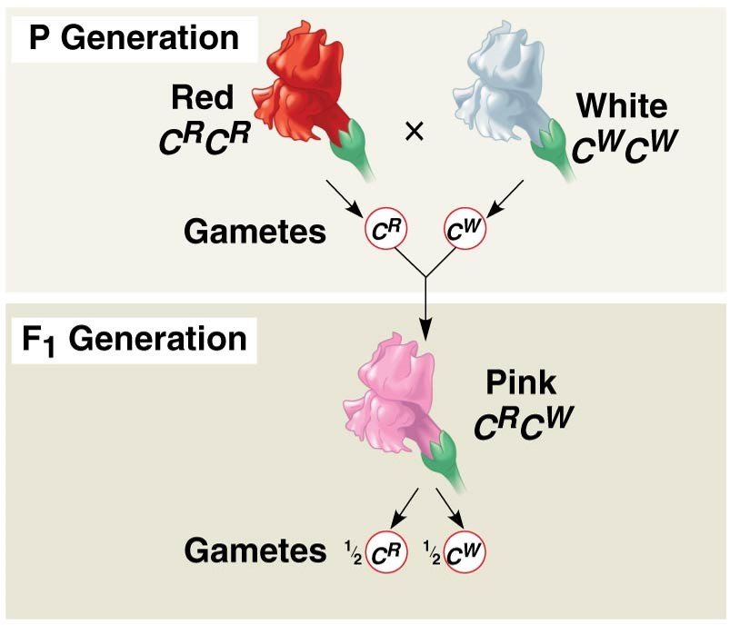

## The smallest unit of evolution: Populations

 
 

* **EVOLUTION: Change in *allele frequencies* in a population over generational time**
 
 

* **What is an ALLELE?**

 

* **Expression of trait variation**
    + allelic differences among individuals
    + may lead to reproductive success in current environment, via selection
    + *allele frequencies* change in populations
    

    
## Viewing the world via one-locus and two alleles

* **Locus: a region of DNA that encodes for a trait**
    + may be one or many genes

 

* **Allele: a variant of a gene**
    + 'A' allele for flower color = ACTGATCCCGATCCCGATAAATAGG
    + sequence is transcibed into mRNA then translated to red pigment
    
 

* **Another allele is possible with a different sequence**
    + 'a' allele for flower color = ACTGATCCCGATC**TT**GATAAATAGG
    + new allele 'a' gives white pigment

 

* **Letters 'A' and 'a' indicate there are two different alleles at this locus in the population**
    + individuals are *Homozygous* (AA or aa) or *Heterozygous* (Aa) 
    + 2 copies on paried chromosomes. *Why 2 copies?*
    
## Phenotypic variation reflects genetic variation

 

* **Some heritable phenotypes occur as 'either-or'**
    + red or white pigment
    + single gene locus, 2 alleles

 

* **Phenotypes may be a gradient or determined by many genes**
    + incomplete dominance 
    + homozygous = red/white; hetero = pink

 

* **Changes in genetic variation, via alleles, provide the raw materials for evolution**
    + inherit one copy of locus from mother & father
    + eg. environment selects flower color phenotypes
    

  
## Claire Wineland (1978-2018)

## 

##

## Cystic Fibrosis is an inherited genetic disease

 

* **People with CF have inherited 2 copies of the defective CFTR gene (autosomal recessive)**
    + people with only one copy are called carriers, but have no disease

 

* **The defective gene is from a 'mutation'**
    + 1,700 known mutations of CFTR
    + deletions, early termination codons, point mutations

 

* **Broken CFTR gene = protein channel not working properly**
    + misfolded and/or not in membrane
    + cannot open channel gate
    + insufficient quantities to lubricate cells
    

## 
 
 

**Let 'A' = functional CFTR gene**
 
  
**Let 'a' = non-functional CFTR gene**

 

 A and a = different alleles of the CFTR gene

 

 Humans are diplod

 

Three possible genotypes:
AA or Aa or aa

## Cystic Fibrosis = autosomal recessive (aa genoptypes)

 
 

* **Fertilization from haploid gametes (1N)**
    + gametes = reproductive cells (sperm and eggs)
    + have only one copy of a chromosome (meiosis)
    
 

* **In Aa genotypes:**
    + 50% of all gametes have A allele
    + 50% of all gametes have a allele

 

* **Cross between Aa and Aa = 1:2:1 ratio in offspring**

## Cystic Fibrosis and Evolution by Natural Selection

 
 
 
 

* **Individuals in a population vary with a trait, that has a genetic basis (Rule 1 & 2) **
    + **Trait = functional or not CFTR gene**

 

* **Variation in trait associated with variation in reproductive success (Rule 3)**
    + **CF = life expectancy ~44 years**

## Cystic Fibrosis and Evol'n by Natural Selection

 
 

* **There will be an increase in frequency of individuals having traits that increased reproductive success in the next generation... (Rule 4)**

 

* **CFTR mutation selected against...**

    
 

* **What should happen to Cystic Fibrosis?**

 

* **Is evolution occurring at the CFTR locus?**
    + how would we detect this in human populations?

## Hardy Weinberg and Cystic Fibrosis

**In a given populations of humans...**

 

**Let p = frequency (%) of functional CFTR gene (A)**
 
 
**Let q = frequency (%) of non-functional CFTR gene (a)**

 

**p + q = 1 (100%)**

 

If randomly	putting	genotypes	together (reproduction):

**f(AA)	=	p^2^; 	f(aa)	=	q^2^; 	f(Aa)	=	2pq**	
 
 
**p^2^	+	2pq	+	q^2^	=	1	(100%)** ---Hardy Weinberg equation	

##

## Hardy Weinberg describes a population NOT evolving

**Allele and geneotype should stay the from one generation to the next**

## Does Hardy Weinberg equilbrium occur in nature? .... Kinda

 

* **Allele and geneotype frequencies *do* change over time in populations**

 

* **It is common for some loci to be in Hardy Weinberg equilibrium**
    + selection is likely not happening on all loci
 
 

* **Populations can evolve *very* slowly**
    + really low mutations rates
    + takes many many generations
    + makes it hard to detect frequency change in alleles from one generation to the next
    
 

* **Becomes useful to predict the % of a population carrying a specific allele**
    + medical science &rarr; inherited diseases &rarr; Cystis Fibrosis

## **In Switzerland there are 5 people born with Cystic Fibrosis (aa) out of every 10,000 children. Assuming the Swiss population is not evolving at the locus for the CFTR gene:**

 

**What is the frequency of broken CFTR allele?**

 

**What is the frequency of the normal CFTR allele?**

 

**What are the expected frequencies of the 3 genotypes of the CFTR gene that determines Cystic Fibrosis in the Swiss population**

 

**Due to modern medicine, Cystic Fibrosis is no longer fatal to children.  Explain how population genetics should/should not be used monitor CF in Swiss people, through time.**

## A population of otters has 336 brown and 64 tan individuals. The brown allele is dominant and the tan allele is recessive. The groundhogs appear to be in Hardy Weinberg equilibrium  at the fur color locus

 

**How many otters in this population are heterozygous?**

 

**One year later, we observed 650 otters in the same location. How many individuals would you expect to be brown, assuming our population did not evolve?**

<!-- ##  -->
<!--   -->
<!--   -->

<!-- **The hard content is from today - pop gen covers 2 lectures** -->

<!--   -->

<!-- **Harder soybean exercise in book, also on Mastering** -->

<!--   -->

<!-- **The practice questions and the Mastering homeworks ?'s = quiz/test material** -->

