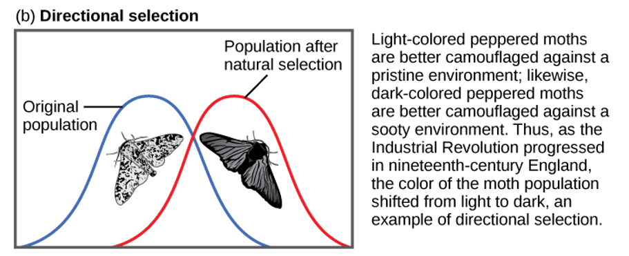
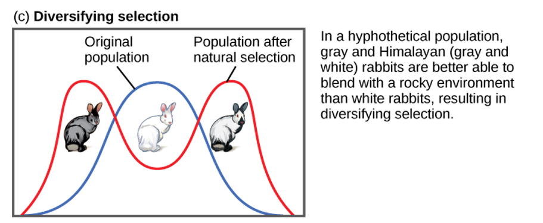
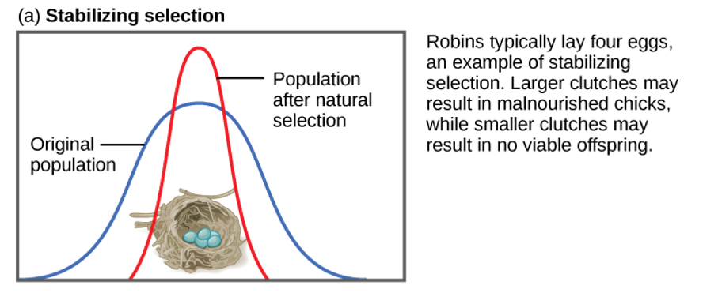

## Things to Know

 
 
 

**#Genetic Drift**

 
 
 

**#Gene Flow**

 
 
 

**#Directional Selection**

## Review: is a population evolving?

 
 
 

* **Re-examine the beetle populations**
    + color: one locus, 2 alleles
 
 

* **Across 2 generations, are allele frequencies the same?**

 

* **Is this population in Hardy Weinberg equilibrium?**

## Hardy Weinberg describes a population NOT evolving

## Allele frequency change in beetles: Mutation

 
 

* **Mutations in the beetle color gene, resulting in more brown**
    + to rare to change allele frequencies on their own
    + require synergy with a another driver (e.g., selection)

 

* **Mutation	rate = probablity that one allele changes to another via mutation**	
    + mutation rates	are	generally	small	(~0.0001%).	
    + humans = 2.5 x 10^-8^ mutations nucleotide^-1^ generation^-1^
    + negligible change from one generation to the next

 

* **Mutation ARE the ultimate source of genetic diversity**
      

## Allele frequencies change in beetles: Genetic Drift

 

* **Genetic drift describes how *allele frequencies may fluctuate unpredictably across generations***
    + happens	in every	population
    + pronounced	in	small	populations
    + extremely	important	evolutionary	“force”

 

* **Reduces genetic variation through the random loss of alleles**

 

* **In a small population, beetles are green or brown**
    + several green beetles get stepped on by Dr. C
    + next generation has more brown beetles, by chance
    + did it matter if alleles were dominant or recessive? or better suited? or helped with mating?

## Hypothetical coin flips to choose 2 alleles

* **Expected frequencies of alleles are just mathematical probability (not certainty)**

 

* **In small populations should we expect the allele frequencies to remain identical across generations?**

## Mechanism of Genetic Drift: Founder Effect

 
 
 

* **Founder Effect: when a few individuals become isolated from a larger population and establish a new population**
    + some alleles are kept, others are lost
    + allele frequencies likely change by chance

 

* **Occurs frequently on islands**
    + what could happen with bad alleles?

## 

## 

## Mechanism of Genetic Drift: Bottleneck Effect

 
 

* **Bottlenecks occurs when *an event drastically reduces a population size, likely altering allele frequencies***
    + sudden change in the environment 
    + fire, flood, invasive species, etc. 
    
 

* **The new gene pool may be different from original population**

 

* **If the population stays small, genetic drift could increase across populations**
    + black robins on Chatham island

## Bottlenecks, species habitat loss, and conservation

## Allele frequencies can change through Gene Flow

 

    
* **Gene flow: exchange of alleles between 2 or more populations**
    + aka 'Gene migration'
    + like mutations but way more frequent

 

* **Occurs when individuals migrate and mate successfully**
    + brown beetles enters population
    + changes allele frequency for color

 

* **Gene flow can be good or bad**
    + may increase genetic diversity
    + may bring harmful alleles

 

* **Does gene flow tend to make populations more or less unique?**

## 

## Allele frequencies change in beetles: Natural Selection

## Only natural selection causes *adaptive* evolution!

 

* **'Sorting' of alleles that favor reproductive success**
    + leads to adaptation at population level
    
 

* **Certain traits lead to greater *Relative Fitness* **
    + individuals with beneficial traits (alleles) will contribute more to gene pool
    + *better survival/reproduction compared to others*
    
 
    
* **More individuals in a population with greater relative fitness means....**

 

* **Natural selection is a 'moving target'...WHY?**

## Natural Selection: selection of heritable traits

## Natural Selection: *Directional selection* of heritable traits

## Natural Selection: *Diversifying selection* of heritable traits

## Natural Selection: *Stabilizing selection* of heritable traits

