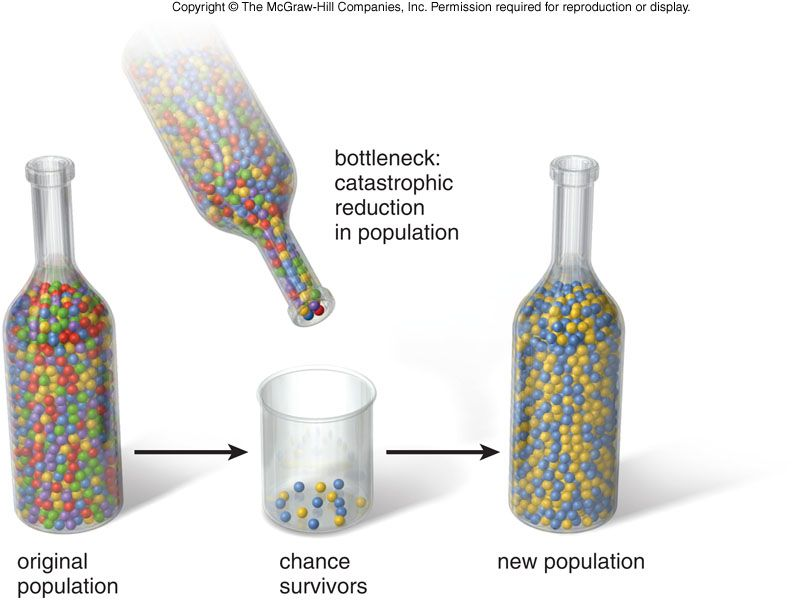
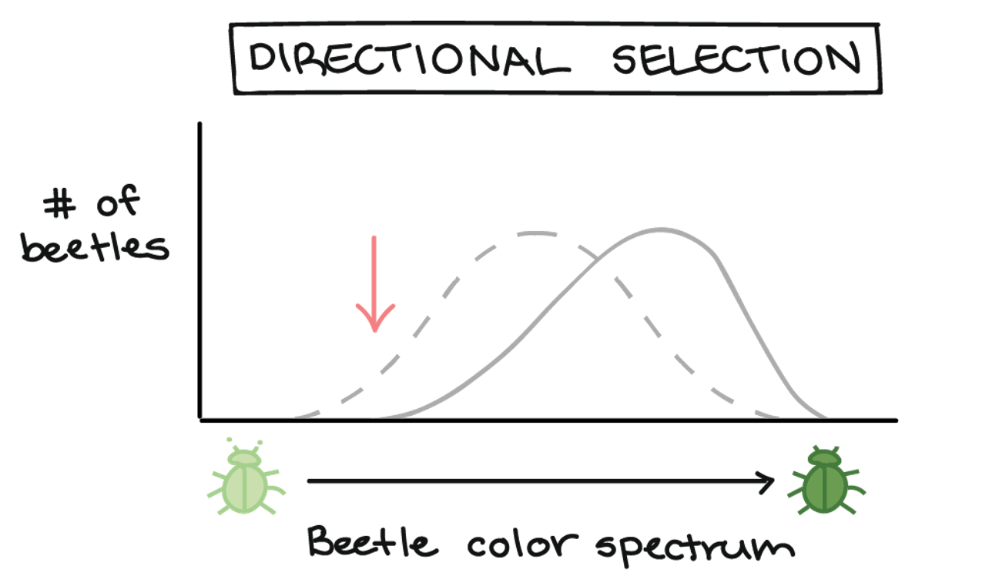

```{r setup, include=FALSE}
knitr::opts_chunk$set(echo = FALSE)
```

## Last time: is a population evolving?
<hr>
<br/>
<br/>
<br/>

<div style="float: left; width: 45%;">

* **Re-examine the beetle populations**
    + color: one locus, 2 alleles
 
<br/>

* **Across 2 generations, are allele frequencies the same?**

<br/>

* **What does this mean?**

</div>


## Hardy Weinberg describes a population NOT evolving
<hr>


## Allele frequencies change in beetles: Mutation
<hr>
<br/>

* **Mutations in the beetle color gene, resulting in more brown**
    + to rare to be considered evolutionary change

<br/>

* **Mutation	rate = **	
    + mutation rates	are	generally	small	(~0.0001%).	
    + humans = 2.5 x 10^-8^ mutations nucleotide^-1^ generation^-1^
    + negligible change from one generation to the next

<br/>

* **Mutation may counterbalance	selection**		
    + selection	against	a	deleterious	recessive	allele (a)
    + but	mutation	from	A	-> a	
    + selection	may not completely eliminate	the	'a' allele
      


## Allele frequencies change in beetles: Genetic Drift
<hr>
<br/>

* **Genetic drift describes how allele frequencies fluctuate unpredictably across generations**
    + happens	in every	population
    + pronounced	in	small	populations
    + extremely	important	evolutionary	“force”

<br/>

* **Reduce genetic variation through the random loss of alleles**

<br/>

* **In a small population, beetles are green or brown**
    + several green beetles get stepped on by Dr. C
    + next generation has more brown beetles, by chance
    + did it matter if alleles were dominant or recessive?


## Hypothetical coin flips to choose 2 alleles
<hr>


## Mechanism of Genetic Drift: Founder Effect
<hr>
<br/>
<br/>
<br/>

<div style="float: right; width: 43%;">

* **Founder Effect: when a few individuals become isolated from a larger population**
    + some alleles make it, others lost
    + non-random

<br/>

* **Occurs frequently on islands**
    + what could happen with bad alleles?

</div>


## 


## 


## Mechanism of Genetic Drift: Bottleneck Effect
<hr>
<br/>
<br/>
<br/>

<div style="float: left; width: 50%;">

* **Bottlenecks occurs after a drastic reduction in population size**
    + sudden change in the environment 
      
<br/>

* **The new gene pool may be different from original population**

<br/>

* **If the population stays small, genetic drift could increase**

</div>



## Bottlenecks and species habitat loss
<hr>


## Allele frequencies change in beetles: Gene Flow
<hr>
<br/>


    
* **Gene flow: exchange of alleles between 2 or more populations**
    + aka 'Gene migration'
    + like mutation but way more powerful

<br/>

* **Occurs when new individual migrates and mates successfully**
    + brown beetles enters population
    + changes allele frequency for color

<br/>

* **Gene flow can be good or bad**
    + may increase genetic diversity
    + bring harmful alleles


## 


## Allele frequencies change in beetles: Natural Selection
<hr>


## Only natural selection causes adaptive evolution!
<hr>
<br/>

<div style="float: right; width: 55%;">

* **'Sorting' of alleles that favor reproductive success**
    + leads to adaptation
    
<br/>

* **Certain traits lead to greater *Relative Fitness* **
    + individuals with good trait will contribute more to gene pool
    + better survival/reproduction compared to others
    
<br/>
    
* **More individuals in a population with greater 'RF' means....**

<br/>

* **Natural selection is a 'moving target'**

</div>


## Natural Selection: selection of heritable traits
<hr>


## 



## 


##


##


