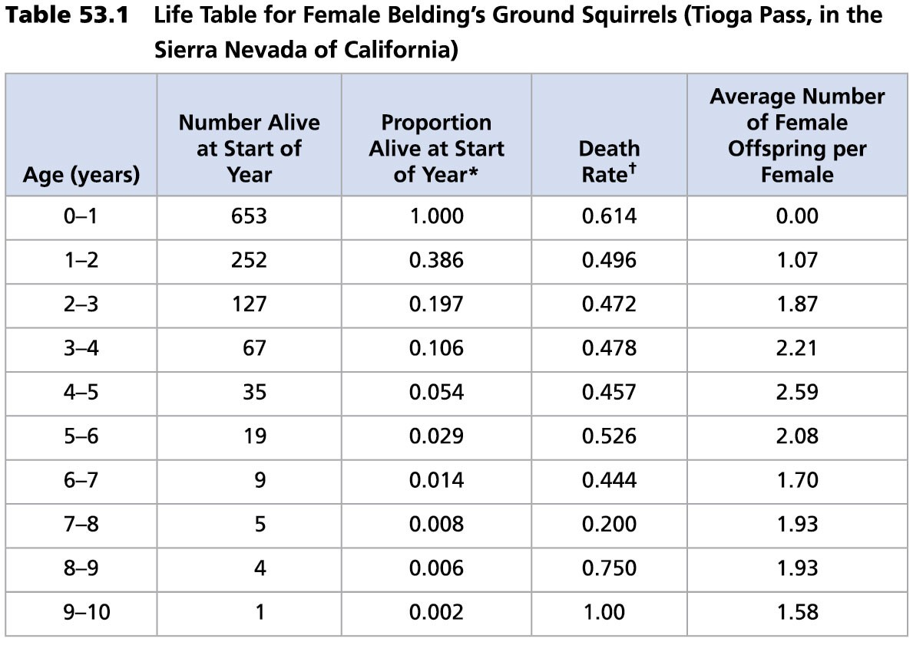
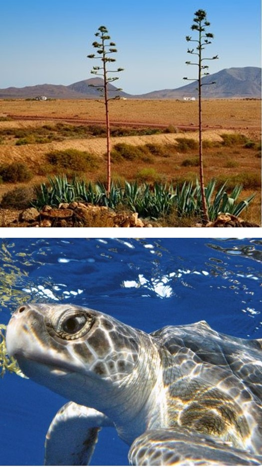

## The big picture: The environment influences populations

 
 
 

* **Review: What is a population?**

 

* **Biotic and abiotic factors affect population dynamics**
    + abundance, dispersion & age structure
    
 

* **Population growth can be 'modeled'**
    + tracking births & deaths
    
 

* **Density (#/area) matters**
    + crowdedness impacts population growth
    

## Populations often described by their boundaries

## Measuring population size and density

 
 

* **May be possible to count all individuals** 
    + large mammals, animals in small habitats

 

* **More often impractical or impossible to count all individuals**
    + indirect estimates are needed
    + dusk deer surveys in Biol 303
    
 

* **Population size and Density is not static**
    + migration in and out of populations
    + births & deaths
    + motility

## Densities vary within a population

**The density of these populations is the same but their ecology differs**

## Tracking population trends through time (demography)

 

* **Reproductive rates vs Survivorship**
    + key for conservation

 

* **Cohorts: group of individuals born at the same time**
    + how many of one age-group *survive* to the next age level?
    + when does reproduction occur? 
    
 

* **Girl power!**
    + only females produce offspring
    + how many *females give rise to new females*`?
    + how many years do females reproduce?
    

## Patterns of survivorship in natural populations

## Populations grow fast when resources are abundant

## Can we predict changes in population size?

 

* **Start with ideal conditions:**
    + few individuals to start
    + non-limiting environment

 

* **Population &uarr; with births & immigration**

 

* **Population &darr; with deaths & emigration**

 

* **Balance of births & deaths at any given time**
    + *per capita* change (r) = 

## Elephants in Kruger National Park (Exponential Growth)

## Resources rarely remain non-limiting 

 
 

* **Carrying capacity (*K*): **
    + as population increases, resources diminish

 

* **Resources that limit are vast**
    + food, shelter, safety, nesting sites
 
 

* **Resource limitation causes birth rate to decline**

 

* **Logistic growth = **

## Trade offs exists between survival and reproduction

 
 
 

* **Frequency of reproduction**
* **Number of offspring**
* **Investment into parental care**

 

**Combined there traits represents an organism's *life history* **
 

1. Age at first reproduction
2. How often reproduction occurs
3. How many offspring are created
    

    

## Trade offs exists between reproduction and survival

 
 
 

* **Frequency of reproduction**
* **Number of offspring**
* **Investment into parental care**

 

**Combined there traits represents an organism's *life history* **
 

1. Age at first reproduction
2. How often reproduction occurs
3. How many offspring are created
    

## Trade offs exists between survival and reproduction

 
 
 

* **Frequency of reproduction**
* **Number of offspring**
* **Investment into parental care**

 

**Combined these traits represents an organism's *life history* **
 

1. Age at first reproduction
2. How often reproduction occurs 
3. How many offspring are created
    

##

## Trade-offs and Life Histories

## Density in populations matter (carrying capacity)

  
  
  

* **Why do populations stop growing?**

  

* **Density dependent factors = crowdedness**
    + resources, predator-prey
    + disease, waste becomes toxic

  

* **Population density works as a negative feedback for predator-prey populations**

## What factors are *density independent*?

    
## Patterns in human population

## Patterns in human population: Age structure

## Patterns in human population: Density and carrying capacity

