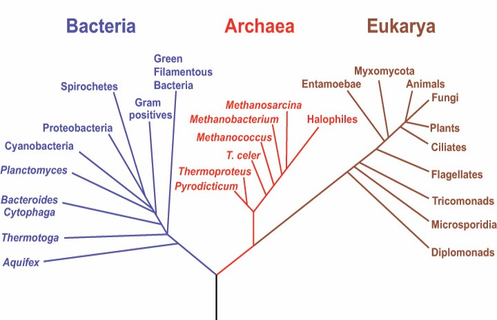
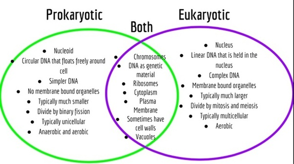
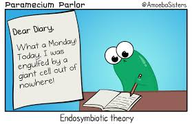
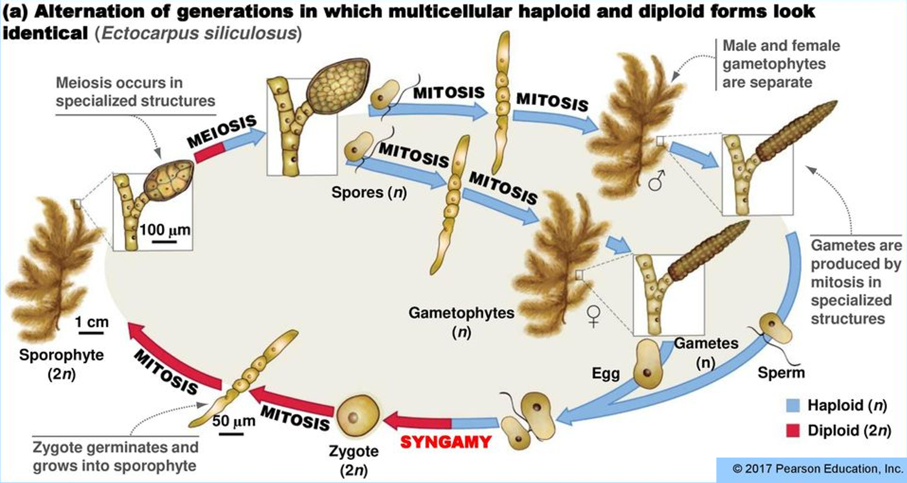

## 

## Protists: The big picture

* **All Eukaryotes are protists except plants, animals and fungi**
    + mostly unicellular
    + amoeba, slime molds, algae, protozoa
    + First undisputed fossils ~2.1 bya

 

* **Extraordinarily diverse**
    + can be smaller than prokaryotes
    + *functions carried out by organelles*
    + *membrane bound nucleus*

 

* **Can be more closely related to other Eukaryotic groups than to other protists ?!?!?**
  + Phylogeny of 'Protista' is broken!
    

## 

## 

## Basic Eukaryotic cell: *Euglena*

## Origin of the nuclear envelope

## Endomembrane system: Outside in or Inside out?

## How did Eukaryotic cells evolve?

 
 
 

* **Origin of mitochondria?**
    + *All* eukaryotic cells have mitochondria, so mitochondria is common ancestor

 

* **Origin of chloroplasts?**
    + Photosynthetic eukaryotes have chloroplasts
    + some from common ancestor
    + others....?

    
## Endosymbiosis Theory

 
 
 

* **Symbiosis** occurs when individuals of two different species live in physical contact

 

* **Endosymbiosis** occurs when an organisms of one species lives inside an organism of another species
    + proposed in 1905 but way too crazy
    + now commonly accepted
    

## Endosymbiosis Theory

## 

## Does data support Endosymbiosis Theory? YES!!!

 

* **Mitochondria and chloroplasts are about the size of an average bacterium**
    + both can self-replicate

 

* **Both organelles replicate by fission, as do bacteria** 
    + have their own ribosomes to make their own proteins
      
 

* **Both organelles have double membranes consistent with the engulfing mechanism**

 

* **Genes of each organelle closely resemble ancestors!**
    + cyanobacteria for chloroplasts
    + proteobacteria for mitrochondria
    
## Red and green algae underwent secondary endosymbiosis

 
 
 

* **Algae ingested by other heterotrophic eukaryotes!**
    + led to Euglenoids, Diatoms and Brown algae

 

* **Chloroplasts transferred to other protists**
    + results in chloroplasts not from common ancestor!

 

* **How do we know this happened?**
    + HINT: # of membranes around organelles = ____
  

## Protists have diverse sex lives

 

* **Haplonic lifecycles**: most life spent with one set of chromosomes
    + zygote only diploid -> meiosis into daughter cells

 

* **Diplonic lifecycles**: most life with pairs of chormosomes
    + sex cels (gametes) are haploid via meoisis -> then fuse
    
 

* **Asexual lifecyles**: binary fision
    + body pinches into 2 parts -> then mitosis

 

* **Alternations of generations**:

## Life cycles in Eukaryotes: Alternation of Generations

 

* **Most complex life cycles include an *alternation of generations***
    + algae → plants

 

* **AOG = the alternation of *multicellular* haploid and diploid generations**
    + diploid (2N) = *sporophyte* = makes spores
    + haploid (1N) = *gametophyte* = male/female = make gametes
    + fertilization of gametes makes new sporophyte

 

* **Some species have structurally different generations (heteromorphic) others have structurally similar generations (isomorphic)**

## Alternation of Generations: Basic Cycle

##

## 

## Protists matters: Ecology

 

