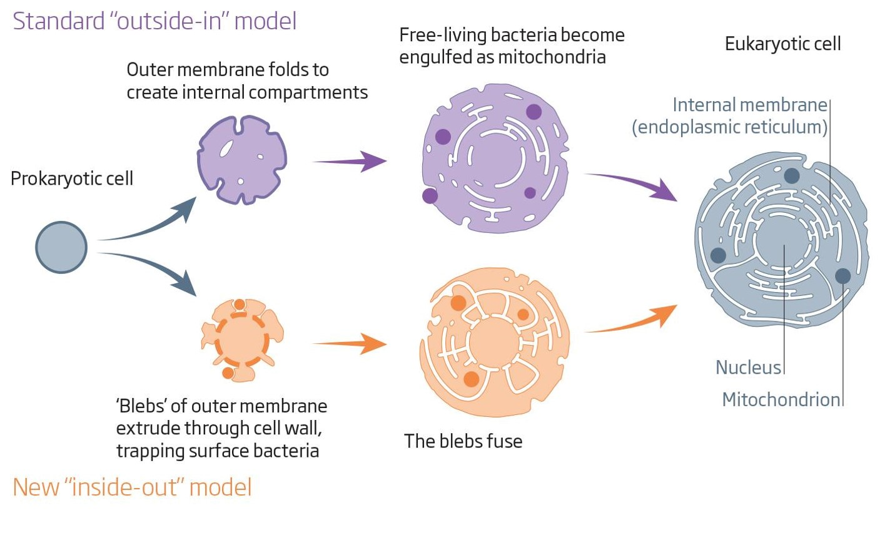

## Van Leeuwenoek: First microbiologist

 
 
 
 

**"For me this was among all the marvels that I have discovered in nature the most marvelous of all, and I must say that, for my part, no more pleasant sight has yet met my eye than this of so many thousands of living creatures in one small drop of water, all huddling and moving, but each creature having its own motion."**

##

## Protists: The big picture

 

* **All Eukaryotes are protists except plants, animals and fungi**
    + mostly unicellular
    + amoeba, slime molds, algae, protozoa

 

* **Extraordinarily diverse**
    + can be smaller than prokaryotes
    +  *functions carried out by organelles*
    +  *membrane bound nucleus*

 

* **First undisputed fossils ~1.8 bya**
    + many have no hard parts
    + spherical algal protists
    + ancestry unresolved

## Tiny Cambrian acritarch Reticella corrugata - 1.7bya

## 

<!--  -->

## Basic protist cell: *Euglena*

## How did Eukaryotic cells evolve?

* **Origin of the nuclear membrane?**

 

* **Origin of mitochondria?**
    + *All* eukaryotic cells have mitochondria 
    + so mitochondria is common ancestor?

 

* **Origin of chloroplasts?**
    + Photosynthetic eukaryotes have chloroplasts
    + some from common ancestor
    + others....?

 

* **Endosymbiosis: Organisms of one species living inside an organism of another species**
    + proposed in 1905 but way too crazy

## How did Eukaryotic cells evolve?

* **Origin of the nuclear membrane?**

 

* **Origin of mitochondria?**
    + *All* eukaryotic cells have mitochondria 
    + so mitochondria is common ancestor?

 

* **Origin of chloroplasts?**
    + Photosynthetic eukaryotes have chloroplasts
    + some from common ancestor
    + others....?

 

* **Endosymbiosis: Organisms of one species living inside an organism of another species**
    + proposed in 1905 but way too crazy

## Endosymbiosis Theory: Origin of eukaryotic cells

<!-- ## Origin of the nuclear envelope/membrane -->
<!-- 
 -->

<!--  -->

## Endomembrane system: Outside in or Inside out?

<!-- ##  -->

<!--  -->

## Does data support Endosymbiosis Theory? YES!!!

 
 

* **Mitochondria and chloroplasts are about the size of an average bacterium**

 

* **Both organelles replicate by fission, as do bacteria** 
    + have their own ribosomes to make their own proteins
      
 

* **Both organelles have double membranes consistent with the engulfing mechanism**

 

* **Genes of each organelle closely resemble ancestors!**
    + cyanobacteria for chloroplasts
    + proteobacteria for mitrochondria
    
## 

## Red and green algae underwent secondary endosymbiosis

 
 
 

* **Algae ingested by other heterotrophic eukaryotes!**
    + led to Euglenoids, Diatoms and Brown algae

 

* **Chloroplasts transferred to other protists**
    + results in chloroplasts not from common ancestor!

 

* **How do we know this happened?**
    + HINT: # of membranes around organelles = ____
  

##

## *Euglena*: chloroplast with triple membrane

## Eukaryotes have diverse sex lives

* **Haplonic life cycles**: most life spent with one set of chromosomes
    + zygote only diploid &rarr;  meiosis into daughter cells
    + some multi-celluar algae, fungi

 

* **Diplonic life cycles**: most life with pairs of chromosomes
    + sex cells (gametes) are haploid via meiosis &rarr; then fuse
    + animals
    
 

* **Asexual life cycles**: binary fission
    + body pinches into 2 parts &rarr; then mitosis
    + many-single celled protists

   

* **There are more....Read about *Paramecium* in text book**
    + parasites require hosts...

## Life cycles in Eukaryotes: Alternation of Generations

 

* **Most complex life cycles include an *alternation of generations***
    + some algae and plants
    + both generations must be multi-cellular

 

* **AOG = the alternation of *multi-cellular* haploid and diploid generations**
    + diploid (2N) = *sporophyte* &rarr; makes spores
    + haploid (1N) = *gametophyte* &rarr; male/female &rarr; make gametes
    + fertilization of gametes makes new sporophyte

 

* **Some species have structurally different generations (heteromorphic) others have structurally similar generations (isomorphic)**

## Alternation of Generations: Basic Cycle

##

## 

## Protists matters: Ecology

 

