## Seed plants were the most recent evolutionary step

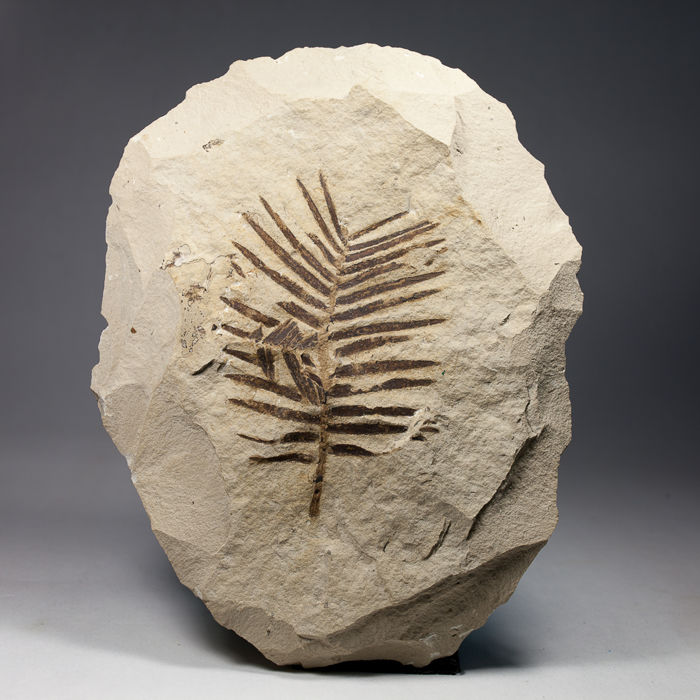

## The big picture: We now live in a seed plant world

 

* **Seeds changed the course of plant evolution**
    + Gymnosperms evolve ~360 mya
    + climate became drier = selection pressures
    + *Elkensia* first fossil seed plant
    
 

* **Seeds consist of embryo & nutrients**
    + surrounded by protective coat
    + seeds can be dispersed long distances
    + supply of stored food

 

* **2 living seed lineages**
    + gymnosperms (naked seed)
    + angiosperms (covered seed)
    

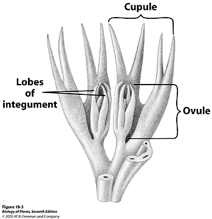

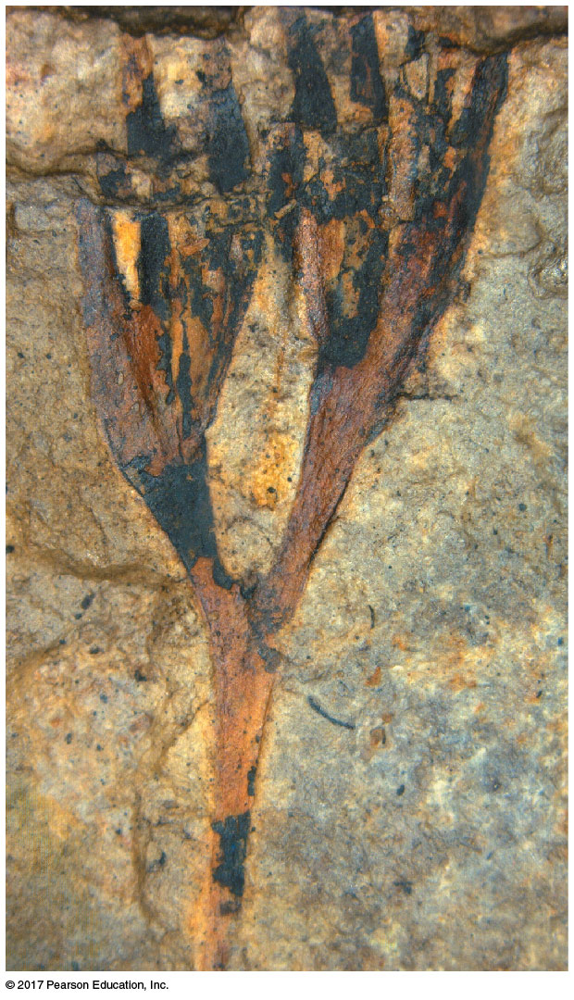

## Why seeds matter so much...

 

* **Before seeds, spore was only protective structure** 
    + allowed long-distance dispersal but...
    + dependent young embryo still left exposed

 

* **Seeds include multi-cellular endospore = food tissue**

 

* **Embryos can remain dormant for a long time inside seed coat**

 

* **Gymnosperms:** seeds exposed on sporophylls, form cones
* **Angiosperms:** seeds enclosed inside ovary of fruit

## Seed plants further adapt to life on land

* **Miniaturization of gametophyte**
    + mosses &rarr; ferns &rarr; seed plants
    + gametophyte became microscopic

 

* **Heterosporous life cycle only**
    + *2 kinds of spores*
    + form male or female gametopytes

 

* **Ovules (protect female gametophyte)**
    + ovule contains female spores
    
 

* **Pollen (protect male gametophyte)**
    + male spores develops into pollen grain

    

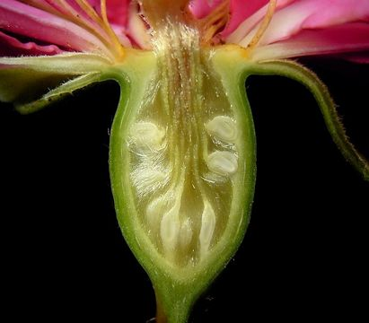

##

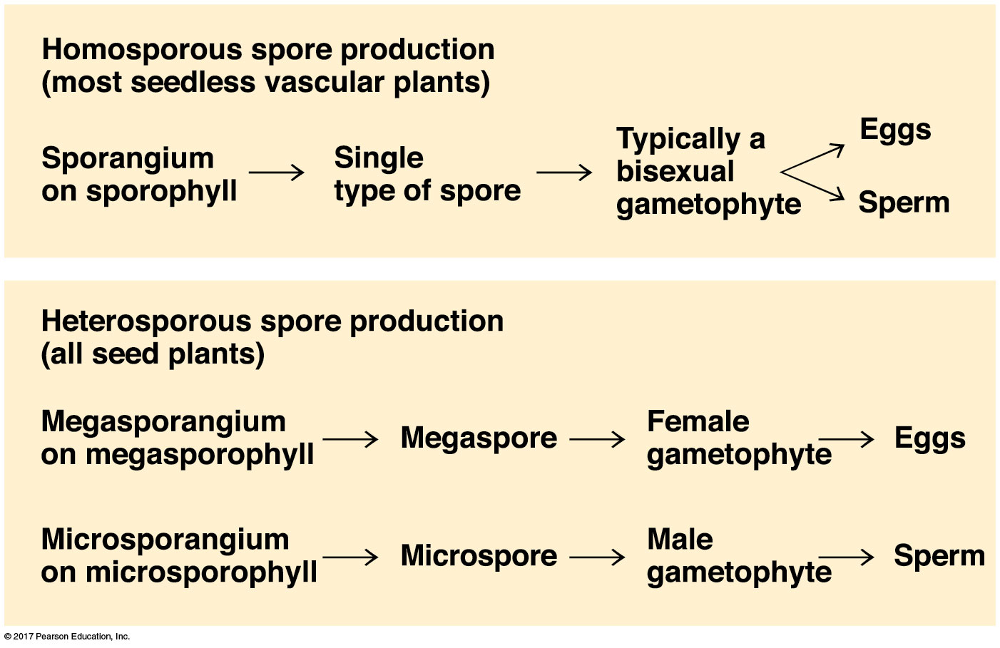

<!-- ## Evolution of gamtetophyte-sporophyte relationship -->
<!-- 
 -->

<!-- 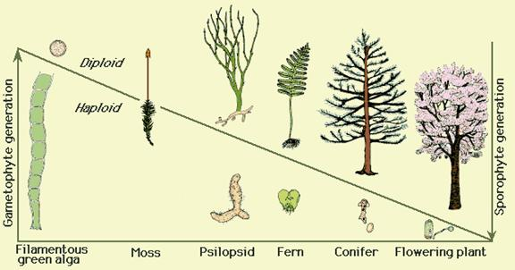 -->

##

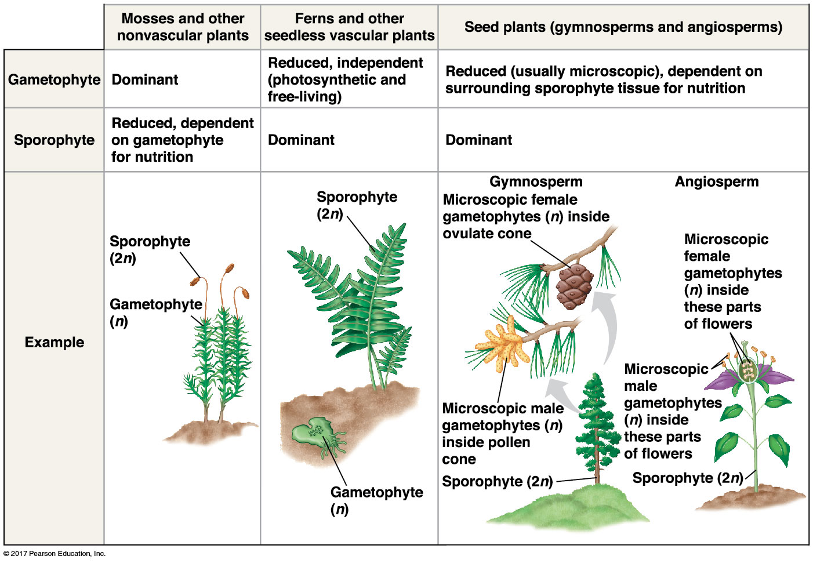

<!-- ## Gymnosperms take over -->
<!-- 
 -->
<!--   -->
<!--   -->

<!-- 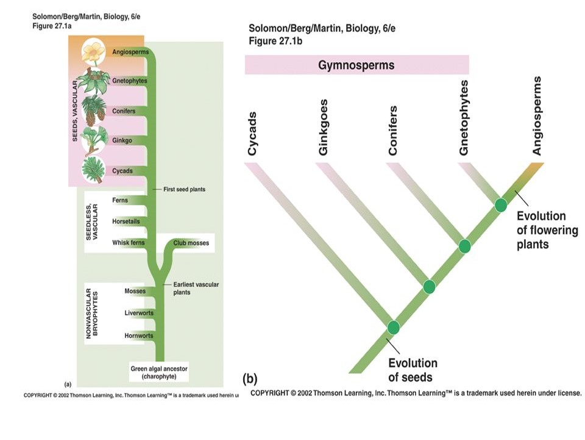 -->

<!-- 
 -->

<!-- * **Seed plant ancestors extinct** -->
<!--     + oldest fossils in Carboniferous -->

<!--   -->

<!-- * **~300-250 mya climate become drier** -->
<!--     + Carboniferous &rarr; Permian -->
<!--     + gymnosperms replaced lycophytes -->

<!--   -->

<!-- * **Gymnosperms with thin needles thrived till ~ 60 mya** -->
<!--     + earliest evidence of insect pollination with gymnosperms -->

<!-- 
 -->

## 4 living lineages of gymnosperms

* **Cycads**: 300 living species
    + earliest evidence of insect pollination
    + Cycads and dinosaurs lived together

 

* **Gnteophytes**: small and super weird group
    + source of ephedrine

 

* **Ginkos**: *Ginkgo biloba* is only species left!
    + super common street tree
    
 

* **Conifers**: ~600 species (cones)
    + evergreen and deciduous
    + leaves are needles or scales

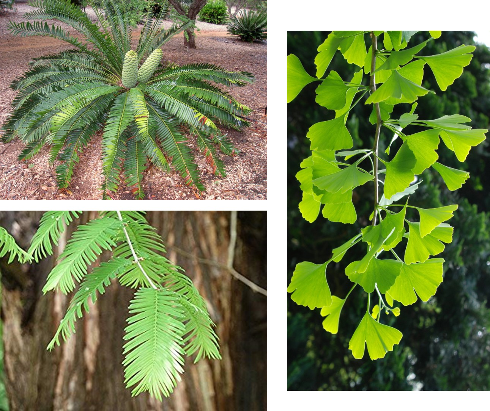

## Welwitchia: the weirdest f'in plant on Earth

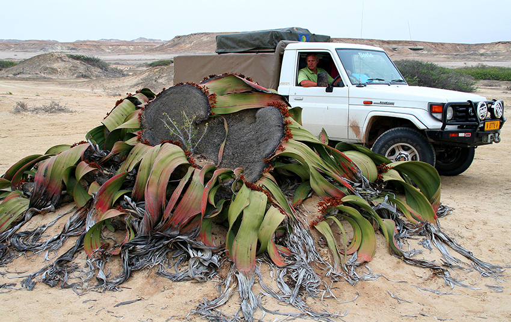

## Gymnosperm reproduction: everything happens on cones

 
 

* **Male and female cones on same plant (mostly)**
    + cone scales &rarr; modified leaves &rarr; sporophyll
    + sporophyll &rarr; sporangia &rarr; spores
    + pollen (male) and ovulate (female) cones

 

* **Male cones house microsporangium**
    + microsporangium produces microspores
    + microspores develop into pollen grains
    + microgametophyte inside pollen grain
    + pollen dispersed by wind
    + *male cones usually on bottom of tree*

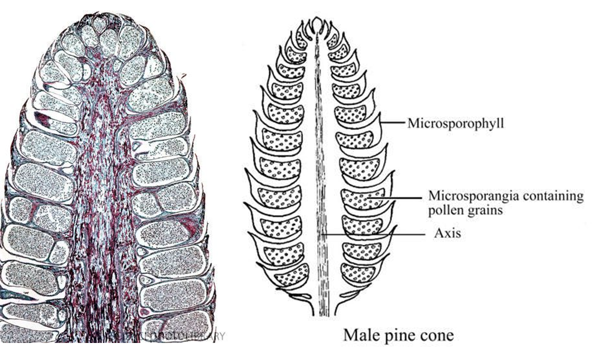

## Gymnosperm reproduction: everything happens on cones

 

* **Female cones have 2 ovules per scale**
    + each ovule has megasproangium
    + megasporangium produce megaspores
    + megaspore develops megagametophyte with egg

 

* **Pollen grain reaches ovule and germinates**
    + pollen tube grows toward megaspore
    + sperm &rarr; pollen tube &rarr; egg (no water!)
    + seed forms, dispersed by wind

 

* **Gymnosperm reproduction requires wind pollination**
    + very inefficient, so lots of pollen produced

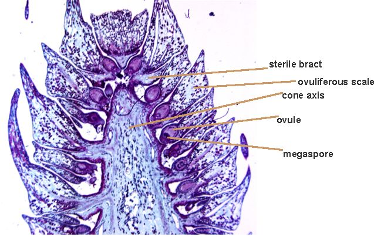

##

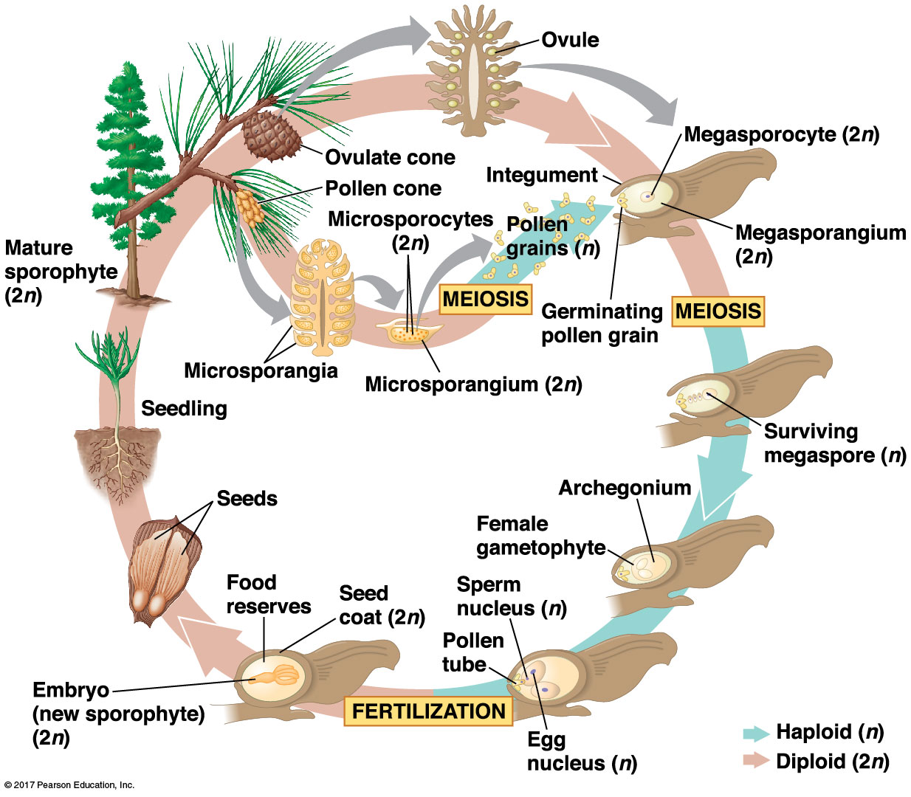

##

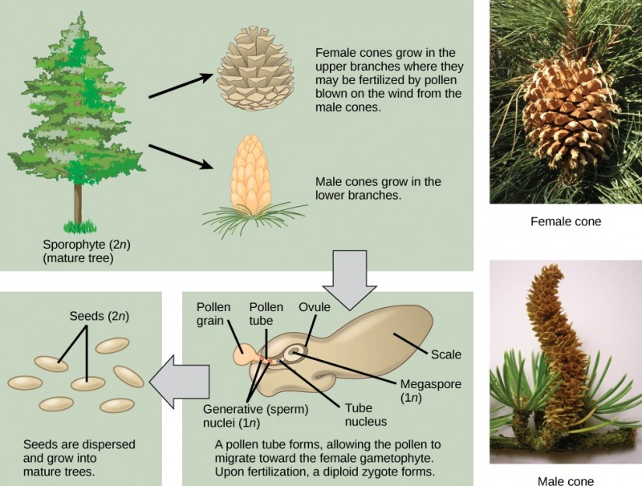

<!-- ## Gymnosperms seeds -->
<!-- 
 -->

<!-- 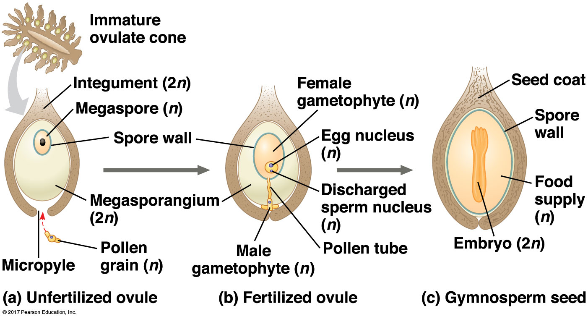 -->

## Flowering plant diversity

 

* **Most diverse living group of plants**
    + 14,000 genera, >250,000 species
    + >90% of plant diversity

* **2 classes: Monocots and Dicots**
    + monocots = one seed leaf in embryo
    + dicots = two seed leaf in embryo

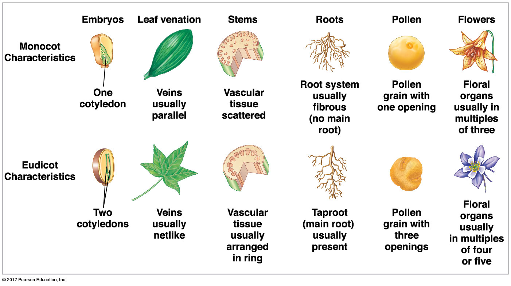

## Angiosperm evolution: pollination (plants + insects) 

**Insect pollination improves on inefficient wind pollination in conifers**

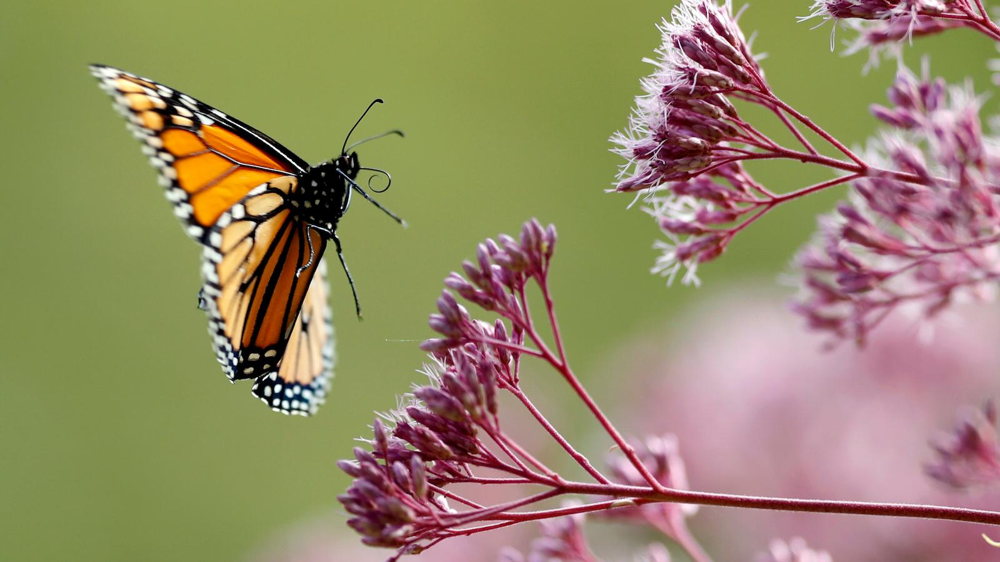

## Angiosperm reproduction: everything happens on flowers

 

* **Flower is a modified stem for reproduction**
    + with 4 types of modified leaves

 

* **Sepals: leaves at base which enclose flower**
    + usually green

 

* **Petals: colored leaves to attract pollinators**
    + less colored if wind pollinated
    
 

* **Two types of fertile organs to make spores**
    + sporophylls (male and female)
    

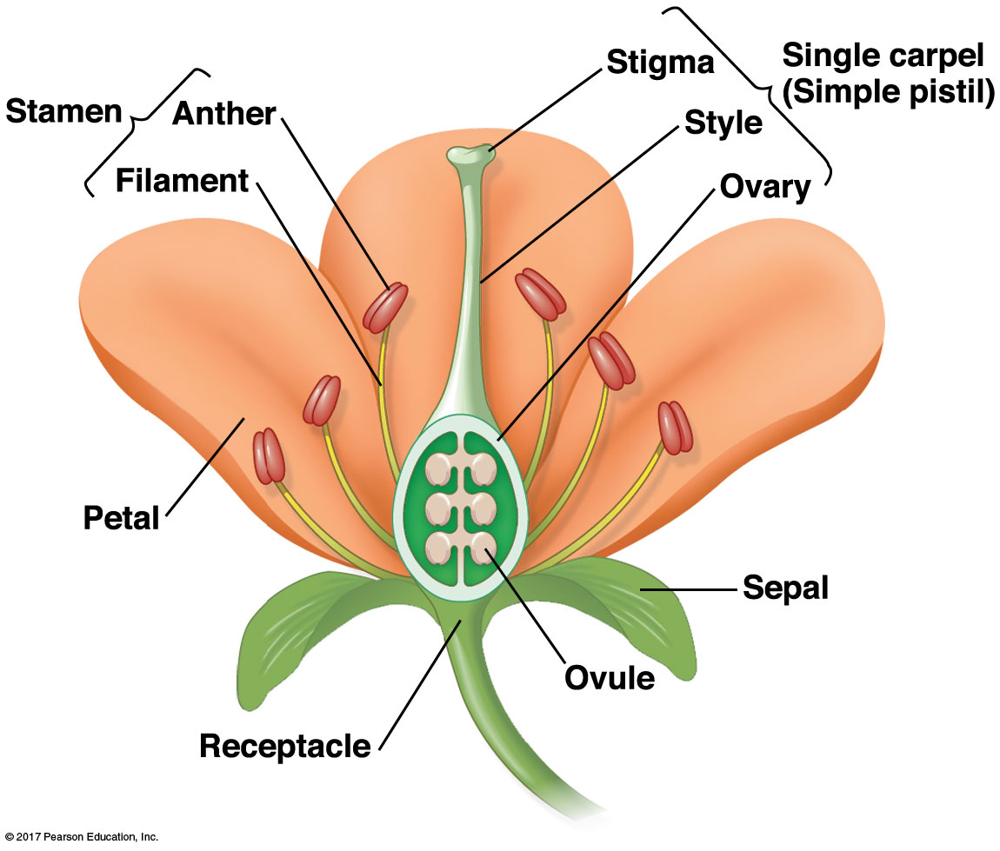

## Flowers - Male

 
 

* **Stamens: microsporophylls**
    + produce microspores that develop into pollen
    
     

* **Anther: where microsporangia develop**
    + microspores produced
    + microspores &rarr; pollen
    + pollen &rarr; male gametophyte

 
    
* **Filament: stalk that holds the anther**

## Flowers - Female

 

* **Carpel: megasporophyll**

 

* **Stigma: receives pollen**
    + sticky

 

* **Style: leads from stigma to ovary**
    + where pollen tube forms
    
 

* **Ovary: contains ovules**
    + megasporangium inside ovule produces megaspores
    + megaspore develops into female gametophyte w/ egg
    + after fertilization, ovary becomes 'fruit'

## Angiosperm reproduction: double fertilization

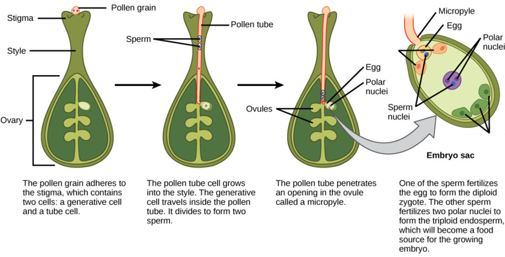

<!-- ## -->

<!-- 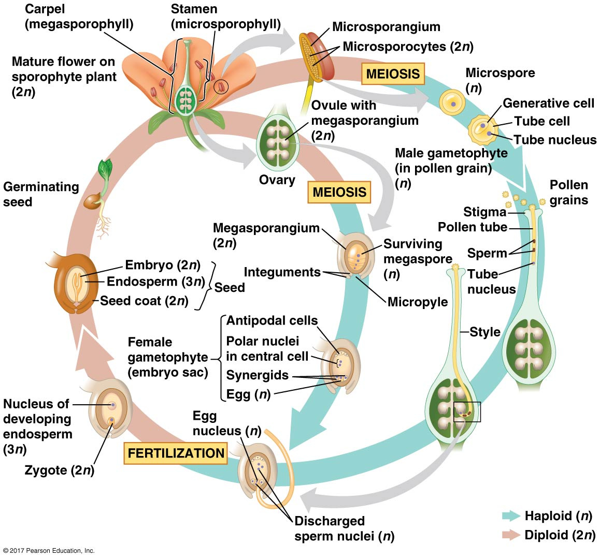 -->

## Comparing seeds of gymnosperm and angiosperms

**Seed coat devlops from ovule (2N), embryo = 2N, endospore (food cells) = ???**
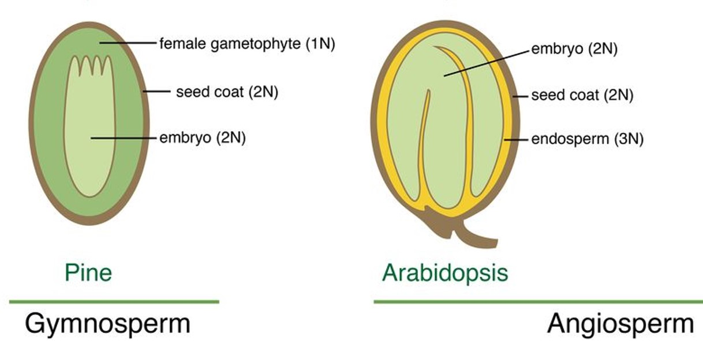

